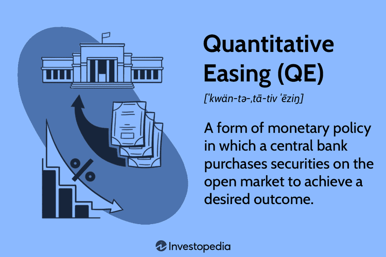

The intersection of monetary policy, bond markets, quantitative easing, and algorithmic trading represents a complex and dynamic facet of modern finance. Each component functions as a critical pillar in the global financial structure, and their interactions significantly influence economic cycles and financial stability across nations.

Monetary policy, managed by central banks, involves the manipulation of interest rates and the money supply to achieve macroeconomic objectives such as controlling inflation and fostering employment. Central banks' actions in the monetary domain directly shape the conditions under which bond markets operate. Bond markets, in turn, act as a barometer for economic health, responding swiftly to policy shifts through changes in yields and prices.

Quantitative easing (QE), a non-standard monetary policy tool, is deployed in periods where traditional measures become inadequate, often characterized by near-zero interest rates. By purchasing large quantities of financial assets, central banks engage in QE to bolster the money supply, reduce long-term interest rates, and stimulate investment and spending. However, QE's expansive monetary injections are not without their risks, potentially sparking inflationary pressures and asset bubbles that could destabilize economies.

Meanwhile, algorithmic trading leverages sophisticated algorithms to automate and expedite the execution of trades, vastly reshaping market dynamics. By enhancing market liquidity and exploiting inefficiencies, algorithmic trading significantly alters market landscapes and interacts intricately with monetary initiatives like QE, presenting both opportunities and challenges regarding market stability.

Understanding the roles, interactions, and impacts of these financial mechanisms is crucial for investors and policymakers. Staying informed about their complexities and implications enables the crafting of informed investment decisions and effective financial policies. By analyzing how these elements influence economic and financial systems, this article seeks to clarify their nuances and explore their vital significance in shaping future financial strategies. Through this understanding, stakeholders can better navigate the financial landscape and position themselves for evolving challenges and opportunities in modern finance.

## Table of Contents

## Understanding Central Banking and Monetary Policy

Central banks, such as the Federal Reserve in the United States, play a critical role in managing a nation's economy through the implementation and adjustment of monetary policy. The primary objective of monetary policy is to maintain economic stability by influencing macroeconomic factors such as inflation, employment, and overall economic growth. This is achieved through various tools and mechanisms designed to control interest rates and the money supply.

### Monetary Policy Tools

1. **Open Market Operations (OMOs):** This is one of the most commonly used tools by central banks to regulate the money supply. It involves the buying and selling of government securities in the open market. When a central bank buys securities, it injects liquidity into the financial system, thereby increasing the money supply and lowering interest rates. Conversely, selling these securities withdraws liquidity, reducing the money supply and potentially raising interest rates.

2. **Reserve Requirements:** Central banks mandate that commercial banks maintain a certain percentage of their deposits as reserves. By altering these reserve requirements, central banks can directly influence lending capacities. Lowering reserve requirements allows banks to lend more, increasing the money supply, while raising them does the opposite.

3. **Discount Rate:** This is the interest rate charged to commercial banks and other financial institutions for loans received from the central bank's discount window. A lower discount rate encourages borrowing and increases the money supply, while a higher rate restricts borrowing.

### Impact on Bond Markets

The decisions made by central banks in exercising monetary policy have a direct impact on bond markets. When central banks lower interest rates, newly issued bonds will typically [carry](/wiki/carry-trading) lower yields, as these rates often serve as benchmarks for the financial industry. Existing bonds with higher yields become more attractive, increasing their market price.

Central bank decisions also influence expectations in the bond markets. For instance, if investors anticipate lower future interest rates due to central bank policy, there can be increased demand for existing bonds, leading to higher prices and lower yields. Conversely, a policy shift towards tighter monetary policy with higher rates can result in lower bond prices and higher yields.

Overall, the strategic use of monetary policy tools allows central banks to steer economic conditions in a desired direction. However, these measures must be carefully calibrated to avoid adverse impacts, such as inflationary pressures or asset bubbles, while ensuring economic stability and growth.

## The Mechanism of Quantitative Easing

Quantitative easing (QE) is an unconventional monetary policy tool employed by central banks to address economic stagnation when traditional methods, such as adjusting short-term interest rates, become ineffective. This policy involves the large-scale purchase of financial assets, primarily government bonds, to inject money directly into the economy. By increasing the money supply, QE aims to stimulate economic activity, particularly when interest rates are at or near zero, rendering conventional rate cuts futile.

The mechanism by which QE influences the economy can be broken down into several key components:

1. **Asset Purchases and Money Supply**: Central banks buy government bonds or other securities from financial institutions. This transaction credits the sellers' bank accounts, thus increasing the reserves held by banks. The heightened reserves expand the money supply, encouraging banks to increase lending and investment.

2. **Lowering Long-term Interest Rates**: As central banks purchase large quantities of bonds, demand for these assets rises, driving up their prices and consequently lowering their yields (interest rates). Lower long-term interest rates reduce the cost of borrowing, encouraging businesses and consumers to take loans for investment and consumption purposes. This, in turn, fosters economic growth.

3. **Encouraging Lending and Investment**: By injecting liquidity into the banking system, QE enhances banks' capability to lend. With more funds on their balance sheets and lower interest rates, banks can provide more credit to businesses and consumers. This increase in available credit underpins higher levels of investment and consumption, critical for economic recovery.

4. **Improving Financial Market Liquidity**: QE also targets the improvement of market liquidity by more easily facilitating the buying and selling of assets. This increased liquidity can stabilize financial markets, reducing volatility and uncertainty. By calming markets, QE can also restore investor confidence, further promoting investment.

Despite these benefits, QE is not without risks. One significant concern is the potential for asset bubbles. As money flows into financial markets, asset prices can inflate beyond their intrinsic values, creating speculative bubbles. Additionally, the long-term increase in money supply raises fears of inflationary pressures once economic conditions normalize, potentially leading to heightened inflation if not carefully managed.

Quantitative easing represents a powerful tool for central banks, yet it necessitates judicious application to balance its stimulatory effects against the possibility of unintended economic distortions.

## The Impact of Quantitative Easing on Bond Markets

Quantitative easing (QE) profoundly impacts bond markets by altering yields, prices, and influencing investor strategies. When central banks engage in QE, they purchase large quantities of government or other financial assets, particularly bonds, from the market. This increase in demand for bonds naturally raises their prices. In finance, bond prices and yields share an inverse relationship; thus, as the prices of bonds rise due to QE-induced demand, their yields consequently fall. Lower yields reflect reduced borrowing costs, an intended outcome of QE aimed at stimulating economic activity.

The environment of lower yields and higher bond prices presents both opportunities and challenges for investors. On one hand, the rising bond prices can provide existing bondholders with capital gains, thus potentially encouraging investors to adjust traditional strategies—such as rotating towards equity markets or seeking higher returns through corporate bonds or emerging market debt. On the other hand, investors who rely on bonds for stable, predictable income may face difficulties as yields diminish, leading to reassessment of risk and return portfolios. This shift can result in altered risk assessments, where previously less desirable investments might become more attractive due to their higher yield under the QE influence.

Reactions in bond markets to QE can be heterogeneous and dynamic, impacted by diverse factors such as the scale and duration of the QE program, prevailing economic conditions, and investor expectations. For example, initial announcements or speculations about QE can lead to anticipatory movements in bond markets, with prices adjusting before the actual execution of bond purchases. Furthermore, the effects of QE might differ across various segments of the bond market, with different categories of bonds responding uniquely to QE stimuli.

Given these complexities, it is crucial for investors to have a deep understanding of QE's effects on bond markets. By recognizing these nuanced dynamics, investors can better navigate the challenges and capitalize on the opportunities presented by QE, ensuring informed decision-making and effective portfolio management amidst policy-induced market changes.

## Algorithmic Trading: Revolutionizing Market Dynamics

Algorithmic trading employs advanced mathematical models and computational algorithms to automate trading activities, significantly enhancing market speed and efficiency. This technological approach allows traders to execute orders at speeds and frequencies that are impossible for human traders. By executing trades based on predefined criteria, such as timing, price, or [volume](/wiki/volume-trading-strategy), [algorithmic trading](/wiki/algorithmic-trading) optimizes the decision-making process and exploits market inefficiencies.

A primary advantage of algorithmic trading is its ability to provide [liquidity](/wiki/liquidity-risk-premium) to the financial markets. As algorithms execute trades precisely and consistently, they help maintain tighter spreads between bid and ask prices, making the markets more efficient. This automation reduces transaction costs, benefitting both institutional and retail investors.

Algorithmic trading also intersects with macroeconomic policies, particularly quantitative easing (QE). During periods of QE, central banks inject large amounts of money into the economy, affecting asset prices and yields. Algorithms can rapidly adapt to these changing conditions by adjusting strategies in realtime, thus significantly impacting market dynamics. As central banks may alter their asset purchase programs unexpectedly, algorithmic systems that monitor such policies can respond instantaneously, affecting liquidity and [volatility](/wiki/volatility-trading-strategies).

Despite the evident benefits, algorithmic trading poses challenges, primarily concerning market stability and regulatory oversight. High-frequency trading, a subset of algorithmic trading, has been criticized for potentially causing sudden market fluctuations, known as "flash crashes." These rapid, algorithm-driven sell-offs can disrupt financial stability and lead to precipitous declines in asset values. Such events underscore the necessity for rigorous regulatory frameworks to ensure market integrity and protect investors.

Regulatory bodies like the U.S. Securities and Exchange Commission (SEC) and the European Securities and Markets Authority (ESMA) are continually working to address these challenges by implementing rules that govern trading algorithms. These regulations aim to enhance transparency, improve accountability, and prevent manipulative practices that could lead to financial instability.

Algorithmic trading continues to revolutionize market dynamics by enhancing efficiency and responding dynamically to monetary policy initiatives like QE. However, ensuring that this innovative approach contributes to stable and fair markets remains a critical task for regulators worldwide.

## Challenges and Criticisms of QE and Algo Trading

Despite the acknowledged benefits of quantitative easing (QE) and algorithmic trading, these financial mechanisms face significant criticism and present challenges, particularly concerning inflation and market volatility. Quantitative easing, while instrumental in stimulating economic activity during periods when interest rates are near zero, is often scrutinized for its potential to generate inflationary pressures and its ambiguous long-term implications on economic stability and currency valuation. When central banks introduce large volumes of money into the economy through asset purchases, it can lead to an increase in asset prices which may eventually spill over into general price increases, potentially destabilizing economic conditions.

The concern extends to the currency markets, where prolonged periods of QE can devalue a nation’s currency, affecting international trade competitiveness and potentially leading to retaliatory devaluations from trade partners. Debates around QE’s effectiveness often focus on whether such policies genuinely spur sustainable economic growth or merely create temporary increases in asset prices without addressing underlying economic weaknesses.

Algorithmic trading, on the other hand, significantly enhances market efficiency but comes with the risk of heightening market volatility. The high speed and frequency of trading through algorithms can amplify minute market movements, sometimes leading to phenomena such as flash crashes, where rapid price changes occur within minutes or even seconds. An infamous instance was the 2010 Flash Crash when Dow Jones Industrial Average plunged about 1,000 points in merely 20 minutes before swiftly recovering—an event largely attributed to automated trading.

The potential for market destabilization through algo trading necessitates robust regulatory oversight to ensure market integrity. Regulatory frameworks must evolve to address the challenges posed by algorithms that can execute complex high-frequency trading strategies, which may otherwise lead to unintended systemic risks.

The balance between fostering innovation in monetary policy and trading technologies and safeguarding financial system stability is crucial. Policymakers and financial regulators are tasked with the challenging role of crafting policies and oversight mechanisms that leverage the benefits of these financial innovations while mitigating associated risks. This requires a nuanced understanding of both the economic implications of QE and the technological dynamics of algorithmic trading to ensure a sustainable and transparent financial ecosystem.

## Future Prospects of Monetary Policy and Trading

The future landscape of monetary policy and trading is set to transform significantly with technological advancements, notably in [artificial intelligence](/wiki/ai-artificial-intelligence) (AI) and [machine learning](/wiki/machine-learning). Central banks are increasingly utilizing these technologies to enhance the efficiency and effectiveness of their decision-making processes. AI, with its ability to analyze large datasets and identify patterns, offers potential improvements in predicting economic conditions and tailoring monetary policies accordingly.

In the aftermath of the COVID-19 pandemic, central banks are taking stock of quantitative easing's (QE) long-term effects. A primary focus is understanding its impact on inflation and market distortions. The expansion of central bank balance sheets through QE raised concerns about asset bubbles and long-term currency devaluation. As economies stabilize post-pandemic, central banks are seeking ways to unwind these measures without destabilizing the financial system. Tools that incorporate AI and machine learning are becoming crucial in developing more nuanced approaches to these complex challenges.

Algorithmic trading continues to evolve, with AI providing enhanced decision-making capabilities. Algorithms that leverage AI can process market data at unprecedented speeds, allowing traders to exploit market inefficiencies more effectively. This advancement increases market liquidity and narrows bid-ask spreads, providing a more efficient trading environment. However, the increased reliance on AI-driven analyses and trading prompts discussions on market stability and the need for updated regulatory frameworks to mitigate the risks of excessive automation.

Looking ahead, monetary policy frameworks must adapt to this technological integration, balancing innovation with the overarching goal of financial stability. Policymakers need to remain vigilant in regulating emerging technologies to protect against systemic risks. Creating regulatory environments that allow innovation while safeguarding against potential negative externalities will be crucial.

Policymakers and financial institutions should prioritize research and development in understanding the nuanced impacts of AI and machine learning on monetary policy and trading. This knowledge will be vital in crafting policies that harness technological advancements' benefits and minimize associated risks. Through proactive adaptation and strategic implementation of technologies, central banks and market participants can better navigate future financial landscapes.

## Conclusion

Understanding the interactions between monetary policy, bond markets, quantitative easing (QE), and algorithmic trading is crucial for navigating the complex financial landscape. These elements are pivotal in shaping economic outcomes and influencing investment strategies as they collectively impact market liquidity, interest rates, and asset valuations. Central banks employ monetary policy as a tool to control inflation and stabilize economies, with QE serving as a critical strategy in extraordinary circumstances to stimulate demand through large-scale asset purchases. This intervention directly affects bond markets by altering yields and bond prices, significantly impacting investor strategies and risk management.

Algorithmic trading introduces an additional layer of complexity by using advanced computational techniques to execute trading strategies at high speeds. This has profound implications for market efficiency and liquidity but also raises concerns about increased volatility and the potential for systemic risks. Consequently, as these technologies evolve, the financial landscape becomes increasingly dynamic, requiring stakeholders to continuously evaluate how these components interact and influence one another.

In this environment, continued research and adaptation are imperative to leverage the benefits of these financial innovations while mitigating associated risks. Policymakers and investors must remain vigilant and informed, ready to adjust strategies in response to evolving market conditions. By doing so, they can better position themselves to tackle future financial challenges and seize emerging opportunities, ensuring stability and growth in an ever-changing global economy.

## References & Further Reading

[1]: Bernanke, B. S., Reinhart, V. R., & Sack, B. P. (2004). ["Monetary Policy Alternatives at the Zero Bound: An Empirical Assessment."](https://www.federalreserve.gov/pubs/feds/2004/200448/200448pap.pdf) Brookings Papers on Economic Activity 2004(2), 1-100.

[2]: Joyce, M. A. S., Lasaosa, A., Stevens, I., & Tong, M. (2011). ["The Financial Market Impact of Quantitative Easing."](https://www.ijcb.org/journal/ijcb11q3a5.pdf) International Journal of Central Banking, 7(3), 113-161.

[3]: Carney, J. (2009). ["The Brave New World of Hedge Fund Regulation."](https://www.wsj.com/articles/BL-MBB-3856) The Journal of Corporation Law, 34(3), 557-596.

[4]: Hendershott, T., Jones, C. M., & Menkveld, A. J. (2011). ["Does Algorithmic Trading Improve Liquidity?"](https://onlinelibrary.wiley.com/doi/full/10.1111/j.1540-6261.2010.01624.x) The Review of Financial Studies, 24(8), 2623-2654.

[5]: "Trading for Beginners: Learn to Win with Algorithmic Trading Strategies" by Charles G. Koonitz.

[6]: Friedman, B., & Kuttner, K. N. (2011). ["Implementation of Monetary Policy: How Do Central Banks Set Interest Rates?"](https://www.nber.org/system/files/working_papers/w16165/w16165.pdf) National Bureau of Economic Research Working Paper No. 16165.