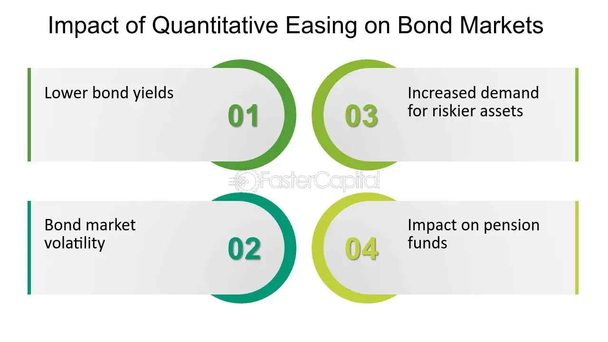

## Table of Contents

## What is quantitative easing?

Quantitative easing, often called QE, is a special tool that central banks use to help the economy. When normal ways of boosting the economy, like lowering interest rates, don't work well enough, central banks might use QE. It involves the central bank creating new money electronically and using it to buy financial assets, like government bonds, from banks and other financial institutions. This action increases the amount of money in the economy and makes borrowing cheaper, encouraging businesses and people to spend and invest more.

The goal of QE is to stimulate economic growth by making sure there's enough money flowing around. When central banks buy assets, it can also push up the prices of those assets, which can help increase confidence in the financial markets. However, QE can have some downsides too. It might lead to higher inflation if too much money is created, and it can be hard to stop once it's started without causing problems in the economy. Despite these risks, QE has been used by many countries, including the United States, the United Kingdom, and Japan, during times of economic trouble.

## How does quantitative easing work?

Quantitative easing, or QE, is a way for central banks to help the economy when normal methods aren't working well. When interest rates are already low and can't be lowered more, the central bank starts QE. They create new money electronically and use it to buy things like government bonds from banks and other financial groups. This puts more money into the economy, making it easier and cheaper for people and businesses to borrow. When borrowing is cheaper, they might spend and invest more, which can help the economy grow.

When the central bank buys these assets, it also helps to push up their prices. This can make people feel more confident about the financial markets. But QE isn't without risks. If too much money is created, it could lead to higher inflation, which means prices for things like food and clothes go up. Also, stopping QE can be tricky because it might cause problems in the economy if not done carefully. Despite these risks, many countries have used QE during tough economic times to try to get things moving again.

## What is the bond market?

The bond market is a place where people and organizations can buy and sell bonds. Bonds are like IOUs where one group, usually a government or a company, borrows money from another group. They promise to pay back the money over time, with extra interest as a thank you for lending. The bond market is really big and important because it helps governments and companies get the money they need to do things like build roads or start new projects.

In the bond market, the price of bonds can go up or down based on what's happening in the economy. If people think the economy is doing well, they might want to buy more bonds, which can make the prices go up. But if they think things are going to get worse, they might sell their bonds, making the prices go down. The bond market also affects interest rates. When bond prices go up, the interest rates usually go down, and when bond prices go down, interest rates usually go up. This can have a big impact on how much it costs for people and businesses to borrow money.

## How does quantitative easing affect bond prices?

Quantitative easing, or QE, is when a central bank buys bonds to help the economy. When the central bank starts buying lots of bonds, it makes the demand for those bonds go up. Since there are more people wanting to buy the bonds, the price of the bonds goes up too. It's like if everyone wants to buy the same toy, the price of that toy will go up because it's in high demand.

When bond prices go up because of QE, the interest rates on new bonds go down. This happens because the [interest rate](/wiki/interest-rate-trading-strategies) on a bond is like a reward for lending money. If the price of a bond is high, the reward, or interest rate, doesn't need to be as big to attract buyers. Lower interest rates mean it's cheaper for people and businesses to borrow money, which can help the economy grow. But if the central bank keeps buying bonds and pushing prices up, it might cause problems like inflation if they're not careful.

## What is the relationship between bond yields and quantitative easing?

When a central bank does quantitative easing, or QE, it buys a lot of bonds. This makes the demand for bonds go up, which pushes the price of bonds higher. When bond prices go up, the yield, or the interest rate that the bond pays, goes down. It's like if you have a cake that pays you a dollar every year, but the price of the cake goes up. The dollar you get each year is worth less compared to the higher price of the cake, so the yield goes down.

Lower yields mean it's cheaper for people and businesses to borrow money. This can help the economy grow because when borrowing is cheaper, people and businesses might spend and invest more. But if the central bank keeps buying bonds and pushing yields down too much, it might cause problems like inflation. So, QE can help the economy, but it needs to be done carefully to avoid making things worse.

## Can you explain the term 'yield curve' and its relation to quantitative easing?

The yield curve is a graph that shows the interest rates, or yields, of bonds over different lengths of time. It's like a line that goes up or down depending on whether short-term bonds have higher or lower interest rates than long-term bonds. When short-term yields are lower than long-term yields, the yield curve slopes upwards, which is normal. But if short-term yields are higher, the yield curve can be flat or even turn downwards, which is called an inverted yield curve. This can be a sign that people think the economy might be in trouble.

Quantitative easing, or QE, can change the shape of the yield curve. When a central bank does QE, it buys a lot of bonds, which makes their prices go up and their yields go down. Usually, the central bank buys more short-term bonds than long-term bonds during QE. This pushes down the yields on short-term bonds more than on long-term bonds, making the yield curve steeper. But if the central bank buys a lot of long-term bonds too, it can flatten the yield curve by bringing down long-term yields. So, QE can help the economy by making borrowing cheaper, but it can also affect how the yield curve looks, which can tell us something about what people think will happen in the economy.

## How does quantitative easing influence inflation expectations in the bond market?

When a central bank does quantitative easing, it buys a lot of bonds. This makes the price of bonds go up and their yields, or interest rates, go down. People in the bond market see this and might start to think that there will be more money in the economy, which could make prices for things like food and clothes go up. This is called inflation. So, when they see QE happening, they might expect more inflation in the future.

These inflation expectations can change how people act in the bond market. If they think inflation will go up a lot, they might want to be paid more to lend their money, so they might ask for higher yields on new bonds. But if the central bank keeps doing QE and buying bonds, it can keep yields low even if people expect more inflation. This can make the bond market a bit confusing because what people expect about inflation might not match what's actually happening with bond yields.

## What are the long-term effects of quantitative easing on the bond market?

When a central bank does quantitative easing, or QE, for a long time, it can change the bond market in big ways. QE makes bond prices go up and their yields, or interest rates, go down. This can make people in the bond market think that the economy might have more money in it, which could lead to higher prices for things like food and clothes. If people think this will happen, they might want higher yields on new bonds to make up for the higher prices. But if the central bank keeps doing QE, it can keep yields low even if people expect more inflation. This can make the bond market confusing because what people expect might not match what's happening with bond yields.

Over time, QE can also change how the bond market works. If the central bank buys a lot of bonds for a long time, it can make the bond market less active. This means there might be fewer bonds being bought and sold because the central bank is holding onto so many of them. This can make it harder for people and businesses to borrow money because there are fewer bonds available. Also, when the central bank wants to stop QE, it can be tricky. If they sell the bonds they bought back into the market, it can make bond prices go down and yields go up. This can make borrowing more expensive and might slow down the economy. So, QE can help in the short term, but it can have tricky long-term effects on the bond market.

## How do investors adjust their strategies in the bond market due to quantitative easing?

When a central bank does quantitative easing, or QE, it buys a lot of bonds. This makes the price of bonds go up and their yields, or interest rates, go down. Investors see this and might change how they invest. They might buy more bonds because they think the prices will keep going up. Or they might look for other places to put their money, like stocks or real estate, because the low yields on bonds aren't giving them much return. Some investors might also try to guess what the central bank will do next and change their strategies based on that.

In the long run, investors have to think about what will happen when QE stops. If the central bank starts selling the bonds it bought, bond prices could go down and yields could go up. This means investors might start selling their bonds before the central bank does, to avoid losing money. They might also look for bonds that will do well even if interest rates go up, like short-term bonds. Overall, QE makes investors think a lot about what the central bank is doing and how it will affect the bond market, so they have to be ready to change their plans.

## What are the potential risks of quantitative easing to the bond market stability?

When a central bank does quantitative easing, or QE, it buys a lot of bonds. This makes bond prices go up and their yields, or interest rates, go down. But this can cause some problems in the bond market. If people start to think that there's too much money in the economy because of QE, they might worry about inflation. If they expect prices to go up a lot, they might want higher yields on new bonds. But if the central bank keeps doing QE, it can keep yields low even if people expect more inflation. This can make the bond market confusing and unstable because what people expect might not match what's actually happening with bond yields.

Over time, QE can also make the bond market less active. If the central bank buys a lot of bonds for a long time, there might be fewer bonds being bought and sold because the central bank is holding onto so many of them. This can make it harder for people and businesses to borrow money because there are fewer bonds available. Also, when the central bank wants to stop QE, it can be tricky. If they sell the bonds they bought back into the market, it can make bond prices go down and yields go up. This can make borrowing more expensive and might slow down the economy. So, QE can help in the short term, but it can cause problems in the bond market if it goes on for too long.

## How does quantitative easing impact different types of bonds, such as government versus corporate bonds?

When a central bank does quantitative easing, or QE, it usually buys a lot of government bonds. This makes the price of government bonds go up and their yields, or interest rates, go down. Because the central bank is buying so many government bonds, there are fewer of them left for other people to buy. This can make the prices of government bonds go up even more. But it can also make people want to buy other types of bonds, like corporate bonds, because they might give a better return. So, QE can make the prices of government bonds go up a lot, but it can also push people to look at corporate bonds.

QE can also affect corporate bonds, but in a different way. When the central bank buys a lot of government bonds, it puts more money into the economy. This can make it easier for companies to borrow money because there's more money around. If companies can borrow money more easily, they might issue more corporate bonds. This can make the prices of corporate bonds go up too, but not as much as government bonds because the central bank isn't buying them directly. So, QE can help make borrowing cheaper for companies, but it affects corporate bonds a bit differently than government bonds.

## What are some case studies or historical examples where quantitative easing significantly impacted the bond market?

One big example of quantitative easing, or QE, affecting the bond market happened in the United States after the 2008 financial crisis. The Federal Reserve, which is the central bank of the U.S., started doing QE to help the economy. They bought a lot of government bonds, which made the prices of those bonds go up and their yields, or interest rates, go down. This made borrowing cheaper for people and businesses, which helped the economy start growing again. But it also made the bond market a bit confusing because what people expected about inflation didn't always match what was happening with bond yields. The Fed kept doing QE for a long time, which made the bond market less active because they were holding onto so many bonds.

Another example is from Japan, where the central bank, called the Bank of Japan, has been doing QE for a long time to fight against low growth and low inflation. They started buying a lot of government bonds, which made their prices go up and their yields go down. This made borrowing cheaper in Japan, but it also made the bond market less active because the Bank of Japan was holding onto so many bonds. People in Japan started to expect that there would be more inflation because of all the money the central bank was putting into the economy. But even though they expected more inflation, the yields on bonds stayed low because the Bank of Japan kept buying them. This made the bond market in Japan very different from what people expected.

## References & Further Reading

[1]: Bernanke, B. S., Reinhart, V. R., & Sack, B. P. (2004). ["Monetary Policy Alternatives at the Zero Bound: An Empirical Assessment."](https://www.federalreserve.gov/pubs/feds/2004/200448/200448pap.pdf) Brookings Papers on Economic Activity 2004(2), 1-100.

[2]: Joyce, M. A. S., Lasaosa, A., Stevens, I., & Tong, M. (2011). ["The Financial Market Impact of Quantitative Easing."](https://www.ijcb.org/journal/ijcb11q3a5.pdf) International Journal of Central Banking, 7(3), 113-161.

[3]: Carney, J. (2009). ["The Brave New World of Hedge Fund Regulation."](https://www.wsj.com/articles/BL-MBB-3856) The Journal of Corporation Law, 34(3), 557-596.

[4]: Hendershott, T., Jones, C. M., & Menkveld, A. J. (2011). ["Does Algorithmic Trading Improve Liquidity?"](https://onlinelibrary.wiley.com/doi/full/10.1111/j.1540-6261.2010.01624.x) The Review of Financial Studies, 24(8), 2623-2654.

[5]: "Trading for Beginners: Learn to Win with Algorithmic Trading Strategies" by Charles G. Koonitz.

[6]: Friedman, B., & Kuttner, K. N. (2011). ["Implementation of Monetary Policy: How Do Central Banks Set Interest Rates?"](https://www.nber.org/system/files/working_papers/w16165/w16165.pdf) National Bureau of Economic Research Working Paper No. 16165.