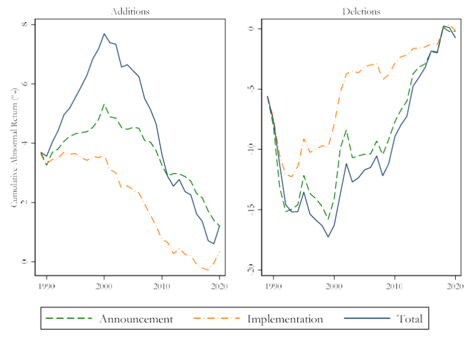

The S&P 500, formally known as the Standard & Poor's 500, is a stock market index that tracks the stock performance of 500 of the largest companies listed on stock exchanges in the United States. It is one of the most commonly followed equity indices and is used as a benchmark for the overall health of the U.S. equity market. The S&P 500's importance lies in its diverse representation of various industries and its role as a barometer for the economy. As a market-capitalization-weighted index, companies with higher market valuations have a more significant impact on the index's performance. 

'Stock removal' refers to the process of a company's stock being removed from the S&P 500 index. This removal can occur for several reasons, such as mergers, bankruptcies, or not meeting the criteria of the index anymore, such as market capitalization requirements. The removal of a stock has substantial implications for index funds that track the S&P 500. These funds must rebalance their portfolios to reflect the updated composition of the index, which can lead to buying and selling activities that impact stock prices and market dynamics.



Algorithmic trading, or algo trading, is a method of executing orders using automated pre-programmed trading instructions accounting for variables such as timing, price, and volume. This type of trading has revolutionized financial markets by enabling high-speed and high-frequency trading. Algorithms can quickly respond to market events like stock removal announcements, influencing price movements and market liquidity. 

This article explores the effects of stock removal from the S&P 500, highlighting how individual stocks and the index itself react to these changes. It also examines the role of algorithmic trading in the modern stock market, particularly how it responds to the inclusion and exclusion of stocks in key indices like the S&P 500. The interplay between stock removal and algorithmic trading strategies presents a dynamic aspect of today's financial markets. Understanding this interaction is crucial for investors, index fund managers, and policymakers seeking to navigate the evolving landscape of stock market trading.

## Table of Contents

## Understanding Stock Removal from the S&P 500

The S&P 500, a hallmark of the U.S. stock market, represents the economic health of the largest and most influential companies in the United States. It is a market-capitalization-weighted index that reflects the stock performance of 500 leading companies listed on stock exchanges in the United States. Understanding how stocks are selected and removed from this index is crucial for investors and policymakers alike due to its broad market representation.

### Selection and Removal Criteria

The inclusion and exclusion of stocks in the S&P 500 index are governed by a specific set of criteria established by the S&P Dow Jones Indices. These criteria ensure that the index is representative of the broader U.S. economy. 

1. **Market Capitalization**: Stocks must meet a minimum market capitalization threshold, typically a few billion dollars, to be eligible for inclusion. This ensures that only large, economically significant companies are part of the index.

2. **Liquidity**: A stock must have a high level of liquidity. This is measured by the ratio of annual dollar value traded to the float-adjusted market capitalization: it should be at least 0.3 over the last six months.

3. **Domicile**: Companies must be based in the United States. This aligns with the index's objective of representing the American economy.

4. **Public Float**: At least 50% of the company's shares must be publicly accessible, ensuring that the majority of the stock is available for public trading.

5. **Financial Viability**: Companies must have a record of positive earnings over the most recent quarter and the cumulative last four quarters. This criterion supports the financial health perspective of the index.

Stock removal occurs when a company no longer meets these criteria or due to significant corporate actions such as mergers, acquisitions, or bankruptcy.

### Historical Impact of Stock Removals

Historically, the removal of a stock from the S&P 500 has had a varied impact on both the individual stock and the index itself. Upon removal, stocks often experience a decrease in demand and [liquidity](/wiki/liquidity-risk-premium) as index funds are forced to divest, potentially leading to a short-term decline in stock price. For instance, a study found that stocks removed from the S&P 500 can drop between 5%-6% following the announcement of their removal.

For the index, stock removal can alter its performance temporarily. However, the S&P 500's balanced and diversified nature typically mitigates long-term effects. The removal decisions tend to reflect broader marketplace conditions and ensure the index evolves in alignment with economic changes.

### Case Studies of Notable Stock Removals

To understand the effects of stock removals, examining specific case studies yields insight into both immediate and prolonged outcomes.

- **Eastman Kodak**: When Eastman Kodak was removed from the S&P 500 in 2004 due to declining market share and failure to adapt to digital photography trends, the stock experienced substantial price declines. It reflected broader market sentiment about the company's future viability.

- **General Electric (GE)**: GE’s removal in 2018 marked a significant event given its historical stature. Although initially witnessing price volatility post-announcement, its stock gradually stabilized, exemplifying how longstanding companies might face strategic challenges leading to their exclusion.

These cases highlight how stock positioning within the S&P 500 signifies not just the immediate market reactions but also broad economic shifts and corporate strategies that influence ongoing market dynamics.

In conclusion, understanding the mechanics of stock removal from the S&P 500 is essential for grasping both its immediate market implications and its role in reflecting broader economic trends. Such decisions impact investor behavior and necessitate strategic adjustments in both active and passive investment portfolios.

## Impact of Stock Removal on the S&P 500 Index

The removal of a stock from the S&P 500 index can lead to significant implications for both the index's performance and valuation. The S&P 500, which aims to reflect the performance of the largest 500 publicly traded companies in the U.S., is heavily impacted by such changes. When a stock is removed, it necessitates adjustments in index funds and ETFs that replicate the S&P 500, which, in turn, can lead to immediate market reactions.

Historically, the removal of a stock from the S&P 500 has often resulted in a negative impact on the stock's price. This phenomenon is largely attributed to the forced selling by index funds and passive investment vehicles, which may lead to a temporary excess supply of the stock in the market. This excess supply tends to drive down the stock price, a situation sometimes referred to as "index effect." Conversely, the addition of a stock can lead to an upward price movement due to increased demand from the same entities that track the index. For instance, when Tesla, Inc. was added to the S&P 500 in December 2020, it experienced a notable increase in demand, significantly affecting its stock price.

Further, the removal of a stock can influence the overall valuation metrics of the S&P 500. Given the cap-weighted nature of the index, the removal of a high-performer or a large-cap stock can alter the index's previous price/earnings ratio, average yield, or [volatility](/wiki/volatility-trading-strategies) metrics. These changes can have far-reaching implications on the forecasting models used by analysts and investors.

The market reaction to stock removals is often marked by an increase in volatility. This volatility arises from active trading by investors aiming to rebalance their portfolios in response to the changes. During these periods, market participants may capitalize on the predictable trading patterns that accompany stock removal events, such as increased liquidity and price fluctuations. For indices like the S&P 500, which are integral benchmarks used by both retail and institutional investors, understanding these dynamics is essential for risk management.

Investor sentiment is another critical [factor](/wiki/factor-investing) that drives the market's response to stock removal from the S&P 500. If the market perceives the removal as a sign of deteriorating fundamentals for the excluded company, this can exacerbate the downward pressure on its stock price. On the other hand, if the removal is due to alternative reasons, such as mergers or acquisitions, the market response might be less drastic.

For passive investors, stock removal leads to necessary adjustments in portfolio allocations. As index funds seek to replicate the S&P 500 closely, they must promptly sell shares of the removed stock and purchase those of any newly added stock. This constant rebalancing to match the index composition is a key characteristic of passive investment strategies.

Active investors, meanwhile, may view stock removal as an opportunity to generate alpha by either taking advantage of the temporary mispricing or by speculating on the reasons behind the exclusion. These investors might employ various hedging techniques or opportunistic trades to benefit from anticipated market movements resultant from stock removals.

In conclusion, stock removal from the S&P 500 has a multifaceted impact on the index's performance and valuation, shaping the strategies of both passive and active investors. Understanding these effects and the accompanying market dynamics enables investors to better navigate the complexities of stock market indices.

## Algorithmic Trading Strategies and Their Influence

Algorithmic trading, which involves using computer algorithms to execute financial market transactions at rapid speeds, has substantially increased in prominence over recent years. These sophisticated systems analyze vast amounts of market data and execute orders based on pre-designed strategies, often within fractions of a second. The rise of [algorithmic trading](/wiki/algorithmic-trading) can be attributed to advancements in technology, the availability of large datasets, and the need for high-speed execution to capitalize on short-lived market opportunities.

In the context of the S&P 500, algorithmic trading strategies play a significant role, particularly when stocks are added or removed from the index. Algorithms are typically designed to respond to such news events immediately, capitalizing on anticipated price movements. When a stock is set to be removed from the index, algorithmic traders might preemptively sell the stock, expecting its price to drop due to decreased demand from index funds. Similarly, when a stock is included, algorithms might buy the stock in anticipation of index fund purchases driving the price up. This predictive capacity allows algorithmic trading to significantly affect stock prices around these events, contributing to increased volatility.

High-frequency trading ([HFT](/wiki/high-frequency-trading-strategies)) algorithms are a subset of algorithmic trading characterized by the extremely high speed at which they operate. These algorithms can place thousands of orders per second, allowing them to exploit even the minor and transient market inefficiencies created by stock inclusion or removal from indices like the S&P 500. By trading rapidly based on complex models that predict price movements, HFT strategies can influence market liquidity and price discovery, sometimes amplifying market reactions post-removal.

However, the influence of algorithmic trading in the stock market comes with both advantages and disadvantages. On the pros side, algorithmic trading improves market liquidity and facilitates efficient price discovery. The rapid, machine-driven buy and sell orders help narrow bid-ask spreads, making it easier for other investors to buy and sell stocks. Moreover, the ability of algorithms to process information quicker than human traders allows markets to incorporate new information more swiftly.

Conversely, the cons of algorithmic trading include the potential for exacerbating volatility, particularly around events like stock removals or inclusions from major indices. Algorithms making simultaneous buy or sell orders can lead to sharp spikes or drops in stock prices, sometimes disconnected from fundamental values. Additionally, reliance on algorithms might increase systematic risk due to the potential for cascading failures from malfunctioning algorithms or flawed decision models. Furthermore, algorithmic trading can sometimes lead to 'flash crashes,' where rapid sell-offs cause steep market declines, as witnessed in the 2010 Flash Crash.

Overall, algorithmic trading represents a significant shift in how stock markets operate, offering both opportunities and challenges. Its interaction with events like changes in the S&P 500 composition highlights the need for constant technological oversight and adaptive regulatory frameworks to maintain market stability and investor confidence.

## Case Studies: Algorithmic Reactions to Stock Removal

Algorithmic trading has become a cornerstone in modern financial markets, particularly in how it reacts to changes in major indices like the S&P 500. This section examines instances where algorithmic trading significantly influenced market behavior following a stock's removal from the index.

A notable example of algorithmic trading's impact is the market behavior observed during the removal of Yahoo Inc. from the S&P 500 in 2016. Algorithms quickly adjusted to the news, leading to a rapid sell-off. This was marked by significant trading volumes within seconds of the announcement, illustrating how algorithms prioritize speed and [volume](/wiki/volume-trading-strategy) to capitalize on new information. The immediate aftermath saw Yahoo's stock experience a sharp decline, followed by stabilization as non-algorithmic participants entered the market, seeking [arbitrage](/wiki/arbitrage) opportunities created by the initial volatility.

Behavioral patterns of algorithms often show sudden spikes or drops in trading activity around stock removal events. These are primarily driven by high-frequency trading (HFT) algorithms designed to respond almost instantaneously to news. Algorithms operate on pre-programmed criteria that automatically execute trades to either minimize losses or maximize short-term gains. The typical formula used in such scenarios assesses the imminent volume impact, incorporating factors like historical price changes and projected market return. A simplified version of this formula might look like:

$$
\Delta P = \alpha \times V_i + \beta \times M_t
$$

where:
- $\Delta P$ is the expected price change.
- $\alpha$ is a sensitivity coefficient.
- $V_i$ stands for imminent volume impact.
- $\beta$ is the market sentiment coefficient.
- $M_t$ represents the market trend factor.

Whether algorithmic trading dampens or exacerbates market volatility has been subject to debate. On one hand, algorithms contribute to increased liquidity and efficient price discovery, which can reduce volatility in theory. However, their propensity for rapid shifts can lead to dramatic price swings, particularly when correlated trading strategies trigger automated responses across multiple market participants. The "Flash Crash" of May 6, 2010, underscores this point, where algorithms heavily amplified market movements, albeit not directly tied to S&P 500 stock removal, illustrating potential vulnerabilities.

Comparing algorithm-driven outcomes to traditional market reactions reveals distinct differences. Algorithms often execute thousands of trades within seconds, focusing on short-term profit margins, whereas traditional investors might place fewer trades based on long-term considerations. For instance, the removal of stocks like General Electric from the S&P 500 in 2018 witnessed algorithmically induced volatility, which was later mitigated as institutional and retail investors stepped in, favoring [fundamental analysis](/wiki/fundamental-analysis) over speculative trading.

In conclusion, algorithmic trading not only accelerates market responses to stock removal announcements but does so in a manner that often enhances volatility initially. The subsequent market correction, typically influenced by traditional investors, highlights a dichotomy in trading strategies where both approaches play essential yet distinct roles in maintaining overall market equilibrium.

## The Future of the S&P 500, Stock Removal, and Algo Trading

As we look toward the future, the dynamics of stock removal from the S&P 500 and the role of algorithmic trading are expected to evolve under the influence of various factors, including regulatory, technological, and investor landscape shifts. 

### Evolving Dynamics of Stock Removal

The process of stock removal from the S&P 500 is likely to become more streamlined and transparent. The necessity for rapid and efficient decision-making, driven by data analytics, is becoming increasingly important. In future scenarios, advanced algorithms might be employed to assess stock performance and compliance with index criteria automatically. This could lead to quicker adjustments in the index composition, thereby aligning more closely with market realities.

### Regulatory and Technological Impacts

Regulatory bodies are anticipated to play a crucial role in shaping the future of algorithmic trading, with an increasing emphasis on maintaining market stability and integrity. The introduction of stricter guidelines could mitigate the risks associated with algorithmic and high-frequency trading (HFT), such as market manipulation and systemic risk. Moreover, advancements in technology, particularly in blockchain and distributed ledger systems, might offer novel solutions to ensure transparency and traceability in trading activities.

### AI Integration in Trading Algorithms

Artificial Intelligence (AI) is poised to revolutionize trading algorithms by enhancing their capability to process large volumes of data and execute trades with precision. Machine learning models, such as neural networks, are capable of recognizing complex patterns in market behavior that were previously undetectable. As AI continues to mature, its integration with trading systems could potentially enable more adaptive and predictive strategies. 

Consider a simple [neural network](/wiki/neural-network) algorithm designed to predict stock price movements based on historical data:

```python
import numpy as np
from sklearn.model_selection import train_test_split
from sklearn.neural_network import MLPRegressor

# Sample data: historical stock prices and corresponding features
X, y = np.random.rand(1000, 10), np.random.rand(1000)

# Split data into training and testing sets
X_train, X_test, y_train, y_test = train_test_split(X, y, test_size=0.2, random_state=42)

# Initialize and train MLPRegressor
mlp = MLPRegressor(hidden_layer_sizes=(50, 50), max_iter=500, random_state=42)
mlp.fit(X_train, y_train)

# Predict using the trained model
predictions = mlp.predict(X_test)
```

This example represents the fundamental concept of using AI for predictive purposes in trading, emphasizing the potential for more precise decision-making.

### Strategic Insights for Investors

As these technological advances continue, investors must adapt by employing strategies that leverage these changes. Active investors may benefit from real-time analytics tools to understand and respond to market shifts effectively. Meanwhile, passive investors should remain cognizant of the implications of index adjustments due to algorithmic trading influences.

Investors are also encouraged to diversify their portfolios to hedge against the uncertainties introduced by rapid changes in trading technologies. Adapting to a landscape where AI and algorithmic trading dominate requires a nuanced understanding of the market dynamics and the potential regulatory shifts that could impact trading practices.

In summary, the evolving landscape of the S&P 500, stock removal, and algorithmic trading necessitates proactive engagement from all market participants. Embracing technology while acknowledging regulatory frameworks will be key to thriving in future markets.

## Conclusion

The discussion on stock removal from the S&P 500 underscores its profound impact on market dynamics and investor decisions. Removal from this index often results in significant price fluctuations for the affected stocks, as well as changes in the index's composition and overall performance. This phenomenon highlights the importance of understanding the criteria and processes that govern the inclusion and exclusion of stocks, which revolve around factors like market capitalization, liquidity, and sector representation.

The intertwined role of algorithmic trading in these stock index changes cannot be overstated. Algorithms process vast amounts of data quickly and respond to stock inclusions and removals with precision. These automated systems can amplify market movements, sometimes contributing to heightened volatility around such events. While algorithmic trading offers benefits like increased market efficiency and liquidity, it also poses challenges in maintaining market stability. The swift, high-volume trades triggered by algorithms can exacerbate price swings, thereby affecting investor confidence.

Maintaining market stability amidst these shifts is crucial. Market participants, including regulatory bodies, must continue to develop strategies to accommodate the growing influence of algorithmic trading. This involves balancing technological advancement with the need for robust market frameworks that mitigate excessive volatility and ensure transparency.

As the landscape of the S&P 500 and trading technologies continues to evolve, further research is essential. Stakeholders are urged to pursue adaptive strategies that account for the dynamic interplay between stock changes and trading mechanisms. This pursuit of knowledge will be instrumental in fostering a resilient financial market that can adapt to new challenges and opportunities, thereby preserving investor confidence and promoting sustainable growth.

## References & Further Reading

[1]: Chen, H., Noronha, G., & Singal, V. (2004). ["The Effect of Index Rebalancing on Stock Price and Trading Volume: Evidence from S&P 500 Changes."](https://pmc.ncbi.nlm.nih.gov/articles/PMC8483868/) The Review of Financial Studies, 17(1), 71-108.

[2]: Harris, L., & Gurel, E. (1986). ["Price and Volume Effects Associated with Changes in the S&P 500 List: New Evidence for the Existence of Price Pressures."](https://www.jstor.org/stable/2328230) The Journal of Finance, 41(4), 815-829.

[3]: Mazouz, K., Saadouni, B., & Yin, S. (2009). ["The Effects of Stock Index Revisions on Share Price and Trading Volume: International Evidence."](https://www.researchgate.net/profile/Khelifa-Mazouz/publication/256031515_Stabilization_and_the_Aftermarket_Prices_of_Initial_Public_Offerings/links/570f64c408aecd31ec9a9ca3/Stabilization-and-the-Aftermarket-Prices-of-Initial-Public-Offerings.pdf) Applied Economics, 41(8), 929-944.

[4]: Lopez de Prado, M. (2018). ["Advances in Financial Machine Learning."](https://books.google.com/books/about/Advances_in_Financial_Machine_Learning.html?id=oU9KDwAAQBAJ) Wiley.

[5]: Boulatov, A., & George, T. (2013). ["Hidden and Displayed Liquidity in Securities Markets with Informed Liquidity Providers."](https://www.jstor.org/stable/pdf/23470217.pdf) Review of Financial Studies, 26(8), 2096-2137.