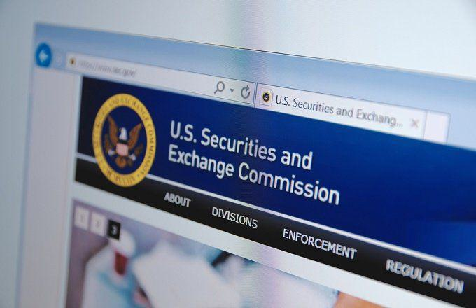

The financial landscape is undergoing a transformative shift with the emergence and growing prominence of cryptocurrencies. Digital currencies such as Bitcoin, Ethereum, and a multitude of altcoins have catalyzed new possibilities for financial transactions, investments, and technological advancements. Amidst this digital revolution, the U.S. Securities and Exchange Commission (SEC) has emerged as a pivotal entity in facilitating and regulating this emerging sector. The SEC's influence is critical in providing a structured regulatory framework that seeks to uphold market integrity, protect investors, and deter fraudulent activities.

Recent years have seen the SEC intensify its focus on addressing concerns inherent to cryptocurrencies, such as fraud, market manipulation, and the protection of retail and institutional investors. This regulatory oversight is crucial given the nascent and rapidly evolving nature of digital assets which pose unique challenges when compared to traditional financial instruments. By categorizing certain cryptocurrencies as securities, the SEC has been able to extend its regulatory reach, thereby enforcing compliance with established securities laws.

This article examines the SEC's influence on cryptocurrency markets, highlighting how its regulations serve as both a protective measure and a guiding framework for market participants. Additionally, the implementation of SEC regulations has had notable repercussions on algorithmic trading within these markets, affecting how trades are executed and monitored to maintain market fairness and efficiency.

## Table of Contents

## The Role of SEC Regulations in Cryptocurrency Markets

The U.S. Securities and Exchange Commission (SEC) is a pivotal entity in the regulation of financial markets, with a primary mandate to ensure transparency and fair practices. This role has expanded to encompass the nascent and rapidly evolving cryptocurrency markets. As cryptocurrencies gain prominence, the regulatory complexity increases, primarily due to their novel nature and decentralized architecture. Their emergence poses distinct challenges, such as determining how existing securities laws apply to new digital assets and identifying appropriate measures to protect investors without stifling innovation.

The SEC has taken a definitive stance by categorizing many digital currencies as securities, thus subjecting them to regulatory scrutiny. This categorization brings cryptocurrencies under the ambit of federal securities laws, prompting issuers to comply with disclosure and registration requirements akin to traditional securities. An essential criterion used in this determination is the Howey Test, which evaluates whether a transaction qualifies as an investment contract.

For market participants, comprehending these regulatory frameworks is critical. It allows traders, investors, and issuers to navigate the inherent risks and complexities of crypto trading. The classification of cryptocurrencies as securities necessitates a thorough understanding of registration requirements, periodic reporting, and adherence to anti-fraud provisions. Such regulations aim to mitigate fraudulent activities and manipulative behaviors, bolstering investor confidence.

While SEC regulations provide a structure for crypto markets, they also highlight systemic risks, including potential market manipulation and fraud. These are pivotal concerns for regulators as they consider long-term strategies for oversight. Effective regulation requires a nuanced approach balancing investor protection with the encouragement of technological advancement and innovation.

Overall, by imposing regulatory measures aligned with securities laws, the SEC endeavors to instill a sense of order and reliability within [cryptocurrency](/wiki/cryptocurrency) markets. This regulatory framework facilitates a safer trading environment, ultimately contributing to the legitimacy and potential mainstream adoption of digital currencies.

## Financial Impacts of SEC Regulation

SEC regulations play a pivotal role in shaping the financial landscape of cryptocurrency markets. A primary goal of these regulations is the protection of investors from fraudulent activities and the assurance of market stability. By mandating increased transparency requirements, the SEC aims to instill greater trust among investors, potentially leading to wider adoption of cryptocurrency assets. Transparency facilitates informed decision-making, which is crucial when dealing with the volatile nature of crypto markets. It involves the disclosure of crucial information regarding cryptocurrency offerings, trading practices, and the financial health of exchanges, thereby reducing the likelihood of fraud and market manipulation.

However, the implementation of SEC regulations also presents several challenges. One of the significant drawbacks is the potential increase in compliance costs for crypto firms. These costs arise from the need to align with stringent regulatory frameworks, which may include detailed reporting requirements, audits, and the hiring of compliance officers. For smaller firms and startups, these compliance costs can be prohibitive, potentially stifling innovation and the entry of new players into the market.

Furthermore, excessive regulatory constraints might reduce the pace of innovation within the cryptocurrency industry. Cryptocurrencies and blockchain technology are inherently designed to disrupt traditional financial systems and provide alternative solutions. As such, overly burdensome regulations could hinder the development of new technologies and solutions that have the potential to enhance efficiencies and create new market opportunities.

Balancing the two priorities of fostering innovation and ensuring investor protection presents a key challenge for regulators. Striking this balance is imperative for the healthy development of cryptocurrency markets. Over-regulation can deter entrepreneurs and stifle technological advancement, while under-regulation may expose investors to excessive risks and fraught environments. Therefore, a nuanced approach that tailors regulatory measures to the specificities of the emerging crypto economy is essential.

The mathematical models used in assessing risk and fraud must also adapt to the complexities of cryptocurrency transactions. For example, sophisticated [machine learning](/wiki/machine-learning) algorithms could be developed to predict fraudulent transactions by analyzing network graphs and transaction patterns. Such advancements would enable more efficient regulatory compliance and fraud detection without unduly burdening innovators.

In summary, while SEC regulations are instrumental in providing a framework for investor protection and market stability, they must be carefully designed to support the dynamic and innovative nature of the cryptocurrency industry. Continued collaboration between regulatory bodies, industry participants, and technologists is essential to achieve a regulatory environment conducive to both security and innovation.

## Algorithmic Trading in Cryptocurrency Markets

Algorithmic trading has become an integral part of cryptocurrency markets, revolutionizing the way trades are executed. This trading method involves the use of complex algorithms to automate and optimize the process of buying and selling digital assets, leveraging computational speed and efficiency. The primary advantage of [algorithmic trading](/wiki/algorithmic-trading) lies in its ability to process vast amounts of data at speeds unmatched by human traders, thus providing an edge in volatile markets like cryptocurrencies.

The U.S. Securities and Exchange Commission (SEC) exerts significant influence over algorithmic trading in cryptocurrency markets by enforcing compliance with market integrity standards. These regulations are designed to prevent market manipulation, ensure fair practices, and protect investors. Accordingly, algorithmic traders must adapt their strategies to align with these regulatory requirements, which can involve implementing advanced detection and adaptation algorithms within their trading systems.

For algorithmic traders, it's crucial to develop robust algorithms that can dynamically adjust to the regulatory landscape. This includes the ability to identify potential regulatory changes and respond accordingly to minimize the risk of non-compliance. For instance, algorithms might need to incorporate mechanisms to halt trading when irregular patterns that could flag regulatory scrutiny are detected. The complexity of these adaptations can often necessitate significant computational resources and expertise in both programming and financial regulations.

Despite the challenges posed by SEC regulations, algorithmic trading continues to be a driving force in cryptocurrency markets. It enhances [liquidity](/wiki/liquidity-risk-premium) and market efficiency while offering traders the advantage of speed and precision. The ongoing evolution of these algorithms, alongside regulatory adjustments, signifies a symbiotic advancement in both technology and market oversight, indicating that algorithmic trading will persist as a key component of the crypto markets' infrastructure.

## The Howey Test and Its Application to Cryptocurrencies

The Howey Test, established by the U.S. Supreme Court in the 1946 SEC v. W.J. Howey Co. case, serves as a critical tool for defining what constitutes an investment contract under U.S. securities law. This test is instrumental in determining whether certain transactions qualify as securities, thereby subjecting them to SEC regulation. The application of the Howey Test to cryptocurrencies is particularly relevant, given the evolving nature of digital assets and their varying structures and purposes.

The Howey Test comprises four key criteria: an investment of money, in a common enterprise, with an expectation of profits, and derived from the efforts of others. Each criterion plays a crucial role in assessing whether a particular cryptocurrency offering should be classified as a security:

1. **Investment of Money**: This criterion is typically straightforward in cryptocurrency transactions, as investors often trade fiat currency or other forms of cryptocurrency for tokens.

2. **Common Enterprise**: The existence of a common enterprise is generally seen in scenarios where the success of the investment is tied to the collective interests of a group. In the context of cryptocurrencies, this can be evidenced by the pooling of funds to develop a blockchain project or platform where investors' fortunes are linked.

3. **Expectation of Profits**: For a digital asset to meet this criterion, purchasers must anticipate financial returns. Many initial coin offerings (ICOs) are marketed with the promise of appreciation in value, satisfying this part of the test.

4. **Efforts of Others**: This involves the reliance on the promotor or a third party's essential managerial efforts for the investment's success. Cryptocurrencies often depend on the developers or a core team to drive functionality and marketability, aligning with this criterion.

Not all cryptocurrencies undergo the Howey Test, but those that function primarily as speculative investment vehicles are more likely to be scrutinized. For instance, utility tokens that provide access to a platform or product but do not promise returns based on managerial efforts may not meet all the Howey criteria.

Understanding the application of the Howey Test is vital for cryptocurrency developers and investors to avoid potential legal repercussions. For developers, structuring a cryptocurrency in a way that avoids classification as a security can open doors to broader, unregulated market participation. Investors, on the other hand, benefit from recognizing the protections and obligations securities regulations entail. For stakeholders within the cryptocurrency industry, recognizing how these criteria apply can mitigate risks and align project development with regulatory expectations.

## Recent SEC Actions and Cryptocurrency Industry Reactions

The U.S. Securities and Exchange Commission (SEC) has recently amplified its enforcement actions against various cryptocurrency firms, targeting regulatory breaches that have become increasingly prominent in the burgeoning sector. These actions underscore the SEC's commitment to addressing potential market abuses and ensuring compliance with established securities laws.

A notable example of the SEC's intensified scrutiny includes charges brought against major cryptocurrency exchanges, such as Coinbase and Binance, which were accused of facilitating the trading of unregulated securities. These cases often involve complex assessments of whether certain digital assets qualify as securities under the legal frameworks outlined by the Howey Test. The SEC argues that by not registering these offerings as securities, the exchanges operate in violation of federal law, thus jeopardizing investor protection and market integrity.

In addition to exchanges, the SEC has targeted high-profile individuals promoting cryptocurrency projects without adequate regulatory disclosures. Influencers, including celebrities who endorse token sales, have faced penalties for failing to disclose compensation received for promotional activities, which is required by securities laws to ensure transparency for potential investors.

The cryptocurrency industry's reactions to the SEC's enforcement actions have been mixed. Some stakeholders applaud the SEC's measures as necessary steps to bring order and legitimacy to the market, emphasizing the importance of protecting investors from fraudulent schemes and market manipulations. These proponents argue that robust regulatory frameworks can foster greater trust and broader adoption of digital assets.

Conversely, critics view the SEC's actions as an overextension of its regulatory reach, potentially stifling innovation and imposing costly compliance burdens on startups operating with lean resources. They argue that the nuanced nature of cryptocurrencies requires tailored regulatory approaches rather than applying traditional securities laws, which may not be entirely suitable for the digital asset landscape.

Overall, the SEC’s recent enforcement actions signal its proactive stance in the cryptocurrency domain, aiming to curtail market abuses and establish clearer regulatory boundaries. The ongoing interplay between regulatory authorities and the cryptocurrency industry will likely continue to shape the dynamics and development of digital asset markets.

## Potential Future Developments in SEC Cryptocurrency Regulations

The U.S. Securities and Exchange Commission (SEC) is expected to evolve its regulatory framework to address the growing complexities of the cryptocurrency market. One pivotal area for future development includes mandating cryptocurrency exchanges to register as securities trading platforms. This regulatory measure aims to enhance oversight and ensure that exchanges adhere to strict standards of transparency and investor protection, akin to those required of traditional securities markets. Registration would likely involve compliance with requirements such as disclosure of trading operations, risk management procedures, and measures to prevent market manipulation.

The regulatory landscape may also expand to encompass stablecoins and decentralized finance (DeFi) platforms. These sectors, having risen sharply in prominence, pose unique challenges due to their decentralized nature and reliance on blockchain technology. For stablecoins, regulations could address issues like reserve transparency and redemption mechanisms, ensuring stability and reliability for users. DeFi platforms might face regulations targeting their operational protocols, governance structures, and consensus mechanisms, designed to secure user funds and maintain market integrity.

Global cooperation could become a cornerstone of the SEC's strategic approach, recognizing the inherently international dimension of cryptocurrency markets. Cross-border collaboration with other regulatory bodies can help address issues like jurisdictional [arbitrage](/wiki/arbitrage) and international money laundering. Such cooperation may lead to a set of standardized guidelines, facilitating a more cohesive global regulatory framework.

Moreover, the adoption of innovation-friendly regulations can foster the growth of cryptocurrency markets sustainably. By balancing regulation with the need to nurture technological advancements, the SEC can encourage innovation while protecting investors. Regulatory sandboxes, for instance, could offer a controlled environment for testing new products and services, ensuring that they meet necessary standards before full-scale deployment. Through these prospective developments, the SEC can play a pivotal role in shaping a secure, transparent, and innovative cryptocurrency ecosystem, aligning with broader financial market objectives.

## The Bottom Line

The SEC plays a pivotal role in shaping the trajectory of cryptocurrency markets, with its regulations forming the backbone of market integrity and investor protection. The emergence of digital assets has presented unforeseen challenges and opportunities, necessitating a comprehensive regulatory framework to ensure the stability and transparency of these cutting-edge financial landscapes.

While SEC regulations have introduced new complexities, particularly in compliance and operational costs, they remain essential to avert market manipulation and fraud. Enhanced regulatory oversight promotes transparency, which could lead to increased trust among investors and wider acceptance of crypto assets. The dynamic between regulatory bodies and the cryptocurrency industry is crucial, as it directly influences market stability and innovation. An inflexible regulatory stance may stifle innovation, yet overly lenient policies might fail to protect investors adequately.

The ongoing evolution of cryptocurrency markets highlights the importance of continued dialogue and adaptation among stakeholders. As the digital financial landscape rapidly evolves, open communication channels between regulatory bodies like the SEC, cryptocurrency firms, and policymakers are crucial. Collaborative efforts can address existing challenges while paving the way for innovative solutions that balance investor protection with market advancements.

In conclusion, the future of cryptocurrency markets largely hinges on harmonious collaboration between regulators and industry participants. Adaptable and forward-thinking regulatory frameworks can foster a conducive environment for sustainable growth, ensuring that the market continues to innovate while safeguarding the interests of all involved.

## References & Further Reading

[1]: Gensler, G. (2021). ["Prepared Remarks of Gary Gensler on Crypto"](https://www.sec.gov/newsroom/speeches-statements/gensler-remarks-crypto-markets-040422) U.S. Securities and Exchange Commission.

[2]: Casey, M. J., & Vigna, P. (2018). ["The Truth Machine: The Blockchain and the Future of Everything"](https://books.google.com/books/about/The_Truth_Machine.html?id=37QoDwAAQBAJ) St. Martin's Press.

[3]: Yermack, D. (2017). ["Corporate Governance and Blockchains"](https://academic.oup.com/rof/article/21/1/7/2888422) Review of Finance, 21(1), 7-31.

[4]: Zohar, A. (2015). ["Bitcoin: under the hood"](https://dl.acm.org/doi/10.1145/2701411) Communications of the ACM, 58(9), 104-113.

[5]: Narayanan, A., Bonneau, J., Felten, E., Miller, A., & Goldfeder, S. (2016). ["Bitcoin and Cryptocurrency Technologies: A Comprehensive Introduction"](https://press.princeton.edu/books/hardcover/9780691171692/bitcoin-and-cryptocurrency-technologies) Princeton University Press.