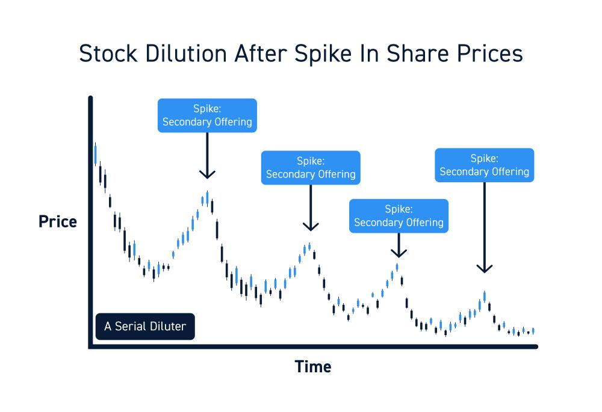

## Table of Contents

## What is a secondary offering?

A secondary offering is when a company that's already public sells more of its stock to the public. This is different from an initial public offering (IPO), which is when a company first sells its stock to the public. Companies might do a secondary offering to raise more money. This money can be used for things like expanding the business, paying off debts, or funding new projects.

Sometimes, the people who already own the company's stock, like early investors or company founders, might sell their shares in a secondary offering. This is called a secondary market offering. When this happens, the money goes to these shareholders, not the company. This can be a way for them to cash out some of their investment. It's important for investors to know if the money from the offering is going to the company or to existing shareholders, as it can affect the stock's value.

## How does a secondary offering differ from an initial public offering (IPO)?

A secondary offering and an initial public offering (IPO) are two ways companies can sell their stock, but they happen at different times and for different reasons. An IPO is when a company first sells its stock to the public. This is the first time the company's shares are available for anyone to buy on a stock market. It's a big step for a company because it means they're going public, and it's a way for the company to raise money to grow or pay for things they need.

On the other hand, a secondary offering happens after a company has already gone public. It's when the company decides to sell more of its stock to the public. This can be done to raise more money for the company, maybe to expand the business, pay off debts, or start new projects. Sometimes, it's not the company selling the stock but the people who already own it, like early investors or founders, who want to sell some of their shares. This type of secondary offering is called a secondary market offering, and the money goes to these shareholders, not the company.

## What are the common reasons a company might issue a secondary offering?

A company might issue a secondary offering to raise more money. This extra money can help the company grow bigger. They might use it to open new stores, make more products, or buy new equipment. It can also help the company pay off debts, which means they won't have to spend as much money on interest. Sometimes, the company needs money to start new projects or invest in new ideas that could make the company more successful in the future.

Another reason for a secondary offering is when the people who already own the company's stock, like early investors or founders, want to sell some of their shares. This is called a secondary market offering. When this happens, the money from selling the shares goes to these shareholders, not the company. They might want to sell their shares to get some money back from their investment or because they think it's a good time to sell. It's important for people who might buy these shares to know if the money is going to the company or to existing shareholders because it can affect what happens to the stock's price.

## How can a secondary offering affect the share price of a company?

When a company does a secondary offering, it can affect the share price in different ways. If the company is selling more shares, it means there are more shares available for people to buy. If the number of shares goes up but the company's value stays the same, each share might be worth a little less. This is called dilution. People who already own the stock might not like this, and the share price can go down because of it.

Sometimes, the reason for the secondary offering can also affect the share price. If the company is selling shares to raise money for good reasons, like growing the business or paying off debts, investors might think this is a good sign. They might be willing to pay more for the shares because they believe the company will do well in the future. But if the company is selling shares because it's having money problems, investors might worry and the share price could go down.

In a secondary market offering, where existing shareholders are selling their shares, the effect on the share price can be different. If a lot of important people, like founders or early investors, are selling their shares, it might make other investors worried. They might think these people know something bad about the company's future and want to sell before the price goes down. This can make the share price drop. But if the market thinks the company is still doing well, the effect might not be as big.

## What is dilution and how does it relate to secondary offerings?

Dilution happens when a company sells more shares and the total value of the company stays the same. This means each share is worth a smaller piece of the company. Imagine you have a pizza and you cut it into more slices. Each slice gets smaller even though the pizza is the same size. When a company does a secondary offering and sells more shares, it can dilute the value of the shares that people already own.

Dilution is important to think about with secondary offerings because it can make the share price go down. If the company is selling the new shares, the money they get can help the company grow or pay off debts, which might make the company more valuable in the future. But right away, the share price might drop because there are more shares. If existing shareholders are selling their shares in a secondary market offering, dilution might not happen, but the share price can still go down if people think the sellers know something bad about the company's future.

## Can a secondary offering ever have a positive effect on a company's share price? If so, how?

Yes, a secondary offering can have a positive effect on a company's share price. This can happen if investors think the company is using the money from the offering in a good way. For example, if the company is raising money to grow bigger, like opening new stores or making more products, investors might think the company will do well in the future. They might be willing to pay more for the shares because they believe the company's value will go up.

Also, if the company uses the money to pay off debts, it can make the company's financial situation better. When a company has less debt, it doesn't have to spend as much money on interest, which can make it more profitable. Investors like companies that are more profitable, so they might be more interested in buying the shares, which can push the share price up. So, if the reason for the secondary offering is seen as a good move by the company, it can lead to a higher share price.

## What are the short-term versus long-term impacts of secondary offerings on share price?

In the short term, a secondary offering can make a company's share price go down. This happens because the company is selling more shares, which means there are more shares for people to buy. If the total value of the company stays the same but there are more shares, each share is worth a smaller piece of the company. This is called dilution. Also, if people think the company is selling shares because it needs money badly, they might worry and sell their shares, which can make the price drop even more. If existing shareholders are selling their shares in a secondary market offering, it might make other investors worried too, because they might think the sellers know something bad about the company's future.

In the long term, the impact of a secondary offering on the share price can be different. If the company uses the money from the offering to grow the business, like opening new stores or making more products, or to pay off debts, it can make the company more valuable. When a company is more valuable, its share price can go up. Investors might be willing to pay more for the shares because they believe the company will do well in the future. So, even though the share price might go down right after a secondary offering, it can go up later if the company uses the money in a good way.

## How do investors typically react to the announcement of a secondary offering?

When a company announces a secondary offering, investors often react by selling their shares, which can make the share price go down right away. This happens because the company is selling more shares, and if the total value of the company stays the same, each share is worth a smaller piece of the company. This is called dilution. Also, if investors think the company is selling shares because it needs money badly, they might worry and decide to sell their own shares before the price drops even more.

However, not all reactions are negative. Some investors might see the secondary offering as a good sign if they believe the company will use the money to grow bigger or pay off debts. If the company uses the money well, it could become more valuable in the future, which might make the share price go up over time. So, while the short-term reaction is often negative, the long-term impact can be positive if the company makes smart choices with the money it raises.

## What role does the market condition play in the impact of a secondary offering on share price?

Market conditions can really change how a secondary offering affects a company's share price. If the market is doing well and people feel good about investing, they might not worry too much about a secondary offering. They might even see it as a good thing if they think the company will use the money to grow or pay off debts. But if the market is not doing well and people are worried about their investments, a secondary offering can make things worse. Investors might be more scared about dilution and might sell their shares, making the price drop even more.

The type of secondary offering can also matter depending on the market conditions. If it's a secondary market offering where existing shareholders are selling their shares, and the market is already nervous, it can make investors even more worried. They might think the shareholders know something bad about the company's future and want to sell before the price goes down. But if the market is strong, investors might not be as worried and might see the offering as a chance to buy more shares in a company they believe in.

## How can a company mitigate the negative effects of a secondary offering on its share price?

A company can take steps to lessen the negative impact of a secondary offering on its share price by clearly explaining why they are doing it. If they tell investors that they will use the money to grow the business or pay off debts, it can make people feel better about the offering. For example, if the company says they will use the money to open new stores or make more products, investors might think the company will be worth more in the future. This can help keep the share price from dropping too much.

Another way to help is by timing the offering well. If the company waits until the market is doing well and people feel good about investing, the negative effects might be smaller. Also, if the company can show that it's doing well financially and has a good plan for the future, it can make investors more confident. This confidence can help keep the share price stable or even make it go up over time, even after a secondary offering.

## What are some historical examples of secondary offerings and their impacts on company share prices?

One example of a secondary offering happened with Tesla in 2020. Tesla announced a $2 billion secondary offering to raise money for its growth plans, like building new factories. At first, Tesla's share price dropped because people worried about dilution. But then, the share price quickly went back up because investors believed in Tesla's future and thought the company would use the money well. This shows how a company's plans for the money can affect how investors react to a secondary offering.

Another example is with Twitter in 2014. Twitter did a secondary offering to raise money to help the company grow. Right after the announcement, Twitter's share price went down because of worries about dilution. But over time, the share price didn't recover as quickly as Tesla's did. This was partly because Twitter was having a harder time showing investors that it was growing and making money. This example shows how the success of a secondary offering can depend on how well the company is doing and what investors think about its future.

These examples show that secondary offerings can have different effects on share prices. It depends a lot on what the company plans to do with the money and how well the company is doing overall. If investors think the company will use the money to grow and become more valuable, the share price might not drop as much or could even go up over time.

## How do advanced financial models predict the impact of secondary offerings on share price?

Advanced financial models use a lot of data and math to guess how a secondary offering might change a company's share price. These models look at things like how many new shares the company is selling, what the company plans to do with the money, and how the market is doing right now. They also think about past secondary offerings and how they affected share prices. By putting all this information together, the models can make a prediction about whether the share price will go up or down and by how much.

Sometimes, these models also use something called "sentiment analysis." This means they look at what people are saying about the company on social media, in the news, and in financial reports. If people are talking positively about the company's plans for the money, the models might predict a smaller drop in the share price or even a rise. But if people are worried or negative, the models might predict a bigger drop. This helps investors and companies understand how a secondary offering might affect the share price in both the short term and the long term.

## What is the understanding of secondary offerings?

A secondary offering occurs when a company issues additional shares after its initial public offering (IPO) to raise further capital. This process serves as a means for companies to generate funding for expansion, debt reduction, or other corporate purposes. Secondary offerings are distinct from primary offerings, the latter representing the issuance of shares during an IPO for the first time.

There are two main types of secondary offerings: dilutive and non-dilutive. A dilutive secondary offering involves the issuance of new shares, which increases the total share count. This can potentially dilute existing shareholders' earnings per share (EPS), leading to a decrease in the value of each individual share. Dilution can be understood through the formula:

$$
\text{Diluted EPS} = \frac{\text{Net Income}}{\text{Total Shares Outstanding after Issuance}}
$$

A higher denominator due to the increased count of shares after issuance can result in a lower EPS, which may impact investor perceptions negatively.

Conversely, a non-dilutive secondary offering involves existing shareholders selling their shares. This type doesn't affect the total number of shares outstanding, hence there is no direct dilution of share value affecting EPS. Shareholder composition changes, however, as ownership stakes shift between sellers and new buyers.

Secondary offerings are used by companies for several reasons. They provide an avenue to raise capital without increasing debt levels, useful for funding strategic projects or acquisitions. Companies may consider such offerings to improve float, enhancing [liquidity](/wiki/liquidity-risk-premium) and marketability of shares. Additionally, they can be part of a broader strategy to diversify the shareholder base or portend future positive developments, like increased growth potential.

While secondary offerings are distinct from primary market activities (which occur during the IPO), they share similarities in influencing market dynamics and investor interest. Investors examining secondary offerings must consider potential dilution implications and the underlying reasons for the offering to ascertain future growth prospects and risks.

## References & Further Reading

[1]: Bergstra, J., Bardenet, R., Bengio, Y., & Kégl, B. (2011). ["Algorithms for Hyper-Parameter Optimization."](https://dl.acm.org/doi/10.5555/2986459.2986743) Advances in Neural Information Processing Systems 24.

[2]: ["Advances in Financial Machine Learning"](https://www.amazon.com/Advances-Financial-Machine-Learning-Marcos/dp/1119482089) by Marcos Lopez de Prado

[3]: ["Evidence-Based Technical Analysis: Applying the Scientific Method and Statistical Inference to Trading Signals"](https://www.amazon.com/Evidence-Based-Technical-Analysis-Scientific-Statistical/dp/0470008741) by David Aronson

[4]: ["Machine Learning for Algorithmic Trading"](https://github.com/stefan-jansen/machine-learning-for-trading) by Stefan Jansen

[5]: ["Quantitative Trading: How to Build Your Own Algorithmic Trading Business"](https://www.amazon.com/Quantitative-Trading-Build-Algorithmic-Business/dp/1119800064) by Ernest P. Chan