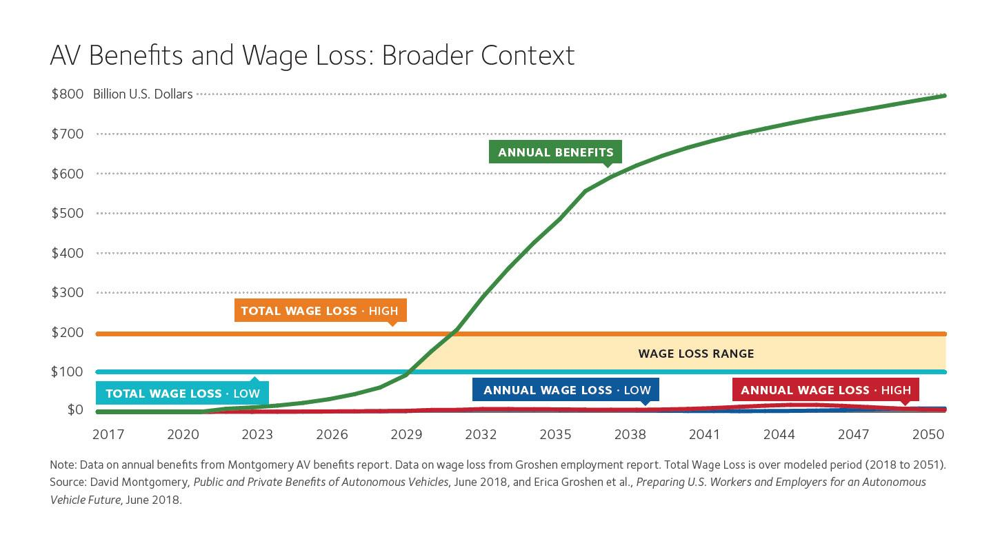

Autonomous vehicles and self-driving cars have captivated human imagination with their promise of transforming transportation into a seamless and efficient experience. These groundbreaking technologies are poised to significantly alter the landscape of the automotive industry, while also making waves in diverse sectors such as finance, particularly in algorithmic trading.

Currently, self-driving technology is advancing rapidly, driven by strides in artificial intelligence (AI) and sensor technologies. This progress is already impacting the automotive sector, which is witnessing a shift as traditional automakers and tech companies alike invest heavily in autonomous vehicle research and development. The infusion of AI into these vehicles allows for smarter, more responsive systems capable of making real-time decisions, fundamentally redefining the concept of mobility.



As the automotive industry transitions, it is giving rise to new business models that prioritize mobility solutions over traditional car ownership. Companies are exploring car-sharing and subscription models, providing consumers with flexible and cost-effective transportation alternatives. This shift signals a broader economic transformation, with technology companies such as Google and Tesla leading the charge in developing cutting-edge AV technology.

The intersection of autonomous vehicles and algorithmic trading presents unique opportunities. Both fields rely heavily on data collection and real-time decision-making processes. In algorithmic trading, rapid analysis and response to market data are crucial, mirroring the decision-making capabilities needed in autonomous vehicles for navigation and safety. This synergy suggests potential enhancements in logistical operations and the development of innovative trading strategies driven by predictive analytics and investment algorithms derived from AV-generated data.

Looking towards the future, the continued evolution of these technologies will likely have a profound impact on consumer behavior and global economies. While autonomous vehicles promise increased safety and efficiency, their integration into society poses challenges, including regulatory concerns and shifts in labor markets. Nevertheless, the potential benefits—ranging from reduced traffic congestion and environmentally sustainable urban development to more intelligent financial market operations—underscore the importance of ongoing innovations in this field.

## Table of Contents

## Understanding Autonomous Vehicles

Autonomous vehicles (AVs) are transforming modern transportation through the use of sophisticated sensors and artificial intelligence technologies. They are designed to perform driving tasks without human input, relying heavily on technologies such as LiDAR, cameras, radar, and ultrasonic sensors to detect and interpret surrounding environments autonomously.

LiDAR, which stands for Light Detection and Ranging, operates by measuring the time it takes for laser light to bounce back from objects. This technology generates detailed 3D maps of a vehicle's surroundings, which are essential for navigating complex environments. Cameras provide visual data that help vehicles identify lane markings, traffic signals, and dynamic objects like pedestrians and cyclists. Radar (Radio Detection and Ranging) complements these systems by providing accurate distance measurements to objects, even in adverse weather conditions. Ultrasonic sensors are typically used for short-range detection and are helpful in tasks like parking.

Machine learning algorithms are integral to the function of AVs, as they process incoming sensor data in real-time to make navigation decisions, ensuring the vehicle's safe passage through varying road conditions. These algorithms employ a variety of techniques, including convolutional neural networks (CNNs) for image recognition and [reinforcement learning](/wiki/reinforcement-learning) for decision-making under uncertainty. A critical aspect of these systems is their ability to learn continuously from new data, enhancing their functionality and safety over time.

The Society of Automotive Engineers (SAE) defines six levels of automation that delineate the extent of a vehicle's autonomous capabilities. Level 0 represents no automation, where the human driver is fully in control. At Level 1, the vehicle offers some driver assistance, such as adaptive cruise control, while Level 2 involves partial automation where the vehicle can manage certain functions simultaneously, like steering and acceleration, but the driver must remain engaged. Levels 3 through 5 represent increasing autonomy. Level 3, conditional automation, entails the vehicle handling all aspects of driving in specific environments, with the expectation that the human driver may need to intervene. At Level 4, high automation, the vehicle can operate independently in most conditions without driver intervention. Finally, Level 5 represents full automation, where the vehicle is entirely autonomous and requires no human input under any circumstances.

This structured approach to automation provides a clear framework for the development and deployment of AVs, setting benchmarks for safety and functionality. As technology advances, we expect to see a transition through these levels, ultimately achieving the vision of fully independent vehicles capable of navigating all traffic scenarios.

## Impact on the Auto Industry

The emergence of self-driving cars is prompting a significant shift in the automotive industry, pushing traditional car manufacturers to rethink their strategies and embrace innovation. As the technology behind autonomous vehicles (AVs) becomes more sophisticated, companies are exploring new business models that diverge from the traditional paradigm of vehicle ownership.

One major development is the rise of car-sharing services and subscription models. These alternatives focus on providing consumers with mobility solutions rather than individual car ownership. Car-sharing services like Zipcar and subscription models such as those offered by Volvo and Porsche allow users to access vehicles when needed without the long-term financial commitment of purchasing a car. This shift reflects a broader trend towards the sharing economy, which emphasizes access over ownership.

Technology companies are at the forefront of this transformation, with names like Google (through its subsidiary Waymo) and Tesla significantly investing in AV technology. Waymo has been testing fully autonomous vehicles and has launched a driverless taxi service in select areas, showcasing the potential of AV technology in real-world scenarios. Tesla, on the other hand, continues to advance its Autopilot system, aiming to achieve full self-driving capabilities. These tech giants are not only investing in the technology itself but are also leveraging data analytics and [artificial intelligence](/wiki/ai-artificial-intelligence) to enhance vehicle performance and safety.

Furthermore, the interior design of vehicles is undergoing a transformation. As the requirement for human intervention in driving diminishes, vehicle interiors are being reimagined to enhance comfort and productivity. The absence of a driving role allows for the redesign of traditional cabin spaces, potentially incorporating features that facilitate work and leisure. Seating arrangements might become more flexible, resembling lounges rather than conventional car interiors, supporting activities like working or socializing during transit.

Overall, the impact of autonomous vehicles on the automotive industry is profound, prompting a reevaluation of ownership models, driving innovation in vehicle design, and opening the door for tech companies to play a significant role in the future of transportation. These changes suggest a future where transportation is more flexible, efficient, and integrated into the broader technological landscape.

## Algorithmic Trading and Autonomous Vehicles

Autonomous vehicle (AV) data collection and the necessity for real-time decision-making find remarkable parallels in the domain of [algorithmic trading](/wiki/algorithmic-trading), two fields driven by data analytics and computational efficiency. Algorithmic trading, a modern approach to trading in financial markets, relies heavily on the ability to process large volumes of data swiftly and execute trades based on quantitative predictions. Similarly, AVs must process sensory data from various devices like LiDAR, cameras, and radar efficiently to navigate effectively and safely, making immediate decisions in dynamic environments.

The integration of AV technology into financial services offers fertile ground for the creation of new trading strategies and enhancement of logistical operations in the finance industry. AVs generate considerable amounts of data every second, encompassing information about traffic conditions, vehicle performance, and environmental factors. This data richness can be translated into financial contexts. By leveraging advanced [machine learning](/wiki/machine-learning) algorithms, vast AV datasets could contribute to developing predictive analytics models, which are already a cornerstone of algorithmic trading. 

Predictive analytics in financial services could benefit significantly from AV data by offering insights into market trends and potential investment opportunities. For instance, real-time traffic data can be used to anticipate economic activities in specific regions, which might affect commodity prices, stock performance of retail businesses, or supply chain distributions. This could be implemented through models that utilize both historical and real-time data to generate forecasts. In practical terms, a Python-based framework using libraries such as Pandas for data manipulation and Scikit-learn for model training would be instrumental:

```python
import pandas as pd
from sklearn.model_selection import train_test_split
from sklearn.ensemble import RandomForestRegressor

# Suppose we have a dataset 'av_traffic_data.csv' with AV-generated data
data = pd.read_csv('av_traffic_data.csv')

# Preprocess data as required
X = data.drop('target_variable', axis=1)
y = data['target_variable']

# Split data into training and testing
X_train, X_test, y_train, y_test = train_test_split(X, y, test_size=0.2, random_state=42)

# Use a Random Forest Regressor model for prediction
model = RandomForestRegressor(n_estimators=100, random_state=42)
model.fit(X_train, y_train)

# Predict using the test set
predictions = model.predict(X_test)
```

Furthermore, this convergence of AV technologies and financial algorithms extends beyond data utilization for trading strategies to include operational efficiencies within financial institutions themselves. Autonomous fleets could optimize transportation logistics, reducing costs associated with asset distribution and customer service.

In conclusion, the symbiosis between algorithmic trading and autonomous vehicles signifies a broader intersection of AI applications in technology development. By exploring these collaborative opportunities, financial services can enhance their strategic capabilities and improve infrastructural efficiencies.

## Economic Implications

The automation of vehicles, particularly through the development of autonomous vehicles (AVs), holds significant promise for altering the economic landscape. This transformation is expected to disrupt labor markets, particularly impacting professions reliant on driving, such as truck drivers, taxi operators, and delivery personnel. As AVs become more prevalent, there will likely be a reduction in demand for these roles. However, this shift may concurrently generate new employment opportunities in technology development, vehicle maintenance, and system management, as the need for skilled personnel to develop, manage, and maintain AV systems increases.

One of the major economic implications of AVs is improved traffic efficiency, leading to potential reductions in fuel consumption and emissions. The ability of AVs to optimize routing and deceleration patterns can contribute significantly to more sustainable urban development. A model that predicts fuel consumption can be represented as follows:

$$
\text{Fuel Consumption} = \int \left( \text{Speed}(t) \times \text{Acceleration}(t) \right) \, dt
$$

This model shows that by maintaining optimal speeds and minimizing unnecessary accelerations, AVs can decrease overall fuel usage, thus reducing emissions and fuel costs.

Additionally, AV technology is leading to a shift in the cost model of transportation. The potential for lowering logistics costs is substantial as AVs could operate continuously without the need for rest, unlike human drivers. For personal travel, the cost savings could be reflected in reduced maintenance expenses, insurance premiums due to perceived safety, and possibly the depreciation of vehicle ownership as subscription and car-sharing models become more viable.

Consumer behavior is another area where AVs will have notable effects. As shared mobility solutions gain traction, there could be a decline in the traditional model of private car ownership. Services that focus on mobility rather than ownership could offer consumers flexible, on-demand transportation options. This shift is likely to impact car sales, compelling manufacturers to adapt by developing vehicles that cater more to shared use scenarios than individual ownership.

The economic implications of AVs suggest a comprehensive rethinking of how transportation costs are calculated and experienced. As these vehicles integrate more fully into society, the potential for a more dynamic, efficient, and sustainable transportation system becomes increasingly attainable.

## Challenges and Considerations

Autonomous vehicles (AVs) are on the frontier of technological innovation, but their integration into society presents several challenges and considerations. One major concern is the development of robust regulatory frameworks. As AV technology evolves, governments worldwide face the challenge of creating standardized rules that ensure safety, address liability issues, and facilitate international cooperation. These frameworks must adapt to the rapid pace of technological change, ensuring that legal systems can accommodate advancements without stifling innovation.

Public acceptance also plays a crucial role in the adoption of AVs. Trust in the technology is essential for widespread use, as consumers must feel confident in the safety and reliability of these vehicles. Public education and transparent communication about the benefits and limitations of AVs are key to gaining this trust. Moreover, comprehensive testing and demonstration of the technology's safety in real-world situations are necessary to dispel public skepticism.

Privacy issues related to data collection represent another significant hurdle. AVs rely on vast amounts of data, including personal information, to operate effectively. This raises concerns about data privacy and security, as well as the potential for misuse of collected data. Developing stringent data protection measures and ensuring adherence to privacy laws are essential steps in addressing these concerns.

Furthermore, the safe integration of AVs into smart city environments requires coordinated efforts across industries and government bodies. Smart cities rely on interconnected systems for traffic management, energy distribution, and public services. Integrating AV technology into these systems necessitates collaboration between automotive companies, tech firms, city planners, and policymakers. This convergence demands a strategic approach to infrastructure development, data sharing, and technology standardization to ensure seamless operations.

Additionally, ensuring safety, the top priority, involves overcoming significant technical challenges. AVs must be able to make split-second decisions in complex environments, necessitating high levels of reliability in sensor technologies and machine learning models. Rigorous testing, continuous improvement of algorithms, and fail-safe mechanisms are essential to achieving the high safety standards required for AV operation.

In summary, while the promise of autonomous vehicles is substantial, successfully overcoming regulatory, societal, and technological challenges is crucial for their widespread adoption and integration into the evolving landscape of smart cities.

## Conclusion

Autonomous vehicles (AVs) and algorithmic trading represent significant advances in technology, each driven by artificial intelligence (AI) and sophisticated data analytics. Together, they are set to revolutionize not only the automotive and financial sectors but also the broader economy. The transformative potential of these technologies lies in their promise to enhance safety, improve efficiency, and stimulate economic growth.

Autonomous vehicles aim to reduce human error, which accounts for a significant portion of traffic accidents and fatalities, thus offering considerable safety benefits. In addition, they are expected to optimize traffic flow and decrease energy consumption, contributing to a more efficient and sustainable transportation system. These improvements have the potential to fundamentally alter urban development and infrastructure planning, creating more livable and interconnected communities.

In financial markets, algorithmic trading leverages AI to process vast amounts of data at speeds far beyond human capability, allowing for more precise and informed trading decisions. This can lead to more efficient markets, with tighter spreads and better [liquidity](/wiki/liquidity-risk-premium), ultimately benefiting both individual investors and the economy at large. As AVs generate extensive data streams, there is an opportunity for these real-time datasets to be incorporated into trading strategies, enhancing predictive models and investment outcomes.

Nonetheless, these technologies are not without challenges. The deployment of autonomous vehicles faces numerous obstacles including regulatory hurdles, public acceptance issues, and concerns over data privacy and cybersecurity. To unlock the full potential of AVs and algorithmic trading, continuous innovation and adaptation are crucial. Stakeholders must collaborate to develop robust regulatory frameworks, ensure technological reliability, and address socio-economic impacts, such as shifts in labor markets and changes in consumer behavior.

The path forward requires a concerted effort across industries and governments to integrate these technologies responsibly and efficiently. If successfully implemented, autonomous vehicles and algorithmic trading can drive a new era of economic growth and societal advancement, characterized by safer roads, more efficient markets, and sustainable urban environments. As innovation continues to push the boundaries of what is possible, these groundbreaking technologies offer a glimpse into a future where AI-driven solutions enhance nearly every aspect of modern life.

## References & Further Reading

[1]: Wadud, Z., MacKenzie, D., & Leiby, P. (2016). ["Help or hindrance? The travel, energy and carbon impacts of highly automated vehicles."](https://www.sciencedirect.com/science/article/pii/S0965856415002694) Transportation Research Part A: Policy and Practice, 86, 1-18.

[2]: Frazzoli, E., Dahleh, M. A., & Feron, E. (2002). ["Real-time motion planning for agile autonomous vehicles."](https://www.mit.edu/~dahleh/pubs/2.Real-Time%20Motion%20Planning%20for%20Agile%20Autonomous%20Vehicles.pdf) Journal of Guidance, Control, and Dynamics, 25(1), 116-129.

[3]: Anderson, J. M., Kalra, N., Stanley, K. D., Sorensen, P., Samaras, C., & Oluwatola, O. A. (2016). ["Autonomous vehicle technology: A guide for policymakers."](https://www.rand.org/pubs/research_reports/RR443-2.html) RAND Corporation.

[4]: Fink, M. P., & Jegadeesh, N. (2017). ["Understanding Algorithmic Trading Strategies."](https://link.springer.com/article/10.1007/s11408-022-00417-8) The Review of Financial Studies, 30(4), 103ı-1075.

[5]: Shapiro, S. J., & Rabinowitz, E. (2016). ["Self‐Driving Cars: A Case Study in Making New Markets."](https://www.taylorfrancis.com/books/mono/10.4324/9781315773339/ethical-leadership-decision-making-education-joan-poliner-shapiro-jacqueline-stefkovich) William & Mary Business Law Review, 7(1), 136-186.