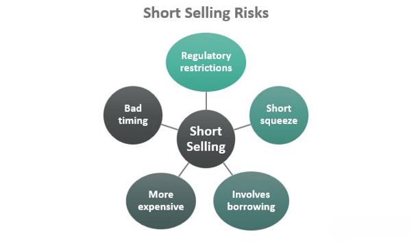

Financial markets represent a multifaceted ecosystem characterized by a wide array of strategies and tools that profoundly influence both individual investors and the broader market landscape. These markets operate as vital mechanisms for economic growth, allowing for the allocation of resources and the valuation of businesses. The performance and behaviors within these markets, however, are heavily influenced by the strategies employed by participating investors.

This article focuses on the convergence of various critical strategies—specifically, the market effects of short selling and the surge of algorithmic trading. Short selling, although sometimes controversial, serves a functional role by contributing to price discovery and providing market liquidity. This mechanism enables investors to potentially profit from declining market prices, affecting securities valuation and volatility.



Algorithmic trading, on the other hand, has ushered in a new era of trading paradigms by leveraging sophisticated algorithms to automate and optimize transactions. It enhances the speed, precision, and efficiency of trading activities, allowing for complex strategies such as high-frequency trading and arbitrage, which were previously unimaginable in the conventional trading framework.

Throughout this article, we aim to parse each aspect of these strategies to comprehend their individual and collective roles. By exploring how short selling reveals overvaluations or how algorithmic trades introduce liquidity, we can gain meaningful insights into their market impact. Understanding these mechanisms is crucial not only for navigating the investment landscape but also for strategic decision-making, whether you are a seasoned investor or just beginning your journey in financial markets.

In essence, a thorough grasp of these concepts not only enhances strategic decision-making capabilities but also ensures that one is well-equipped to respond to the dynamic nature of modern financial markets.

## Table of Contents

## Investor Strategies in Modern Markets

Investors employ a diverse range of strategies to effectively navigate the complexities of modern financial markets. Traditional long-term investments continue to serve as a cornerstone for many, focusing on the sustained growth of capital over extended periods. These strategies typically involve buying securities such as stocks, bonds, or mutual funds with the expectation of appreciating value over time.

In addition to long-term approaches, trading in derivatives has gained traction as a means to hedge risks or speculate on asset price movements. Derivatives—including options, futures, and swaps—allow investors to utilize leverage to gain exposure to larger positions with relatively smaller initial investments. For example, a call option gives the holder the right, but not the obligation, to buy an underlying asset at a predetermined price before a specified expiration date. This flexibility is appealing to traders looking to manage potential risks associated with fluctuations in asset prices.

Short selling represents another strategic option, enabling investors to profit from anticipated declines in asset prices. This involves borrowing securities and selling them on the open market, with the intention of repurchasing them at a lower price. While short selling carries significant risks due to its potential for unlimited losses, it is lauded for its role in promoting market efficiency by facilitating more accurate price discovery and [liquidity](/wiki/liquidity-risk-premium).

Automated and [algorithmic trading](/wiki/algorithmic-trading) have emerged as transformative forces, reshaping traditional investment methodologies. These strategies leverage computer algorithms to execute trades at speeds and frequencies beyond human capabilities. Algorithmic trading, or algotrading, encompasses diverse strategies such as high-frequency trading ([HFT](/wiki/high-frequency-trading-strategies)), statistical [arbitrage](/wiki/arbitrage), and [market making](/wiki/market-making), allowing for rapid response to market opportunities and discrepancies. By analyzing vast datasets in real-time, algo-based models identify pricing inefficiencies or trends across multiple asset classes, optimizing trade execution with minimal human intervention.

Technological advancements have catalyzed the evolution of these strategies, offering investors innovative ways to capitalize on market movements. The advent of [machine learning](/wiki/machine-learning) and [artificial intelligence](/wiki/ai-artificial-intelligence) enables the development of increasingly sophisticated models that learn from historical data to predict future market behaviors. These technologies not only enhance the precision of trading strategies but also offer tools for portfolio optimization, risk management, and asset allocation.

As financial landscapes continue to evolve, investors are equipped with an expanding toolkit of strategies and technologies. This facilitates improved decision-making and competitive positioning within global markets, underscoring the dynamic interplay between innovation and investment strategy.

## Market Impact of Short Selling

Short selling is a trading strategy in which an investor borrows and sells a security with the expectation of repurchasing it later at a lower price, thus profiting from a decline in the security's value. This practice, though often controversial, is integral to the functionality of financial markets due to its impact on price discovery and liquidity.

### Efficient Price Discovery

Short selling aids in efficient price discovery by allowing market participants to express negative views on overpriced securities, thus pushing prices towards their true value. This mechanism ensures that prices reflect available information more accurately, minimizing instances of overvaluation. According to financial theories, the price of a security should equal the present value of expected future cash flows. However, market inefficiencies, sentiment, and misinformation can lead to irrational pricing. Short sellers, by identifying and acting on these inefficiencies, contribute to more accurate pricing.

### Liquidity Enhancement

The presence of short sellers enhances market liquidity, providing more opportunities for other investors to participate in trades. Increased liquidity reduces the bid-ask spread, leading to more efficient markets. This liquidity injection is particularly vital in moments of market stress, as it stabilizes price movements and prevents extreme [volatility](/wiki/volatility-trading-strategies).

### Controversies and Criticisms

Despite its benefits, short selling is often criticized for exacerbating market volatility. Critics argue that aggressive short selling can lead to sharp declines in stock prices, creating a self-fulfilling prophecy where investor panic further depresses prices. This negative spiral can destabilize markets, particularly during economic downturns.

### Historical Examples

Short sellers have historically played pivotal roles in market corrections. During the dot-com bubble in the late 1990s, numerous technology stocks were significantly overvalued based on speculative predictions rather than fundamental financial performance. Short sellers scrutinized these overvaluations, acting as a counterbalance to bullish investor sentiment. Eventually, as the bubble burst, the actions of short sellers were seen as instrumental in correcting market mispricing.

In conclusion, while short selling presents potential risks, its contributions to price discovery and liquidity are undeniable. Balancing the positive aspects with its potential to induce volatility remains a critical consideration for regulators and market participants alike. Through responsible practice and oversight, short selling can continue to help render financial markets more efficient and resilient.

## Algorithmic Trading: The New Frontier

Algorithmic trading represents a significant evolution in financial markets, utilizing advanced algorithms to automate and optimize trading processes. By leveraging computational power, algorithmic trading strategies execute orders with unparalleled speed and accuracy, far surpassing traditional manual trading methods.

Algorithmic trading facilitates high-frequency trading (HFT), a subset characterized by extremely high-speed trade execution. HFT exploits minute price discrepancies across markets, capitalizing on arbitrage opportunities that exist for mere milliseconds. The algorithms used in these strategies are designed to analyze vast datasets quickly, identify trading opportunities, and execute trades faster than a human trader can react. This speed allows for the execution of thousands of trades in a brief period, thus maximizing potential gains from small price movements.

To understand algorithmic trading, consider the basic structure of a trading algorithm:

```python
def trading_algorithm(market_data):
    for asset in market_data:
        if asset.price_mispricing():
            execute_trade(asset)

def execute_trade(asset):
    # Insert order logic here
    if asset.buy_signal():
        place_order('buy', asset)
    elif asset.sell_signal():
        place_order('sell', asset)
```

Such algorithms enable the immediate execution of trades upon identification of lucrative conditions, ensuring maximal exploitation of short-lived market inefficiencies. The ability to process and act on large volumes of market data almost instantaneously constitutes a substantial advantage in competitive financial environments.

While algorithmic trading significantly enhances market liquidity and efficiency, it also raises concerns regarding market volatility and systemic risks. The rapid buying and selling activities inherent to algorithmic and high-frequency trading can amplify price swings during periods of market stress, potentially leading to flash crashes. These sudden market disturbances highlight the systemic risks posed by an over-reliance on automated systems that may not account for human judgment or unforeseen events.

Moreover, the scale and speed of algorithmic trading necessitate stringent regulatory oversight to mitigate potential market manipulation and ensure fair trading practices. Authorities worldwide continue to refine regulations to address the challenges posed by algorithmic and high-frequency trading, aiming to balance the benefits of technological advancements with the need for market stability and integrity.

In summary, while algorithmic trading offers profound benefits in terms of execution speed and efficiency, it also demands a responsible approach to minimize associated risks. Robust monitoring and regulation, together with the development of smarter, more adaptive algorithms, are crucial for harnessing the potential of algorithmic trading while safeguarding against its drawbacks.

## Positive and Negative Impacts of Short Selling

Short selling is a practice within financial markets where investors sell securities they do not own, with the intention of buying them back at a lower price. This strategy has sparked considerable debate due to its diverse impacts on the market, both positive and negative.

On the positive side, short selling contributes significantly to better market information. By facilitating the expression of negative opinions about overvalued assets, it ensures a more accurate reflection of a security's true value. This process, known as price discovery, is essential for maintaining market efficiency. By identifying and correcting overvalued securities, short sellers play a pivotal role in adjusting prices to reflect intrinsic values.

Short selling also enhances market liquidity. The presence of short sellers adds depth to the market by providing additional buyers and sellers, making it easier for other market participants to execute trades. This increased liquidity reduces transaction costs and minimizes price distortions, contributing to overall market stability.

Moreover, short selling acts as a check on corporate misconduct. Short sellers often conduct thorough [fundamental analysis](/wiki/fundamental-analysis) to identify potential issues with a company. By exposing corporate fraud or financial misrepresentation, they prompt corrective actions from stakeholders and regulatory bodies, thereby fostering greater corporate accountability and transparency.

Conversely, the practice of short selling is not devoid of criticisms. It can lead to increased market volatility as it involves significant borrowing and leveraging, which may amplify price swings. This volatility can deter long-term investors and undermine market confidence.

There is also the potential for market manipulation. Unscrupulous traders might engage in "short and distort" schemes, where they disseminate false information to drive down stock prices for profit. Such actions not only harm target companies but also erode investor trust in the fairness of the market.

Additionally, short selling raises ethical considerations due to the moral quandary of profiting from declining stock prices of companies. Critics argue that it contributes to a negative market sentiment and may exacerbate downturns, as some investors might view short selling as betting on a company's failure, thereby harming economic growth and employment.

Understanding both the positive and negative impacts of short selling is crucial for developing balanced regulatory policies that protect market integrity while promoting efficiency. Policymakers must weigh these factors to create a regulatory framework that curbs potential abuses without stifling the beneficial aspects of short selling. Implementing such balanced regulations is essential to strike a fair equilibrium that fosters robust market practices and resilient financial ecosystems.

## The Legal and Ethical Landscape

The legality of short selling is subject to variation across different jurisdictions, reflecting diverse regulatory attitudes toward its practice. In the United States, short selling is legal but operates under specific regulatory conditions designed to maintain market integrity and protect investors. The Securities and Exchange Commission (SEC) oversees these regulations, requiring short sellers to borrow the security before executing a sale, thereby preventing default on delivery obligations. This requirement is in place to discourage manipulative practices and ensure that all transactions are underpinned by actual shares available in the market.

Naked short selling, distinct from traditional short selling, is prohibited due to its potential for market manipulation. Unlike standard short selling, naked short selling involves selling shares without first borrowing them or ensuring their availability. This practice can lead to an artificial increase in the supply of shares, potentially driving down the stock price unjustifiably and undermining market stability. The SEC's ban on naked short selling aims to eliminate this risk and mitigate the chances of systemic exploitation.

Ethical considerations surrounding short selling and algorithmic trading are pivotal in safeguarding market integrity. Critics argue that these activities can be used to manipulate markets, causing harm to other investors and eroding trust in financial systems. There are concerns about high-frequency traders using complex algorithms to exploit milliseconds of information advantage, which can disadvantage retail investors and smaller market participants. These ethical considerations necessitate robust and transparent regulatory frameworks to prevent abuse and maintain fair market conditions.

For instance, regulatory bodies worldwide impose various rules to ensure fair play, including the implementation of circuit breakers to curb excessive volatility and the imposition of disclosure requirements for substantial short positions. Moreover, there's a focus on monitoring and controlling high-frequency trading to prevent potential disruptions caused by algorithmic errors or systemic risks. The balance between embracing innovative trading strategies and protecting market participants remains a core challenge for regulators, emphasizing the need for continuous oversight and adaptation to evolving market dynamics.

## The Relationship Between Investor Strategies and Market Behavior

Investor strategies significantly influence market behavior, often resulting in varied effects such as price corrections and liquidity enhancements. These outcomes stem from the intricate mechanisms of short selling and algorithmic trading.

Short selling can influence market prices by fostering efficient price discovery. When investors expect a security to be overvalued, they might engage in short selling, which contributes to adjusting the price to reflect its true market value. This process promotes a more accurate pricing model in financial markets. Conversely, during market downturns, excessive short selling can exacerbate price declines, potentially undermining market stability.

Algorithmic trading, characterized by its speed and precision, has revolutionized the execution of trades. Its capacity to process vast amounts of data rapidly facilitates high-frequency trading (HFT) and enables arbitrage opportunities. This efficiency often enhances market liquidity, ensuring tighter bid-ask spreads and reduced transaction costs. For example, the rapid execution inherent in algorithmic trading can help stabilize prices by balancing demand and supply more effectively than traditional trading methods.

However, the impact of these strategies is contingent upon economic conditions and regulatory environments. During periods of economic stability, algorithmic trading and short selling can jointly maintain a balanced market by ensuring efficient price adjustments and liquidity provision. Yet, in volatile markets, the same strategies might contribute to instability. HFT, in particular, can lead to sudden spikes in volatility as algorithms react to minor price changes, potentially causing market disruptions.

The role of regulatory oversight cannot be overstated. Regulatory frameworks help mitigate the potential adverse effects of these strategies, like excessive speculation and market manipulation, by enforcing rules on trading practices. This is particularly crucial when considering the systemic risks posed by algorithmic trading's reliance on automated decision-making processes, which can amplify market shocks.

Understanding these dynamics is essential for both investors and policymakers. For investors, insights into how these strategies affect market behavior can inform better decision-making and risk management practices. For policymakers, a deep comprehension of these interactions aids in crafting regulations that safeguard market integrity while allowing beneficial aspects of these strategies to enhance market performance. Balancing innovation with regulation remains key to promoting market health and resilience.

## Conclusion

As financial markets continue to evolve, the strategies adopted by investors must also advance to maintain a competitive edge. Both short selling and algorithmic trading serve as formidable tools in modern finance, influencing market dynamics in profound ways. Short selling allows for the identification and correction of mispriced securities, promoting market efficiency by bringing inflated stock prices back to their fair value. However, its impact is twofold, as it can also lead to increased market volatility, especially during times of financial uncertainty.

Algorithmic trading, on the other hand, incorporates advanced algorithms to automate trading processes, enabling rapid execution of trades with a precision unmatched by traditional methods. This efficiency contributes to enhanced market liquidity and the effective execution of high-frequency trading and arbitrage strategies. Despite its benefits, algorithmic trading raises concerns about systemic risks and heightened volatility due to the sheer speed and [volume](/wiki/volume-trading-strategy) of trades it produces.

The responsible use and clear understanding of short selling and algorithmic trading are pivotal. Equally crucial is the establishment and maintenance of robust regulatory frameworks to safeguard market integrity and stability. Regulation must strive to balance the benefits of these strategies with the potential risks, ensuring that financial markets operate efficiently and fairly. As investors adapt to a continuously changing financial landscape, informed decision-making and robust oversight remain essential to navigating the complexities and preserving the stability of global markets.

## References & Further Reading

[1]: Saffi, P. A., & Sigurdsson, K. (2011). ["Price efficiency and short selling."](https://academic.oup.com/rfs/article-abstract/24/3/821/1590469) The Review of Financial Studies, 24(3), 821-852.

[2]: Engle, R., & Ferstenberg, R. (2007). ["Execution risk"](https://www.semanticscholar.org/paper/Execution-Risk-Engle-Ferstenberg/6e7ebdc2cb37119678c0be0b63e3a51fa40ef4e0) and the need for a new order type. SSRN Working Paper.

[3]: Lo, K. Y. (2021). ["The impact of algorithmic trading on liquidity: Evidence from futures markets."](https://onlinelibrary.wiley.com/doi/epdf/10.1002/fut.22224) Financial Markets, Institutions & Instruments, 30(1), 21-50.

[4]: Aldridge, I. (2013). ["High-Frequency Trading: A Practical Guide to Algorithmic Strategies and Trading Systems"](https://www.ahmetbeyefendi.com/wp-content/uploads/2020/07/High-Frequency-Trading-Irene-Aldridge.pdf). Wiley.

[5]: Chlistalla, M. (2011). ["High-Frequency Trading: Better Than Its Reputation? Deutsche Bank Research,"](https://www.finextra.com/finextra-downloads/featuredocs/prod0000000000269468.pdf) 

[6]: Ötker-Robe, I., & Podpiera, R. (2013). ["The social value of financial sector growth."](https://www.researchgate.net/profile/Inci-Otker-Robe/publication/281374261_The_Social_Impact_of_Financial_Crises/links/55e45bd208ae6abe6e8f5b3d/The-Social-Impact-of-Financial-Crises.pdf) International Monetary Fund.

[7]: Gomber, P., Arndt, B., Lutat, M., & Uhle, T. (2011). ["High-Frequency Trading."](https://papers.ssrn.com/sol3/papers.cfm?abstract_id=1858626) Springer Berlin Heidelberg.