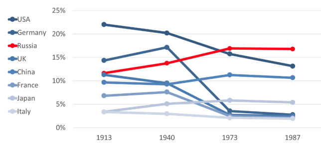

## Table of Contents

## What was the Soviet economic system?

The Soviet economic system was based on a planned economy, which means the government controlled all economic activities. Instead of businesses deciding what to make and sell, the government made these decisions. The government set goals for production, decided what goods to produce, and how much of them. They also controlled prices and wages. This system was called a command economy because the government commanded what should happen in the economy.

The idea behind this system was to make sure everyone had what they needed. The Soviet Union wanted to make sure there was enough food, housing, and other necessities for all its people. However, this system had problems. Sometimes the government's plans didn't work well. There were shortages of goods, and people had to wait in long lines to buy things. Also, because the government set prices, there was little motivation for workers and factories to improve or be more efficient. Over time, these issues made it hard for the Soviet economy to grow and meet the needs of its people.

## How did the Soviet economic system differ from a market economy?

The Soviet economic system was very different from a market economy. In a market economy, businesses and people decide what to make, sell, and buy. Prices go up and down based on how much people want something and how much of it is available. If a lot of people want a product, its price will go up. If not many people want it, the price will go down. This system encourages businesses to make things that people want and to find ways to make them cheaper and better.

In contrast, the Soviet economic system was a planned economy. The government made all the big decisions about what to produce, how much to produce, and what prices to charge. The goal was to make sure everyone had enough of everything they needed, like food and housing. But this system had problems. Sometimes there were not enough goods, and people had to wait in long lines. Also, because prices were set by the government, there was less motivation for workers and factories to improve or work harder. This made it hard for the economy to grow and meet everyone's needs.

## What role did the state play in the production of consumer goods in the Soviet Union?

In the Soviet Union, the state played a big role in making consumer goods. The government decided what kinds of things should be made, like clothes, food, and household items. They made plans for how much of each thing should be produced. Factories had to follow these plans. The state also set the prices for these goods. This was different from countries where businesses decide what to make and how much to charge.

Sometimes, the state's plans did not work well. There were times when there were not enough goods for everyone. People had to wait in long lines to buy things like bread or shoes. Because the government set the prices, there was not much reason for factories to make things better or faster. This made it hard for the Soviet Union to have enough good quality consumer goods for everyone.

## How were consumer goods prioritized in the Soviet economic planning?

In the Soviet Union, the government decided what consumer goods to make and how much to make. They wanted to make sure everyone had enough of the basics, like food, clothes, and household items. The government made big plans for the whole country, telling factories what to produce. They thought this was the best way to make sure everyone got what they needed.

But sometimes, the plans did not work out well. There were times when there were not enough goods for everyone. People had to wait in long lines to buy things like bread or shoes. Because the government set the prices, factories did not have much reason to make things better or faster. This made it hard for the Soviet Union to have enough good quality consumer goods for everyone.

## What were the common consumer goods available to Soviet citizens?

In the Soviet Union, people could buy basic things they needed every day. These included food like bread, meat, and vegetables, as well as clothes like shirts, pants, and shoes. They could also find household items such as soap, dishes, and furniture. The government made sure there were stores in cities and towns where people could buy these goods.

However, sometimes there were not enough of these things for everyone. People had to wait in long lines to get food or other items. The quality of these goods was not always good because the factories did not have much reason to make things better. The government set the prices and told factories what to make, so there was less motivation to improve. This made life harder for Soviet citizens who wanted more and better things.

## How did the availability and quality of consumer goods compare to Western countries during the Soviet era?

During the Soviet era, the availability and quality of consumer goods were much lower compared to Western countries. In the Soviet Union, the government decided what to make and how much to make, which often led to shortages. People had to wait in long lines to buy basic things like bread, meat, and clothes. The quality of these goods was also not very good because factories did not have much reason to improve. The government set the prices and told factories what to make, so there was little motivation to make better products.

In Western countries, people had a lot more choices and better quality goods. Stores were full of different kinds of food, clothes, and household items. If people wanted something, they could usually find it easily. Businesses competed with each other to make the best products and offer the best prices. This competition made goods better and more available. So, while Soviet citizens struggled with shortages and poor quality, people in Western countries enjoyed a much higher standard of living with more and better consumer goods.

## What impact did the Soviet economic system have on the variety of consumer goods?

The Soviet economic system had a big impact on the variety of consumer goods. The government made all the decisions about what to make and how much to make. They wanted to make sure everyone had the basics like food and clothes. But this meant there were not many different kinds of things to choose from. People could buy bread, meat, and simple clothes, but there were not many choices. If you wanted something special or different, it was hard to find.

Because the government controlled everything, there was no competition between businesses. In other countries, businesses try to make better and different things to attract customers. But in the Soviet Union, factories did not have a reason to make new or better products. The government told them what to make, and that was it. So, the variety of consumer goods was very limited. People had to make do with what was available, and it was often the same basic items over and over.

## How did the Soviet government control the pricing of consumer goods?

In the Soviet Union, the government decided the prices of all consumer goods. They did not let businesses set their own prices like in other countries. The government wanted to make sure everyone could afford basic things like food and clothes, so they set the prices low. But this also meant there was no competition between businesses to make better or cheaper products. If the government said a loaf of bread should cost a certain amount, that's what it cost everywhere.

Sometimes, setting prices this way caused problems. Because the prices were low and set by the government, factories did not have much reason to make things better or more efficiently. This led to shortages of goods. People had to wait in long lines to buy things like bread or meat. The government's control over pricing made it hard for the Soviet Union to have enough good quality consumer goods for everyone.

## What were the effects of central planning on innovation and quality of consumer goods?

Central planning in the Soviet Union meant the government decided everything about making consumer goods. This did not help with innovation. Because the government told factories what to make and set the prices, there was no reason for factories to come up with new ideas or make things better. They just had to follow the government's plans. This made it hard for new and better products to be made. People in the Soviet Union did not see many new kinds of goods or improvements in the things they used every day.

The quality of consumer goods also suffered because of central planning. With the government setting prices and telling factories what to make, there was no competition. Factories did not need to make things better to attract customers. As a result, the goods they made were often not very good. People had to use things like clothes and household items that were not as nice or durable as they could be. This made life harder for Soviet citizens who wanted better quality goods but had to make do with what was available.

## How did shortages and long waiting times for consumer goods affect Soviet citizens' daily lives?

In the Soviet Union, people often had to wait in long lines to buy things like bread, meat, and clothes. This made their daily lives harder. They had to spend a lot of time waiting instead of doing other things they needed to do. Sometimes, after waiting for a long time, they might not even get what they needed because there was not enough for everyone. This made it hard for people to plan their days and take care of their families.

The shortages and long waiting times also made people feel frustrated and unhappy. They wanted to have enough food and other things they needed, but it was not always possible. People had to be creative and find ways to get by with less. They might trade with friends or neighbors to get what they needed. Overall, the lack of goods and the time spent waiting affected every part of their lives, from what they ate to how they spent their time.

## What were the long-term effects of the Soviet economic system on consumer behavior and expectations?

The Soviet economic system changed how people thought about buying things. They got used to not having many choices and waiting in long lines for basic things like food and clothes. Because there were often not enough goods, people learned to take what they could get and not expect much. They also learned to save and not waste anything, because they never knew when they might run out of something important. This way of thinking became normal for many Soviet citizens.

Over time, this affected what people expected from the economy. They did not expect to find new and different products in stores. They expected to have to wait and to make do with what was available. When the Soviet Union ended and new economic systems came in, it was hard for people to change their habits and expectations. They had to learn to shop in a new way, with more choices and different prices, which was very different from what they were used to.

## How did the collapse of the Soviet Union change the availability and perception of consumer goods?

When the Soviet Union collapsed, people started to see a big change in the kinds of things they could buy. Before, the government decided what was made and how much, so there were not many choices. After the collapse, new businesses opened up, and people could buy all sorts of new things from other countries. Stores started to have more food, clothes, and other items. This meant people did not have to wait in long lines anymore, and they could pick what they wanted.

The way people thought about buying things also changed. In the Soviet Union, people got used to not having many choices and expecting shortages. After the collapse, they started to see that they could have more and better things. At first, it was hard for them to get used to this new way of shopping. But over time, they learned to enjoy having more choices and better quality goods. This made their lives easier and more enjoyable.

## References & Further Reading

[1]: Gregory, P. R. (2004). *The Political Economy of Stalinism: Evidence from the Soviet Secret Archives.* Cambridge University Press. [Link](https://www.ouleft.org/wp-content/uploads/Political-Economy-of-Stalinism.pdf)

[2]: Nove, A. (1977). *The Soviet Economic System.* Allen & Unwin.

[3]: Ellman, M. (2014). *Socialist Planning.* Cambridge University Press. [Link](https://www.cambridge.org/core/books/socialist-planning/80A1C337AD2ACF7BF4365BA2A1090363)

[4]: Harrison, M. (1998). "Trends in Soviet Labour Productivity: The Late 1930s to the End of the War." European Review of Economic History, 2(2), 171-200. [Link](https://academic.oup.com/ereh/article/2/2/171/518579)

[5]: Kornai, J. (1992). *The Socialist System: The Political Economy of Communism.* Princeton University Press. [Link](https://archive.org/details/socialistsystemp0000korn)

[6]: Lopez de Prado, M. (2018). *Advances in Financial Machine Learning.* Wiley. [Link](https://www.amazon.com/Advances-Financial-Machine-Learning-Marcos/dp/1119482089) 

[7]: Jansen, S. (2020). *Machine Learning for Algorithmic Trading: Predictive models to extract signals from market and alternative data for systematic trading strategies with Python.* Packt Publishing. [Link](https://github.com/stefan-jansen/machine-learning-for-trading)