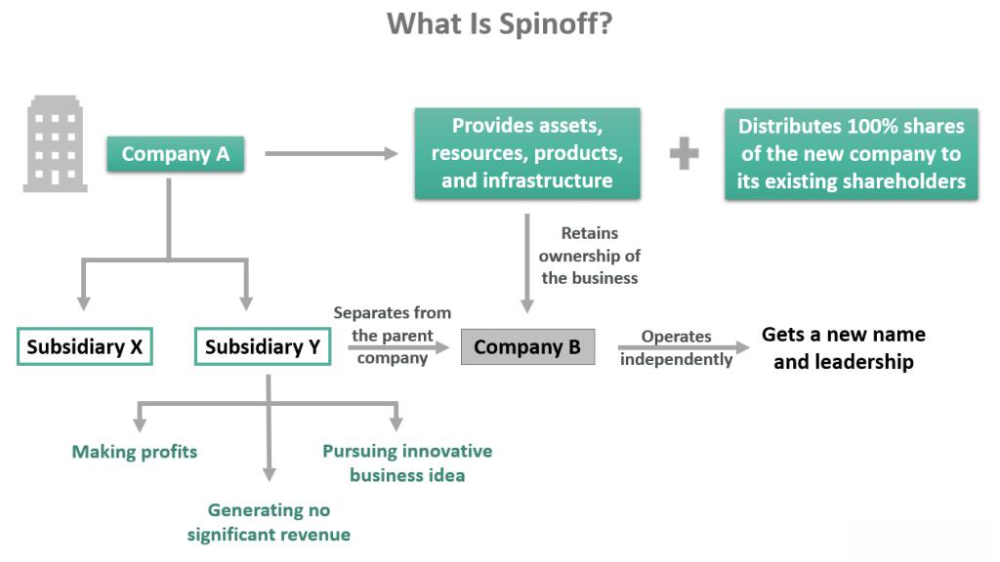

The corporate landscape is witnessing a notable increase in the frequency of spinoffs, which has become a prominent strategy for companies looking to optimize their operations and enhance shareholder value. A spinoff is a form of corporate realignment where a parent company creates an independent company by distributing new shares of its subsidiary, typically to existing shareholders. This maneuver is distinct from other forms of corporate restructuring, such as mergers or acquisitions, as it allows the parent company to focus on its core operations while granting the newly formed entity the ability to pursue its own strategic objectives.

A parent company refers to the original corporation that owns more than a 50% controlling interest in another company, known as a subsidiary. Subsidiaries operate as separate legal entities, although their operational strategies and financial reporting may be influenced by the parent company. In contrast, algorithmic trading is an automated process for executing trades using pre-set algorithms, accounting for variables such as timing, price, and quantity to optimize financial strategies. This sophisticated trading method leverages computational technology to analyze market conditions and execute trades at speeds unachievable by human traders.



The primary aim of this article is to investigate the influence spinoffs exert on algorithmic trading and investment approaches. The separation of subsidiaries into standalone entities can introduce new market dynamics, impacting factors such as volatility, liquidity, and valuation. For investors, understanding these dynamics is essential, as spinoffs can lead to significant shifts in market conditions and offer unique investment opportunities.

Investors need to comprehend how spinoffs affect the corporate structure, as well as the consequent adjustments in algorithmic trading strategies, to adeptly navigate these changes. By examining the relationship between corporate spinoffs and algorithmic trading, investors can enhance their strategic approach, ensuring they capitalize on potential benefits while mitigating associated risks.

The article will proceed with a detailed exploration of spinoffs and their effects on the corporate structure and market. Following this, a comprehensive explanation of algorithmic trading and its significance in modern financial markets will be presented. Subsequently, the interplay between spinoffs and algorithmic trading will be analyzed. This will include assessing how algorithmic models adapt to the new data patterns spinoffs introduce. Further sections will address investment strategies tailored to spinoffs, challenges, risks, and the conclusion will encapsulate the insights drawn throughout the article.

## Table of Contents

## Understanding Spinoffs and their Impact

A spinoff is a type of corporate restructuring where a parent company creates a new independent entity by distributing new shares of the subsidiary. Unlike mergers, acquisitions, or divestitures, spinoffs involve the separation of a portion of the company's operations into a newly formed entity while the parent company remains intact. This strategic move allows both the parent company and the spinoff to focus on their core operations independently. 

Companies typically opt for spinoffs to unlock shareholder value and enhance business focus. By divesting a part of their operations, companies can streamline their activities and allocate resources more effectively to growth areas. This often results in improved performance and clearer strategic direction. Additionally, spinoffs can help to mitigate risk by separating less profitable or non-core divisions, enhancing the financial standing of the parent company.

The impact of a spinoff on the parent company and its subsidiaries can be significant. The parent company may experience an initial reduction in scale but can benefit from an increased focus on its primary business activities and potentially improved stock market performance. Subsidiaries that become independent entities gain more autonomy and can pursue focused strategic goals, potentially unlocking growth opportunities that were previously constrained under the parent company's structure.

Several case studies illustrate the varying success of spinoffs. A notable example is the spinoff of PayPal from eBay in 2015. This move allowed PayPal to focus on its growing online payments business, resulting in substantial growth and market performance post-spinoff. Conversely, the spinoff of Time Inc. from Time Warner in 2014 struggled to survive as an independent entity due to declining advertising revenues and increasing digital competition, ultimately leading to its acquisition by Meredith Corporation.

Spinoffs can offer fresh market opportunities for investors. They often involve the creation of new stock for the spun-off entity, presenting potential investment opportunities. For example, newly independent companies might demonstrate rapid growth and innovation, attracting investors seeking high-reward investments. Furthermore, these entities can offer diversification opportunities within investment portfolios, appealing to investors with specific sector interests or risk-appetite profiles.

## Algorithmic Trading Explained

Algorithmic trading, also known as algo trading, refers to the use of computer algorithms to automate the process of trading financial assets. It plays a significant role in modern financial markets by enabling traders to execute orders based on predetermined criteria rapidly and efficiently, minimizing human intervention.

At its core, [algorithmic trading](/wiki/algorithmic-trading) involves the use of sophisticated software to monitor market data and execute trades at optimal times. These algorithms rely on a variety of strategies, including statistical [arbitrage](/wiki/arbitrage), [market making](/wiki/market-making), and [trend following](/wiki/trend-following). High-frequency trading ([HFT](/wiki/high-frequency-trading-strategies)) is a subset of algorithmic trading that focuses on executing a large number of orders at extremely high speeds. HFT leverages powerful computing infrastructure to capitalize on minute price discrepancies, often measured in milliseconds.

The benefits of algorithmic trading are manifold. For investors, it provides improved efficiency and speed of trade execution, often leading to reduced transaction costs. Additionally, algorithmic trading helps in maintaining systematic and disciplined trading without the emotional biases that can affect human traders. However, challenges persist, such as the risk of system failures, algorithmic errors, and the potential for exacerbating market [volatility](/wiki/volatility-trading-strategies) during periods of stress. Regulatory scrutiny is also heightened due to concerns about market stability and fairness.

Big data and quantitative analysis are pivotal in refining trading algorithms. Algorithms analyze vast amounts of historical and real-time data to identify patterns and develop predictive models. This involves the use of [machine learning](/wiki/machine-learning) techniques, statistical models, and advanced computational methods to enhance the accuracy and performance of trading strategies.

Current trends in algorithmic trading technology include the integration of [artificial intelligence](/wiki/ai-artificial-intelligence) and machine learning to create adaptive algorithms capable of learning from past trades and market conditions. Additionally, the rise of [alternative data](/wiki/best-alternative-data) sources, such as social media sentiment and satellite imagery, provides new insights for developing innovative trading strategies. The increased focus on low-latency infrastructures is also crucial, as minimizing latency can substantially impact trading profitability in high-frequency environments.

In summary, algorithmic trading is a cornerstone of today's financial markets, leveraging technological advancements to enhance trading precision and efficiency. As technology continues to evolve, the role of algorithmic trading is expected to grow, offering new opportunities and challenges for investors.

## Interplay Between Spinoffs and Algorithmic Trading

Spinoffs present unique opportunities for algorithmic trading by introducing new data patterns into financial markets. A spinoff, the process where a parent company separates part of its operations to form a new independent entity, often results in distinct financial conditions that require real-time adaptation of algorithmic models. This is primarily because spinoffs can significantly alter the asset structure, debt, and market perception regarding both parent and spun-off companies1[1].

### Analysis of New Data Patterns

Algorithmic trading models often rely on historical data to predict future price movements. However, spinoffs disrupt traditional patterns by introducing a new set of financial data and altering existing ones. For instance, post-spinoff, previously consolidated financial statements are split, resulting in divergences in performance metrics such as earnings, revenues, and growth forecasts. This necessitates recalibration of algorithms to incorporate the revised datasets. Using machine learning algorithms, traders can update training datasets to reflect these changes, ensuring that models accurately capture the nuances introduced by the spinoff.

### Volatility and Market Movements

Spinoffs often lead to increased volatility in the market, as investors react to the new structural realities of the involved companies. This volatility presents both a challenge and an opportunity for algorithmic trading, which thrives in fast-moving markets. Algorithmic models can exploit short-term price inefficiencies arising from the fluctuating investor sentiment immediately following a spinoff announcement. High-frequency trading algorithms, in particular, can capitalize on this volatility, executing multiple trades within microseconds to optimize profit margins.

### Opportunities During Initial Phases

The initial phases of a spinoff present prime opportunities for algorithmic traders. The renegotiation of market value and investor sentiment can lead to temporary price discrepancies that sophisticated algorithms can exploit. For example, quantitative strategies may utilize arbitrage techniques to take advantage of price differences between the spun-off entity and the parent company. Python code utilizing libraries like NumPy and pandas can process live data feeds to detect and respond to these discrepancies in real-time:

```python
import numpy as np
import pandas as pd

# Mock data representing stock prices after spinoff
parent_company_prices = pd.Series([100, 102, 101, 98, 97])
spinoff_company_prices = pd.Series([50, 51, 52, 50, 49])

# Calculate potential arbitrage opportunities
price_difference = parent_company_prices - spinoff_company_prices
threshold = 3  # Assumed acceptable difference for arbitrage

# Identify trading signal
arbitrage_opportunities = np.where(price_difference > threshold)

print("Arbitrage opportunities at indices:", arbitrage_opportunities)
```

### Strategy Examples

Various strategies can be designed to optimize outcomes from spinoff events. Trend-following algorithms may adjust to detect patterns in the price behavior of the new entity, while contrarian algorithms can be programmed to expect corrections following an initial overreaction by the market. Event-driven algorithms specifically focus on trading opportunities arising from corporate actions such as spinoffs, utilizing natural language processing (NLP) to assess sentiment and news articles for actionable trades.

### Challenges in Data Integration

The primary challenge algorithmic traders face when incorporating spinoff-related data is the disruption of historical data trends. Algorithms must be adapted to assimilate the financial profiles of newly independent entities, which often have limited historical data. Furthermore, correlations previously utilized for pricing models may no longer hold, requiring recalibration. Overcoming these challenges necessitates the use of adaptive learning systems that can prompt real-time strategy adjustment, ensuring algorithms remain effective in new trading environments.

In summary, spinoffs introduce both complex challenges and lucrative opportunities for algorithmic trading. The ability to adaptively integrate new data patterns and leverage market volatility fundamentally underpins successful trading strategies in this context.

### References
1. "Spin-off," Wikipedia: [https://en.wikipedia.org/wiki/Spin-off](https://en.wikipedia.org/wiki/Spin-off)

## Investment Strategies for Spinoffs

## Investment Strategies for Spinoffs

Identifying key indicators of a potentially successful spinoff involves evaluating several crucial factors. One primary indicator is the strategic rationale behind the spinoff, such as unlocking shareholder value or enhancing operational focus. Analyzing the parent company's motivation and the potential of the subsidiary to thrive independently provides insights into the prospects of the spinoff. Additional indicators include the operational and financial independence of the spinoff entity, the management team’s expertise, and the market conditions at the time of the spinoff.

For retail and institutional investors, capitalizing on spinoffs requires tailored strategies. Retail investors can benefit from a buy-and-hold strategy, targeting spinoffs with promising growth potential and advantageous market positioning. Institutional investors might employ event-driven strategies, using options or derivatives to leverage short-term market reactions. Both groups should consider diversification to balance potential risks associated with spinoff investments.

Due diligence and thorough research are critical in informing investment choices. This involves assessing the financial statements, growth projections, and competitive landscape of both the parent and spun-off entities. Investors must scrutinize management’s track record in previous spinoffs or similar strategic maneuvers, while also reviewing the regulatory environment impacting the industry.

Algorithmic insights can complement traditional investment strategies by providing data-driven analysis of spinoff-related events. Algorithms can identify patterns in trading volumes, price fluctuations, and market sentiment, offering investors a dynamic tool to anticipate movements post-spinoff. Python, for example, can be used to develop algorithms that process large datasets to generate investment signals:

```python
import pandas as pd
import numpy as np

# Sample spinoff data processing
data = pd.read_csv('spinoff_data.csv')
# Calculate moving averages to identify trends
data['50_MA'] = data['Close'].rolling(window=50).mean()
data['200_MA'] = data['Close'].rolling(window=200).mean()

# Signal generation based on crossover strategy
data['Signal'] = np.where(data['50_MA'] > data['200_MA'], 1, 0)

# Trading strategy based on signals
data['Position'] = data['Signal'].diff()
```

This example demonstrates a crossover strategy where buying signals are generated when the short-term moving average crosses above the long-term moving average.

Case studies illustrate successful investments in spinoffs, such as the eBay-PayPal separation, where investors capitalized on PayPal's independent growth trajectory. Investors who conducted meticulous research and leveraged algorithmic strategies were able to identify market opportunities that led to substantial returns. These instances underscore the potential benefits of strategic spinoff investments, provided investors are equipped with robust analytical tools and insights.

## Challenges and Risks

Investing in spinoffs entails several potential risks that investors must be wary of. Spinoffs can present both opportunities and challenges, which demand careful evaluation and strategic considerations. 

### Market Considerations and Regulatory Factors

Spinoffs are influenced by various market considerations and regulatory frameworks. The decision to pursue a spinoff often stems from a company's desire to unlock value, focus on core competencies, or respond to strategic shifts in the market. However, these decisions can be affected by economic conditions, industry trends, and regulatory changes. For instance, antitrust laws and securities regulations can impact the timeline and execution of spinoffs, possibly leading to delays or additional costs. Companies must also navigate compliance with tax regulations, since taxation can significantly affect the financial attractiveness of a spinoff for both the parent company and shareholders.

### Risks in Algorithmic Trading During High Volatility

Algorithmic trading, widely used in modern financial markets, faces specific challenges and risks during periods of high volatility, which can often accompany spinoff situations. High volatility can exacerbate the difficulties associated with algorithmic strategies, such as slippage, execution risk, and sudden shifts in [liquidity](/wiki/liquidity-risk-premium). Algorithms are designed to react to specific market conditions, and unexpected volatility can lead to significant discrepancies between expected and actual trading outcomes. This variance is especially concerning for high-frequency trading (HFT) systems, where rapid price changes can lead to substantial unintended losses.

### Strategies to Mitigate Risks

Mitigating risks while capitalizing on spinoff opportunities requires a multi-faceted approach:

1. **Comprehensive Due Diligence**: Investors should conduct thorough analyses of the spinoff to understand the financial health of both the parent and newly independent companies. Examining historical performance, management capabilities, and strategic plans is crucial.

2. **Dynamic Algorithmic Adjustments**: Traders using algorithmic strategies should incorporate adaptive models that can adjust to market conditions. Machine learning techniques can be used to refine these algorithms, enabling them to respond to new patterns associated with the spinoff.

   ```python
   from sklearn.ensemble import RandomForestRegressor

   # Example of a simplified algorithmic model using machine learning
   def algorithmic_strategy(data):
       model = RandomForestRegressor()
       X, y = data.drop('target', axis=1), data['target']
       model.fit(X, y)
       prediction = model.predict(X)
       return prediction
   ```

3. **Portfolio Diversification**: Diversifying investments can reduce exposure to the specific risks associated with any single spinoff. Balancing investments across various sectors or asset classes can offer protection against volatile outcomes.

4. **Regulatory Awareness**: Staying informed on regulatory changes and engaging with legal experts can help anticipate challenges and navigate compliance smoothly, thus preventing unexpected costs or legal hurdles.

### Expert Opinions

Financial experts emphasize the importance of understanding both the qualitative and quantitative aspects of spinoffs and algorithmic trading. While algorithmic models provide precision and efficiency, they must be periodically reviewed and updated to align with evolving market dynamics. According to experts, investors should combine quantitative insights with qualitative judgments, particularly when evaluating the strategic fit and long-term viability of spinoff entities.

In conclusion, while spinoffs offer numerous opportunities, careful risk management is essential for leveraging these opportunities successfully. Balancing the benefits of algorithmic trading with an awareness of its limitations can enable investors to navigate the complexities of spinoff events more effectively.

## Conclusion

The relationship between spinoffs, their parent companies, subsidiaries, and algorithmic trading presents a multifaceted dynamic within the modern financial landscape. Throughout this article, we have explored how spinoffs serve as a distinct form of corporate restructuring that allows parent companies to unlock value and refine their business focus. This restructuring often results in the creation of new market opportunities, which are of particular interest to investors and algorithmic traders alike.

Algorithmic trading has become a critical component of today's financial markets, leveraging advanced software and quantitative analysis to execute high-frequency trades. The introduction of spinoffs into this ecosystem generates fresh data patterns, creating opportunities and challenges for algorithmic trading models. Understanding these dynamics is crucial for investors seeking to capitalize on newly emerged opportunities while navigating the associated risks.

Looking forward, spinoffs are anticipated to continue playing a significant role in corporate strategies, prompting both risks and prospects within algorithmic trading. The volatility and market adjustments that often follow spinoff announcements offer fertile ground for algorithmic strategies designed to exploit short-term inefficiencies. However, integrating spinoff-related data into existing algorithms remains a complex task, necessitating continuous refinement and innovation in trading technologies.

For investors, staying informed and adaptable is more important than ever. As spinoffs evolve and markets fluctuate, a solid grasp of these processes will be essential for making informed decisions. This adaptability extends to embracing new trading methodologies and technologies that can provide a competitive edge in evaluating investment opportunities.

Investors are encouraged to broaden their strategic horizons and consider incorporating algorithmic insights into their decision-making processes. By staying attuned to the interplay between corporate restructuring events and technological advancements, investors can position themselves to navigate and capitalize on the dynamic financial landscape effectively.

## References & Further Reading

[1]: Bergstra, J., Bardenet, R., Bengio, Y., & Kégl, B. (2011). ["Algorithms for Hyper-Parameter Optimization."](https://papers.nips.cc/paper/4443-algorithms-for-hyper-parameter-optimization) Advances in Neural Information Processing Systems 24.

[2]: ["Advances in Financial Machine Learning"](https://www.amazon.com/Advances-Financial-Machine-Learning-Marcos/dp/1119482089) by Marcos Lopez de Prado

[3]: ["Evidence-Based Technical Analysis: Applying the Scientific Method and Statistical Inference to Trading Signals"](https://www.amazon.com/Evidence-Based-Technical-Analysis-Scientific-Statistical/dp/0470008741) by David Aronson

[4]: ["Machine Learning for Algorithmic Trading"](https://github.com/stefan-jansen/machine-learning-for-trading) by Stefan Jansen

[5]: ["Quantitative Trading: How to Build Your Own Algorithmic Trading Business"](https://www.amazon.com/Quantitative-Trading-Build-Algorithmic-Business/dp/1119800064) by Ernest P. Chan