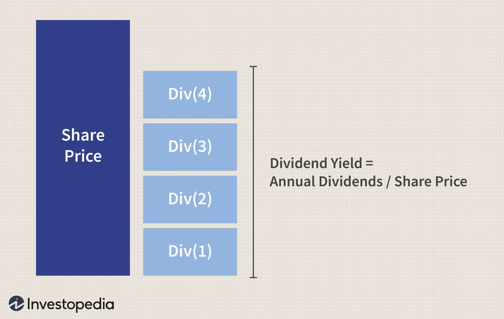

In the dynamic world of stock markets, understanding the impact of corporate actions such as stock dividends and stock splits on share prices is essential for investors aiming to maximize their returns. Stock dividends and forward stock splits, while both resulting in an increased number of shares outstanding, affect the market and individual portfolios differently, requiring strategic navigation.

Stock dividends involve the distribution of additional shares to existing shareholders, proportional to their holdings, without a change in the total value of their investment. This action increases the number of shares, leading to a corresponding drop in the share price. The overall equity value for investors remains unchanged, preserving the market capitalization. For example, if a company declares a 10% stock dividend, an investor holding 100 shares would receive 10 additional shares, but the value of each share would decrease, reflecting the increased share count.



Conversely, forward stock splits are primarily employed to adjust a company's stock price to a more attractive level, enhancing liquidity and accessibility for a broader range of investors. A common split ratio is 2-for-1, where shareholders receive an additional share for each share they own, effectively halving the share price. This action is often implemented when a company's stock becomes perceived as overvalued, potentially deterring small or new investors.

Algorithmic trading strategies must be adept at recognizing and adapting to these corporate actions, as they significantly influence share prices and trading patterns. Algorithms, coded with precision, can respond swiftly to such changes, exploiting opportunities that arise from price adjustments and shifts in trading volumes. For instance, during a stock split, increased liquidity can lead to more trading opportunities and reduced transaction costs, factors that automated trading strategies can leverage.

This article sheds light on the intersections of stock dividends, forward stock splits, and algorithmic trading, presenting insights vital for both retail and institutional investors aiming to harness these corporate actions effectively.

## Table of Contents

## Stock Dividends and Their Impact on Share Price

Stock dividends represent a method by which companies distribute additional shares to shareholders in proportion to their current holdings, leading to an increase in the total number of shares outstanding. This maneuver typically results in a decrease in the share price, reflecting the increased supply, while preserving the overall value of the shareholder's investment. For instance, if a company declares a 10% stock dividend, a shareholder owning 100 shares will receive an additional 10 shares, making it 110 shares in total. However, the total market value of the shares remains unchanged, assuming no other market dynamics are affecting the stock price.

Mathematically, the new share price after a stock dividend can be calculated as follows:

$$
\text{New Share Price} = \frac{\text{Old Share Price} \times \text{Number of Old Shares}}{\text{Number of New Shares}}
$$

For example, if the old share price was $50, and there was a 10% stock dividend, then after the dividend, each share would be priced at approximately $45.45:

$$
\text{New Share Price} = \frac{50 \times 100}{110} = 45.45
$$

While stock dividends do not alter the fundamental value of a shareholder's investment, their implications can be multifaceted. On one hand, they can be beneficial by potentially enhancing [liquidity](/wiki/liquidity-risk-premium), making shares more accessible to retail investors due to the lower price per share. Moreover, they may indicate a company's confidence in its future earnings and growth prospects, which can be positively perceived by the market.

Conversely, stock dividends can be dilutive. The increased number of shares may result in reduced earnings per share (EPS) unless accompanied by proportional gains in net income. Investors may perceive this dilution negatively if they suspect the company's earnings are stagnating or decreasing. Furthermore, the lower per-share price might inadvertently signal financial struggles unless the company's long-term growth narrative is strong and credible. 

Therefore, while stock dividends preserve investors' proportional ownership in a company, the perceived and actual impact on shareholder value can vary, necessitating careful analysis by investors and adaptation by [algorithmic trading](/wiki/algorithmic-trading) strategies.

## Forward Stock Splits: Mechanisms and Examples

A forward stock split is a corporate action that involves increasing the number of shares in circulation while proportionally decreasing the share price, ensuring the overall market capitalization of the company remains unchanged. The mechanism of a forward stock split is straightforward: a company issues additional shares to existing shareholders without changing their proportional ownership in the company. For instance, in a 2-for-1 stock split, each shareholder receives one additional share for each share they hold, and the price per share is halved.

The primary motivation for a company to undertake a forward stock split is to enhance market liquidity and accessibility. A lower share price can make the stock more attractive to a broader range of investors, particularly retail investors who might find it financially challenging to purchase high-priced stocks. This increased accessibility can lead to heightened interest in the stock, often resulting in improved market liquidity, which benefits trading operations as more shares are available for buying and selling at any given time.

Enhanced liquidity can also reduce the bid-ask spread, thereby lowering transaction costs and encouraging increased trading activity. Additionally, a post-split stock often sees increased visibility and interest, which can be advantageous for the company in terms of market presence and investor engagement.

Numerous notable companies have utilized stock splits as a strategic tool to manage their share prices. Apple Inc. is a classic example; the company has implemented several stock splits over the years to keep its shares affordable. For instance, on August 28, 2020, Apple executed a 4-for-1 stock split when its shares were trading at approximately $500 each. This split reduced the share price to around $125 per share while quadrupling the number of shares outstanding, making Apple's stock more accessible to a wider array of investors.

Similarly, Tesla, Inc. conducted a 5-for-1 stock split in August 2020. Prior to the split, the stock was trading near $2,200 per share. Post-split, the price adjusted to about $440 per share, effectively increasing the number of shares by a [factor](/wiki/factor-investing) of five and enhancing liquidity and marketability.

In summary, forward stock splits serve as a strategic mechanism for companies looking to maintain accessibility and liquidity in trading their shares. These objectives are met through a proportional adjustment of shares and prices without affecting the company's market capitalization. By doing so, companies can attract a broader investor base and stimulate increased trading activity.

## Understanding Share Price Post-Splits and Dividends

Stock splits and dividends are two corporate actions that can significantly impact the nominal share price of a company's stock, yet they do not alter the overall market capitalization of the company. Understanding the recalibration of share prices post-splits and dividends is essential for both investors and algorithmic trading systems.

### Recalculation of Share Price after Stock Splits

A stock split increases the number of shares outstanding by issuing more shares to existing shareholders. The most common type is a forward stock split, such as a 2-for-1 split, where each existing share is split into two. The primary purpose of a stock split is to reduce the trading price of the shares, making them more accessible to a broader range of investors and potentially increasing market liquidity.

#### Formula and Example

The new share price after a stock split can be calculated using the formula:

$$
\text{New Share Price} = \frac{\text{Old Share Price}}{\text{Split Ratio}}
$$

For example, consider a stock priced at $100 that undergoes a 2-for-1 stock split. The split ratio here is 2 (since each share is split into two):

$$
\text{New Share Price} = \frac{100}{2} = 50
$$

Post-split, the shareholder will own twice the number of shares, each priced at $50, maintaining the investment's total value.

### Recalculation of Share Price after Stock Dividends

Stock dividends distribute additional shares to shareholders instead of cash. For example, a 10% stock dividend grants an additional 10 shares for every 100 shares owned. This increase in the number of shares outstanding also results in a decrease in the nominal share price.

#### Formula and Example

The share price adjustment for a stock dividend can be calculated using:

$$
\text{New Share Price} = \frac{\text{Old Share Price}}{1 + \frac{\text{Dividend Percentage}}{100}}
$$

Consider a stock priced at $100 receiving a 10% stock dividend:

$$
\text{New Share Price} = \frac{100}{1 + \frac{10}{100}} = \frac{100}{1.1} \approx 90.91
$$

The shareholder's total investment value remains unchanged as the decrease in price per share matches the increase in the number of shares held.

### Market Capitalization Consistency

Importantly, during these corporate actions, a company's market capitalization remains constant. Market capitalization, defined as the total value of a company's outstanding shares, is expressed as:

$$
\text{Market Capitalization} = \text{Share Price} \times \text{Number of Shares Outstanding}
$$

Even though the share price changes post-split or post-dividend, the product of the new share price and the adjusted number of shares (either due to splits or dividends) equals the company's previous market capitalization, ensuring that the value held by shareholders is conserved.

In conclusion, while the nominal share prices adjust post-splits and dividends, these changes leave the intrinsic value of the holdings and the company's market capitalization unaffected. This understanding assists both investors and algorithmic trading systems in making informed decisions without conflating nominal price changes with real value changes.

## Algorithmic Trading and Stock Splits

Algorithmic trading harnesses the power of computational algorithms to analyze market data and execute trades at speeds and frequencies that are impossible for a human trader to achieve. A prominent corporate action, a forward stock split, can significantly influence price behavior and trading volumes, presenting unique opportunities for algorithmic traders.

A forward stock split increases the number of shares outstanding while proportionally decreasing the share price. For instance, in a 2-for-1 split, each shareholder receives an additional share for every one they hold, while the price per share is halved. Although the market capitalization remains unchanged, these splits can enhance liquidity and market accessibility, attracting a broader investor base. Increased liquidity often results in narrower bid-ask spreads and higher trading volumes, factors that algorithmic strategies are designed to exploit.

Stock splits can lead to shifts in price patterns, influencing technical indicators and other algorithmic signal generators. Algorithms can be programmed to detect these shifts and adapt trading strategies accordingly. For example, a sudden influx of retail investors due to a lower price point can create [volatility](/wiki/volatility-trading-strategies), which some algorithms are designed to capitalize on. Additionally, the post-split adjustment in key technical indicators, such as moving averages and Relative Strength Index (RSI), can trigger buy or sell signals within algorithmic frameworks.

The following Python code snippet demonstrates how an algorithm can be adjusted to accommodate a stock split by recalculating adjusted technical indicators:

```python
import pandas as pd

# Sample data setup
data = {
    'Date': ['2023-01-01', '2023-01-02', '2023-01-03'],
    'Close': [100, 102, 50]  # Assume a 2-for-1 split on 2023-01-03
}
df = pd.DataFrame(data)
df['Date'] = pd.to_datetime(df['Date'])

# Function to adjust prices post-split
def adjust_for_split(df, split_date, split_ratio):
    df.loc[df['Date'] >= split_date, 'Close'] /= split_ratio
    return df

# Adjust the close prices
adjusted_df = adjust_for_split(df, '2023-01-03', 2)
print(adjusted_df)
```

In this example, the close prices are adjusted for a 2-for-1 stock split by dividing the post-split prices by the split ratio. This ensures that the algorithm operates on data that reflects these corporate actions accurately.

Algorithmic trading systems must not only react to price changes resulting from splits but also proactively adjust to leverage new trading dynamics. These systems must continuously refine their strategies as they seek to leverage altered liquidity and volatility patterns, ensuring that trading operations remain efficient and profitable amidst shifting market landscapes.

## Incorporating Corporate Actions into Algo Strategies

Algorithmic trading systems must be capable of adjusting to corporate actions such as stock splits and dividends to maintain their accuracy and effectiveness. These corporate actions directly impact the share prices and trading volumes, which algorithms rely on for executing trades. Here, we explore how algorithmic programs can adapt to these changes and the necessity of using adjusted closing prices.

### Designing Algorithms for Price and Volume Adjustments

Algorithms are fundamentally driven by data. When a stock split or dividend occurs, the raw data (such as the price and [volume](/wiki/volume-trading-strategy) of shares) no longer reflect the current market reality unless it is adjusted. These financial events can create discrepancies that, if uncorrected, may lead to incorrect trade signals. To address this, algorithms can be designed with mechanisms to automatically adjust for these events.

One approach involves integrating an automated detection system within the algorithm to recognize announcements of stock splits or dividend declarations. Upon detecting such events, the system can perform recalculations of historical data. For example, in the case of a stock split, historical stock price data and volume would be adjusted according to the split ratio:

$$
\text{Adjusted Price} = \frac{\text{Old Price}}{\text{Split Ratio}}
$$

$$
\text{Adjusted Volume} = \text{Old Volume} \times \text{Split Ratio}
$$

An updated dataset that accounts for these recalibrations ensures the algorithm's continued effectiveness in issuing accurate buy or sell signals.

### Importance of Adjusted Closing Prices

Backtesting, a critical phase in developing and refining algorithmic trading strategies, requires accuracy and historical consistency. Adjusted closing prices are essential because they represent the true economic value of a stock, accounting for corporate actions such as dividends and stock splits. By using adjusted prices, [backtesting](/wiki/backtesting) can accurately simulate market conditions and offer insights on potential strategy performance.

During live executions, adjusted prices help ensure that the algorithm's logic remains valid and relevant, preventing erroneous trades based on misleading raw data. For instance, algorithms can incorporate data feeds from financial services that provide adjusted prices, ensuring real-time adaptability to any corporate actions.

### Implementation Example in Python

Using a popular data analysis library like pandas in Python, here’s a simplified example of how an algorithm might adjust for a stock split:

```python
import pandas as pd

# Example of historical stock data
data = {
    'Date': pd.date_range(start='2023-01-01', end='2023-01-05'),
    'Close': [100, 102, 101, 103, 200]
}

df = pd.DataFrame(data)

# Define a stock split that occurred on 2023-01-04 with a 2-for-1 ratio
split_date = '2023-01-04'
split_ratio = 2

# Adjust prices for the split
df.loc[df['Date'] >= split_date, 'Close'] /= split_ratio

print(df)
```

In this example, the algorithm automatically recalculates the closing prices to reflect the 2-for-1 stock split after the specified date, thus remaining aligned with current market data.

By designing algorithms with these adjustments and prioritizing the use of adjusted closing prices, traders can ensure that their strategies remain robust and reactive to corporate actions, optimizing their trading performance. Continuous adaptation and monitoring are paramount to leverage the full potential of algorithmic trading in dynamic market environments.

## Real-World Case Studies

Real-world examples of companies that have undergone stock splits provide valuable insights for investors and algorithmic trading strategies. One notable example is the stock split conducted by Apple Inc. In August 2020, Apple executed a 4-for-1 stock split, increasing its share count while reducing the individual share price. This move aimed to make Apple's stock more accessible to a broader range of investors by lowering the price per share.

Following Apple's stock split, trading volumes surged significantly. The lower price per share attracted an influx of retail investors, contributing to heightened market activity. The increased liquidity and accessibility resulted in enhanced participation from a diverse range of investors. This phenomenon highlights how stock splits can stimulate trading volumes and improve market dynamics.

Another prominent example is Tesla Inc.'s 5-for-1 stock split in August 2020. Similar to Apple's case, Tesla aimed to enhance liquidity and attract more investors. Following the split, investor interest in Tesla soared, leading to substantial increases in trading volumes. The increased liquidity facilitated smoother trading experiences and heightened price volatility, attracting both individual and institutional traders.

A significant lesson from these stock split scenarios is the impact on algorithmic trading strategies. Algorithms designed to recognize stock splits must be nimble and adaptable. The adjustments in share prices and trading volumes necessitate recalibration of trading models. Algorithms need to incorporate mechanisms to detect splits and adjust calculations accordingly to maintain their effectiveness.

Moreover, backtesting strategies should account for historical stock splits to ensure accuracy. Utilizing adjusted closing prices in backtesting ensures that strategies remain robust across corporate actions. This emphasizes the importance of continuous monitoring and refinement of algorithmic programs to adapt to corporate actions like stock splits.

In summary, real-world examples such as those of Apple and Tesla illustrate how stock splits can influence trading dynamics and investor participation. Understanding these impacts and learning from them is crucial for developing effective algorithmic trading strategies that leverage changes in market conditions brought about by corporate actions.

## Conclusion

Understanding how stock dividends and stock splits affect trading is pivotal for both individual investors and institutions, offering opportunities to optimize the performance of algorithmic trading strategies. Stock dividends and forward splits, although altering share prices nominally, do not affect the intrinsic value or market capitalization of a company. Their primary effect is on the distribution of shares and the subsequent share price recalibration, which necessitates strategic adjustments in trading algorithms.

Aligning algorithmic trading strategies with corporate actions such as stock dividends and splits provides an opportunity to enhance strategy accuracy and execution. Market participants equipped with algorithms attuned to detect and anticipate these financial events can exploit the fluctuations in liquidity and share price volatility that often accompany them. When a company undergoes a stock split, for instance, the increased number of shares at a lower price can improve liquidity, thus facilitating conditions beneficial for high-frequency traders who thrive on volume and volatility.

The continuous monitoring and adaptive adjustment of trading algorithms are imperative to maintaining an edge in the competitive landscape of financial markets. Algorithms must account for not only the immediate impacts of stock dividends and splits but also the induced changes in trading patterns and sentiment. Utilizing adjusted closing prices and ensuring that backtesting considers historical data reflective of these corporate actions are essential practices for preserving the fidelity of trading models.

Mathematically modeling the changes in share prices due to stock dividends and splits, and integrating these models into algorithmic strategies, ensures that algorithms maintain congruence with real-time market conditions. Consider the adjustment of share prices through a straightforward Python function:

```python
def adjust_share_price(initial_price, stock_split_factor, dividend_factor=1):
    adjusted_price = (initial_price / stock_split_factor) * dividend_factor
    return adjusted_price

# Example usage
initial_price = 100  # Original share price
stock_split_factor = 2  # 2-for-1 stock split
dividend_factor = 1  # No dividend adjustment in this example

new_price = adjust_share_price(initial_price, stock_split_factor, dividend_factor)
print(f"Adjusted Share Price: {new_price}")
```

Such implementation illustrates the simplicity with which a trading algorithm can be kept congruent with market operations following corporate actions. In conclusion, the ability to recognize and incorporate the implications of stock dividends and splits into trading algorithms is a vital component for success in algorithmic trading. Constant refinement and recalibration of these algorithms are critical to capturing the benefits that arise from these predictable but impactful events.

## References & Further Reading

1. **Scholarly Articles:**
   - Baker, M., & Wurgler, J. (2012). "Behavioral Corporate Finance: An Updated Survey." *Handbook of the Economics of Finance*. This article provides insights into corporate actions like stock splits and dividends, examining their psychological and market-based impacts on stock prices. [Link](https://www.journals.elsevier.com/handbook-of-the-economics-of-finance)
   - Fama, E. F., & French, K. R. (1993). "Common risk factors in the returns on stocks and bonds." *Journal of Financial Economics*. This paper covers various risk factors in stock pricing which can be useful in understanding the impact of corporate actions. [Link](https://econpapers.repec.org/article/eeejfinec/v_3a33_3ay_3a1993_3ai_3a1_3ap_3a3-56.htm)

2. **Books:**
   - Bodie, Z., Kane, A., & Marcus, A. J. (2021). *Investments*. This comprehensive book covers various aspects of investment including stock dividends, splits, and their implications for traders.
   - Hull, J. C. (2018). *Options, Futures, and Other Derivatives*. This book provides an excellent overview of financial derivatives and their relation to stock market dynamics, including corporate actions.

3. **Financial Websites:**
   - Investopedia: Articles on stock dividends and stock splits give detailed explanations with examples on how these actions affect stock pricing and market behavior. [Link to Stock Dividends Article](https://www.investopedia.com/stock-dividend-4689731) | [Link to Stock Splits Article](https://www.investopedia.com/terms/s/stocksplit.asp)
   - The Motley Fool: Offers investor-focused articles that explore recent stock splits and dividends from notable companies, along with market analysis. [Link](https://www.fool.com)

4. **Algorithmic Trading & Stock Splits:**
   - Chan, E. (2013). *Algorithmic Trading: Winning Strategies and Their Rationale*. This book explains strategies for algorithmic trading, including how to incorporate corporate actions like stock splits.
   - QuantConnect: This platform provides tools for developing algorithmic trading strategies and includes resources for handling corporate actions such as stock splits and dividends. [Link](https://www.quantconnect.com)

These resources provide valuable insights into the mechanics of stock dividends, splits, and the adaptation of algorithmic trading strategies to these corporate actions.

