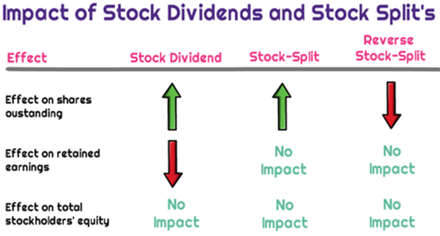

## Table of Contents

## What is a stock dividend?

A stock dividend is when a company gives its shareholders more shares instead of cash. This happens when the company wants to share its profits but decides to give more shares instead of money. For example, if you own 100 shares and the company declares a 10% stock dividend, you will get 10 more shares.

The main reason companies give stock dividends is to keep more cash in the business. This can help the company grow or pay for other things it needs. For shareholders, getting more shares can be good because it increases the number of shares they own without costing them any money. However, the value of each share might go down a little bit because there are more shares now.

## What is a forward stock split?

A forward stock split is when a company decides to increase the number of its shares by splitting each existing share into more shares. For example, in a 2-for-1 split, if you own one share, you will get one more share, so you will have two shares after the split. The main goal of a forward stock split is to make the stock's price lower, which can make it easier for more people to buy the stock.

When a company does a forward stock split, the total value of the company stays the same, but the price per share goes down. This means that even though you have more shares, the value of your investment doesn't change right away. For example, if you owned one share worth $100 before a 2-for-1 split, you would own two shares worth $50 each after the split, keeping your total investment at $100. This can make the stock more attractive to new investors and can sometimes lead to more trading of the stock.

## How do stock dividends affect the number of shares an investor owns?

When a company gives a stock dividend, it means they are giving their shareholders more shares instead of cash. For example, if a company declares a 10% stock dividend and you own 100 shares, you will get 10 more shares. This means the total number of shares you own will go up. The company does this to share its profits but keep its cash for other uses.

After a stock dividend, the price of each share usually goes down a bit because there are more shares now. But the total value of your investment stays the same right after the dividend. So, even though you have more shares, the overall worth of what you own doesn't change immediately. This can be good for investors because they end up owning more shares without spending any extra money.

## How does a forward stock split change the number of shares outstanding?

A forward stock split increases the number of shares a company has. For example, if a company does a 2-for-1 split, it means every share is split into two shares. So, if there were 1 million shares before the split, there will be 2 million shares after the split. This makes the total number of shares outstanding go up.

The main reason for a forward stock split is to lower the price of each share. If the stock was expensive before, this makes it cheaper and easier for more people to buy. Even though the number of shares goes up, the total value of the company stays the same right after the split. So, if you owned one share worth $100 before the split, you would own two shares worth $50 each after the split, keeping your total investment at $100.

## What is the immediate impact of a stock dividend on share price?

When a company gives a stock dividend, the price of each share usually goes down a little bit right away. This happens because the company is giving out more shares, so the total number of shares goes up. Imagine if you have a pizza and you cut it into more slices; each slice gets smaller. It's the same with stock dividends. If you owned 100 shares and the company gives a 10% stock dividend, you get 10 more shares, but the price of each share drops to make up for the extra shares.

Even though the price per share goes down, the total value of your investment stays the same right after the dividend. If you had 100 shares worth $10 each before the dividend, your investment was worth $1,000. After a 10% stock dividend, you would have 110 shares, but each share might be worth about $9.09, still making your total investment $1,000. So, while the price per share drops, the overall value of what you own doesn't change immediately.

## What is the immediate effect of a forward stock split on share price?

When a company does a forward stock split, the price of each share goes down right away. This happens because the company is making more shares. If you think of a pie and you cut it into more pieces, each piece gets smaller. It's the same with stocks. If a company does a 2-for-1 split, the price of each share will be half of what it was before the split.

Even though the price per share goes down, the total value of the company stays the same right after the split. This means that if you owned one share worth $100 before the split, you would own two shares worth $50 each after the split. Your total investment would still be $100. The main reason companies do this is to make the stock cheaper and easier for more people to buy.

## How do stock dividends influence investor perception and demand for the stock?

When a company gives a stock dividend, it can make investors feel good about the company. It shows that the company is doing well enough to share its profits, even if it's not giving out cash. This can make investors think the company is strong and has a bright future. They might feel more confident about keeping their shares or even buying more. This positive feeling can increase the demand for the stock because more people want to own it.

However, stock dividends also mean more shares are out there. This can make some investors worry that the value of each share will go down because there are more shares to go around. If too many people start thinking this way, it might lower the demand for the stock. But overall, if the company is seen as doing well, the positive feelings from the stock dividend can often outweigh the worries about more shares, keeping or even boosting the demand for the stock.

## How do forward stock splits affect investor perception and demand?

When a company does a forward stock split, it can make the stock look more attractive to investors. The main reason is that the price of each share goes down, making it easier for more people to buy the stock. If someone thought the stock was too expensive before, they might be more willing to buy it now that it's cheaper. This can lead to more people wanting to buy the stock, which increases demand.

However, not everyone sees a forward stock split in the same way. Some investors might worry that the company is doing a split because the stock price has gone up too fast, and they might think the company is trying to make the stock seem cheaper to trick people into buying it. But usually, if the company is doing well and the split is seen as a sign of confidence, it can make investors feel good about the company's future. This positive feeling can keep or even increase the demand for the stock.

## What are the long-term effects of stock dividends on a company's share price?

Over the long term, stock dividends can have a few effects on a company's share price. When a company gives stock dividends, it's showing that it's doing well and wants to share its profits with shareholders. This can make investors feel good about the company and might make them want to keep their shares or buy more. If more people want to buy the stock, the demand goes up, and this can push the share price higher over time. But, because stock dividends increase the number of shares, each share might be worth a little less right after the dividend. If the company keeps doing well, this effect can be small, and the share price can still go up over time.

On the other hand, if investors start to worry about the company giving out too many shares, it might make them think the value of each share will go down a lot. This could make them sell their shares, which would lower the demand and might cause the share price to drop. But usually, if the company keeps growing and making money, the positive feelings from the stock dividends can help keep the share price steady or even make it go up over the long term. So, while stock dividends can make the share price go down a bit right away, the long-term effect depends a lot on how well the company does and how investors feel about it.

## What are the long-term implications of forward stock splits on share price?

Over the long term, forward stock splits can make a company's share price go up. When a company does a forward stock split, it makes the price of each share go down right away. This can make the stock look cheaper and easier for more people to buy. If more people start buying the stock because it's cheaper, the demand can go up. If the company keeps doing well, this increased demand can push the share price higher over time.

However, not all investors see forward stock splits the same way. Some might think the company is doing a split because the stock price has gone up too fast, and they might worry that the company is trying to make the stock seem cheaper to trick people into buying it. If too many investors feel this way, it could make them sell their shares, which would lower the demand and might cause the share price to drop. But usually, if the company is doing well and the split is seen as a sign of confidence, it can help the share price stay strong or even go up over the long term.

## How do stock dividends and forward stock splits impact a company's market capitalization?

Stock dividends and forward stock splits don't change a company's market capitalization right away. Market capitalization is the total value of all the company's shares. When a company gives a stock dividend, it's giving more shares to shareholders, but the total value of the company stays the same because the price of each share goes down a little bit. It's like cutting a pizza into more slices; the whole pizza doesn't get bigger, just the number of slices. The same thing happens with a forward stock split. The company makes more shares, but the price of each share goes down, so the total value of the company stays the same right after the split.

Over time, though, stock dividends and forward stock splits can affect market capitalization if they change how investors feel about the company. If investors see stock dividends as a sign that the company is doing well, they might want to buy more shares, which can make the share price go up. This would increase the company's market capitalization. The same goes for forward stock splits. If the split makes the stock look cheaper and more people start buying it, the demand can go up, and the share price might go up too, which would also increase market capitalization. But if investors start to worry about too many shares being out there, it could make them sell, which might lower the share price and the company's market capitalization.

## What are the tax implications of stock dividends compared to forward stock splits?

When a company gives you stock dividends, it can affect your taxes. If you get stock dividends, you have to pay taxes on the value of those extra shares, just like you would if you got cash. This is because the IRS sees stock dividends as income. So, even though you're not getting money right away, you still have to report the value of the new shares on your taxes. The tax rate you pay depends on your income and how long you've held the shares.

On the other hand, forward stock splits don't usually have any tax effects right away. When a company does a forward stock split, it just gives you more shares, but the total value of your investment stays the same. The IRS doesn't see this as income, so you don't have to pay taxes on it right when it happens. You'll only have to worry about taxes if you sell your shares later, and then the tax will depend on how much you sell them for and how long you've owned them.

## How do stock dividends impact share price?

Stock dividends represent a method by which companies distribute additional shares to shareholders in proportion to their current holdings, leading to an increase in the total number of shares outstanding. This maneuver typically results in a decrease in the share price, reflecting the increased supply, while preserving the overall value of the shareholder's investment. For instance, if a company declares a 10% stock dividend, a shareholder owning 100 shares will receive an additional 10 shares, making it 110 shares in total. However, the total market value of the shares remains unchanged, assuming no other market dynamics are affecting the stock price.

Mathematically, the new share price after a stock dividend can be calculated as follows:

$$
\text{New Share Price} = \frac{\text{Old Share Price} \times \text{Number of Old Shares}}{\text{Number of New Shares}}
$$

For example, if the old share price was $50, and there was a 10% stock dividend, then after the dividend, each share would be priced at approximately $45.45:

$$
\text{New Share Price} = \frac{50 \times 100}{110} = 45.45
$$

While stock dividends do not alter the fundamental value of a shareholder's investment, their implications can be multifaceted. On one hand, they can be beneficial by potentially enhancing [liquidity](/wiki/liquidity-risk-premium), making shares more accessible to retail investors due to the lower price per share. Moreover, they may indicate a company's confidence in its future earnings and growth prospects, which can be positively perceived by the market.

Conversely, stock dividends can be dilutive. The increased number of shares may result in reduced earnings per share (EPS) unless accompanied by proportional gains in net income. Investors may perceive this dilution negatively if they suspect the company's earnings are stagnating or decreasing. Furthermore, the lower per-share price might inadvertently signal financial struggles unless the company's long-term growth narrative is strong and credible. 

Therefore, while stock dividends preserve investors' proportional ownership in a company, the perceived and actual impact on shareholder value can vary, necessitating careful analysis by investors and adaptation by [algorithmic trading](/wiki/algorithmic-trading) strategies.

## What is the impact of share price post-splits and dividends?

Stock splits and dividends are two corporate actions that can significantly impact the nominal share price of a company's stock, yet they do not alter the overall market capitalization of the company. Understanding the recalibration of share prices post-splits and dividends is essential for both investors and algorithmic trading systems.

### Recalculation of Share Price after Stock Splits

A stock split increases the number of shares outstanding by issuing more shares to existing shareholders. The most common type is a forward stock split, such as a 2-for-1 split, where each existing share is split into two. The primary purpose of a stock split is to reduce the trading price of the shares, making them more accessible to a broader range of investors and potentially increasing market liquidity.

#### Formula and Example

The new share price after a stock split can be calculated using the formula:

$$
\text{New Share Price} = \frac{\text{Old Share Price}}{\text{Split Ratio}}
$$

For example, consider a stock priced at $100 that undergoes a 2-for-1 stock split. The split ratio here is 2 (since each share is split into two):

$$
\text{New Share Price} = \frac{100}{2} = 50
$$

Post-split, the shareholder will own twice the number of shares, each priced at $50, maintaining the investment's total value.

### Recalculation of Share Price after Stock Dividends

Stock dividends distribute additional shares to shareholders instead of cash. For example, a 10% stock dividend grants an additional 10 shares for every 100 shares owned. This increase in the number of shares outstanding also results in a decrease in the nominal share price.

#### Formula and Example

The share price adjustment for a stock dividend can be calculated using:

$$
\text{New Share Price} = \frac{\text{Old Share Price}}{1 + \frac{\text{Dividend Percentage}}{100}}
$$

Consider a stock priced at $100 receiving a 10% stock dividend:

$$
\text{New Share Price} = \frac{100}{1 + \frac{10}{100}} = \frac{100}{1.1} \approx 90.91
$$

The shareholder's total investment value remains unchanged as the decrease in price per share matches the increase in the number of shares held.

### Market Capitalization Consistency

Importantly, during these corporate actions, a company's market capitalization remains constant. Market capitalization, defined as the total value of a company's outstanding shares, is expressed as:

$$
\text{Market Capitalization} = \text{Share Price} \times \text{Number of Shares Outstanding}
$$

Even though the share price changes post-split or post-dividend, the product of the new share price and the adjusted number of shares (either due to splits or dividends) equals the company's previous market capitalization, ensuring that the value held by shareholders is conserved.

In conclusion, while the nominal share prices adjust post-splits and dividends, these changes leave the intrinsic value of the holdings and the company's market capitalization unaffected. This understanding assists both investors and algorithmic trading systems in making informed decisions without conflating nominal price changes with real value changes.

## How can corporate actions be incorporated into algorithmic trading strategies?

Algorithmic trading systems must be capable of adjusting to corporate actions such as stock splits and dividends to maintain their accuracy and effectiveness. These corporate actions directly impact the share prices and trading volumes, which algorithms rely on for executing trades. Here, we explore how algorithmic programs can adapt to these changes and the necessity of using adjusted closing prices.

### Designing Algorithms for Price and Volume Adjustments

Algorithms are fundamentally driven by data. When a stock split or dividend occurs, the raw data (such as the price and [volume](/wiki/volume-trading-strategy) of shares) no longer reflect the current market reality unless it is adjusted. These financial events can create discrepancies that, if uncorrected, may lead to incorrect trade signals. To address this, algorithms can be designed with mechanisms to automatically adjust for these events.

One approach involves integrating an automated detection system within the algorithm to recognize announcements of stock splits or dividend declarations. Upon detecting such events, the system can perform recalculations of historical data. For example, in the case of a stock split, historical stock price data and volume would be adjusted according to the split ratio:

$$
\text{Adjusted Price} = \frac{\text{Old Price}}{\text{Split Ratio}}
$$

$$
\text{Adjusted Volume} = \text{Old Volume} \times \text{Split Ratio}
$$

An updated dataset that accounts for these recalibrations ensures the algorithm's continued effectiveness in issuing accurate buy or sell signals.

### Importance of Adjusted Closing Prices

Backtesting, a critical phase in developing and refining algorithmic trading strategies, requires accuracy and historical consistency. Adjusted closing prices are essential because they represent the true economic value of a stock, accounting for corporate actions such as dividends and stock splits. By using adjusted prices, [backtesting](/wiki/backtesting) can accurately simulate market conditions and offer insights on potential strategy performance.

During live executions, adjusted prices help ensure that the algorithm's logic remains valid and relevant, preventing erroneous trades based on misleading raw data. For instance, algorithms can incorporate data feeds from financial services that provide adjusted prices, ensuring real-time adaptability to any corporate actions.

### Implementation Example in Python

Using a popular data analysis library like pandas in Python, here’s a simplified example of how an algorithm might adjust for a stock split:

```python
import pandas as pd

# Example of historical stock data
data = {
    'Date': pd.date_range(start='2023-01-01', end='2023-01-05'),
    'Close': [100, 102, 101, 103, 200]
}

df = pd.DataFrame(data)

# Define a stock split that occurred on 2023-01-04 with a 2-for-1 ratio
split_date = '2023-01-04'
split_ratio = 2

# Adjust prices for the split
df.loc[df['Date'] >= split_date, 'Close'] /= split_ratio

print(df)
```

In this example, the algorithm automatically recalculates the closing prices to reflect the 2-for-1 stock split after the specified date, thus remaining aligned with current market data.

By designing algorithms with these adjustments and prioritizing the use of adjusted closing prices, traders can ensure that their strategies remain robust and reactive to corporate actions, optimizing their trading performance. Continuous adaptation and monitoring are paramount to leverage the full potential of algorithmic trading in dynamic market environments.

## References & Further Reading

1. **Scholarly Articles:**
   - Baker, M., & Wurgler, J. (2012). "Behavioral Corporate Finance: An Updated Survey." *Handbook of the Economics of Finance*. This article provides insights into corporate actions like stock splits and dividends, examining their psychological and market-based impacts on stock prices. [Link](https://www.journals.elsevier.com/handbook-of-the-economics-of-finance)
   - Fama, E. F., & French, K. R. (1993). "Common risk factors in the returns on stocks and bonds." *Journal of Financial Economics*. This paper covers various risk factors in stock pricing which can be useful in understanding the impact of corporate actions. [Link](https://econpapers.repec.org/article/eeejfinec/v_3a33_3ay_3a1993_3ai_3a1_3ap_3a3-56.htm)

2. **Books:**
   - Bodie, Z., Kane, A., & Marcus, A. J. (2021). *Investments*. This comprehensive book covers various aspects of investment including stock dividends, splits, and their implications for traders.
   - Hull, J. C. (2018). *Options, Futures, and Other Derivatives*. This book provides an excellent overview of financial derivatives and their relation to stock market dynamics, including corporate actions.

3. **Financial Websites:**
   - Investopedia: Articles on stock dividends and stock splits give detailed explanations with examples on how these actions affect stock pricing and market behavior. [Link to Stock Dividends Article](https://www.investopedia.com/stock-dividend-4689731) | [Link to Stock Splits Article](https://www.investopedia.com/terms/s/stocksplit.asp)
   - The Motley Fool: Offers investor-focused articles that explore recent stock splits and dividends from notable companies, along with market analysis. [Link](https://www.fool.com)

4. **Algorithmic Trading & Stock Splits:**
   - Chan, E. (2013). *Algorithmic Trading: Winning Strategies and Their Rationale*. This book explains strategies for algorithmic trading, including how to incorporate corporate actions like stock splits.
   - QuantConnect: This platform provides tools for developing algorithmic trading strategies and includes resources for handling corporate actions such as stock splits and dividends. [Link](https://www.quantconnect.com)

These resources provide valuable insights into the mechanics of stock dividends, splits, and the adaptation of algorithmic trading strategies to these corporate actions.

