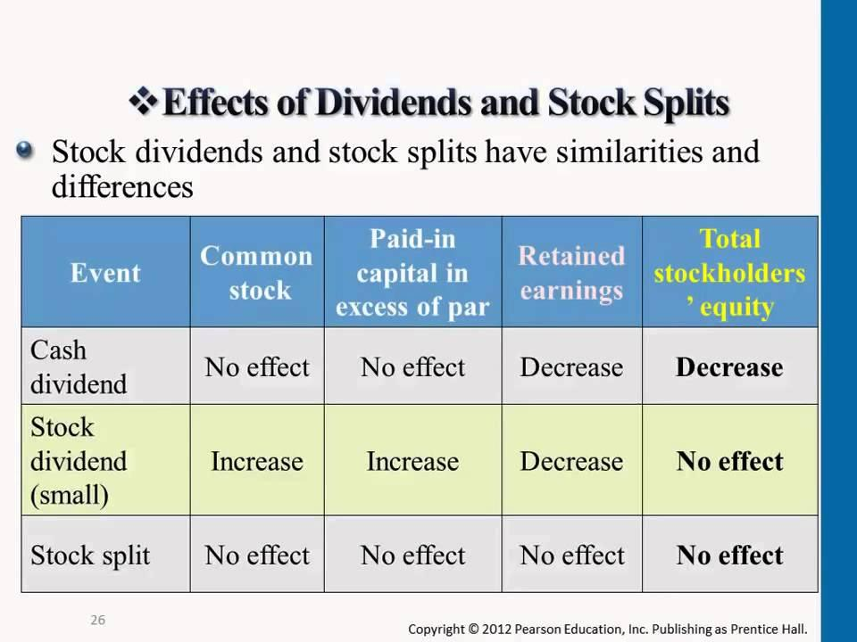

## Table of Contents

## What is a stock split?

A stock split is when a company decides to divide its existing shares into more shares. This makes the price of each share lower, but it doesn't change the total value of the shares you own. For example, if you have one share worth $100 and the company does a 2-for-1 split, you'll have two shares, but each will be worth $50.

Companies do stock splits for a few reasons. One reason is to make their stock seem more affordable to smaller investors. When the price per share goes down, more people might want to buy the stock. Another reason is to make the stock look more attractive. If the stock price keeps going up and up, a split can bring it back to a more normal level, which some investors like.

Stock splits don't change the overall value of the company or the total value of your investment. They just change the number of shares and the price per share. So, if you own stock in a company that does a split, you'll have more shares, but your total investment will be worth the same amount as before the split.

## What are cash dividends?

Cash dividends are payments that a company gives to its shareholders from its profits. When a company makes money, it can choose to share some of that money with the people who own its stock. The company decides how much to pay and when to pay it. Shareholders get a certain amount of money for each share of stock they own. For example, if a company pays a dividend of $1 per share and you own 100 shares, you would get $100.

Not all companies pay cash dividends. Some companies, especially newer ones or those in fast-growing industries, might decide to use their profits to grow the business instead of paying dividends. Other companies, often more established ones, might pay regular dividends because they have steady profits and want to reward their shareholders. When a company announces a dividend, it sets a date when shareholders need to own the stock to get the payment. This is called the ex-dividend date. If you buy the stock on or after this date, you won't get the next dividend payment.

## How do stock splits affect the number of shares a shareholder owns?

When a company does a stock split, it changes the number of shares each shareholder owns. If the company does a 2-for-1 split, it means that for every share you own before the split, you will have two shares after the split. So, if you owned 10 shares before the split, you would own 20 shares after it. The total value of your investment stays the same, but you have more shares, and each share is worth less.

For example, if you owned one share worth $100 before a 2-for-1 split, after the split you would own two shares, but each would be worth $50. The total value of your investment is still $100, but you have twice as many shares. This doesn't change how much your investment is worth, but it does change the number of shares you have.

## Does a stock split change the total value of a shareholder's investment?

A stock split does not change the total value of a shareholder's investment. When a company does a stock split, it gives more shares to its shareholders, but the price of each share goes down by the same amount. So, if you owned one share worth $100 before a 2-for-1 split, after the split you would own two shares worth $50 each. The total value of your investment stays the same at $100.

This happens because a stock split is like cutting a pizza into more slices. The total amount of pizza doesn't change, just the number of slices. In the same way, the total value of the company and your investment in it doesn't change after a stock split. The only thing that changes is the number of shares you own and the price of each share.

## How do stock splits impact the per-share dividend amount?

When a company does a stock split, the per-share dividend amount usually goes down. This happens because the company wants to keep the total amount of money it pays out in dividends the same. If you had one share before the split and the company paid a $1 dividend per share, you would get $1. After a 2-for-1 split, you would have two shares, but the company might pay a $0.50 dividend per share. So, you would still get $1 in total dividends, but the per-share amount would be half as much.

The reason the per-share dividend goes down after a stock split is to make sure the company's dividend policy stays the same. If the company didn't change the per-share dividend after a split, it would have to pay out more money in total, which might not be what the company wants. By adjusting the per-share dividend, the company can keep paying the same total amount of dividends to all shareholders, even though they now have more shares.

## What is the effect of a stock split on the total dividend payout by the company?

A stock split does not change the total dividend payout by the company. When a company decides to do a stock split, it gives more shares to its shareholders, but it also lowers the dividend per share. This means that even though each share pays out less in dividends, the total amount of money the company pays out in dividends stays the same.

For example, if a company had 1 million shares before a 2-for-1 split and paid a $1 dividend per share, it would pay out $1 million in total dividends. After the split, the company would have 2 million shares, but it would pay a $0.50 dividend per share. So, the total payout would still be $1 million. The company adjusts the per-share dividend to make sure the total dividend payout remains the same.

## Can a stock split influence a company's decision to increase, decrease, or maintain its dividend policy?

A stock split by itself usually doesn't make a company change its dividend policy. A company's dividend policy depends on things like how much money it's making, its plans for the future, and what it thinks is best for its shareholders. When a company does a stock split, it might change the dividend per share, but the total amount of money it pays out in dividends stays the same. So, a stock split doesn't really push a company to increase, decrease, or keep its dividend policy the same.

However, a stock split can sometimes make a company think more about its dividend policy. If a company does a stock split to make its stock price look better or to attract more investors, it might also look at its dividend policy to see if it needs to change. But any decision to change the dividend policy would be based on the company's overall financial health and goals, not just because of the stock split. So, while a stock split might make a company review its dividend policy, it's not the main reason for any changes.

## How do stock splits potentially affect shareholder yield?

A stock split doesn't change the shareholder yield directly. Shareholder yield is about how much money you get back from your investment, usually through dividends and stock buybacks. When a company does a stock split, it gives you more shares, but the price of each share goes down. The total value of your investment stays the same, and the total amount of dividends you get doesn't change either. So, the stock split itself doesn't make your yield go up or down.

However, a stock split can sometimes make a company's stock more attractive to investors. If more people want to buy the stock because it's cheaper per share, the stock price might go up. If the stock price goes up, and the company keeps paying the same total amount of dividends, your yield might go down a bit because yield is calculated as the dividend per share divided by the stock price. But this isn't because of the stock split itself; it's because of how the market reacts to the split. So, while a stock split can affect how people see the stock, it doesn't directly change your shareholder yield.

## What are the tax implications of stock splits in relation to cash dividends?

Stock splits don't have any direct tax implications. When a company does a stock split, it's just giving you more shares, but the total value of your investment stays the same. So, you don't have to pay taxes on the extra shares you get from a stock split. It's not like getting money or something you can sell right away, so the tax people don't count it as income.

On the other hand, cash dividends do have tax implications. When a company pays you cash dividends, that money is usually considered income. You have to report it on your taxes, and you might have to pay taxes on it, depending on how much you get and what tax laws apply to you. So, while stock splits don't change your taxes, cash dividends can make your tax bill go up because you're getting money from the company.

## How do stock splits and cash dividends interact to influence stock price?

Stock splits and cash dividends can both affect a stock's price, but they do it in different ways. A stock split doesn't change the total value of your investment, but it can make the stock price go down right away because you're getting more shares. For example, if a company does a 2-for-1 split, the price of each share will be half of what it was before. But sometimes, the stock price might go up after a split because more people might want to buy the stock since it's cheaper per share. So, while a stock split lowers the price at first, it might make the price go up over time if more people start buying the stock.

Cash dividends work differently. When a company pays a cash dividend, it's giving money to its shareholders, which can make the stock price go down a bit right after the dividend is paid. This happens because the company is using its money to pay the dividend, so the company is worth a little less right after the payment. But, like with stock splits, if investors see the dividend as a good thing, it might make more people want to buy the stock. If more people want to buy it, the stock price could go up over time. So, both stock splits and cash dividends can make the stock price change, but it depends a lot on what investors think about the company and its decisions.

## What are some historical examples where stock splits significantly impacted cash dividend policies?

One example is Apple Inc. In 2014, Apple did a 7-for-1 stock split, which made the price of each share go down a lot. Before the split, Apple paid a dividend of about $3.05 per share every year. After the split, they changed the dividend to about $0.44 per share, so the total amount of money they paid out stayed the same. But the stock split made more people want to buy Apple stock because it was cheaper per share. This didn't change their dividend policy directly, but it did make Apple think more about how to keep shareholders happy, including keeping the dividends steady.

Another example is Coca-Cola. In 2012, Coca-Cola did a 2-for-1 stock split. Before the split, they paid about $0.51 per share in dividends each quarter. After the split, they changed it to about $0.255 per share, so the total amount of dividends stayed the same. The stock split made Coca-Cola's stock more affordable, and this helped them keep their dividend policy the same. Like Apple, Coca-Cola used the stock split to make their stock more attractive to investors, but it didn't make them change how they paid dividends.

## How do investors typically react to announcements of stock splits in terms of expectations about future dividends?

When a company announces a stock split, investors often get excited because it can make the stock seem cheaper and easier to buy. They might think that the company is doing well and wants to make its stock more attractive to more people. But this doesn't usually change what investors expect about future dividends. A stock split just changes the number of shares and the price per share, not the total amount of money the company pays out in dividends. So, investors usually don't expect the company to change its dividend policy just because of a stock split.

However, if a company has a history of increasing its dividends over time, investors might still hope for bigger dividends in the future, even after a stock split. They might see the stock split as a sign that the company is confident about its future and might keep growing its dividends. But this is more about the company's overall performance and plans, not just the stock split itself. So, while a stock split can make investors feel good about the company, it doesn't directly change their expectations about future dividends.

## What are stock splits and cash dividends and how can they be understood?

A stock split is a corporate action that involves increasing the number of shares outstanding by dividing existing shares into multiple ones. For instance, in a 2-for-1 stock split, each share is divided into two, effectively doubling the total number of shares while halving the share price. This process does not alter the company's overall market capitalization, as the total value of the shares remains the same; it simply redistributes the existing value across a greater number of shares. This can be represented mathematically by:

$$
\text{Post-Split Share Price} = \frac{\text{Pre-Split Share Price}}{\text{Split Ratio}}
$$

$$
\text{Post-Split Shares Outstanding} = \text{Pre-Split Shares Outstanding} \times \text{Split Ratio}
$$

Stock splits can enhance [liquidity](/wiki/liquidity-risk-premium) by making shares more affordable to a broader range of investors, particularly retail investors who may find lower-priced shares more accessible. The psychological effect of a reduced share price can also enhance the stock's perceived value, potentially increasing demand.

Cash dividends, conversely, are distributions of a company's earnings to its shareholders, typically expressed as a dollar amount per share. These payouts are a direct method for returning profits to shareholders and can signal a company's robust financial health. The amount paid as a dividend is deducted from the company's retained earnings, which leads to an immediate reduction in the stock's price equivalent to the dividend paid, reflecting the decreased equity. The process can affect the stock price as follows:

$$
\text{Ex-Dividend Share Price} = \text{Share Price} - \text{Dividend Amount}
$$

Both stock splits and cash dividends influence shareholder equity and can alter investment strategies. Stock splits primarily impact psychological perceptions and market accessibility, while dividends affect tangible returns and stock valuation. Investors must consider factors such as dividend yield, payout ratios, and investment horizons when formulating strategies based on these corporate actions. Each of these actions plays a significant role in shaping the equity landscape, enabling investors to potentially optimize their portfolios through careful monitoring and strategic decision-making.

## What is the impact of stock splits on shareholder value?

Stock splits are a financial maneuver where a company increases the number of its shares outstanding while keeping the total market value constant. This is achieved by reducing the price per share proportionally. For example, in a 2-for-1 stock split, a shareholder holding one share worth $100 will, after the split, possess two shares valued at $50 each. The overall value of their holding remains $100, ensuring no immediate change in the investor's equity stake or the company's market capitalization.

The primary effect of stock splits is psychological, affecting investor perceptions. By lowering the price per share, stocks often become more accessible to retail investors who may have previously perceived them as too expensive. Such accessibility can potentially increase demand for the stock, as it appears more affordable, despite no change in fundamental value. This perceived affordability can lead to increased liquidity, as more investors are able to buy the stock at the lower price. Enhanced liquidity is beneficial for a stock, as it tends to reduce bid-ask spreads and facilitates more seamless trading.

From the perspective of existing shareholders, stock splits can impact their proportional ownership and dividends if done in conjunction with recent acquisitions or restructures. However, in typical circumstances, a stock split maintains all financial ratios, ensuring that each shareholder's claims on earnings, assets, and dividends remain unchanged. Calculating this involves ensuring the ratio of shares before and after the split remains equivalent:

$$
\text{Shareholders' Equity Before Split} = \text{Shares Outstanding} \times \text{Price Per Share}
$$
$$
\text{Shareholders' Equity After Split} = \left(\text{Shares Outstanding} \times \text{Split Ratio}\right) \times \left(\frac{\text{Price Per Share}}{\text{Split Ratio}}\right)
$$

This mathematical assurance allows investors to make informed decisions, understanding that while the corporate structure appears altered, the financial backbone remains consistent.

However, despite the theoretical neutrality of stock splits on intrinsic value, empirical studies indicate that stock splits can lead to short-term stock price increases. This may be due to increased trading [volume](/wiki/volume-trading-strategy) and investor interest post-split. Consequently, prudent investors should assess whether the post-split enthusiasm translates into substantial long-term value or merely reflects transient market sentiment.

Overall, understanding the impact of stock splits on shareholder value requires recognizing the distinction between the unchanged fundamental value and altered market perception. This balance aids investors in leveraging stock splits judiciously within their investment strategy.

## What are the effects of cash dividends on shareholder value?

Cash dividends serve as a direct financial return to shareholders, impacting both the perceived value and market behavior of a company's stock. When a company declares a cash dividend, it signifies a distribution of profits back to its shareholders, which is a testament to its financial health and profitability. However, this distribution can also lead to a decrease in the stock’s market price, a phenomenon commonly referred to as the post-dividend drop.

The payment of cash dividends has several implications for shareholder value. First, cash dividends provide a tangible return to investors, offering them periodic income that can be utilized or reinvested according to their financial goals. This capability makes dividend-paying stocks particularly attractive to income-focused investors, such as retirees who seek stable and predictable returns.

However, the declaration of dividends usually results in a reduction of a company's market value equivalent to the total value of the dividend paid out. This is because, on the ex-dividend date, the market typically adjusts the share price downward to reflect the dividend payment. Theoretically, the drop equals the amount of the dividend. For example, if a company pays a dividend of $1 per share, the stock price should drop by $1 on the ex-dividend date, barring other market forces.

Mathematically, the effect of cash dividends on the stock price can be described as:

$$
P_{\text{after}} = P_{\text{before}} - D
$$

where $P_{\text{after}}$ is the stock price after the dividend, $P_{\text{before}}$ is the stock price before the dividend, and $D$ is the dividend per share.

Beyond immediate price adjustments, dividends communicate a company’s robust cash flow and earnings capacity, projecting an image of stability. This demonstration of financial solidity can help sustain or even enhance investor confidence, counterbalancing the temporary drop in stock price.

Investors aiming to maximize their returns from dividend-paying stocks need to analyze the dividend yield, defined as:

$$
\text{Dividend Yield} = \frac{\text{Annual Dividends per Share}}{\text{Price per Share}}
$$

By comparing the dividend yield to alternative investment opportunities, shareholders can decide whether retaining or reinvesting dividends is the most strategic choice.

Moreover, reinvesting dividends through dividend reinvestment plans (DRIPs) can potentially increase shareholder value over time, compounding returns by purchasing additional shares. This reinvestment strategy can lead to significant wealth accumulation, especially when coupled with the power of compounding interest.

In summary, while cash dividends lead to an immediate reduction in stock price, they also reinforce a company’s profitable image and provide investors the opportunity to earn tangible returns. By evaluating dividend yield and considering reinvestment opportunities, investors can strategically manage their portfolios to enhance long-term gains.

## References & Further Reading

[1]: "Understanding Stock Splits and Their Impact on Shareholder Value." Investopedia. Accessible at: [Investopedia Stock Splits](https://www.cgaa.org/article/why-share-split)

[2]: Loughran, T., & Ritter, J. R. (1995). "The New Issues Puzzle." Journal of Finance, 50(1), 23-51. DOI: 10.1111/j.1540-6261.1995.tb05166.x.

[3]: ["Understanding Dividend Investing"](https://www.kiplinger.com/investing/dividend-stocks/what-is-dividend-investing) by Morningstar

[4]: Dravid, A. (1987). "A Note on the Behavior of Stock Prices around Ex-Dividend Dates." Journal of Finance, 42(1), 205–213. DOI:10.1111/j.1540-6261.1987.tb02566.x

[5]: ["Algorithmic Trading: Winning Strategies and Their Rationale"](https://www.amazon.com/Algorithmic-Trading-Winning-Strategies-Rationale-ebook/dp/B00CY5HC0U) by Ernie Chan

[6]: "Adjustments for Stock Splits and Stock Dividends." New York Stock Exchange (NYSE). Available at: [NYSE Adjustments](https://www.nyse.com/publicdocs/nyse/indices/nyse_sector_index_methodology.pdf)

[7]: Angel, J. J. (1997). "Tick Size, Share Prices, and Stock Splits." Journal of Finance, 52(2), 655–681. DOI:10.1111/j.1540-6261.1997.tb04817.x

[8]: ["Dividend Stock Basics: Understanding the Metrics"](https://www.investing.com/academy/stocks/key-metrics-for-dividend-stocks/) by The Balance 

[9]: "Introduction to Data Science for Finance with Python." DataCamp. Access available at: [DataCamp Finance Course](https://www.datacamp.com/courses/introduction-to-python-for-finance)

[10]: Hull, J. C. (2018). ["Options, Futures, and Other Derivatives."](https://www.amazon.com/Options-Futures-Other-Derivatives-10th/dp/013447208X) Pearson, 9th Edition.