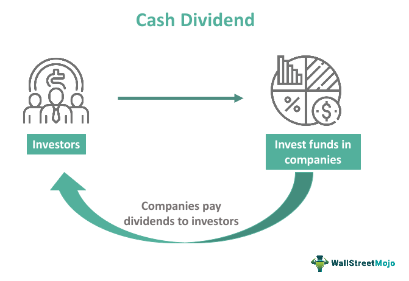

Shareholder value is a critical metric in assessing a company's success and the return on investment it provides to its shareholders. Corporate actions such as stock splits and cash dividends significantly influence this value, thereby impacting investor decisions and market perceptions. A stock split increases the number of a company's outstanding shares while concurrently reducing the price per share, making them potentially more attractive to a broader range of investors without affecting the company's overall market capitalization. Conversely, cash dividends serve as a direct payout to shareholders, reflecting a company's profitability and its willingness to share profits with its investors.

As the financial landscape evolves, algorithmic trading has emerged as a powerful tool for enhancing investment strategies. The intersection of corporate actions and algorithmic trading presents unique challenges and opportunities. Understanding how stock splits and cash dividends interact with algorithmic frameworks can provide investors with strategic insights to refine their approaches. Algorithmic trading systems rely heavily on historical data, meticulously adjusted for events like stock splits and dividend payouts, to formulate trading strategies and predict market movements accurately.



This article examines the complex interplay between stock splits, cash dividends, and algorithmic trading, elucidating their collective impact on shareholder value. By dissecting these relationships, investors and financial analysts can gain a deeper understanding of the ways in which corporate actions influence market behavior, thereby honing their investment strategies to maximize shareholder returns.

## Table of Contents

## Understanding Stock Splits and Cash Dividends

A stock split is a corporate action that involves increasing the number of shares outstanding by dividing existing shares into multiple ones. For instance, in a 2-for-1 stock split, each share is divided into two, effectively doubling the total number of shares while halving the share price. This process does not alter the company's overall market capitalization, as the total value of the shares remains the same; it simply redistributes the existing value across a greater number of shares. This can be represented mathematically by:

$$
\text{Post-Split Share Price} = \frac{\text{Pre-Split Share Price}}{\text{Split Ratio}}
$$

$$
\text{Post-Split Shares Outstanding} = \text{Pre-Split Shares Outstanding} \times \text{Split Ratio}
$$

Stock splits can enhance [liquidity](/wiki/liquidity-risk-premium) by making shares more affordable to a broader range of investors, particularly retail investors who may find lower-priced shares more accessible. The psychological effect of a reduced share price can also enhance the stock's perceived value, potentially increasing demand.

Cash dividends, conversely, are distributions of a company's earnings to its shareholders, typically expressed as a dollar amount per share. These payouts are a direct method for returning profits to shareholders and can signal a company's robust financial health. The amount paid as a dividend is deducted from the company's retained earnings, which leads to an immediate reduction in the stock's price equivalent to the dividend paid, reflecting the decreased equity. The process can affect the stock price as follows:

$$
\text{Ex-Dividend Share Price} = \text{Share Price} - \text{Dividend Amount}
$$

Both stock splits and cash dividends influence shareholder equity and can alter investment strategies. Stock splits primarily impact psychological perceptions and market accessibility, while dividends affect tangible returns and stock valuation. Investors must consider factors such as dividend yield, payout ratios, and investment horizons when formulating strategies based on these corporate actions. Each of these actions plays a significant role in shaping the equity landscape, enabling investors to potentially optimize their portfolios through careful monitoring and strategic decision-making.

## Impact of Stock Splits on Shareholder Value

Stock splits are a financial maneuver where a company increases the number of its shares outstanding while keeping the total market value constant. This is achieved by reducing the price per share proportionally. For example, in a 2-for-1 stock split, a shareholder holding one share worth $100 will, after the split, possess two shares valued at $50 each. The overall value of their holding remains $100, ensuring no immediate change in the investor's equity stake or the company's market capitalization.

The primary effect of stock splits is psychological, affecting investor perceptions. By lowering the price per share, stocks often become more accessible to retail investors who may have previously perceived them as too expensive. Such accessibility can potentially increase demand for the stock, as it appears more affordable, despite no change in fundamental value. This perceived affordability can lead to increased liquidity, as more investors are able to buy the stock at the lower price. Enhanced liquidity is beneficial for a stock, as it tends to reduce bid-ask spreads and facilitates more seamless trading.

From the perspective of existing shareholders, stock splits can impact their proportional ownership and dividends if done in conjunction with recent acquisitions or restructures. However, in typical circumstances, a stock split maintains all financial ratios, ensuring that each shareholder's claims on earnings, assets, and dividends remain unchanged. Calculating this involves ensuring the ratio of shares before and after the split remains equivalent:

$$
\text{Shareholders' Equity Before Split} = \text{Shares Outstanding} \times \text{Price Per Share}
$$
$$
\text{Shareholders' Equity After Split} = \left(\text{Shares Outstanding} \times \text{Split Ratio}\right) \times \left(\frac{\text{Price Per Share}}{\text{Split Ratio}}\right)
$$

This mathematical assurance allows investors to make informed decisions, understanding that while the corporate structure appears altered, the financial backbone remains consistent.

However, despite the theoretical neutrality of stock splits on intrinsic value, empirical studies indicate that stock splits can lead to short-term stock price increases. This may be due to increased trading [volume](/wiki/volume-trading-strategy) and investor interest post-split. Consequently, prudent investors should assess whether the post-split enthusiasm translates into substantial long-term value or merely reflects transient market sentiment.

Overall, understanding the impact of stock splits on shareholder value requires recognizing the distinction between the unchanged fundamental value and altered market perception. This balance aids investors in leveraging stock splits judiciously within their investment strategy.

## Effects of Cash Dividends on Shareholder Value

Cash dividends serve as a direct financial return to shareholders, impacting both the perceived value and market behavior of a company's stock. When a company declares a cash dividend, it signifies a distribution of profits back to its shareholders, which is a testament to its financial health and profitability. However, this distribution can also lead to a decrease in the stock’s market price, a phenomenon commonly referred to as the post-dividend drop.

The payment of cash dividends has several implications for shareholder value. First, cash dividends provide a tangible return to investors, offering them periodic income that can be utilized or reinvested according to their financial goals. This capability makes dividend-paying stocks particularly attractive to income-focused investors, such as retirees who seek stable and predictable returns.

However, the declaration of dividends usually results in a reduction of a company's market value equivalent to the total value of the dividend paid out. This is because, on the ex-dividend date, the market typically adjusts the share price downward to reflect the dividend payment. Theoretically, the drop equals the amount of the dividend. For example, if a company pays a dividend of $1 per share, the stock price should drop by $1 on the ex-dividend date, barring other market forces.

Mathematically, the effect of cash dividends on the stock price can be described as:

$$
P_{\text{after}} = P_{\text{before}} - D
$$

where $P_{\text{after}}$ is the stock price after the dividend, $P_{\text{before}}$ is the stock price before the dividend, and $D$ is the dividend per share.

Beyond immediate price adjustments, dividends communicate a company’s robust cash flow and earnings capacity, projecting an image of stability. This demonstration of financial solidity can help sustain or even enhance investor confidence, counterbalancing the temporary drop in stock price.

Investors aiming to maximize their returns from dividend-paying stocks need to analyze the dividend yield, defined as:

$$
\text{Dividend Yield} = \frac{\text{Annual Dividends per Share}}{\text{Price per Share}}
$$

By comparing the dividend yield to alternative investment opportunities, shareholders can decide whether retaining or reinvesting dividends is the most strategic choice.

Moreover, reinvesting dividends through dividend reinvestment plans (DRIPs) can potentially increase shareholder value over time, compounding returns by purchasing additional shares. This reinvestment strategy can lead to significant wealth accumulation, especially when coupled with the power of compounding interest.

In summary, while cash dividends lead to an immediate reduction in stock price, they also reinforce a company’s profitable image and provide investors the opportunity to earn tangible returns. By evaluating dividend yield and considering reinvestment opportunities, investors can strategically manage their portfolios to enhance long-term gains.

## Algorithmic Trading and Stock Adjustment

Algorithmic trading depends heavily on the precision and accuracy of historical market data. This involves the critical process of adjusting data to account for corporate actions such as stock splits and cash dividends. Stock splits, which increase the number of shares while maintaining the total market capitalization, do not inherently change a company's market value. However, if unadjusted, they can create misleading historical price charts and metrics, thus impacting the integrity of models relying on accurate price trajectories. For instance, a stock price dropping from $100 to $50 may appear alarming without context, but if this adjustment results from a 2-for-1 stock split, the perceived loss is non-existent.

Cash dividends also necessitate adjustments. When a company issues a cash dividend, the stock price typically decreases by the dividend amount on the ex-dividend date. This adjustment is crucial to maintain accurate performance metrics and valuation models over time. Failure to adjust for dividends can lead to overestimated returns when conducting [backtesting](/wiki/backtesting), as past prices might appear lower than they should be.

An accurate approach to adjusting historical prices can be illustrated using Python, which serves as a robust tool for financial data analysis. A typical adjustment method for stock splits involves recalculating historical prices by dividing them by the split ratio. For dividends, prices are adjusted upwards by the dividend per share amount. Below is a simple Python example showcasing a price adjustment for both stock splits and dividends:

```python
def adjust_prices(prices, splits, dividends):
    """
    Adjusts stock prices for splits and dividends.

    :param prices: List of historical stock prices.
    :param splits: Dictionary with dates as keys and split ratios as values.
    :param dividends: Dictionary with dates as keys and dividend amounts as values.
    :return: List of adjusted stock prices.
    """
    adjusted_prices = prices.copy()

    for date, split_ratio in splits.items():
        # Divide all prices prior to split by the split ratio
        adjusted_prices = [price / split_ratio if i <= date else price for i, price in enumerate(adjusted_prices)]

    for date, dividend in dividends.items():
        # Increase all prices prior to dividend by the dividend amount
        adjusted_prices = [price + dividend if i <= date else price for i, price in enumerate(adjusted_prices)]

    return adjusted_prices

# Example usage
historical_prices = [100, 102, 104, 106, 108]  # Sample data
splits = {2: 2}  # Stock split on index 2 with a ratio of 2-for-1
dividends = {4: 1}  # Dividend issued on index 4 with a payout of $1

adjusted_prices = adjust_prices(historical_prices, splits, dividends)
print(adjusted_prices)
```

For trading algorithms, ensuring data accuracy through such adjustments is indispensable. Misleading data due to overlooked stock splits or dividends produces skewed analyses, potentially leading to flawed trading decisions. By adjusting datasets accordingly, algorithms are better prepped to analyze past stock behaviors authentically and predict future movements, thus refining strategy algorithms and enhancing their decision-making capabilities.

## Real-World Implications of Stock Splits and Dividends in Algo Trading

Incorporating adjusted data in [algorithmic trading](/wiki/algorithmic-trading) is crucial for reflecting true historical performance during backtesting. Stock splits and dividends, while not altering a company's total market valuation, can significantly affect per-share data and require adjustments for accurate analysis.

Algorithms utilizing unadjusted data may inaccurately portray stock movements, thereby misconstruing market dynamics and leading to suboptimal trading decisions. For instance, unadjusted historical prices do not account for the increase in share count due to stock splits, which can falsely inflate price appreciation. Similarly, neglecting adjustments for cash dividends could distort yield calculations and financial ratios that are critical for algo-driven decisions.

Prominent trading firms recognize the importance of adjusted datasets and integrate these into their trading strategies. By using adjusted historical price data, firms ensure that backtesting accurately assesses the performance of trading models over time, accounting for any splits or dividends that have occurred. This precision is vital in verifying the efficacy of trading algorithms before they are deployed in live markets.

To illustrate, consider an algorithm that relies on historical price movements to predict future trends. Without adjustments, a stock split might falsely indicate a drastic price drop, misleading the algorithm. Adjusted data maintains continuity in price series, thus enabling a more reliable performance evaluation.

Using Python, traders can employ libraries such as Pandas to adjust historical data for splits and dividends. The following Python code snippet demonstrates a simple method to adjust historical stock prices for splits:

```python
import pandas as pd

def adjust_for_split(data, split_date, split_ratio):
    # Assume 'data' is a DataFrame with Date and Close columns
    data['Adjusted Close'] = data['Close']
    # Adjust all previous prices by the split ratio
    data.loc[data['Date'] < split_date, 'Adjusted Close'] /= split_ratio
    return data

# Example usage
historical_data = pd.DataFrame({
    'Date': ['2023-01-01', '2023-02-01', '2023-03-01'],
    'Close': [150, 300, 450]
})

adjusted_data = adjust_for_split(historical_data, '2023-02-01', 2)
```

In the above code, `adjust_for_split` function modifies the historical close prices prior to the split date, ensuring continuity in data for analysis. Similarly, adjustments for cash dividends can also be executed to maintain data accuracy.

In conclusion, utilizing adjusted data in algorithmic trading aids in developing robust, high-performing trading strategies. This adjustment ensures that past performance assessments are realistic, thereby providing a dependable foundation for strategy development and algorithmic trading success.

## Tools and Resources for Adjusted Data

Various platforms provide adjusted data for stock splits and dividends, central to ensuring accuracy in algorithmic trading strategies. These platforms include Bloomberg Terminal, Thomson Reuters Eikon, and Yahoo Finance, each offering distinct advantages in terms of accuracy, cost, and ease of integration. Choosing the right platform depends on the specific needs of the investor or firm.

Bloomberg Terminal is renowned for its comprehensive financial data coverage, accurate adjusted historical price data, and real-time analytics, making it a preferred choice for professional traders and financial analysts. It is highly valued for its reliability and extensive database, though it comes with a substantial cost that may not be accessible to all investors. Its advanced analytical tools and integration capabilities justify its premium pricing for large trading firms and institutions.

Thomson Reuters Eikon offers a competitive edge with its user-friendly interface and efficient data retrieval processes. It is known for providing reliable adjusted data and supports customization and integration with trading software via APIs. Eikon appeals to firms prioritizing a balance between cost and analytical functionality, providing a scalable solution for medium to large entities seeking robust data solutions without the higher costs associated with Bloomberg Terminal.

Yahoo Finance provides a more accessible option for individual investors and smaller firms. Though it offers free access to financial data, Yahoo Finance's adjusted historical price data may not be as comprehensive as its premium counterparts. However, it serves as an excellent starting point for those with budget constraints, providing adequate data for basic analytical purposes. Users should be aware of potential limitations in data depth and accuracy, emphasizing the necessity of cross-referencing with other sources.

Validation of data through cross-referencing and consulting corporate announcements is crucial for ensuring reliability. Discrepancies in adjusted data can arise from various factors such as delayed corporate actions or data entry errors. It is prudent to corroborate data across multiple platforms and verify against official corporate disclosures to mitigate the risk of adopting erroneous information in trading algorithms.

Accurate adjustment of historical data for stock splits and dividends is integral for algorithmic trading. These platforms, when selected and used appropriately, can provide the foundation for developing effective trading strategies by ensuring that historical backtesting reflects authentic market conditions.

## Conclusion

Stock splits and dividends are integral components that significantly affect shareholder value, necessitating thorough scrutiny by investors. When a company executes a stock split, it increases the number of shares outstanding, thereby making the stock more accessible to potential investors. Although the intrinsic value remains unchanged, the perceived affordability can catalyze heightened investor interest and, subsequently, an increase in trading volume and liquidity.

Conversely, cash dividends represent a direct transfer of profit to shareholders and serve as a testament to a company’s financial well-being. While they provide immediate returns, they often result in a reduction in share price equivalent to the dividend paid, aligning the overall company valuation with its market capitalization post-distribution.

The precision of algorithmic trading strategies relies heavily on the use of adjusted data that accounts for these corporate actions. Inaccuracies in interpreting stock splits or dividend actions in historical data can lead algorithms to miscalculate actual value, causing errant trading decisions. Accurate data adjustments ensure that algorithmic models reflect the true historical performance of assets, thereby enhancing the reliability and efficacy of trading strategies. 

By comprehensively understanding the implications of stock splits and dividends, investors can better optimize their portfolios. With accurate data adjustments, algorithmic traders can develop and maintain strategies that are both competitive and aligned with authentic market dynamics, ensuring optimal investment outcomes.

## References & Further Reading

[1]: "Understanding Stock Splits and Their Impact on Shareholder Value." Investopedia. Accessible at: [Investopedia Stock Splits](https://www.cgaa.org/article/why-share-split)

[2]: Loughran, T., & Ritter, J. R. (1995). "The New Issues Puzzle." Journal of Finance, 50(1), 23-51. DOI: 10.1111/j.1540-6261.1995.tb05166.x.

[3]: ["Understanding Dividend Investing"](https://www.kiplinger.com/investing/dividend-stocks/what-is-dividend-investing) by Morningstar

[4]: Dravid, A. (1987). "A Note on the Behavior of Stock Prices around Ex-Dividend Dates." Journal of Finance, 42(1), 205–213. DOI:10.1111/j.1540-6261.1987.tb02566.x

[5]: ["Algorithmic Trading: Winning Strategies and Their Rationale"](https://www.amazon.com/Algorithmic-Trading-Winning-Strategies-Rationale-ebook/dp/B00CY5HC0U) by Ernie Chan

[6]: "Adjustments for Stock Splits and Stock Dividends." New York Stock Exchange (NYSE). Available at: [NYSE Adjustments](https://www.nyse.com/publicdocs/nyse/indices/nyse_sector_index_methodology.pdf)

[7]: Angel, J. J. (1997). "Tick Size, Share Prices, and Stock Splits." Journal of Finance, 52(2), 655–681. DOI:10.1111/j.1540-6261.1997.tb04817.x

[8]: ["Dividend Stock Basics: Understanding the Metrics"](https://www.investing.com/academy/stocks/key-metrics-for-dividend-stocks/) by The Balance 

[9]: "Introduction to Data Science for Finance with Python." DataCamp. Access available at: [DataCamp Finance Course](https://www.datacamp.com/courses/introduction-to-python-for-finance)

[10]: Hull, J. C. (2018). ["Options, Futures, and Other Derivatives."](https://www.amazon.com/Options-Futures-Other-Derivatives-10th/dp/013447208X) Pearson, 9th Edition.