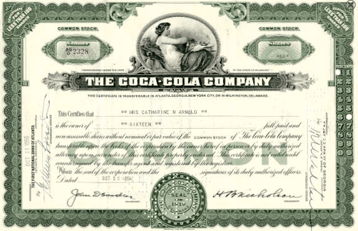

## Table of Contents

## What is a stock split?

A stock split is when a company decides to divide its existing shares into more shares. This makes the price of each share lower, but it doesn't change the total value of the shares you own. For example, if you have one share worth $100 and the company does a 2-for-1 split, you will have two shares, but each will be worth $50.

Companies often do stock splits to make their shares more affordable for smaller investors. When the price per share goes down, more people might want to buy the stock. However, it's important to remember that a stock split by itself doesn't make the company worth more or less. It's just like cutting a pizza into more slices; the pizza is still the same size, but the slices are smaller.

## How does a stock split affect the number of shares a shareholder owns?

When a company does a stock split, it gives more shares to its shareholders. For example, in a 2-for-1 split, if you own one share, you will get one more share for free. So, if you had one share before the split, you will have two shares after the split.

The total value of your investment stays the same right after the split. If the price of one share was $100 before the split, after a 2-for-1 split, you will have two shares, but each share will be worth $50. So, even though you have more shares, the total value of your shares is still $100.

## What happens to the price per share after a stock split?

After a stock split, the price per share goes down. For example, if a company does a 2-for-1 split, and the price of one share was $100 before the split, the price will be $50 after the split. This happens because the company is giving out more shares, but the total value of the company stays the same.

Even though the price per share goes down right after a stock split, it doesn't mean the value of the company has changed. The stock split just makes each share cheaper, which can make it easier for more people to buy the stock. Over time, if more people want to buy the stock because it's cheaper, the price might go up again.

## Does a stock split change the total value of a shareholder's investment?

A stock split does not change the total value of a shareholder's investment right after the split happens. If you own one share worth $100 and the company does a 2-for-1 split, you will get one more share for free. So, you will have two shares, but each will be worth $50. The total value of your investment is still $100 because $50 times two equals $100.

Over time, the value of your investment can change because of other things, like how well the company is doing or what's happening in the stock market. But the stock split itself does not change the total value of what you own. It just makes the price per share lower and gives you more shares, but the overall value stays the same right after the split.

## How are physical share certificates affected by a stock split?

When a company does a stock split, they will send new share certificates to people who have physical certificates. For example, if you have one certificate for one share and the company does a 2-for-1 split, you will get a new certificate for the extra share. The old certificate will still be good, but it will show that you own more shares now.

Sometimes, the company might ask you to send back your old certificate so they can give you a new one that shows the new number of shares. This helps keep everything up to date. But if you keep your old certificate, it will still be worth the new number of shares after the split.

## What is the process for shareholders to receive new share certificates after a stock split?

When a company does a stock split, they need to send new share certificates to people who have physical certificates. If you have one certificate for one share and the company does a 2-for-1 split, you will get a new certificate for the extra share. The old certificate will still be good, but it will show that you own more shares now.

Sometimes, the company might ask you to send back your old certificate. They do this so they can give you a new one that shows the new number of shares. This helps keep everything up to date. But if you keep your old certificate, it will still be worth the new number of shares after the split.

## Are there any costs associated with receiving new share certificates post-split?

Usually, there are no costs for shareholders to get new share certificates after a stock split. The company takes care of the costs because it's their decision to do the split. They want to make sure everything is updated correctly without making shareholders pay extra money.

If the company asks you to send back your old certificate, you might need to pay for mailing it. But this is a small cost, and it's not something the company charges you for. They just need the old certificate to give you a new one that shows the right number of shares you own after the split.

## How does a stock split impact the record-keeping of share ownership?

When a company does a stock split, it changes how many shares people own, but it doesn't change how they keep track of who owns what. If you have a record of your shares, like a certificate or an account with a broker, that record will be updated to show the new number of shares you own. For example, if you had one share and the company did a 2-for-1 split, your record would show you now have two shares.

This update happens automatically for most people. If you have shares in a brokerage account, the broker will update your account to show the new number of shares. If you have physical certificates, the company might send you new certificates or ask you to send back the old ones so they can give you new ones that show the right number of shares. Either way, the record-keeping system will reflect the new number of shares you own after the split.

## What are the tax implications of a stock split for shareholders?

A stock split does not usually have any direct tax implications for shareholders. When a company does a stock split, it just changes the number of shares you own and the price per share, but the total value of your investment stays the same. Since nothing has really changed in terms of value, you don't have to pay any taxes just because of the stock split.

However, if you decide to sell your shares after a stock split, then you might have to pay taxes on any profit you make. The cost basis of your shares, which is what you originally paid for them, will be adjusted to reflect the split. For example, if you bought one share for $100 and the company did a 2-for-1 split, your cost basis for each of the two new shares would be $50. When you sell, you'll use this adjusted cost basis to figure out if you made a profit and how much tax you might owe.

## How do electronic share records handle stock splits compared to physical certificates?

When a company does a stock split, electronic share records and physical certificates both get updated, but the process is different. If you have your shares in an electronic account, like with a broker, the system will automatically update your account to show the new number of shares you own. For example, if you had one share and the company did a 2-for-1 split, your account would show you now have two shares without you having to do anything.

For physical certificates, the company might send you new certificates that show the new number of shares, or they might ask you to send back your old certificate. If they send you new certificates, you will get them in the mail, and they will show the right number of shares after the split. If they ask for the old certificate, you send it back, and they will give you a new one that's updated. Either way, the goal is the same: to make sure your records show the correct number of shares after the stock split.

## What are the long-term effects of stock splits on share certificate management?

When a company does a stock split, it changes how many shares people own, but it doesn't change how they manage share certificates in the long run. If you have electronic shares, your account will be updated automatically every time there's a stock split. This means you don't have to do anything special to keep your records right. Over time, this makes managing your shares easier because everything is updated for you without any extra work.

If you have physical certificates, you might get new ones after a stock split, or you might need to send back the old ones. This can be a bit more work because you have to keep track of the new certificates or remember to send back the old ones when asked. But once you have the new certificates, they show the right number of shares, and you can keep them safely. Over time, managing physical certificates might need a bit more attention, but the process is still straightforward as long as you keep everything organized.

## How do regulatory requirements influence the handling of share certificates during and after a stock split?

Regulatory requirements make sure that companies handle share certificates correctly during and after a stock split. When a company decides to do a stock split, they have to follow rules set by places like the Securities and Exchange Commission (SEC) in the U.S. These rules say that the company must update the records to show the new number of shares each shareholder owns. This means they have to send new certificates or adjust electronic records to match the new share count. The goal is to make sure everything is fair and clear for everyone who owns shares.

After a stock split, the company also has to keep good records and make sure shareholders know about any changes. If shareholders have physical certificates, the company might need to ask them to send back the old ones to get new ones that show the right number of shares. This helps keep everything up to date and follows the rules about how to handle share certificates. Even if shareholders have electronic records, the company still has to make sure those records are updated correctly and that shareholders can see the changes.

## What is Understanding Stock Splits?

Stock splits are corporate actions undertaken by publicly traded companies to adjust the price of their shares without altering the total market capitalization. A stock split increases the number of shares outstanding by issuing more shares to current shareholders, thus reducing the nominal value of each share. The two primary types of stock splits are forward stock splits and reverse stock splits.

A forward stock split occurs when a company divides its existing shares into multiple shares. For example, in a 2-for-1 stock split, a shareholder holding 100 shares pre-split will hold 200 shares post-split. The value of each share is halved, retaining the overall investment's value. The formula for adjusting the share price in a forward stock split is: 

$$
\text{New Price} = \frac{\text{Old Price}}{\text{Split Ratio}}
$$

In contrast, a reverse stock split consolidates shares. For example, in a 1-for-2 reverse stock split, a holder of 200 shares pre-split would hold 100 shares post-split. This action increases the share price accordingly and is often used by companies to meet stock exchange listing requirements or to enhance the perception of the stock's value.

Companies implement stock splits for several strategic reasons, including enhancing [liquidity](/wiki/liquidity-risk-premium) and attracting retail investors by making the stock more affordable. A lower per-share price after a forward split can increase trading [volume](/wiki/volume-trading-strategy), as more investors can purchase whole shares.

Stock splits also impact share certificates, which historically represented ownership in physical form. Today, most equities exist as electronic records. Transfer [agents](/wiki/agents) play a crucial role in updating these electronic records during a stock split. They ensure the correct number of newly split shares are recorded in shareholders' accounts, facilitating seamless electronic transactions.

Real-world examples demonstrate effective stock split strategies by companies like NVIDIA and Apple. Apple Inc., known for multiple splits throughout its history, conducted a 4-for-1 stock split in August 2020 to maintain an accessible share price for individual investors. Similarly, NVIDIA announced a 4-for-1 stock split in 2021, intending to make its shares more attractive to small investors following a significant rise in its stock price.

Understanding how stock splits work and their implications on share certificates and investor perception is vital for investors. These events can influence trading strategies and portfolio management, enhancing liquidity and market participation while maintaining a company's market capitalization.

## How can one develop a comprehensive trading strategy?

To develop a comprehensive trading strategy that effectively combines stock splits, corporate actions, and [algorithmic trading](/wiki/algorithmic-trading), investors should follow a structured approach. This involves several key steps and considerations.

### Key Steps in Developing the Strategy

1. **Market Analysis and Data Collection**: 
   Investors must begin by gathering extensive historical data on stock prices, volume, corporate actions, and market conditions. Quantitative data is critical, and should include stock split events and their timing.

2. **Identification of Opportunities**:
   Identify stocks that are likely to split by analyzing patterns and corporate behaviors. Look at historical patterns where companies might announce stock splits alongside other corporate actions, like dividends or buybacks.

3. **Algorithm Development**:
   With the collected data, develop algorithms to automate trading decisions. These algorithms should incorporate predictive models to forecast stock movements post-split, using statistical methods or [machine learning](/wiki/machine-learning) models such as regression analysis or neural networks.

4. **Programming Considerations**:
   Algorithms should be able to dynamically adjust based on new data. Incorporate market [volatility](/wiki/volatility-trading-strategies) analysis, as capital markets can behave unpredictably post-split. Python's libraries like NumPy, pandas, and scikit-learn can help in developing and testing these algorithms. Here's a simple snippet demonstrating how to start setting up such an algorithmic framework:

   ```python
   import pandas as pd
   from sklearn.linear_model import LinearRegression

   # Load and preprocess data
   data = pd.read_csv('stock_data.csv')
   X = data[['past_volume', 'past_volatility']]
   y = data['post_split_return']

   # Develop and fit a predictive model
   model = LinearRegression()
   model.fit(X, y)

   # Predict future returns
   future_returns = model.predict(X)
   ```

5. **Backtesting**:
   Backtest the strategy using historical data to evaluate its effectiveness. This involves simulating the trading strategy on past data to assess profitability, reduced drawdowns, and risk management. Adjust parameters until the desired outcome is achieved.

6. **Risk Management**:
   Implement risk management techniques such as stop-loss orders, position sizing, and diversification to minimize potential losses. Modern risk management also includes real-time monitoring and dynamic adjustment in response to market conditions.
$$
   \text{Position Size} = \frac{\text{Capital} \times \text{Risk per Trade}}{\text{Stop Loss Distance}}

$$

7. **Monitoring and Evaluation**:
   Continuously monitor the performance of your trading strategy, using real-time data analysis. Evaluate the effectiveness of the algorithm and make necessary adjustments based on market developments and [backtesting](/wiki/backtesting) results.

8. **Continuous Learning and Adaptation**:
   The market evolves, and so should trading strategies. Investors need to stay informed about the latest market trends, emerging technologies in algorithmic trading, and corporate actions. Continuous learning will help in adapting strategies to stay competitive.

### Conclusion

The effective integration of stock splits, corporate actions, and algorithmic trading requires a disciplined approach involving comprehensive data analysis, modeled predictions, and adaptive algorithms. Risk management and continuous learning are crucial to maintaining and improving the strategy's effectiveness. This strategic approach not only helps in maximizing returns but also aids in minimizing potential risks, ultimately enhancing portfolio performance.

## References & Further Reading

[1]: Bergstra, J., Bardenet, R., Bengio, Y., & Kégl, B. (2011). ["Algorithms for Hyper-Parameter Optimization."](https://dl.acm.org/doi/10.5555/2986459.2986743) Advances in Neural Information Processing Systems 24.

[2]: ["Advances in Financial Machine Learning"](https://www.amazon.com/Advances-Financial-Machine-Learning-Marcos/dp/1119482089) by Marcos Lopez de Prado

[3]: ["Evidence-Based Technical Analysis: Applying the Scientific Method and Statistical Inference to Trading Signals"](https://www.amazon.com/Evidence-Based-Technical-Analysis-Scientific-Statistical/dp/0470008741) by David Aronson

[4]: ["Machine Learning for Algorithmic Trading"](https://github.com/stefan-jansen/machine-learning-for-trading) by Stefan Jansen

[5]: ["Quantitative Trading: How to Build Your Own Algorithmic Trading Business"](https://www.amazon.com/Quantitative-Trading-Build-Algorithmic-Business/dp/1119800064) by Ernest P. Chan