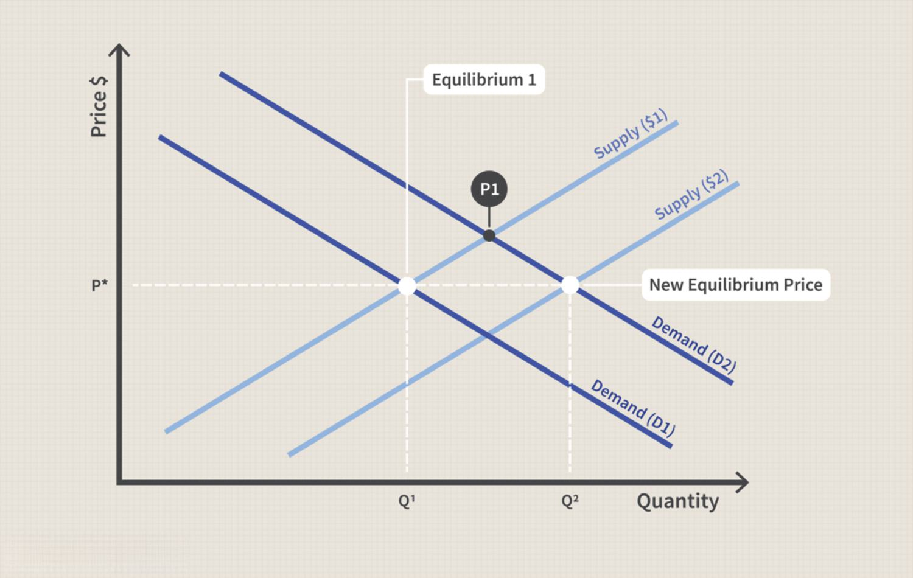

Understanding the interplay of supply and demand is crucial for comprehending price determination in market economics. At the heart of any market are the forces of supply and demand, which dictate the prices of goods and services. Supply describes the amount of a good or service that producers are willing and able to sell at a given price, while demand represents the quantity that consumers are willing and able to purchase. This interaction establishes the equilibrium price, the price point at which the quantity supplied equals the quantity demanded. This intricate balance forms the cornerstone of market economics, impacting everything from consumer behavior to business strategy.

With the advancement of technology, algorithmic trading (algo trading) has become a significant player in how prices are set. Algorithmic trading refers to the use of computer algorithms to automatically make trading decisions, execute orders, and manage portfolios, harnessing data and mathematical models to capture trading opportunities at optimal moments. This practice has gained prominence in financial markets thanks to its ability to enhance efficiency and speed, reduce human error, and handle large volumes of trading data. Algorithms analyze multiple market factors rapidly, often within milliseconds, allowing for swift and informed trading decisions that human traders cannot match in speed or accuracy.

This article examines the core concepts of supply and demand and investigates how algo trading influences the dynamics of modern markets. As technology progresses, traditional methods of understanding and predicting market price movements are evolving. Algo trading arguably reshapes trading landscapes by adding layers of complexity to how prices are determined. Critical factors, such as market liquidity, volatility, and access to market information, are increasingly intertwined with algorithmic processes. 

The effectiveness and challenges of algorithmic strategies deserve careful consideration in market economics. On one hand, algorithmic trading can lead to more efficient price discovery and increased market liquidity. It facilitates a more seamless interaction between supply and demand by optimizing trading operations and reducing transaction costs. Conversely, the rapid execution of trades poses challenges, potentially leading to heightened market volatility and events like flash crashes, where prices plummet within a very short time due to cascading algorithmic reactions.

This introduction sets the stage for a comprehensive exploration of how algorithmic trading affects market conditions, juxtaposed with the fundamental forces of supply and demand that have governed markets traditionally. The subsequent sections will delve into these topics with greater detail, offering insights into the evolving landscape of market economics shaped by technological advancements.

## Table of Contents

## The Fundamentals of Supply and Demand in Market Economics

## The Fundamentals of Supply and Demand in Market Economics

Supply and demand are foundational concepts in market economics that drive price determination. The interaction between sellers' willingness to supply a product and buyers' willingness to purchase it establishes market prices. The balance or imbalance between supply and demand determines whether a market is in equilibrium or disequilibrium.

### Key Determinants of Supply and Demand

Several factors influence supply and demand, which in turn affect pricing:

- **Consumer Preferences**: Changes in tastes and preferences can shift demand curves. For instance, an increasing preference for electric vehicles boosts demand in that segment, affecting market prices.

- **Production Costs**: Lower production costs typically increase supply. Technological advancements can reduce these costs, shifting the supply curve outward and potentially lowering prices.

- **External Factors**: Events such as natural disasters can disrupt supply chains, reducing supply and increasing prices. Similarly, changes in regulatory policies or economic conditions, like a recession, can impact both supply and demand.

### Market Equilibrium and Disequilibrium

The point at which the quantity supplied equals the quantity demanded is termed the market equilibrium. At this point, the price and quantity are stabilized. When the market is not in equilibrium, it experiences disequilibrium, leading to either a surplus or shortage.

- **Surplus**: Occurs when the quantity supplied exceeds the quantity demanded at a given price, pushing prices down.
- **Shortage**: Happens when demand exceeds supply, driving prices up.

These concepts can be visualized through supply and demand graphs. The intersection of the supply and demand curves represents the equilibrium price and quantity.

### Law of Supply and Demand

The law of supply and demand posits that, ceteris paribus, an increase in demand will raise prices, while an increase in supply will lower them. However, this law has limitations and assumes conditions that often do not hold in real markets, such as perfect competition and absence of externalities.

#### Limitations and Assumptions:
1. **Perfect Market Conditions**: Real markets are influenced by imperfect competition, government intervention, and information asymmetry.
2. **Rational Actors**: Assumes all actors in the market make rational decisions.
3. **No Time Lags**: Immediate adjustments are assumed, contrary to real markets where time lags can occur.

### Case Studies of Supply and Demand Shifts

Several historical instances illustrate significant impacts due to shifts in supply and demand:

- **OPEC Oil Embargo (1973)**: This event saw a sharp decrease in oil supply due to political decisions, leading to increased oil prices worldwide, demonstrating how external factors can drastically affect supply.

- **Tech Boom of the Late 1990s**: Consumer movement towards technology-driven products shifted demand curves to the right, leading to increased prices in tech markets.

In essence, the dynamics of supply and demand are crucial for understanding economic behaviors and market price adjustments. The interplay of these forces reveals not only how prices are set but also how they reflect and react to broader economic and external conditions.

## Price Determination in Traditional Markets

Price determination in traditional markets is intricately linked to the interplay of bargaining power, market structures, and the availability of information. At the core of price setting lies the interaction between buyers and sellers, each possessing varying degrees of influence depending on the market conditions.

### Market Structures and Their Role in Price Setting

In economics, market structures significantly influence how prices are set. The principal types include perfect competition, monopoly, oligopoly, and monopolistic competition.

1. **Perfect Competition**: This market structure is characterized by numerous small firms competing against each other. Products are homogeneous, and no single firm can influence the market price. Prices are determined by the forces of supply and demand, leading to an equilibrium state where the quantity supplied equals the quantity demanded.

2. **Monopoly**: Here, a single firm dominates the market without any close substitutes for its product. The monopolist has the power to set prices above marginal costs, leading to higher profits. The price is set where the firm's marginal revenue equals its marginal cost, maximizing profit at the expense of consumer surplus.

3. **Oligopoly**: In an oligopolistic market, a few firms hold the majority of the market share. These firms may collude, leading to price-setting similar to a monopoly, or compete, resulting in prices that might resemble those in competitive markets.

4. **Monopolistic Competition**: This structure features many firms, each offering a differentiated product. While firms have some price-setting power due to product uniqueness, the entry of new competitors can erode long-run profitability.

### Government Interventions and Pricing Mechanisms

Government interventions, such as tariffs, taxes, subsidies, and price controls, can significantly influence pricing mechanisms. Tariffs and taxes typically increase production costs, leading to higher prices for consumers. Subsidies, on the other hand, can lower prices by offsetting production expenses. Price controls, like price ceilings and floors, are direct interventions that can lead to surpluses or shortages when set above or below the equilibrium price.

### Equilibrium Price in Competitive Markets

The equilibrium price is the price at which the quantity of goods supplied equals the quantity demanded. This is typically represented graphically where the supply curve intersects the demand curve. Mathematically, this can be expressed as:

$$
Q_s(P) = Q_d(P)
$$

where $Q_s$ is the quantity supplied and $Q_d$ is the quantity demanded at price $P$.

In competitive markets, any deviation from this equilibrium prompts adjustments by buyers and sellers, driving the market back to equilibrium over time.

### Consumer and Producer Surplus

Consumer surplus refers to the difference between what consumers are willing to pay for a good or service and what they actually pay. Producer surplus is the difference between the price producers receive and the minimum they would be willing to accept. Together, these surpluses measure the overall benefits to participants in the market. Changes in these surpluses can significantly impact market sentiment and price setting.

Understanding these fundamental principles of price determination provides a foundation for analyzing more complex market dynamics, including those influenced by modern technologies such as [algorithmic trading](/wiki/algorithmic-trading).

## Algorithmic Trading: Revolutionizing Market Mechanics

Algorithmic trading has revolutionized the financial markets by automating and optimizing decision-making processes. This method involves the use of computer programs to execute trades based on a predefined set of rules or algorithms. Such algorithms analyze a vast array of market indicators and data points to identify trading opportunities that a human might miss, leveraging technology to enhance speed and accuracy.

The growing importance of algorithmic trading in financial markets is underscored by its capacity to handle complex calculations and large volumes of data rapidly. Algorithms leverage data-driven approaches for making trading decisions by processing real-time market data, historical trends, and statistical models. This data-centric methodology enables traders to set prices and make buy or sell decisions with precision. For instance, regression analysis and [machine learning](/wiki/machine-learning) techniques can be employed to forecast price movements or identify [arbitrage](/wiki/arbitrage) opportunities.

There are several algorithmic strategies prevalent in financial markets, including high-frequency trading ([HFT](/wiki/high-frequency-trading-strategies)), arbitrage strategies, and market-making. High-frequency trading involves the execution of a large number of orders at extremely fast speeds, often in microseconds, to capitalize on small price discrepancies. Arbitrage strategies are designed to exploit price differences of the same asset across different markets to make a profit. Market-making algorithms provide [liquidity](/wiki/liquidity-risk-premium) to the market by continuously quoting a buy and a sell price, thus facilitating trade execution.

The implementation of automated trading systems has led to significant speed and efficiency gains in the market. These systems can execute trades at a fraction of a second, far quicker than any human trader, allowing them to capitalize on fleeting market conditions. Automated trading reduces latency, ensures consistency in trade execution, and minimizes human error.

Despite its efficiency, algorithmic trading also impacts market liquidity, [volatility](/wiki/volatility-trading-strategies), and transparency. It generally improves market liquidity by enabling quicker and more efficient trade execution. However, it can also increase volatility, as high-frequency trading can lead to rapid and sizable movements in asset prices. This is especially evident during market stress, where algorithms might trigger a cascade of automated trades that amplify price swings. Transparency is another concern, as the operations of complex algorithms can be opaque, making it difficult for regulators and other market participants to understand their effects fully.

In conclusion, algorithmic trading has substantially reshaped trading landscapes by introducing technology-driven strategies that enhance speed and expand market opportunities. It presents both advantages, such as improved market liquidity and efficiency, and challenges, including potential spikes in volatility and issues surrounding market transparency. The continuous evolution of algorithms driven by advances in [artificial intelligence](/wiki/ai-artificial-intelligence) and machine learning promises further transformation of market mechanics, necessitating effective oversight and adaptive strategies from all market stakeholders.

## Supply, Demand, and Algo Trading: A Modern Synthesis

Algorithmic trading significantly influences the dynamics of supply and demand within modern markets. By utilizing programmed instructions to execute trade strategies, these algorithms can rapidly analyze data and enact trades far faster than traditional human-operated methods. This integration of technology reshapes how supply and demand interact, affecting overall market liquidity, price volatility, and transparency.

Human traders and algorithms frequently engage as counterparties in financial markets, creating an intricate interplay in price determination. While human traders might rely on intuition and qualitative analysis, algorithms focus on quantitative data-driven approaches. They can parse volumes of market data, identify arbitrage opportunities, and execute orders within microseconds. Thus, algorithms often react to market conditions more swiftly than humans, potentially leading to more accurate price discovery and efficient markets.

However, the efficiency afforded by algorithmic trading can also introduce risks, such as flash crashes—sudden and severe market dips followed by an equally rapid recovery. These are often triggered by algorithms reacting to market anomalies or data errors, resulting in a chain reaction that amplifies volatility. Such events underscore the potential for systemic risk when algorithms operate without sufficient oversight or fail-safes.

Algorithmic trading raises significant challenges including bias and ethical considerations. Algorithms are only as objective as the data they are trained on. If historical market data reflect specific biases, these can be perpetuated or even exacerbated when encoded into trading algorithms. Ethical concerns also arise regarding transparency and fairness—especially if proprietary algorithms dominate trading exchanges, potentially disadvantaging human traders or smaller firms.

Regulatory concerns are inherent as markets evolve to embrace algorithmic trading. Ensuring transparent, fair, and stable markets requires robust frameworks that accommodate the rapid technological advances in financial services. Regulators must balance fostering innovation while preventing the adverse consequences associated with algorithmic systems.

Looking forward, the integration of artificial intelligence (AI) and machine learning in algorithmic trading entails profound implications for supply-demand dynamics. AI systems can continuously learn from new data, potentially enhancing market predictions and adaptive trading strategies. This could lead to markets where prices more accurately reflect underlying economic realities. However, as these systems become more autonomous, they may also present unprecedented regulatory and ethical challenges.

The future landscape of supply and demand will likely continue to be shaped by AI-driven insights and optimizations. As algorithmic trading strategies evolve, so too must the mechanisms governing their use, ensuring that markets remain resilient and equitable amidst continuous technological innovation.

## Conclusion

Revisiting the foundational concepts of supply and demand is essential to understanding their pivotal role in determining market prices. The laws of supply and demand form the backbone of market economics, dictating that prices naturally adjust based on the availability of commodities and consumer demand. These principles establish the equilibrium point at which market forces balance, optimizing resource allocation and maintaining economic stability.

Algorithmic trading has significantly reshaped market dynamics by optimizing and automating the decision-making process. Through sophisticated algorithms and cutting-edge technology, traders can process vast amounts of data at speeds unattainable by humans. This automation has introduced efficiency gains and precision in executing trades, reducing the bid-ask spread and generally enhancing market liquidity. The optimization potential of algorithmic strategies allows for effective market-making, arbitrage exploitation, and improved market efficiency.

However, a balanced integration of traditional and modern trading approaches is crucial for achieving a stable market environment. While algorithmic trading offers numerous advantages, it also presents risks such as market manipulation and the possibility of flash crashes. The human element in trading, characterized by intuition and experience, still holds value and can complement technologically driven strategies to ensure a robust market.

Regulatory oversight remains a critical aspect of safeguarding financial markets against the pitfalls of algorithmic trading. Regulatory frameworks need to be adaptable and proactive, addressing the challenges of high-frequency trades and ensuring transparency and fairness in market operations. By upholding stringent regulations, potential negative impacts on market stability can be mitigated, fostering trust and resilience in financial systems.

To keep pace with rapid technological advancements in trading, continuous learning and adaptation are vital. Traders, regulators, and stakeholders must remain informed and upskill themselves to effectively navigate the evolving landscape. Embracing education and research into emerging technologies like artificial intelligence and machine learning will enhance the ability to forecast trends and develop innovative trading strategies, sustaining the integrity and performance of financial markets.

## Additional Resources & References

### Recommended Books, Articles, and Papers

1. **Books:**
   - *Principles of Economics* by N. Gregory Mankiw: A comprehensive guide covering the fundamentals of supply and demand along with various economic principles.
   - *Options, Futures, and Other Derivatives* by John C. Hull: Explores financial instruments integral to algorithmic trading.
   - *Algorithmic Trading: Winning Strategies and Their Rationale* by Ernie Chan: Offers insights into developing algorithmic trading strategies.

2. **Articles:**
   - "The Laws of Supply and Demand" by Avinash Dixit: This article discusses theoretical underpinnings and real-world applicability of supply and demand. Available in [Journal of Political Economy](https://www.journals.uchicago.edu/journals/jpe/about).
   - "Algorithmic Trading and Market Efficiency" by Alex S. Belenzon: Analyzes the implications of algorithmic trading on market efficiency, published in the [Journal of Financial Economics](https://www.journals.elsevier.com/journal-of-financial-economics).

3. **Papers:**
   - "High-Frequency Trading and Price Discovery" by Albert J. Menkveld: Examines high-frequency trading's role in the price discovery process.
   - "Flash Crashes: Causes and Consequences" by Andrei A. Kirilenko and Andrew W. Lo: Investigates the causes of market volatility linked to algorithmic trading.

### Online Courses and Tutorials

1. **Coursera:**
   - *Financial Markets* by Yale University: Offers foundational knowledge of trading, including the impact of algorithmic practices.
   - *Introduction to Financial Engineering* by Columbia University: Aims at providing technical skills necessary for developing trading algorithms.

2. **edX:**
   - *Microeconomics* by MIT: A comprehensive course on supply and demand analytics and market mechanics.
   - *Algorithmic Trading and Stocks Essential Training* by LinkedIn Learning: Focuses on creating trading strategies using algorithmic approaches.

### Suggestions for Further Research

1. **Bias in Trading Algorithms:** Investigating bias embedded in algorithms that could impact market fairness.
2. **Machine Learning Integration:** Exploring how machine learning models can improve supply and demand predictions.
3. **Regulatory Impact:** Analyzing how regulation shapes the use of algorithms in financial markets.

### Footnotes and Citations

- Dixit, Avinash. "The Laws of Supply and Demand" in *Journal of Political Economy*.
- Menkveld, Albert J. "High-Frequency Trading and Price Discovery", Working Paper, [arXiv:1506.05080](https://arxiv.org/abs/1506.05080).
- Belenzon, Alex S. "Algorithmic Trading and Market Efficiency" from *Journal of Financial Economics*.

These resources provide foundational knowledge as well as advanced insights into supply and demand economics and the evolving world of algorithmic trading. They offer tools for understanding price mechanisms and developing strategies that take advantage of technical advancements in market operations.

## References & Further Reading

[1]: Mankiw, N. Gregory (2014). *Principles of Economics*. Cengage Learning.

[2]: Hull, John C. (2011). *Options, Futures, and Other Derivatives*. Pearson Education.

[3]: Chan, Ernest P. (2009). *Algorithmic Trading: Winning Strategies and Their Rationale*. Wiley.

[4]: Dixit, Avinash. "The Laws of Supply and Demand" in *Journal of Political Economy*. [Link](https://www.jstor.org/stable/24490348)

[5]: Belenzon, Alex S. "Algorithmic Trading and Market Efficiency" in *Journal of Financial Economics*. [Link](https://www.jstor.org/stable/43612951)

[6]: Menkveld, Albert J. "High-Frequency Trading and Price Discovery", arXiv: [1506.05080](https://papers.ssrn.com/sol3/papers.cfm?abstract_id=1722924)

[7]: Kirilenko, Andrei A., and Lo, Andrew W. "Flash Crashes: Causes and Consequences". [Working Paper] 

[8]: de Prado, Marcos Lopez. (2018). *Advances in Financial Machine Learning*. Wiley. 

[9]: Aronson, David (2006). *Evidence-Based Technical Analysis: Applying the Scientific Method and Statistical Inference to Trading Signals*. Wiley. 

[10]: Jansen, Stefan (2020). *Machine Learning for Algorithmic Trading*. Packt Publishing.

[11]: Chan, Ernest P. (2008). *Quantitative Trading: How to Build Your Own Algorithmic Trading Business*. Wiley.