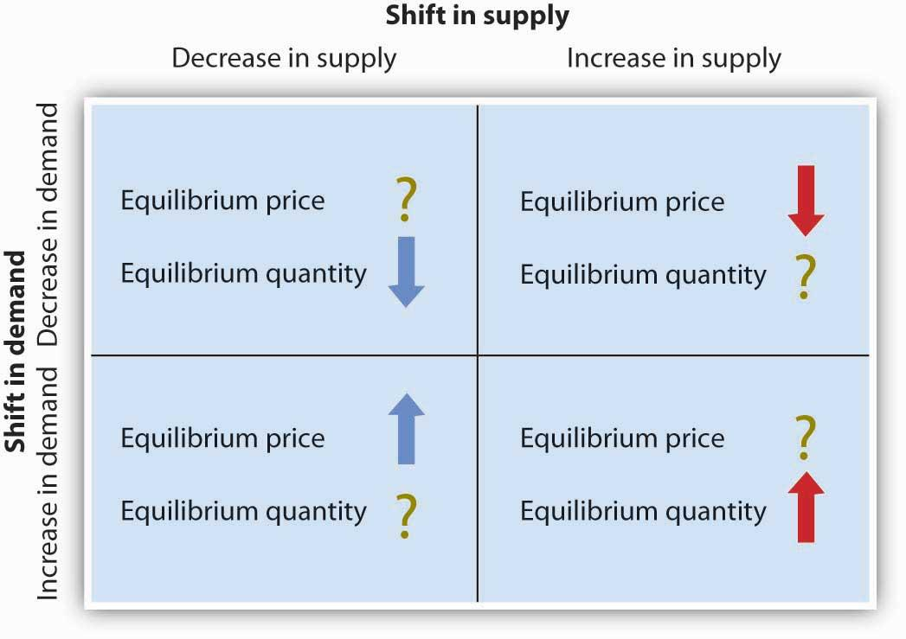

## Table of Contents

## What is supply and demand?

Supply and demand is a basic idea in economics that explains how the price and amount of goods or services are decided. It works like this: when there's a lot of something (supply) and not many people want it (demand), the price goes down. But if there's not much of something and a lot of people want it, the price goes up. It's like a seesaw; when one side goes up, the other goes down.

This concept affects everything we buy and sell, from food to houses. For example, if a new toy becomes really popular, stores might not have enough to sell to everyone who wants one. This high demand and low supply can make the toy's price go up. On the other hand, if nobody wants a certain type of phone anymore, stores might lower the price to sell what they have. Understanding supply and demand helps businesses decide how much to make and what to charge, and it helps us understand why prices change.

## How does supply affect prices?

Supply is how much of something is available to buy. When there's a lot of something, like apples at a grocery store, the price usually goes down. This happens because if a store has too many apples, they might lower the price so people will buy them before they go bad. It's like when you have too many toys and you want to give some away or sell them cheaper so they don't just sit around.

On the other hand, if there's not much of something, like a special toy that's hard to find, the price can go up. This is because when something is rare, more people might want it, and they're willing to pay more to get it. For example, if only a few stores have that special toy, they can charge more because people really want it and can't find it anywhere else. So, the amount of supply can make prices go up or down depending on how much or how little there is of something.

## How does demand affect prices?

Demand is how much people want something. When a lot of people want something, like a new video game, the price can go up. This happens because when lots of people want the same thing, they might be willing to pay more to get it. For example, if a new game comes out and everyone wants to play it, stores can charge more because they know people will buy it no matter the price.

On the other hand, if not many people want something, like an old phone model, the price can go down. Stores might lower the price to sell what they have because not many people are interested in it anymore. So, demand can make prices go up when lots of people want something, and it can make prices go down when not many people want it.

## What is the equilibrium price?

The equilibrium price is the price where the amount of something people want to buy (demand) is the same as the amount available to buy (supply). It's like finding the perfect balance where everyone who wants something can get it, and no one is left with too much of it. Imagine you're at a lemonade stand on a hot day. If you charge too much, not many people will buy your lemonade, but if you charge too little, you might sell out too fast and leave people wanting more. The equilibrium price is the sweet spot where you sell all your lemonade at a good price.

This balance is important because it helps keep the market stable. When the price is at the equilibrium, there's no pressure for it to go up or down because everyone is happy with the amount they can buy and sell. If something changes, like more people suddenly wanting lemonade or you making more lemonade, the equilibrium price might change too. But it always tries to find that balance again, making sure the market works smoothly for everyone involved.

## Can you explain the concept of price elasticity?

Price elasticity is a way to measure how much the amount of something people want to buy changes when its price changes. If the price of a thing goes up or down, will people still buy it, or will they buy more or less of it? This is important because it helps businesses decide how to set their prices. If a product is very elastic, that means if the price goes up even a little bit, people will buy a lot less of it. On the other hand, if a product is inelastic, people will keep buying about the same amount even if the price changes.

For example, think about gasoline. If the price of gas goes up, people still need to drive to work or school, so they might not buy much less of it. This makes gas inelastic. But if the price of a certain type of candy goes up, people might decide to buy a different kind of candy instead, making that type of candy elastic. Understanding price elasticity helps businesses know if they can raise prices without losing too many customers, or if they need to keep prices low to keep selling their products.

## How do shifts in supply and demand curves influence prices?

When the supply curve shifts, it means there's a change in how much of something is available. If there's suddenly more of something, like more apples being grown, the supply curve shifts to the right. This usually makes the price go down because there's more to go around. On the other hand, if something happens that makes less of something available, like a factory closing down, the supply curve shifts to the left. This can make the price go up because there's less to buy.

When the demand curve shifts, it's because people's wants have changed. If a new toy becomes really popular and everyone wants it, the demand curve shifts to the right. This can push the price up because more people are trying to buy the same thing. But if people lose interest in something, like an old fashion trend, the demand curve shifts to the left. This can make the price go down because fewer people want to buy it. Both supply and demand shifts can move the equilibrium price, where the amount people want to buy matches what's available to buy.

## What are some real-world examples of supply and demand affecting prices?

One real-world example of supply and demand affecting prices is with housing. In cities where a lot of people want to live but there aren't enough homes, like San Francisco, the prices of houses go up. People really want to live there, so they're willing to pay more. But if builders start making more homes, the supply goes up, and the prices might start to come down a bit because there are more homes for people to choose from.

Another example is with oil. When there's a lot of oil being produced, like in times of peace and stable production, the price of gas at the pump goes down. But if something happens, like a war in an oil-producing country, it can make less oil available. This lower supply can make gas prices go up because there's not enough to go around and people still need it for their cars.

A third example is with seasonal items, like winter coats. In the fall, when it starts to get cold, a lot of people want to buy winter coats. If stores don't have enough, the prices can go up because everyone wants one. But after winter, when it's warm again and nobody needs a coat, stores might lower the prices to sell what they have left before the next season.

## How do government policies impact supply and demand?

Government policies can have a big impact on supply and demand. One way they do this is by setting taxes or subsidies. If the government puts a high tax on something, like cigarettes, it makes them more expensive. This can lower the demand because people might not want to pay the higher price. But if the government gives a subsidy, like money to farmers to grow more food, it can increase the supply. More food means prices might go down because there's more to buy.

Another way government policies affect supply and demand is through regulations. For example, if the government makes strict rules about how much pollution a factory can make, it might cost more to follow those rules. This can make it more expensive for the factory to produce things, which can lower the supply and raise prices. On the other hand, if the government makes it easier for businesses to start or grow, like giving them loans or less paperwork, it can increase the supply of what they make. More supply can lead to lower prices if there's enough demand for it.

## What role does consumer behavior play in the dynamics of supply and demand?

Consumer behavior is a big part of how supply and demand works. When lots of people want something, like a new phone or a popular toy, the demand goes up. This can make the price go up too because stores know people will pay more to get it. But if people start wanting something different, like switching from one brand of soda to another, the demand for the first brand can go down. This can make the price go down because stores want to sell what they have before it goes bad or becomes outdated.

On the other hand, if people decide they don't want something anymore, like an old fashion trend, the demand drops. This can lead to lower prices because stores want to get rid of what they have. Sometimes, if a lot of people start buying something because it's on sale, the demand can go up suddenly. This can make the supply go down quickly, and stores might not have enough to sell to everyone. So, what people choose to buy and how they change their minds can really affect how much of something is available and how much it costs.

## How do global economic factors influence supply and demand?

Global economic factors can change how much of something is available and how much people want to buy it. For example, if a country that makes a lot of oil has a problem, like a war or a natural disaster, it can make less oil available. This can make the price of oil go up all over the world because there's less to go around. On the other hand, if a new technology makes it easier and cheaper to grow food, more food can be made. This can make food prices go down because there's more to buy.

People's wants can also change because of what's happening in the world. If the economy in a big country like the United States or China is doing well, people might have more money to spend. They might buy more things, like cars or electronics, which can make the demand go up and the prices go up too. But if there's a global problem, like a big financial crisis, people might not have as much money. They might buy less, which can make the demand go down and the prices go down too. So, what happens around the world can really affect what we buy and how much it costs.

## What advanced models are used to predict changes in supply and demand?

Economists use advanced models like the cobweb model to predict changes in supply and demand. The cobweb model looks at how prices and amounts change over time. Imagine you're a farmer deciding how many tomatoes to grow next year. If the price of tomatoes is high this year, you might grow more next year, thinking you'll make more money. But if everyone thinks like you, there might be too many tomatoes next year, making the price go down. This model helps predict these ups and downs in supply and demand, showing how today's prices can affect tomorrow's supply.

Another model is the dynamic stochastic general equilibrium (DSGE) model. This model is like a big computer game that tries to guess what will happen in the economy. It looks at things like how much people want to spend, how much businesses want to make, and even what the government might do. By putting all these pieces together, the DSGE model can help predict how changes in one part of the world, like a new law in another country, might change what people buy and sell everywhere. It's a complex tool, but it helps economists see the big picture and plan for the future.

## How can businesses strategically use supply and demand to optimize pricing?

Businesses can use supply and demand to set their prices in smart ways. If they know a lot of people want something and there's not much of it, they can charge more. For example, if a new toy is really popular and hard to find, a store might raise the price because they know people will still buy it. On the other hand, if they have a lot of something and not many people want it, they might lower the price to sell what they have. Like if a store has too many winter coats in the summer, they might have a big sale to get rid of them.

Another way businesses use supply and demand is by looking at what's happening in the world. If they see that people are starting to like a new kind of phone, they might make more of that phone and raise the price a bit because they know people will buy it. But if they see that people are buying less of something because of a new law or a problem in another country, they might lower the price or stop making as much of it. By keeping an eye on what people want and how much of something they have, businesses can change their prices to make more money and keep their customers happy.

## How is price determined in traditional markets?

Price determination in traditional markets is intricately linked to the interplay of bargaining power, market structures, and the availability of information. At the core of price setting lies the interaction between buyers and sellers, each possessing varying degrees of influence depending on the market conditions.

### Market Structures and Their Role in Price Setting

In economics, market structures significantly influence how prices are set. The principal types include perfect competition, monopoly, oligopoly, and monopolistic competition.

1. **Perfect Competition**: This market structure is characterized by numerous small firms competing against each other. Products are homogeneous, and no single firm can influence the market price. Prices are determined by the forces of supply and demand, leading to an equilibrium state where the quantity supplied equals the quantity demanded.

2. **Monopoly**: Here, a single firm dominates the market without any close substitutes for its product. The monopolist has the power to set prices above marginal costs, leading to higher profits. The price is set where the firm's marginal revenue equals its marginal cost, maximizing profit at the expense of consumer surplus.

3. **Oligopoly**: In an oligopolistic market, a few firms hold the majority of the market share. These firms may collude, leading to price-setting similar to a monopoly, or compete, resulting in prices that might resemble those in competitive markets.

4. **Monopolistic Competition**: This structure features many firms, each offering a differentiated product. While firms have some price-setting power due to product uniqueness, the entry of new competitors can erode long-run profitability.

### Government Interventions and Pricing Mechanisms

Government interventions, such as tariffs, taxes, subsidies, and price controls, can significantly influence pricing mechanisms. Tariffs and taxes typically increase production costs, leading to higher prices for consumers. Subsidies, on the other hand, can lower prices by offsetting production expenses. Price controls, like price ceilings and floors, are direct interventions that can lead to surpluses or shortages when set above or below the equilibrium price.

### Equilibrium Price in Competitive Markets

The equilibrium price is the price at which the quantity of goods supplied equals the quantity demanded. This is typically represented graphically where the supply curve intersects the demand curve. Mathematically, this can be expressed as:

$$
Q_s(P) = Q_d(P)
$$

where $Q_s$ is the quantity supplied and $Q_d$ is the quantity demanded at price $P$.

In competitive markets, any deviation from this equilibrium prompts adjustments by buyers and sellers, driving the market back to equilibrium over time.

### Consumer and Producer Surplus

Consumer surplus refers to the difference between what consumers are willing to pay for a good or service and what they actually pay. Producer surplus is the difference between the price producers receive and the minimum they would be willing to accept. Together, these surpluses measure the overall benefits to participants in the market. Changes in these surpluses can significantly impact market sentiment and price setting.

Understanding these fundamental principles of price determination provides a foundation for analyzing more complex market dynamics, including those influenced by modern technologies such as [algorithmic trading](/wiki/algorithmic-trading).

## References & Further Reading

[1]: Mankiw, N. Gregory (2014). *Principles of Economics*. Cengage Learning.

[2]: Hull, John C. (2011). *Options, Futures, and Other Derivatives*. Pearson Education.

[3]: Chan, Ernest P. (2009). *Algorithmic Trading: Winning Strategies and Their Rationale*. Wiley.

[4]: Dixit, Avinash. "The Laws of Supply and Demand" in *Journal of Political Economy*. [Link](https://www.jstor.org/stable/24490348)

[5]: Belenzon, Alex S. "Algorithmic Trading and Market Efficiency" in *Journal of Financial Economics*. [Link](https://www.jstor.org/stable/43612951)

[6]: Menkveld, Albert J. "High-Frequency Trading and Price Discovery", arXiv: [1506.05080](https://papers.ssrn.com/sol3/papers.cfm?abstract_id=1722924)

[7]: Kirilenko, Andrei A., and Lo, Andrew W. "Flash Crashes: Causes and Consequences". [Working Paper] 

[8]: de Prado, Marcos Lopez. (2018). *Advances in Financial Machine Learning*. Wiley. 

[9]: Aronson, David (2006). *Evidence-Based Technical Analysis: Applying the Scientific Method and Statistical Inference to Trading Signals*. Wiley. 

[10]: Jansen, Stefan (2020). *Machine Learning for Algorithmic Trading*. Packt Publishing.

[11]: Chan, Ernest P. (2008). *Quantitative Trading: How to Build Your Own Algorithmic Trading Business*. Wiley.