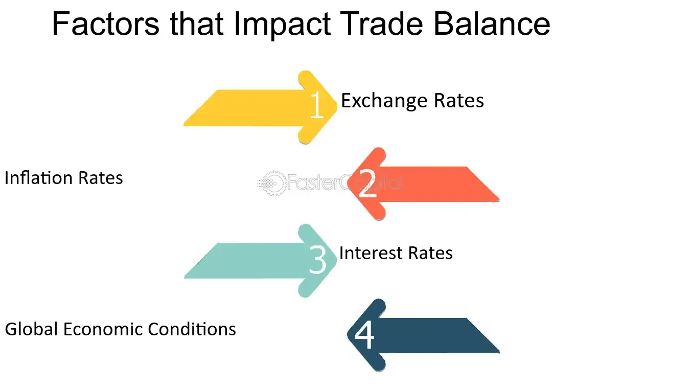

## Table of Contents

## What is a trade balance?

A trade balance is the difference between the value of a country's exports and the value of its imports over a certain period, usually a year. If a country exports more than it imports, it has a trade surplus. This means the country is selling more goods and services to other countries than it is buying from them. On the other hand, if a country imports more than it exports, it has a trade deficit. This means the country is buying more from other countries than it is selling to them.

The trade balance is an important indicator of a country's economic health. A trade surplus can be a sign of a strong economy because it shows that the country's goods and services are in demand globally. However, a trade deficit isn't always bad. It can mean that the country's consumers have enough money to buy more foreign goods. But if the deficit is too large, it might lead to problems like a weaker currency or more debt. Governments and economists watch the trade balance closely to make decisions about economic policies.

## What are exchange rates?

Exchange rates are the prices at which one country's currency can be traded for another country's currency. For example, if you want to buy something from another country, you need to exchange your money for their money. The exchange rate tells you how much of your money you need to give to get one unit of their money. If the exchange rate between the US dollar and the Euro is 1:0.85, it means you need to give 1 US dollar to get 0.85 Euros.

Exchange rates change all the time because they are influenced by many things like the economic strength of a country, interest rates, and how much people want to buy or sell that currency. If a country's economy is doing well, its currency usually becomes more valuable, and the exchange rate goes up. On the other hand, if a country's economy is not doing well, its currency might become less valuable, and the exchange rate goes down. This can affect how much it costs to buy things from other countries and can impact international trade.

## How does a trade surplus affect a country's currency?

A trade surplus usually makes a country's currency stronger. When a country has a trade surplus, it means they are selling more stuff to other countries than they are buying. This makes other countries need more of that country's money to buy their products. So, the demand for the currency goes up, and when more people want something, its value usually goes up too.

A stronger currency can be good because it shows that the country's economy is doing well. But it can also make the country's products more expensive for other countries to buy. This might make it harder to keep the trade surplus going because other countries might start buying less. So, while a trade surplus can help make a currency stronger, it's important for countries to watch how this affects their trade with other countries.

## How does a trade deficit influence a country's currency?

A trade deficit happens when a country buys more stuff from other countries than it sells to them. This can make the country's currency weaker. When a country has a trade deficit, it needs to use more of its own money to buy things from other places. This means there's more of its currency out there, and when there's more of something, it usually becomes less valuable. So, the value of the currency can go down because there's more of it floating around.

A weaker currency isn't always bad. It can make the country's products cheaper for other countries to buy, which might help the country sell more stuff and maybe even turn the trade deficit into a surplus. But if the currency gets too weak, it can cause problems like making it more expensive for the country to buy things from other places. This can make prices go up at home, which is called inflation. So, a trade deficit can lead to a weaker currency, and it's important for countries to keep an eye on this to make sure it doesn't cause too many problems.

## What role do imports and exports play in determining exchange rates?

Imports and exports are really important when it comes to figuring out exchange rates. When a country exports a lot, it means other countries need to buy their stuff. To do this, they need to get the exporting country's money. So, if a country is exporting more, the demand for its currency goes up. This usually makes the currency stronger because more people want it. On the other hand, if a country is importing a lot, it means they are buying stuff from other places. They need to use their own money to buy these things, which can make their currency less valuable because there's more of it out there.

The balance between imports and exports, called the trade balance, is a big deal for exchange rates. If a country has a trade surplus, meaning they export more than they import, their currency tends to get stronger. This is because other countries need more of that currency to buy the stuff they want. But if a country has a trade deficit, meaning they import more than they export, their currency can get weaker. This happens because they are using more of their own money to buy things from other places, which makes their currency less valuable. So, the more a country exports compared to what it imports, the stronger its currency can become.

## Can you explain the concept of purchasing power parity in relation to trade balance and exchange rates?

Purchasing power parity (PPP) is a way to compare how much things cost in different countries. It looks at how much money you need in one country to buy the same stuff you can buy in another country. If a burger costs $5 in the US and the same burger costs 4 Euros in Europe, PPP says the exchange rate should be about 1 US dollar to 0.8 Euros. This helps us understand if a country's currency is too strong or too weak compared to another country's currency.

PPP is important when we talk about trade balance and exchange rates. If a country's currency is stronger than what PPP suggests, it might make their exports more expensive and imports cheaper. This could lead to a trade deficit because other countries might buy less from them. On the other hand, if a country's currency is weaker than what PPP suggests, their exports could be cheaper and imports more expensive, which might help them have a trade surplus. So, PPP helps us see how exchange rates should be to keep trade balanced and fair between countries.

## How do interest rates interact with trade balance to affect exchange rates?

Interest rates play a big role in how a country's currency value changes, and this can affect the trade balance. When a country's interest rates go up, it can attract more money from other countries. People want to put their money where they can get a better return, so they exchange their money for the country's currency to invest there. This increased demand for the currency can make it stronger. A stronger currency might make a country's exports more expensive for other countries to buy, which could lead to a smaller trade surplus or even a trade deficit.

On the other hand, if a country's interest rates go down, it might make their currency less attractive to investors. When interest rates are low, people might move their money to other countries where they can get a better return. This can make the demand for the country's currency go down, making it weaker. A weaker currency can make a country's exports cheaper and more attractive to other countries, which might help increase exports and improve the trade balance towards a surplus. So, interest rates can influence exchange rates, which in turn can affect how much a country imports and exports.

## What is the J-curve effect and how does it relate to trade balance and exchange rates?

The J-curve effect is a way to describe what happens to a country's trade balance right after its currency value changes. Imagine a country's currency suddenly becomes weaker. You might think this would make their exports cheaper and their imports more expensive, so they should sell more and buy less, leading to a better trade balance. But right after the currency weakens, the opposite can happen. The trade balance might actually get worse before it gets better. This is because prices for exports and imports don't change right away. It takes time for people to adjust to the new prices, so the trade balance forms a shape like the letter "J" on a graph.

The J-curve effect shows how the trade balance can dip down before it starts to improve. At first, even though the currency is weaker, the country might still be paying the same high prices for imports they ordered before the change. And the people who ordered the country's exports might not have realized the price went down yet, so they're still buying the same amount. But over time, as everyone adjusts to the new prices, the country's exports start to go up because they're cheaper, and imports go down because they're more expensive. This eventually leads to a better trade balance. So, the J-curve effect helps explain why a weaker currency doesn't immediately fix a trade deficit, but it can help in the long run.

## How do government policies and interventions impact the relationship between trade balance and exchange rates?

Government policies and interventions can really change how a country's trade balance and exchange rates work together. If a government wants to make its currency stronger, it might raise interest rates or buy its own currency in the foreign exchange market. This can make the currency more valuable, which might make exports more expensive and imports cheaper. This could lead to a trade deficit because other countries might buy less from them. On the other hand, if a government wants to make its currency weaker, it might lower interest rates or sell its own currency. This can make the currency less valuable, which might make exports cheaper and imports more expensive, possibly leading to a trade surplus.

Sometimes, governments use other policies to affect trade balance and exchange rates. For example, they might put tariffs on imports to make them more expensive and encourage people to buy more local products. This can help improve the trade balance by reducing imports. Governments might also give subsidies to their exporters to make their products cheaper on the world market, which can increase exports and help create a trade surplus. All these actions can change how much a country's currency is worth and how it trades with other countries, showing how closely linked government policies, trade balance, and exchange rates are.

## What are the long-term versus short-term effects of trade balance on exchange rates?

In the short term, changes in a country's trade balance can have a quick but sometimes confusing effect on its exchange rates. If a country suddenly starts exporting more and importing less, you might think its currency would get stronger right away. But because of things like the J-curve effect, the trade balance might actually get worse at first. This is because prices for exports and imports don't change immediately. It takes time for people to adjust to new prices, so the currency might not get stronger right away. Instead, it might stay the same or even get a bit weaker until everyone catches up with the new prices.

In the long term, the trade balance usually has a clearer impact on exchange rates. If a country keeps exporting more than it imports, it will likely see its currency get stronger over time. This happens because other countries need more of that currency to buy the stuff they want. On the other hand, if a country keeps importing more than it exports, its currency might get weaker over time. This is because they're using more of their own money to buy things from other places, which can make their currency less valuable. So, while the short-term effects can be a bit tricky, the long-term effects of trade balance on exchange rates are usually more straightforward.

## How do global economic conditions influence the impact of trade balance on exchange rates?

Global economic conditions can really change how a country's trade balance affects its exchange rates. If the world economy is doing well, countries might buy more stuff from each other. This can make a country's currency stronger if they are selling a lot. But if the global economy is not doing well, countries might buy less, which can make a country's currency weaker even if they have a good trade balance. Things like global interest rates, economic growth, and even big events like wars or pandemics can change how much other countries want to buy or sell, which affects exchange rates.

For example, if there's a global economic crisis, a country might still have a trade surplus, but their currency might not get as strong as it would in good times. This is because other countries are not buying as much, so the demand for the currency is lower. On the other hand, if the world economy is booming, a country with a trade deficit might not see their currency get as weak because other countries are still buying a lot. So, global economic conditions can make the relationship between trade balance and exchange rates more complicated, showing that what happens in the world can be just as important as what happens in one country.

## Can you discuss advanced econometric models used to predict the impact of trade balance on exchange rates?

Advanced econometric models help economists predict how a country's trade balance affects its exchange rates. One popular model is the Vector Autoregression (VAR) model. This model looks at how different economic factors, like trade balance, interest rates, and inflation, all affect each other over time. By using past data, the VAR model can show how a change in the trade balance might change the exchange rate in the future. It's like looking at a big puzzle and figuring out how all the pieces fit together. Economists use these models to make better guesses about what might happen next, which can help governments and businesses plan better.

Another useful model is the Error Correction Model (ECM). This model is good at showing how exchange rates might go back to normal after they've been thrown off by changes in the trade balance. Imagine you push a ball into water; it might go down, but then it comes back up to the surface. The ECM helps us understand this kind of movement in exchange rates. It looks at both short-term changes and long-term trends, so it can tell us if a big change in the trade balance will have a lasting effect on the exchange rate or if things will just go back to how they were before. By using these advanced models, economists can get a clearer picture of what might happen to exchange rates when the trade balance changes.

## References & Further Reading

[1]: Bergstra, J., Bardenet, R., Bengio, Y., & Kégl, B. (2011). ["Algorithms for Hyper-Parameter Optimization."](https://papers.nips.cc/paper/4443-algorithms-for-hyper-parameter-optimization) Advances in Neural Information Processing Systems 24.

[2]: ["Advances in Financial Machine Learning"](https://www.amazon.com/Advances-Financial-Machine-Learning-Marcos/dp/1119482089) by Marcos Lopez de Prado

[3]: ["Evidence-Based Technical Analysis: Applying the Scientific Method and Statistical Inference to Trading Signals"](https://www.amazon.com/Evidence-Based-Technical-Analysis-Scientific-Statistical/dp/0470008741) by David Aronson

[4]: ["Machine Learning for Algorithmic Trading"](https://github.com/stefan-jansen/machine-learning-for-trading) by Stefan Jansen

[5]: ["Quantitative Trading: How to Build Your Own Algorithmic Trading Business"](https://www.amazon.com/Quantitative-Trading-Build-Algorithmic-Business/dp/1119800064) by Ernest P. Chan