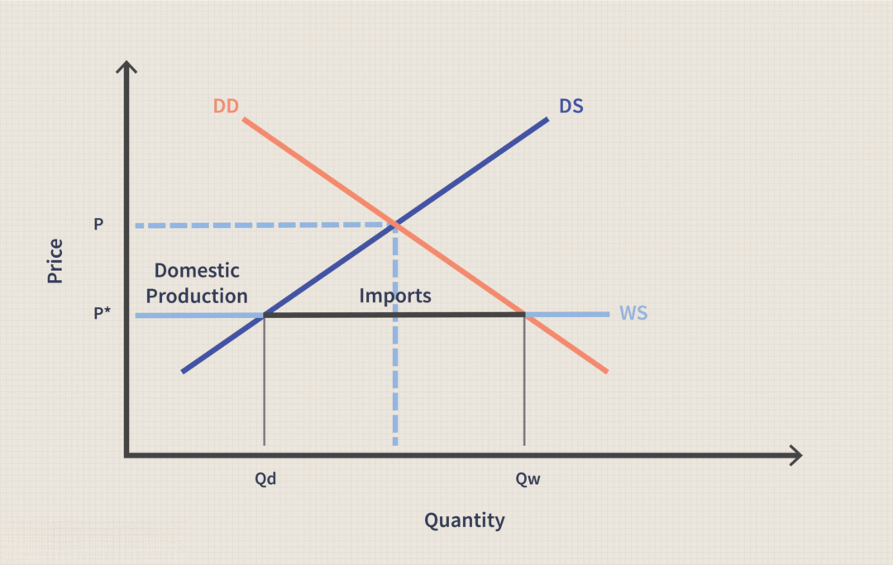

## Table of Contents

## What is a trade deficit?

A trade deficit happens when a country buys more things from other countries than it sells to them. Imagine you're trading with your friends. If you keep taking more toys from them than you give away, you have a trade deficit with your friends. For countries, this means they import more goods and services than they export.

Having a trade deficit isn't always bad. It can mean that people in the country can buy more things from around the world, which can make life better for them. But if it goes on for a long time, it might make the country's money weaker and could lead to fewer jobs in places that make things to sell. So, countries often try to balance their trade to keep their economy strong.

## How is the trade deficit measured?

The trade deficit is measured by looking at the difference between what a country exports and what it imports over a certain time, usually a year. Exports are things a country sells to other countries, and imports are things it buys from them. If a country exports less than it imports, it has a trade deficit. To find out the exact number, you subtract the value of exports from the value of imports.

This measurement is often shown in a country's balance of trade, which is part of its overall balance of payments. The balance of payments is like a big report that shows all the money coming in and going out of a country. Economists and governments use this information to understand how well the country is doing in global trade. If the trade deficit is big, it might mean the country needs to find ways to sell more of its own products abroad or buy less from other countries.

## What causes a trade deficit?

A trade deficit can happen for many reasons. One big reason is that people in a country might want to buy more things from other countries than they can make themselves. This could be because things from other places are cheaper or better quality. Another reason is that the country's own money might be strong, making it cheaper for its people to buy things from abroad, but more expensive for other countries to buy things from them.

Sometimes, a country might not be making enough things to sell to other countries. This can happen if it doesn't have the right factories or if its workers aren't as good at making certain things as workers in other countries. Also, if a country's economy is growing fast, it might need to buy more from other countries to keep up with the growth, leading to a bigger trade deficit.

In the end, a trade deficit is not just about buying and selling things. It's also affected by things like government rules, how much people in the country are spending, and what's happening in the rest of the world. For example, if other countries are doing well, they might buy more from the country, which can help reduce the trade deficit. But if they're not doing well, they might buy less, making the trade deficit bigger.

## How does a trade deficit affect the U.S. economy?

A trade deficit can have different effects on the U.S. economy. When the U.S. buys more from other countries than it sells to them, it means more money is going out of the country than coming in. This can make the U.S. dollar weaker over time because there's less demand for it. A weaker dollar can make things from other countries more expensive for Americans to buy, which might help reduce the trade deficit. But it can also make things made in the U.S. cheaper for other countries to buy, which could be good for U.S. businesses that sell abroad.

On the other hand, a trade deficit can lead to fewer jobs in the U.S. because companies might move their factories to other countries where they can make things cheaper. This can hurt the people who used to work in those factories. But it's not all bad. A trade deficit can also mean that Americans have more choices and can buy things from around the world that they might not be able to get otherwise. So, while a trade deficit can be a problem, it's not always a bad thing, and it depends on how the U.S. manages it and what else is happening in the economy.

## What is the relationship between the trade deficit and the U.S. dollar?

When the U.S. has a trade deficit, it means the country is buying more from other countries than it's selling to them. This can make the U.S. dollar weaker because there's less demand for it. When the dollar is weak, it costs more for Americans to buy things from other countries. But it also makes things made in the U.S. cheaper for other countries to buy, which can help U.S. businesses that sell abroad.

A weaker dollar isn't always bad. It can help the U.S. sell more things to other countries, which might help reduce the trade deficit over time. But if the dollar stays weak for a long time, it can make life harder for Americans because everything they buy from other countries costs more. So, the trade deficit and the value of the U.S. dollar are closely linked, and changes in one can affect the other in big ways.

## How does a trade deficit influence the value of the U.S. dollar?

A trade deficit means the U.S. is buying more things from other countries than it's selling to them. This can make the U.S. dollar weaker because there's less demand for it. When the dollar is weak, it's cheaper for other countries to buy things made in the U.S., but it costs more for Americans to buy things from other countries. So, a trade deficit can make the dollar go down in value.

But a weaker dollar isn't always a bad thing. It can help U.S. businesses sell more things to other countries because their products are cheaper for foreigners to buy. This might help reduce the trade deficit over time. However, if the dollar stays weak for a long time, it can make life harder for Americans because everything they buy from other countries costs more. So, the trade deficit and the value of the U.S. dollar are closely linked, and changes in one can affect the other.

## Can a trade deficit lead to a depreciation of the U.S. dollar?

A trade deficit can lead to a depreciation of the U.S. dollar. When the U.S. buys more from other countries than it sells to them, it means more dollars are going out of the country than coming in. This can make the dollar less valuable because there's less demand for it. If other countries see that the U.S. is spending more dollars than it's getting back, they might not want to hold onto dollars as much, which can make the dollar weaker.

A weaker dollar can have both good and bad effects. On the good side, it makes things made in the U.S. cheaper for other countries to buy, which can help U.S. businesses sell more abroad and maybe even reduce the trade deficit over time. But on the bad side, a weaker dollar means it costs more for Americans to buy things from other countries. If the dollar stays weak for a long time, it can make life harder for people in the U.S. because everything they import becomes more expensive.

## What role do foreign investors play in the U.S. trade deficit and dollar value?

Foreign investors can help keep the U.S. dollar strong even when there's a trade deficit. When the U.S. buys more from other countries than it sells, it needs to pay for those things with dollars. If foreign investors want to buy U.S. things like stocks, bonds, or property, they need dollars too. So, they might keep buying dollars, which can help stop the dollar from getting weaker. This means that even if the U.S. has a big trade deficit, the dollar might not go down in value as much because foreign investors are still using it.

But if foreign investors start to think the U.S. dollar is too weak or that the trade deficit is too big, they might decide to sell their dollars and buy another country's money instead. If lots of foreign investors do this at the same time, it can make the U.S. dollar go down in value even more. So, what foreign investors do can have a big effect on the U.S. trade deficit and the value of the dollar. If they keep buying dollars, it can help, but if they start selling, it can make things worse.

## How have historical trends of the U.S. trade deficit impacted the dollar?

Over the years, the U.S. has often had a trade deficit, which means it buys more from other countries than it sells to them. This can make the dollar weaker because there's less demand for it. For example, in the 1980s, the U.S. had a big trade deficit, and the dollar got weaker. But during that time, foreign investors still wanted to buy U.S. things like stocks and bonds, which helped keep the dollar from getting too weak. So, even with a trade deficit, the dollar didn't fall as much as it could have because foreign investors were still using dollars.

In the early 2000s, the U.S. trade deficit grew even bigger, but the dollar didn't fall right away. Foreign countries, especially China, were buying a lot of U.S. dollars to keep their own money from getting too strong. This helped keep the U.S. dollar stable for a while. But when the 2008 financial crisis hit, many investors started to worry about the U.S. economy and sold their dollars, making the dollar weaker. So, while a trade deficit can push the dollar down, what foreign investors do can make a big difference in how much the dollar changes.

## What are the long-term implications of a persistent trade deficit on the U.S. dollar?

A long-term trade deficit can make the U.S. dollar weaker over time. When the U.S. keeps buying more from other countries than it sells to them, it means more dollars are going out than coming in. This can make people think the dollar is not as valuable, so they might want to use other countries' money instead. If the dollar stays weak for a long time, it can make things from other countries more expensive for Americans to buy. But it can also make things made in the U.S. cheaper for other countries to buy, which might help U.S. businesses sell more abroad.

Even though a trade deficit can make the dollar weaker, foreign investors can change things. If they keep buying U.S. things like stocks and bonds, they need dollars, which can help keep the dollar from getting too weak. But if they start to worry about the U.S. economy or think the dollar is too weak, they might sell their dollars and buy another country's money instead. This can make the dollar go down even more. So, while a long-term trade deficit can push the dollar down, what foreign investors do can make a big difference in how the dollar does over time.

## How do economic policies aimed at reducing the trade deficit affect the U.S. dollar?

Economic policies that try to reduce the trade deficit can make the U.S. dollar stronger. When the government makes rules to help the country sell more things to other countries, it means more people want to buy dollars to pay for those things. For example, if the government gives money to businesses that make things to sell abroad, those businesses can make more stuff and sell it to other countries. This can make the dollar go up in value because more people want to use it.

But these policies can also have other effects. If the government makes it harder for people to buy things from other countries, like by putting taxes on imports, it can make the dollar stronger too. But this might also make things more expensive for people in the U.S. because they have to pay more for things from other countries. So, while these policies can help the dollar, they can also make life harder for Americans if everything they buy from abroad costs more.

## What are the global economic consequences of changes in the U.S. dollar value due to trade deficits?

When the U.S. dollar changes because of trade deficits, it can affect the whole world's economy. If the dollar gets weaker, things made in the U.S. become cheaper for other countries to buy. This can help U.S. businesses sell more stuff abroad, but it can also make things from other countries more expensive for Americans. Other countries might find it harder to sell their things to the U.S. because their stuff costs more in dollars. This can make their economies grow slower if they rely a lot on selling to the U.S.

On the other hand, if the dollar gets stronger because of policies to reduce the trade deficit, it can make things from other countries cheaper for Americans to buy. But it can also make things made in the U.S. more expensive for other countries, which might make them buy less from the U.S. This can hurt U.S. businesses that sell abroad. Also, if the dollar is strong, other countries might find it harder to pay back loans they took out in dollars because they need more of their own money to buy the same amount of dollars. This can cause problems in their economies too.

## References & Further Reading

[1]: ["The U.S. Trade Deficit: Are We Trading Away Our Future?"](https://www.epi.org/publication/webfeatures_viewpoints_tradetestimony/) by the Congressional Research Service

[2]: ["The Impact of Algorithmic Trading on Market Liquidity"](https://www.sciencedirect.com/science/article/pii/S0927538X16300956) published by the European Securities and Markets Authority (ESMA)

[3]: ["International Economics"](https://en.wikipedia.org/wiki/International_economics) by Paul Krugman and Maurice Obstfeld

[4]: ["Exchange Rate Dynamics"](https://www.nber.org/system/files/chapters/c6834/c6834.pdf) by Martin D. D. Evans

[5]: ["Algorithmic Trading and DMA: An Introduction to Direct Access Trading Strategies"](https://www.amazon.com/Algorithmic-Trading-DMA-introduction-strategies/dp/0956399207) by Barry Johnson