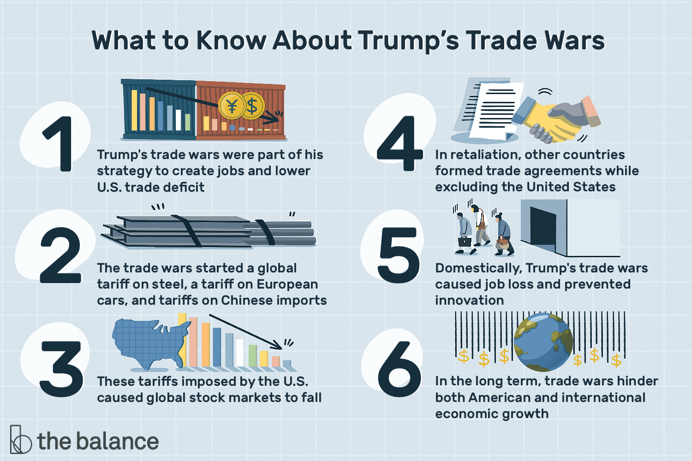

## Table of Contents

## What is a trade war?

A trade war is when two or more countries fight over trade by putting taxes on each other's goods. These taxes are called tariffs. When one country puts a tariff on another country's goods, it makes those goods more expensive. This can make people in the first country buy less of those goods. The other country might then put tariffs on the first country's goods in response. This back-and-forth can escalate into a trade war.

Trade wars can hurt both countries involved. They can lead to higher prices for consumers, fewer choices of goods, and less trade between countries. Businesses might struggle because their goods are more expensive in other countries. This can lead to fewer jobs and slower economic growth. Sometimes, trade wars can also lead to political tensions between countries. Overall, trade wars can have negative effects on the economies of the countries involved and the global economy.

## How do trade wars start?

Trade wars usually start when one country feels that another country is not playing fair in trade. This can happen if a country thinks that another country is selling goods at very low prices to take over the market. To protect their own businesses, the first country might decide to put a tax, called a tariff, on the goods coming from the other country. This makes the goods more expensive and less attractive to buyers.

Once the first country puts a tariff on the other country's goods, the second country might get angry and decide to put tariffs on the first country's goods too. This back-and-forth can quickly turn into a trade war. Both countries keep adding more tariffs, trying to protect their own businesses but hurting each other in the process.

Sometimes, trade wars can also start because of political disagreements between countries. If two countries are not getting along well, they might use trade as a way to fight each other. By putting tariffs on each other's goods, they try to pressure the other country into changing its behavior. This can lead to a cycle of retaliation and more tariffs, turning into a full-blown trade war.

## What are the immediate effects of trade wars on everyday consumers?

When trade wars start, everyday consumers often feel the effects right away. The main thing they notice is that prices for some things go up. This happens because when one country puts a tax, or tariff, on goods from another country, those goods become more expensive. For example, if there's a trade war and your country puts a tariff on cars from another country, those cars will cost more money. This means consumers have to pay more to buy the same things they used to buy.

Another immediate effect is that consumers might have fewer choices. When goods from other countries become more expensive because of tariffs, stores might stop selling them. This means that consumers can't buy the same variety of products they used to. They might have to switch to different brands or products that are made in their own country. This can be frustrating because people like having options and might not like the new choices as much.

## How do trade wars affect the prices of goods and services?

Trade wars make things more expensive for people. When a country puts a tax, called a tariff, on goods from another country, it makes those goods cost more. For example, if your country puts a tariff on toys from another country, those toys will be more expensive in stores. This means people have to spend more money to buy the same things they used to buy. It's like if you wanted to buy a toy that used to cost $10, but now it costs $15 because of the tariff.

Trade wars can also make the prices of services go up. When goods are more expensive, the businesses that use those goods to provide services have to pay more too. For example, if a restaurant uses a lot of ingredients that come from another country, and those ingredients get more expensive because of tariffs, the restaurant might have to raise the prices of their meals. This means that going out to eat could cost more money. So, trade wars can make both the things people buy and the services they use more expensive.

## What industries are most impacted by trade wars?

Trade wars hit some industries harder than others. The industries that make things like cars, electronics, and clothes are often the most affected. These industries rely a lot on parts and materials from other countries. When tariffs make these parts more expensive, it costs more to make the final products. This can mean higher prices for customers and fewer sales for the companies. For example, if a car company uses steel from another country, and that steel gets more expensive because of tariffs, the cars they make will cost more.

Farmers are also really affected by trade wars. Many countries trade a lot of food with each other. When tariffs go up, it can be hard for farmers to sell their crops and animals to other countries. This can lead to lower prices for their products at home because there's too much supply and not enough demand. Farmers might struggle to make money and keep their farms running. For example, if a country puts tariffs on soybeans from another country, the farmers growing those soybeans will have a harder time selling them abroad.

Other industries that can be hit hard by trade wars include technology and energy. Tech companies often use parts from all over the world to make things like computers and smartphones. If tariffs make these parts more expensive, it can slow down innovation and raise prices for consumers. In the energy sector, tariffs on things like oil and gas can lead to higher energy costs for everyone. This can affect everything from the price of gas at the pump to the cost of heating homes. Trade wars can make life harder for many different industries and the people who work in them.

## How do trade wars influence employment and job security?

Trade wars can make it harder for people to keep their jobs. When countries put taxes on each other's goods, it can make those goods more expensive. This means that businesses might sell fewer products because people don't want to pay the higher prices. When businesses sell less, they might need fewer workers. This can lead to layoffs, where people lose their jobs. For example, if a factory makes cars and the parts for those cars get more expensive because of tariffs, the factory might have to let some workers go because they can't afford to keep everyone.

Trade wars can also make it harder for people to feel secure about their jobs. When businesses are worried about selling less because of tariffs, they might be less likely to hire new workers. This means that people looking for jobs might have a harder time finding work. Even people who already have jobs might feel worried about losing them if their company is struggling. This uncertainty can make people feel stressed and less confident about their future. For example, if a company that makes clothes is worried about selling less because of tariffs, they might not hire new workers and current employees might worry about their job security.

## What are the long-term economic consequences of trade wars for individuals?

Trade wars can have big effects on people's lives over a long time. When countries keep fighting over trade, it can make things more expensive for a long time. This means people have to spend more money on things they need, like food and clothes. If prices stay high, people might not be able to save as much money. This can make it harder for them to buy a house or save for retirement. Also, if businesses keep struggling because of trade wars, they might not grow or start new projects. This can mean fewer new jobs and less chance for people to move up in their careers.

Over time, trade wars can also make it harder for people to feel secure about their jobs. If businesses are always worried about selling less because of tariffs, they might not hire as many new workers. This can make it tough for people to find good jobs. Even people who already have jobs might worry about losing them if their company is doing badly. This uncertainty can make people feel stressed and less confident about their future. In the end, trade wars can make life harder for individuals by making things more expensive, reducing job opportunities, and creating a lot of uncertainty.

## How do trade wars affect global supply chains and what does this mean for individuals?

Trade wars mess up the way things are made and moved around the world. When countries put taxes on each other's goods, it can make it harder for businesses to get the parts they need. For example, if a company makes phones and the parts come from different countries, tariffs can make those parts more expensive. This can slow down how fast the company can make phones and make them cost more. When supply chains get messed up, it can take longer for things to get from the factory to the store. This means people might have to wait longer to buy the things they want or need.

For individuals, messed-up supply chains can mean higher prices and fewer choices. When it's harder for businesses to get the parts they need, they might have to charge more for their products. This can make everyday things like clothes and electronics more expensive. Also, if it takes longer for things to get to stores, people might not be able to find what they want right away. This can be frustrating and make life harder, especially if people are trying to save money or need something quickly. In the end, trade wars can make it tougher for people to get the things they need at a good price.

## Can trade wars lead to changes in consumer behavior and if so, how?

Trade wars can make people change how they buy things. When things get more expensive because of tariffs, people might start looking for cheaper options. They might switch to buying things made in their own country instead of buying things from other countries. For example, if a trade war makes imported toys more expensive, people might start buying toys made at home. People might also start buying less of some things. If the prices go up a lot, they might decide they don't need as many new clothes or gadgets and try to save money instead.

These changes can also affect how people think about shopping. When prices keep going up because of trade wars, people might start to be more careful with their money. They might look for sales and discounts more often or buy things in bulk to save money. People might also start to pay more attention to where things come from and choose to support local businesses more. Over time, trade wars can make people change their shopping habits a lot, trying to deal with higher prices and fewer choices.

## What strategies can individuals use to mitigate the negative impacts of trade wars?

When trade wars make things more expensive, people can try to save money by looking for cheaper options. They can shop around and compare prices to find the best deals. Buying things on sale or using coupons can help too. People might also choose to buy things made in their own country instead of buying imports that have gotten more expensive because of tariffs. This can help support local businesses and might even save money. Another way to save is by buying things in bulk when they go on sale, which can be cheaper in the long run.

People can also change how they spend their money to deal with trade wars. They might decide to spend less on things they don't really need, like new clothes or gadgets, and save more money for important things like food and bills. Planning ahead and making a budget can help people manage their money better during tough times. It's also a good idea to keep an eye on the news and learn about what's happening with trade wars, so they can make smart choices about what to buy and when. By being careful with their money and making smart choices, people can handle the effects of trade wars better.

## How do trade wars affect different socio-economic groups within a country?

Trade wars can hit different groups of people in different ways. For people who don't have a lot of money, trade wars can make life really hard. When prices go up because of tariffs, these people might struggle to buy the things they need, like food and clothes. They might have to cut back on other things, like going out or buying new things, just to make ends meet. This can make them feel stressed and worried about money.

For people who have more money, trade wars might not be as big of a problem. They might still feel the effects, like higher prices for some things, but they can usually afford to keep buying what they need. They might even be able to take advantage of the situation by buying things made in their own country or looking for deals. But even for them, trade wars can cause uncertainty and worry about the future, especially if they own businesses or work in industries that are affected by the tariffs.

## What are the geopolitical implications of trade wars and how do they indirectly affect individuals?

Trade wars can cause big problems between countries. When countries fight over trade by putting taxes on each other's goods, it can make them angry at each other. This can lead to more than just trade problems; it can affect how countries work together on other things too. For example, if two countries are in a trade war, they might not want to help each other with things like fighting climate change or dealing with global health issues. This can make the world a less friendly place and make it harder for countries to solve big problems together.

These geopolitical tensions can indirectly affect individuals in many ways. When countries don't get along because of trade wars, it can make people feel worried about the future. For example, if two big countries are fighting over trade, it might make people in other countries worry about their own economy and safety. Also, if countries stop working together on important issues, it can mean slower progress on things like protecting the environment or stopping diseases from spreading. This can make life harder for everyone, even if they don't live in the countries directly involved in the trade war.

## References & Further Reading

[1]: Barboza, G., & Cushing, B. (2011). ["U.S.-China Trade War: Tariff Data and General Equilibrium Simulations."](https://www.semanticscholar.org/paper/The-U.S.%E2%80%93China-trade-war%3A-Tariff-data-and-general-Li-Balistreri/f107bb8cd25852f5c8b759a64e0c85e38ee721b1) Global Economic Journal.

[2]: Krugman, P., & Obstfeld, M. (2018). ["International Economics: Theory and Policy."](https://www.pearson.com/se/Nordics-Higher-Education/subject-catalogue/economics/International-Economics-Theory-and-Policy-Krugman.html) Pearson. 

[3]: Hull, J. C. (2021). ["Options, Futures, and Other Derivatives."](https://elibrary.pearson.de/book/99.150005/9781292410623) Pearson.

[4]: Baldwin, R., & Evenett, S. J. (2020). ["COVID-19 and Trade Policy: Why Turning Inward Won't Work."](https://cepr.org/publications/books-and-reports/covid-19-and-trade-policy-why-turning-inward-wont-work) VoxEU eBook.

[5]: ["Economics of Trade Wars"](https://egc.yale.edu/research/economic-impacts-us-china-trade-war) by Nuno Limão, National Bureau of Economic Research.

[6]: ["Principles of Algorithmic Trading"](https://www.investopedia.com/articles/active-trading/101014/basics-algorithmic-trading-concepts-and-examples.asp) by Paul Cottrell.

[7]: Moses, M. (2020). ["The Role of Algorithmic Trading in Financial Markets."](https://ieeexplore.ieee.org/document/10379947) SSRN Electronic Journal.

[8]: Sengupta, R., & Keane, M. (2019). ["US-China Trade Spillovers and Key US Trading Partners."](https://eprints.whiterose.ac.uk/143843/1/BJM_SI_BigData_2019.pdf). Federal Reserve Bank of Kansas City Economic Bulletin.

[9]: Tankov, P. (2015). ["Algorithmic and High-Frequency Trading."](https://assets.cambridge.org/97811070/91146/frontmatter/9781107091146_frontmatter.pdf) Palgrave Macmillan.

[10]: ["Determinants of Protectionist Policies: The Case of US-China Trade Frictions"](https://www.tandfonline.com/doi/full/10.1080/0163660X.2024.2366109) by Kishore, N., & Swanson, O., European Economic Review.