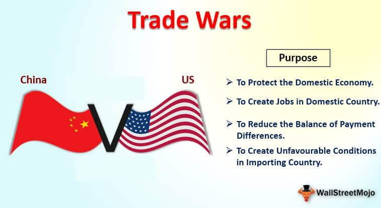

The global economy is witnessing significant shifts due to the evolving dynamics between the United States and China, two of the world's largest economic powers. Central to this evolving relationship is the ongoing trade war, a series of economic conflicts characterized by the imposition of tariffs and other trade barriers. These measures are often employed by countries in a bid to protect their domestic industries or retaliate against what they perceive as unfair trade practices by their counterparts. 

At the core of these trade wars are complex economic interactions that extend beyond mere tariff implementations. The repercussions of such conflicts are far-reaching, affecting not just the nations directly involved but also having a cascading impact on consumers, businesses, and global supply chains worldwide. Consumers may experience increased prices for everyday goods as tariffs raise import costs, which are often passed down through the supply chain. Businesses, particularly those with reliance on international trade, face challenges such as disrupted supply chains and increased production costs, necessitating strategic adaptations.



This article seeks to explore the multifaceted effects of trade wars, focusing not only on the immediate economic impacts but also on how these conflicts influence longer-term strategies and relationships in international trade. An emerging dimension of this discussion is the role of algorithmic trading, which interacts dynamically with market fluctuations induced by trade wars. Algorithmic trading systems, designed to respond swiftly to changes in market conditions and news events, are increasingly relevant as they adjust portfolios in response to trade-related developments, adding an additional layer of complexity to financial markets.

By understanding these components—trade wars, their economic impact, and the role of algorithmic trading—we can gain valuable insights into future economic strategies and international trade relations. Such an understanding is critical for navigating the complexities of today's interconnected global economy and for anticipating the long-term outcomes of current trade tensions.

## Table of Contents

## Understanding Trade Wars

Trade wars occur when countries adopt retaliatory measures such as tariffs, quotas, and other trade barriers on imports and exports. These measures are typically used to protect domestic industries from foreign competition or in response to perceived unfair trade practices by another country. A prominent example is the 2018 trade war between the United States and China, where both nations imposed significant tariffs on each other's products. This conflict was marked by substantial economic repercussions, affecting global trade and political relations.

The primary motivations for engaging in trade wars include issues related to intellectual property theft, trade imbalances, and protectionist policies. For instance, concerns about the theft of intellectual property have been a major sticking point in U.S.-China trade relations. The United States has accused China of not adequately protecting foreign intellectual property rights, leading to significant losses for American companies. Additionally, trade deficits, where one country imports more than it exports to another, often drive nations to engage in trade wars to rebalance their economic exchanges.

Protectionism, the economic policy of restricting imports to shield domestic industries from foreign competition, is another key driver of trade wars. While such policies aim to bolster local economies and jobs, they often result in higher prices for consumers as the costs of tariffs on imported goods are passed down through the supply chain. This can lead to inflationary pressures within the domestic market, reducing consumer purchasing power and potentially leading to decreased economic growth.

Moreover, trade wars can alter global trade patterns by compelling companies to reconfigure their supply chains. Businesses may seek alternative markets or suppliers to avoid the costs associated with tariffs. For instance, during the U.S.-China trade war, some companies considered relocating manufacturing operations to countries not directly involved in the conflict to circumvent the increased costs. This shift in supply chains not only affects the countries involved in the trade war but also has global economic implications, as production and trade routes are rearranged to adapt to new economic realities.

In summary, trade wars are complex economic conflicts that arise from a combination of factors including protectionism, intellectual property issues, and trade imbalances. While they aim to protect domestic industries, trade wars often lead to increased consumer costs and transformation in international trade dynamics, necessitating strategic adaptation by businesses worldwide.

## Economic Impact of Trade Wars

Trade wars exert a significant economic impact that reverberates well beyond the countries directly involved, influencing global markets and supply chains comprehensively. A prominent example is the U.S.-China trade war, initiated in 2018, which has considerably increased costs for businesses engaged in cross-border trade. These costs arise primarily from the additional tariffs imposed on billions of dollars worth of goods, compelling businesses to either absorb the increased expenses or pass them on to consumers, resulting in higher prices for goods and services.

The economic repercussions of trade wars are not restricted to tariff-related cost increases. They also extend to disruptions in global supply chains, causing inefficiencies and delays for businesses that depend on international operations. With tariffs complicating existing trade routes, companies may need to source materials from alternate suppliers, which can lead to logistical challenges and increased lead times. This reconfiguration of supply chains often triggers a domino effect, impacting production schedules and inventory management across various sectors.

Additionally, trade wars prompt countries to reassess their international trade strategies. To mitigate adverse effects, nations may explore alternative trade alliances or adjust their economic policies. These adjustments may include negotiating new trade agreements to bypass tariffs, or investing in domestic industries to reduce dependence on foreign imports. For instance, in response to tariff pressures, businesses might seek new markets with countries not directly involved in the trade war, thereby altering global trade patterns.

The strategic redirection of trade alliances and economic policies underscores the need for countries to be adaptable and proactive in addressing the challenges posed by trade wars. By doing so, nations aim to cushion their economies from the direct and collateral impacts of these conflicts, striving for stability and sustained growth amidst the complex global economic landscape.

## Algorithmic Trading and Trade Wars

Algorithmic trading, commonly referred to as algo trading, utilizes sophisticated algorithms to automate trading decisions with the goal of capitalizing on market discrepancies. During periods of trade wars, market conditions tend to become volatile due to economic unrest and uncertainties introduced by tariffs and retaliatory trade policies. This [volatility](/wiki/volatility-trading-strategies) presents both opportunities and risks for those employing algorithmic strategies.

Algo trading systems can quickly digest and react to news regarding tariffs or trade negotiations, adjusting investment portfolios almost in real-time to align with anticipated market movements. This ability to process vast amounts of information rapidly can be beneficial for traders looking to exploit short-term market inefficiencies. However, the heightened uncertainty and market fluctuations that accompany trade wars also amplify risks. Thus, robust risk management protocols are crucial to safeguard against potential losses incurred by sudden market swings.

Consider the mathematical model behind [algorithmic trading](/wiki/algorithmic-trading): a basic algorithm might include variables such as price changes ($\Delta P$), [volume](/wiki/volume-trading-strategy) ($V$), and time ($t$). In Python, a simplified version might look like this:

```python
def algorithmic_decision(price_change, volume, time):
    threshold = 0.05  # example threshold for trading decision
    if price_change/volume > threshold:
        return "buy"
    elif price_change/volume < -threshold:
        return "sell"
    else:
        return "hold"

current_decision = algorithmic_decision(0.1, 100, 5)
```

Such strategies are dynamic, adjusting to the ebb and flow of market trends influenced by external factors like trade disputes. Nonetheless, increased volatility during trade wars necessitates refined algorithmic models that incorporate diversified risk measures. Strategies might involve incorporating volatility indices or engaging in diversification to mitigate risks. 

The interplay between trade tensions and algorithmic trading highlights the need for strategic planning in financial markets. Traders and financial institutions must anticipate and adapt to the changing landscape, with algorithmic trading serving as both a tool and a test of their market strategies. By leveraging the advantages of automated trading while counterbalancing the risks through comprehensive planning and advanced risk management, stakeholders can navigate the complexities introduced by trade wars effectively.

## The Role of Policy and Negotiation

International trade policy and negotiations are integral to addressing the challenges posed by trade wars and achieving economic stability. Trade wars often result from disputes over unfair trading practices, protectionist measures, or economic asymmetries. In these scenarios, countries often rely on international organizations such as the World Trade Organization (WTO) to mediate and resolve conflicts. The WTO serves as a forum for negotiating trade agreements and a place to settle trade disputes. Through its dispute resolution process, member countries can challenge perceived injustices and seek remedies, fostering a more balanced international trade environment.

Effective negotiation is key to resolving trade war tensions. Successful negotiations can lead to the reduction or elimination of tariffs, which are typically imposed during trade wars to protect domestic industries but ultimately result in increased costs for consumers and businesses. By agreeing on terms that are mutually beneficial, countries can restore trade flows and contribute to global economic stability. Such negotiations require careful consideration of each nation's economic strengths, vulnerabilities, and long-term strategic interests.

In response to trade tensions, governments may also implement targeted policies to strengthen their domestic industries and reduce dependency on international supply chains. For instance, the United States introduced the CHIPS Act to bolster domestic semiconductor production. By investing in domestic technologies and industries, countries aim to safeguard their economies against geopolitical uncertainties and reduce the risks associated with global trade disruptions.

Governments worldwide must strike a balance between protectionist policies, which safeguard national interests, and global trade integration, which promotes economic growth through international cooperation. Protectionism can provide short-term economic benefits by shielding local industries from foreign competition, but excessive protectionism may hinder long-term growth by reducing competitiveness and innovation. On the other hand, promoting global trade integration can enhance economic development, but it requires careful management to ensure that domestic industries are not unduly harmed.

In conclusion, the resolution of trade wars through policy and negotiation demands strategic foresight and collaboration among nations. By engaging in constructive negotiations and crafting policies that enhance both domestic growth and international cooperation, countries can navigate the complexities of trade conflicts and contribute to a more stable and prosperous global economy.

## Impact on Consumers and Businesses

Trade wars directly affect consumers primarily through increased prices on goods, driven by the imposition of tariffs. Tariffs function as a tax on imports, raising the cost of foreign goods in domestic markets. This, in turn, forces consumers to bear higher costs for everyday products, ranging from electronics to apparel. Consequently, purchasing power diminishes as the cost of living rises, affecting consumer spending patterns.

Businesses are also significantly impacted by trade wars as they navigate a shifting trade environment. Tariffs lead to elevated production costs, particularly for industries reliant on imported raw materials or components. For example, a manufacturing company that sources parts from abroad may face increased expenses due to tariffs, impacting its profit margins. This necessitates strategic cost management and supply chain reconfiguration to maintain competitiveness.

Sectors heavily dependent on international trade, such as technology and manufacturing, encounter profound strategic challenges during trade wars. In the technology sector, for instance, the U.S.-China trade war has prompted concerns over supply chain disruption, compelling businesses to explore alternative sourcing options or even relocate manufacturing operations to mitigate risks. In the manufacturing sector, shifts in global supply chains may force companies to reconsider their production strategies, such as engaging in nearshoring to reduce dependency on foreign suppliers.

Consumers might notice changes in product availability and pricing as global supply chains reconfigure in response to trade tensions. As companies seek to adapt, there may be temporary supply shortages or delays in product availability, affecting consumer access to goods. Price volatility is another consequence, with prices potentially fluctuating based on changes in trade policies and supply chain adjustments.

To thrive amidst these challenges, businesses must exhibit agility and forward-thinking. Adopting a proactive approach to anticipate potential policy shifts enables companies to position themselves advantageously. This might involve investing in supply chain diversification, leveraging technology for risk management, and enhancing operational efficiencies. By staying informed on trade developments and adjusting strategies accordingly, businesses can mitigate the adverse impacts of trade wars and maintain resilience in a volatile global market.

## Conclusion

The economic impact of trade wars is multifaceted, influencing numerous facets of global trade and financial markets. Trade tensions, particularly between major economies such as the United States and China, significantly shape the trajectory of international trade relations. These conflicts can alter trade flows, create uncertainties in market conditions, and reshape global supply networks.

Comprehending the intricacies of these conflicts and the varied responses from markets and governments is crucial for both businesses and policymakers. Awareness of the evolving trade environment allows these entities to develop informed strategies, helping them to anticipate and mitigate potential disruptions.

Algorithmic trading plays a unique role in financial markets under the strain of trade wars. By leveraging high-speed data processing and advanced algorithmic models, traders can respond swiftly to market fluctuations spurred by trade-related news, thereby capitalizing on short-term discrepancies and maintaining portfolio balance. However, the inherent volatility in such scenarios necessitates robust risk management practices to avoid substantial losses.

Ultimately, resolving trade wars relies on strategic negotiations and adaptive policy measures aimed at fostering global economic stability. Countries often engage in comprehensive dialogues and may turn to international bodies, like the World Trade Organization, to mediate and resolve trade disputes. Achieving a balance between protectionist policies and the benefits of global trade integration remains a key challenge for national governments, influencing future economic policies and international collaborations.

## References & Further Reading

[1]: Barboza, G., & Cushing, B. (2011). ["U.S.-China Trade War: Tariff Data and General Equilibrium Simulations."](https://www.semanticscholar.org/paper/The-U.S.%E2%80%93China-trade-war%3A-Tariff-data-and-general-Li-Balistreri/f107bb8cd25852f5c8b759a64e0c85e38ee721b1) Global Economic Journal.

[2]: Krugman, P., & Obstfeld, M. (2018). ["International Economics: Theory and Policy."](https://www.pearson.com/se/Nordics-Higher-Education/subject-catalogue/economics/International-Economics-Theory-and-Policy-Krugman.html) Pearson. 

[3]: Hull, J. C. (2021). ["Options, Futures, and Other Derivatives."](https://elibrary.pearson.de/book/99.150005/9781292410623) Pearson.

[4]: Baldwin, R., & Evenett, S. J. (2020). ["COVID-19 and Trade Policy: Why Turning Inward Won't Work."](https://cepr.org/publications/books-and-reports/covid-19-and-trade-policy-why-turning-inward-wont-work) VoxEU eBook.

[5]: ["Economics of Trade Wars"](https://egc.yale.edu/research/economic-impacts-us-china-trade-war) by Nuno Limão, National Bureau of Economic Research.

[6]: ["Principles of Algorithmic Trading"](https://www.investopedia.com/articles/active-trading/101014/basics-algorithmic-trading-concepts-and-examples.asp) by Paul Cottrell.

[7]: Moses, M. (2020). ["The Role of Algorithmic Trading in Financial Markets."](https://ieeexplore.ieee.org/document/10379947) SSRN Electronic Journal.

[8]: Sengupta, R., & Keane, M. (2019). ["US-China Trade Spillovers and Key US Trading Partners."](https://eprints.whiterose.ac.uk/143843/1/BJM_SI_BigData_2019.pdf). Federal Reserve Bank of Kansas City Economic Bulletin.

[9]: Tankov, P. (2015). ["Algorithmic and High-Frequency Trading."](https://assets.cambridge.org/97811070/91146/frontmatter/9781107091146_frontmatter.pdf) Palgrave Macmillan.

[10]: ["Determinants of Protectionist Policies: The Case of US-China Trade Frictions"](https://www.tandfonline.com/doi/full/10.1080/0163660X.2024.2366109) by Kishore, N., & Swanson, O., European Economic Review.