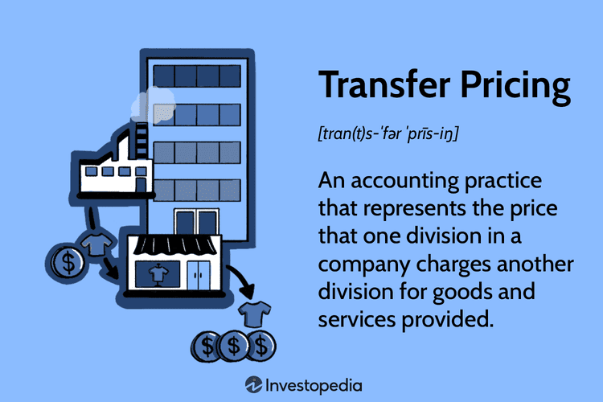

## Table of Contents

## What is transfer pricing and how does it relate to managerial accounting?

Transfer pricing is the price that one division of a company charges another division for goods or services provided. Imagine a big company with different parts, like one part makes car engines and another part makes the whole car. The engine-making part sells engines to the car-making part, and the price they set for the engines is the transfer price. This is important because it affects how much profit each part of the company shows and how they are evaluated.

In managerial accounting, transfer pricing is crucial because it helps managers make decisions about how to run the company efficiently. It's like a tool that helps them see if one part of the company is doing well or if it needs help. By setting the right transfer prices, managers can make sure that the company's resources are used in the best way possible. This can also help in figuring out the true cost of products and in planning for the future.

## How does transfer pricing affect the financial statements of a company?

Transfer pricing can change how a company's financial statements look. When one part of a company sells goods or services to another part, the price they set affects the income and costs shown on the financial statements. If the transfer price is high, the selling division will show more profit, and the buying division will show more costs. This can make the selling division look good but might make the buying division look like it's not doing well. It's like moving money around inside the company, and it can make the overall profit of the company look different depending on how the prices are set.

This also affects the company's tax situation. If the company has parts in different countries, setting transfer prices can move profits to places where taxes are lower. This can lower the total taxes the company has to pay, but it has to be done carefully because there are rules about transfer pricing. If a company doesn't follow these rules, it could get into trouble with tax authorities. So, transfer pricing is a big deal because it not only changes how the financial statements look but also how much tax the company pays.

## What are the common methods used to determine transfer prices?

There are a few common ways to figure out transfer prices. One way is called the market-based method. This means setting the transfer price at what the product would cost if it were sold on the open market. It's like saying, "If we sold this to someone else, how much would we charge?" This method makes sure that the price is fair and reflects what's happening outside the company.

Another method is the cost-based approach. Here, the transfer price is based on how much it costs to make the product. There are different ways to do this, like adding a certain percentage to the cost to cover other expenses or to make a profit. This method is useful when there's no clear market price for the product, but it can be tricky because it might not reflect the true value of the product if the costs are not accurate.

The last common method is the negotiated price approach. In this method, the two parts of the company talk to each other and agree on a price that works for both. It's like a little negotiation inside the company. This method can be good because it takes into account what each part needs, but it can also take a lot of time and might lead to disagreements if they can't agree on a fair price.

## How can transfer pricing influence managerial decision-making?

Transfer pricing can really change how managers make decisions in a company. When managers see how much profit their part of the company is making, they might decide to do things differently. If the transfer price is high, the part selling the product might want to make more of it because they see more profit. But the part buying the product might decide to use less of it or look for other ways to get what they need because it's too expensive. This can lead managers to think about new ways to save money or make more money, like changing how they make things or where they get their supplies.

Also, transfer pricing can affect big decisions like whether to keep making a product inside the company or buy it from outside. If the transfer price is too high, it might make more sense to buy from someone else. Managers have to think about what's best for the whole company, not just their part. This can lead to big changes in how the company works. So, transfer pricing is a big deal because it can push managers to make choices that help the company do better overall.

## What are the tax implications of transfer pricing for multinational companies?

Transfer pricing can really change how much tax a multinational company has to pay. When a company has parts in different countries, they can set the prices for goods or services moving between these parts. If they set a high price for goods sold from a country with low taxes to one with high taxes, more profit shows up in the low-tax country. This means the company pays less tax overall. But, there are rules about transfer pricing that countries have to make sure companies follow these rules or they might get into trouble with tax authorities.

Because of these rules, companies need to be careful and use methods like market-based or cost-based pricing to set fair prices. If they don't, they might have to pay more taxes, penalties, or even face legal action. It's a big deal for multinational companies because getting transfer pricing right can save them a lot of money, but getting it wrong can cost them a lot too. So, they often need to work with experts to make sure they're doing it right and staying within the law.

## How does transfer pricing impact performance evaluation and incentive systems within a company?

Transfer pricing can change how well a company thinks each part is doing. When managers look at how much profit each part makes, the transfer price they use can make one part look better or worse. If the price is high, the part selling the product might seem to be doing great because they show a lot of profit. But the part buying the product might look like they're not doing well because their costs are high. This can make it hard for the company to see which parts are really doing well and which ones need help. Managers need to be careful and use fair transfer prices so they can make good decisions about how to help each part of the company do better.

Transfer pricing also affects how managers are rewarded. Many companies give bonuses or other rewards based on how much profit a manager's part of the company makes. If the transfer price makes one part look more profitable than it really is, the manager of that part might get a bigger bonus. But this might not be fair to other managers whose parts look less profitable because of the transfer prices. To make sure everyone is treated fairly, companies need to set transfer prices in a way that shows the real performance of each part. This helps make sure that the rewards given to managers are based on how well they are really doing, not just how the transfer prices make it look.

## What are the regulatory and compliance issues associated with transfer pricing?

Transfer pricing can get companies into trouble with the law if they don't follow the rules. Countries have rules to make sure companies don't move profits to places with low taxes to pay less. If a company sets transfer prices that are too high or too low, it might look like they're trying to cheat on taxes. This can lead to fines, extra taxes, or even legal action. To avoid these problems, companies need to use fair methods like market-based or cost-based pricing and keep good records to show that their transfer prices are right.

Dealing with these rules can be hard, especially for big companies that work in many countries. Each country might have different rules, and keeping track of them all can be a lot of work. Companies often need to hire experts to help them set transfer prices correctly and make sure they're following the law everywhere they work. If they don't, they could face big fines or legal problems that can cost a lot of money and time.

## How can transfer pricing be used to optimize the overall profitability of a company?

Transfer pricing can help a company make more money by setting the right prices for goods or services moving between different parts of the company. If the price is set correctly, it can make sure that each part of the company is working well together. For example, if the price is too high, the part buying the product might look for cheaper options outside the company, which could hurt the overall profit. But if the price is fair, it can keep the company's resources working together smoothly, helping to save money and make more profit.

To do this, companies need to use methods like market-based or cost-based pricing to set fair transfer prices. This helps make sure that the prices reflect what's happening in the real world or the true cost of making the product. By getting transfer pricing right, managers can see which parts of the company are doing well and which ones need help. This can lead to better decisions about where to spend money or how to make things, which can make the whole company more profitable.

## What are the challenges faced by companies in setting and managing transfer prices?

Setting and managing transfer prices can be really hard for companies. One big problem is making sure the prices are fair. If they're too high or too low, it can mess up how much profit each part of the company shows. This can make some parts look better than they really are, while others look worse. It's like trying to balance a seesaw. Companies need to use methods like market-based or cost-based pricing to set prices that everyone agrees are fair. But even then, it can be tough to get it right because different parts of the company might have different ideas about what's fair.

Another challenge is dealing with all the rules about transfer pricing. Countries have laws to stop companies from moving profits to places with lower taxes. If a company doesn't follow these rules, they could get into big trouble with tax authorities. This means companies have to keep good records and be ready to explain their transfer prices if they're asked. It can be a lot of work, especially for big companies that work in many countries. They often need to hire experts to help them stay on the right side of the law, which can cost a lot of money.

On top of that, transfer pricing can affect how managers make decisions and how they're rewarded. If the transfer prices are set in a way that makes one part of the company look more profitable, the manager of that part might get a bigger bonus. But this might not be fair to other managers. Companies need to be careful to set transfer prices that show the real performance of each part, so everyone gets rewarded fairly. This can be tricky and requires a lot of thought and planning to get it right.

## How does transfer pricing affect cost allocation and cost management strategies?

Transfer pricing can change how a company decides to split up its costs. When one part of the company sells something to another part, the price they set affects how much each part has to pay. If the price is high, the part buying the product will show higher costs. This can make them look for ways to spend less money or find cheaper options. On the other hand, if the price is low, the part selling the product might not make as much money, which could make them think about how they can cut costs to stay profitable. So, transfer pricing is like a tool that helps companies figure out the best way to share costs and make sure each part is working well.

It also affects how companies plan to manage their costs. By setting the right transfer prices, companies can see where they're spending too much and where they can save money. For example, if a high transfer price makes the buying part look less profitable, managers might decide to change how they make things or where they get their supplies to lower costs. This can lead to better decisions about how to use the company's resources. Transfer pricing helps managers see the big picture and make choices that help the whole company save money and make more profit.

## What role does transfer pricing play in strategic planning and corporate governance?

Transfer pricing plays a big part in helping companies plan for the future. When companies set the right prices for goods or services moving between different parts, it helps them see how well each part is doing. This can lead to better decisions about where to spend money or how to make things. For example, if a high transfer price makes one part look less profitable, managers might decide to change how they make things or where they get their supplies to save money. This helps the whole company work better together and make more profit. By using transfer pricing wisely, companies can plan ahead and make sure they're using their resources in the best way possible.

Transfer pricing also matters a lot for how a company is run. It affects how managers are judged and rewarded. If the transfer prices make one part look more profitable than it really is, the manager of that part might get a bigger bonus. But this might not be fair to other managers. So, companies need to set transfer prices that show the real performance of each part. This helps make sure that the people in charge are making good decisions for the whole company, not just their own part. Transfer pricing is a big deal for making sure the company is run well and that everyone is working towards the same goals.

## How can advanced analytics and technology be utilized to improve transfer pricing strategies?

Advanced analytics and technology can make a big difference in how companies set their transfer prices. By using data and computers, companies can look at a lot of information quickly and see what's happening in the market. They can use this to set transfer prices that are fair and match what's going on outside the company. For example, if they see that the price of a product is going up in the market, they can adjust their transfer price to make sure it's still fair. This helps them make better decisions and avoid problems with tax authorities. It's like having a smart helper that can look at a lot of numbers and help the company set the right prices.

Technology also helps companies keep track of all the rules about transfer pricing. There are a lot of rules to follow, and they can be different in each country. With the right technology, companies can keep good records and make sure they're following the law everywhere they work. This can save them a lot of time and money because they won't have to worry about getting into trouble with tax authorities. By using advanced analytics and technology, companies can set transfer prices that help them save money, make more profit, and run the company better overall.

## References & Further Reading

[1]: Bergstra, J., Bardenet, R., Bengio, Y., & Kégl, B. (2011). ["Algorithms for Hyper-Parameter Optimization."](https://dl.acm.org/doi/10.5555/2986459.2986743) Advances in Neural Information Processing Systems 24.

[2]: ["Advances in Financial Machine Learning"](https://www.amazon.com/Advances-Financial-Machine-Learning-Marcos/dp/1119482089) by Marcos Lopez de Prado

[3]: ["Evidence-Based Technical Analysis: Applying the Scientific Method and Statistical Inference to Trading Signals"](https://www.amazon.com/Evidence-Based-Technical-Analysis-Scientific-Statistical/dp/0470008741) by David Aronson

[4]: ["Machine Learning for Algorithmic Trading"](https://github.com/stefan-jansen/machine-learning-for-trading) by Stefan Jansen

[5]: ["Quantitative Trading: How to Build Your Own Algorithmic Trading Business"](https://www.amazon.com/Quantitative-Trading-Build-Algorithmic-Business/dp/1119800064) by Ernest P. Chan