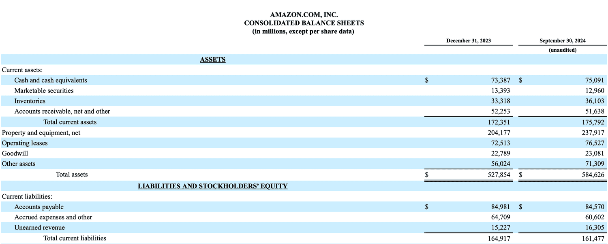

Unearned revenue, financial management, working capital, and algorithmic trading are pivotal concepts in the landscape of modern business finance. Each component plays a distinct yet interconnected role in shaping the financial health and operational efficiency of a business, making their understanding essential for investors and enterprises alike.

Unearned revenue refers to the liability recorded on a company's balance sheet when a business receives payment for goods or services that have yet to be delivered. This prepayment concept is common in industries such as subscription services, where companies receive funds in advance for services to be provided over time. From a financial management perspective, accurately accounting for unearned revenue is crucial as it affects cash flow, revenue recognition, and overall financial statements.



Working capital, defined as the difference between a company's current assets and current liabilities, is a fundamental measure of a company's short-term financial health and operational efficiency. Effective working capital management ensures that a company has sufficient resources to maintain day-to-day operations while meeting its short-term obligations. Unearned revenue, being a current liability, influences a company’s working capital. Properly managing working capital can impact liquidity and financial stability, which in turn can affect investment decisions and business growth.

Algorithmic trading, or algo trading, involves using computer algorithms to execute trades based on pre-specified criteria. This technology-driven approach has become an integral part of financial markets, offering benefits such as increased speed and reduced human error. For businesses, the efficiency of algo trading can also support better financial forecasting and operational management. However, it comes with risks, including market volatility and systemic risks, making strategic planning and risk assessment crucial components.

These core concepts are interconnected in numerous ways. Efficient working capital management affects liquidity and operational decision-making, which can support or hinder algorithmic trading strategies. Unearned revenue impacts liquidity, a critical factor in financial planning and investment strategies. Understanding these elements can provide businesses and investors with insights into optimizing financial performance and capitalizing on opportunities in the ever-evolving financial ecosystem.

This article will explore the definitions, impacts, and real-world applications of unearned revenue, working capital management, and algorithmic trading. It aims to elucidate the complex relationships among these components, enhancing the reader's comprehension of their significance in modern financial decision-making. The subsequent sections will offer a deeper understanding of each concept and their intricate interplay, providing valuable perspectives for effective financial management and strategic planning.

## Table of Contents

## Understanding Unearned Revenue

Unearned revenue, also known as deferred revenue, refers to the payments that a company receives before it has delivered the promised goods or services. It represents an obligation, or a liability, on the company's balance sheet because it owes goods or services to its customers in the future. This liability arises because payment has been received in advance, but the associated earnings process is not yet complete.

The generation of unearned revenue occurs when a company engages in transactions where customers pay prior to the delivery of the product or service. This is common in subscription-based services, airline ticket sales, insurance premiums, and maintenance contracts. For instance, if a magazine subscription is paid upfront for a year, the company records this payment as unearned revenue and will recognize the revenue gradually as the magazines are delivered monthly.

The recognition of unearned revenue into earned revenue is accomplished over time as the service is rendered or product is delivered. This process requires accurate tracking of service or product delivery against the prepayment. For example, if a company receives $1,200 in advance for a one-year service agreement, it will recognize $100 of earned revenue each month as the service is provided. The general journal entry for this process would initially record the advance payment as a credit to unearned revenue (a liability account) and debit cash. As each month elapses, the company debits the unearned revenue account and credits a respective revenue account to recognize earned revenue.

$$
\text{Unearned Revenue (Beginning) } - \text{Service Delivered } = \text{Unearned Revenue (Ending)}
$$

The impact of unearned revenue on financial statements is significant. Initially, it strengthens the company’s cash position, as the payment is collected upfront. However, it does not immediately contribute to the income statement in the form of revenue; instead, it is recognized progressively, impacting both the income and cash flow statements as the company's obligations are fulfilled. Over time, this series of adjustments will impact the net income, tax liability, and working capital.

In terms of cash flow, unearned revenue can enhance [liquidity](/wiki/liquidity-risk-premium), providing immediate funds that may be utilized for operating expenses or investments. However, it also bears the responsibility of delivering goods or services as agreed, making effective tracking and management essential to avoid cash flow mismatches or operational challenges. As a result, unearned revenue plays a crucial role in the financial health and operational strategy of businesses, particularly in sectors with prevalent upfront payment models.

## Working Capital Management

Working capital is a crucial component of a company's financial health, defined as the difference between current assets and current liabilities. Mathematically, it is expressed as:

$$
\text{Working Capital} = \text{Current Assets} - \text{Current Liabilities}
$$

Current assets include cash, inventory, and receivables, while current liabilities encompass debts and obligations like accounts payable and unearned revenue due within a year. A positive working capital indicates that a company can cover its short-term liabilities with its short-term assets, signifying its liquidity and operational efficiency.

Effective management of working capital is paramount for maintaining liquidity, minimizing costs, and maximizing returns on investment. It ensures that a company has sufficient cash flow to meet its short-term obligations, thus supporting uninterrupted operations. Poor working capital management can lead to liquidity crises, negatively impacting both operational efficiency and a company's financial stability.

Unearned revenue, a current liability, is generated when a company receives payments for goods or services it has yet to deliver. This obligation affects working capital by temporarily increasing current liabilities. Managing this aspect is critical, as an excess of unearned revenue can skew a company's balance sheet, signaling potential cash flow issues.

Strategies for effective working capital management include:

1. **Inventory Management:** Optimize inventory levels to prevent overstocking, which ties up capital, or understocking, which can result in a loss of sales.

2. **Receivables Management:** Accelerate collections to shorten the receivables cycle. This can involve offering discounts for early payments or renegotiating payment terms with clients.

3. **Payables Management:** Efficiently manage outgoing payments to suppliers by taking full advantage of credit terms without compromising relationships. 

4. **Cash Flow Forecasting:** Regularly forecast cash flow to anticipate any potential shortfalls or surpluses, allowing for proactive decision-making.

Unearned revenue poses specific challenges to net working capital. Since it is recorded as a liability, it impacts the overall liquidity and may distort working capital ratios. These ratios are critical for assessing a company's financial health. For instance, an increase in unearned revenue without a corresponding rise in current assets can indicate potential strain on working capital, thus requiring sharp management oversight to ensure liabilities do not outweigh assets.

In conclusion, maintaining an optimal balance of current assets and liabilities through adept working capital management is vital. Unearned revenue, while an indicator of future income, requires meticulous handling to ensure that it does not adversely impact liquidity or operations. Businesses must adopt strategic management practices to enhance their financial stability and operational resilience.

## Algorithmic Trading: An Overview

Algorithmic trading refers to the use of computer algorithms to execute a large number of stock trades at high speeds that are not possible for human traders. These algorithms are designed to follow pre-defined sets of instructions for trading, which can include timing, price, quantity, or other mathematical models. By systematically managing trades, [algorithmic trading](/wiki/algorithmic-trading) aims to enhance decision-making processes, decrease the possibility of human error, and ultimately provide traders with increased control over the execution of their trading strategies.

Algorithms in trading operate based on pre-set conditions and strategies derived from historical data analysis, technical indicators, and market situations. This involves complex computational techniques that help identify trading opportunities by scanning multiple markets and stocks simultaneously. For example:

```python
def simple_moving_average_strategy(prices, window_size):
    moving_averages = prices.rolling(window=window_size).mean()
    signals = (prices > moving_averages).astype(int)  # Buy signal when price is above the moving average
    return signals.shift(1)  # Shift signals to align with the next day's trade execution
```

The benefits of algorithmic trading are manifold. Firstly, it significantly enhances the speed and efficiency of executing trades, as algorithms can react to market conditions almost instantaneously. This eliminates the delay associated with human processing and execution, providing a competitive advantage in fast-moving markets. Secondly, by removing emotions from trading decisions, algorithmic trading reduces human errors that may arise from psychological factors like fear and greed. Additionally, algorithmic trading contributes to improved market liquidity by executing trades in small quantities at frequent intervals, enabling smoother market operations and reduced price [volatility](/wiki/volatility-trading-strategies).

Despite its advantages, algorithmic trading also presents several risks and challenges. One major risk is market volatility, as algorithmic strategies can sometimes exacerbate price fluctuations during periods of stress. Furthermore, systemic risks arise when interconnected algorithms amplify market movements or trigger cascading effects. Such scenarios were evident in events like the 2010 "Flash Crash," where algorithmic trades contributed to a sudden and significant drop in U.S. equity markets. Risk management and robust financial models are therefore critical in mitigating these challenges.

The technological advancement supporting algorithmic trading largely relies on [machine learning](/wiki/machine-learning) and big data analytics. Machine learning algorithms help predict price movements by analyzing vast datasets, identifying patterns, and optimizing trading strategies based on historical performance. Big data analytics, on the other hand, enables the processing of large volumes of market data, providing insights that guide algorithmic decision-making. These tools ensure that algorithmic trading systems can adapt to changing market conditions and optimize strategies in real-time.

In sum, algorithmic trading serves a pivotal role in modern financial markets. It offers significant benefits in terms of execution speed, precision, and market liquidity. However, as with any technological system, it requires careful consideration of its associated risks, leveraging advanced tools and techniques to create robust and flexible trading strategies.

## Interrelation: Unearned Revenue, Working Capital, and Algo Trading

Efficient working capital management is a crucial [factor](/wiki/factor-investing) that can significantly influence algorithmic trading strategies. Working capital, defined as the difference between a company's current assets and current liabilities, directly affects a firm's liquidity and operational capacity. In this context, unearned revenue, often classified as a current liability, plays a critical role in determining the liquidity levels that are essential for executing trading strategies.

Unearned revenue arises when a company receives payment in advance for products or services to be delivered in the future. This payment constitutes a liability until the services are rendered, at which point the revenue is recognized as earned. This aspect impacts a company's liquidity position as it represents cash inflow without an immediate offset by an expense from delivering goods or performing services. The presence of substantial unearned revenue can enhance liquidity, providing more flexibility and capital for algorithmic trading activities.

Algorithmic trading firms utilize liquidity to execute trades efficiently and leverage market opportunities. When working capital management includes the strategic use of unearned revenue, companies can maintain or improve their liquidity position, enabling them to respond promptly to market signals. For example, a tech company with significant subscription-based revenue might efficiently manage unearned revenue to bolster liquidity, thus supporting its trading operations by ensuring sufficient funds for high-frequency trading or deploying intricate trading algorithms.

In analyzing the financial metrics and data integration involved in these concepts, several key performance indicators can be considered. Liquidity ratios, such as the current ratio and quick ratio, help assess a firm's ability to cover its short-term obligations. Furthermore, cash conversion cycle analysis helps determine the efficiency of working capital management by measuring the time taken to convert resource inputs into cash flows. These metrics are instrumental in providing insights for algorithmic trading decisions, as they highlight the liquidity and financial stability of a business.

The integration of real-time financial data and analytics is pivotal in optimizing these strategies. Advanced machine learning models and big data analytics allow for the processing of vast datasets to predict market trends and make informed trading decisions. Algorithmic models can analyze past performance, market indicators, and financial statements to optimize cash flow management and enhance decision-making processes related to trading execution.

Looking ahead, the trend of using sophisticated algorithmic strategies to optimize financial management is likely to continue evolving. Innovations in [artificial intelligence](/wiki/ai-artificial-intelligence) and machine learning are expected to play increasingly significant roles in enhancing the predictive capabilities of trading algorithms. By integrating real-time data analytics with financial metrics, companies can improve their working capital management while leveraging algorithmic trading as a tool for increased financial efficiency and competitive advantage. This holistic approach enables not only improved financial oversight but also maximized returns through efficient market participation.

## Practical Applications and Case Studies

In examining the practical applications and real-world case studies involving the interaction between unearned revenue, working capital, and algorithmic trading, several patterns and lessons have emerged. These cases illustrate the delicate balance that companies must maintain in managing liabilities, liquidity, and market strategies while leveraging technological advancements.

A notable example can be seen in the subscription-based software industry, where companies like Adobe have successfully managed unearned revenue through careful working capital management and algorithmic trading strategies. By transitioning to a subscription model, Adobe generates significant unearned revenue, appearing as a liability on its balance sheet until the service is rendered. Adobe integrates algorithmic solutions to forecast cash flows and optimize investment strategies, ensuring they maintain a healthy balance sheet and sufficient liquidity to manage ongoing operations and growth investments. The shift has not only stabilized cash flow but also enhanced investor confidence through predictable, recurring revenue streams.

The airline industry provides another insightful example. Companies such as Delta Airlines collect large sums of unearned revenue through advance ticket sales. Efficient management of this liability is crucial for maintaining operational liquidity. By leveraging algorithmic trading, Delta can optimize fuel purchases and foreign exchange transactions, which minimizes expenses and reduces exposure to volatile markets. This strategy has proven essential in maintaining competitive ticket pricing and achieving operating efficiency. The key lesson here is the importance of using technology to enhance responsiveness to market changes, thereby stabilizing cash flow and enhancing profitability.

However, pitfalls persist in these strategies if not properly managed. A common mistake involves relying too heavily on algorithmic solutions without appropriate oversight, which can lead to significant risks during market disruptions. The infamous case of Knight Capital Group in 2012 underscores this danger, where a trading algorithm malfunction led to a catastrophic financial loss, nearly bankrupting the firm. This highlights the need for robust risk management protocols and continuous oversight.

Several actionable insights for businesses emerge from these studies:

1. **Integrate Technology with Human Oversight**: While algorithmic trading offers efficiency, human oversight is indispensable in managing unprecedented market conditions.

2. **Diversify Algorithmic Strategies**: To mitigate risks, businesses should employ a diversified set of trading algorithms tailored to different market conditions and financial goals.

3. **Optimize Working Capital through Advanced Analytics**: Leveraging data analytics can enhance the predictability and control of cash flows, allowing better management of unearned revenue and current liabilities.

4. **Cross-Departmental Coordination**: Financial strategies must involve collaboration between finance, IT, and strategic planning departments to ensure alignment and effective resource utilization.

These insights underscore the necessity of integrated strategies that combine financial acumen with technological innovation to improve financial health and support long-term growth. By learning from both successful applications and past mistakes, companies can better navigate the complexities of modern business finance.

## Conclusion

Unearned revenue, working capital management, and algorithmic trading are integral components in modern financial management, each playing a pivotal role in shaping an organization's financial strategy and performance. Unearned revenue represents a liability for goods and services prepaid but not yet delivered, affecting both an organization's cash flow and balance sheet. Managing this liability efficiently is crucial for accurate financial reporting and ensuring operational liquidity. 

Working capital management, which focuses on balancing current assets against current liabilities, is essential for maintaining liquidity, operational efficiency, and financial stability. Unearned revenue as a part of current liabilities directly influences a company's net working capital, necessitating careful management to avoid liquidity issues.

Algorithmic trading introduces advanced strategies for financial markets, offering benefits such as enhanced speed, efficiency, and reduced human error. Algorithms leverage vast data analytics to drive trading decisions, thereby enhancing the deployment and management of financial assets, including cash flow from operations influenced by unearned revenue and working capital dynamics.

The interconnectedness of these concepts is significant for financial decision-making. Efficient working capital management impacts a company's ability to engage in algorithmic trading, ensuring adequate liquidity and optimizing financial outcomes. This interconnected framework supports data-driven trading strategies, integrating financial obligations like unearned revenue to balance operational needs and investment opportunities effectively.

Future advancements in financial technology and management promise even more sophisticated tools and strategies, leveraging artificial intelligence and machine learning to refine financial forecasting and operational optimization. Businesses are encouraged to explore these integrated financial strategies, enabling them to enhance their viability and competitive edge.

In conclusion, the integration of unearned revenue management, working capital strategies, and algorithmic trading forms a comprehensive approach to robust financial management. Staying informed and adaptable in this rapidly evolving financial landscape is crucial for businesses aiming to thrive. By embracing new technologies and financial strategies, companies can optimize their financial health and achieve unprecedented business outcomes.

## References & Further Reading

[1]: ["Financial Management: Theory & Practice"](https://faculty.cengage.com/titles/9781337902601) by Eugene F. Brigham and Michael C. Ehrhardt

[2]: ["Advances in Financial Machine Learning"](https://www.amazon.com/Advances-Financial-Machine-Learning-Marcos/dp/1119482089) by Marcos Lopez de Prado

[3]: ["Algorithmic Trading and DMA: An introduction to direct access trading strategies"](https://www.amazon.com/Algorithmic-Trading-DMA-introduction-strategies/dp/0956399207) by Barry Johnson

[4]: ["Working Capital Management: Applications and Case Studies"](https://books.google.com/books/about/Working_Capital_Management.html?id=hJstBAAAQBAJ) by James Sagner

[5]: ["Quantitative Trading: How to Build Your Own Algorithmic Trading Business"](https://www.amazon.com/Quantitative-Trading-Build-Algorithmic-Business/dp/1119800064) by Ernest P. Chan