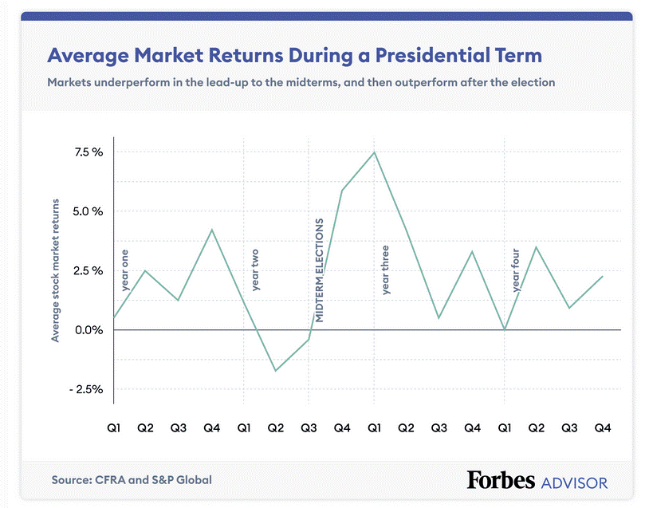

U.S. elections hold considerable significance in shaping the dynamics of the stock market. Historically, election outcomes can lead to fluctuations in market performance as investors anticipate changes in policies that may impact economic growth, taxation, and regulatory frameworks. This phenomenon is largely attributed to the uncertainty surrounding electoral results and the subsequent fiscal and monetary policies implemented by the incoming government. As investors tend to reassess their portfolios in response to potential policy shifts, market volatility often increases during election periods, affecting stock valuations across various sectors.

In recent years, algorithmic trading has gained prominence in modern financial markets. This method involves employing complex algorithms and high-speed data analysis to execute trades, capitalizing on fleeting market opportunities with precision and efficiency. By integrating vast datasets and historical patterns, algorithmic trading systems are designed to identify and exploit market inefficiencies, thereby fostering more liquidity and tighter spreads. The relevance of algorithmic trading is underscored by its capacity to process vast amounts of information at speeds unattainable by human traders, facilitating swift reaction to market events, including those triggered by political developments.



This article explores two interconnected areas: the impact of U.S. elections on stock markets and the role of algorithmic trading in navigating these politically charged environments. Through analyzing historical market data and case studies from past elections, we will identify trends and patterns significant to investors. Additionally, the examination of algorithmic trading's methodologies and its implications for market volatility during election cycles will provide insights into how technology shapes trading strategies and market dynamics. Both topics offer a comprehensive understanding of the intersection between political events and financial markets, highlighting the critical role of data and technology in modern-day trading.

## Table of Contents

## The Connection Between U.S. Elections and Stock Market Performance

U.S. elections have historically exhibited a pronounced impact on stock market performance, with various trends and patterns observable across different electoral cycles. Typically, market reactions are influenced by the anticipation of changes in fiscal policies, regulatory environments, and overall economic direction, which are often contingent on the political party assuming office. Analyzing historical data reveals that the stock market tends to experience heightened volatility during election years, as investors grapple with uncertainty regarding future policies and economic management.

Historically, certain patterns emerge around U.S. elections. For instance, the stock market often sees a degree of increased volatility in the months leading up to an election, as uncertainty regarding the election outcome and its implications for fiscal policy heightens investor anxiety. Research published in financial studies, such as the Journal of Finance, identifies the "presidential election cycle theory," which suggests markets perform differently during various phases of a president's term. Markets have generally performed better in the latter half of a presidential term, reflecting stability after initial policy implementations.

Political parties' fiscal policies significantly shape market expectations and sentiments. Democratic administrations are frequently associated with increased public spending and regulatory measures, focusing on social welfare programs, healthcare, and environmental regulation. Conversely, Republican administrations are typically linked with tax cuts, deregulation, and a pro-business stance aimed at stimulating economic growth. These differing fiscal policies can lead to varying expectations among investors regarding costs, revenues, and ultimately, corporate profitability, directly influencing market behaviors.

Consider, for example, tax policies. Markets may react positively to announced tax cuts, expecting increases in corporate profitability due to reduced tax burdens. Conversely, prospective tax increases might spur negative investor sentiment. A classic example can be seen in the Tax Reform Act of 1986 under President Reagan, which restructured federal income tax and was initially met with mixed reactions in financial markets due to its sweeping changes.

Furthermore, the uncertainty surrounding policy shifts contributes to market [volatility](/wiki/volatility-trading-strategies). During elections, both potential policy changes under a new administration and the continuity or departure from the incumbent policies weigh heavily on investor decisions. For instance, shifts in trade policy, healthcare reform, or infrastructure spending lead to speculation about sectors that might benefit or suffer, influencing stock prices within those industries.

In conclusion, U.S. elections invariably impact stock market dynamics, driven by shifts in investor sentiment and expectations tied to the electoral outcomes. The political landscape's anticipated changes in fiscal and regulatory policies play a crucial role in shaping these market responses. Understanding these historical patterns and the implications of party-specific fiscal policies provides valuable insights into market behavior during election cycles.

## Case Studies: Market Reactions to Previous U.S. Elections

### Case Studies: Market Reactions to Previous U.S. Elections

The U.S. elections are pivotal events that often correlate with significant stock market behavior. Historically, markets have responded differently based on whether the resulting government is unified, with one party controlling both the executive and legislative branches, or divided, where control is split between parties. This section examines those scenarios, focusing particularly on the market reactions following the 2008 and 2020 elections.

#### Market Performance: Unified vs. Divided Government Scenarios

When analyzing stock market performance, the distinction between unified and divided government is crucial. Historical data generally suggests that markets appreciate predictability and stability, often associated with a unified government. However, a divided government can lead to policy gridlock, potentially tempering the markets' response due to reduced likelihood of sweeping legislative changes that might disrupt business environments.

#### Stock Market Behavior in 2008

The 2008 U.S. presidential election occurred during a global financial crisis, with Barack Obama elected alongside a Democrat-controlled Congress, leading to a unified government. The markets during and following the election reflected extreme volatility, primarily due to the financial turmoil rather than the election outcomes per se. The S&P 500 index dropped dramatically in the months leading up to the election due to broader economic concerns, reaching a low in March 2009. However, post-election, while short-term volatility persisted, there was a progressive recovery as confidence slowly returned, aided by government measures like the American Recovery and Reinvestment Act of 2009.

#### Stock Market Behavior in 2020

In contrast, the 2020 election presented a different scenario amidst the COVID-19 pandemic. Joe Biden's election initially suggested a possible unified government, but subsequent Senate races led to a divided government until the Georgia run-offs in January 2021. The initial market response was cautious optimism, with the S&P 500 showing resilience and growth towards the end of 2020, partly due to expectations of forthcoming fiscal stimulus and vaccine rollouts. Markets were reassured by the likelihood of substantial government support aimed at economic recovery, despite the potential for policy disagreements in a divided legislative environment.

#### Significant Trends and Deviations

Several trends are notable across past electoral cycles:

1. **Volatility Pre-Election:** Both 2008 and 2020 saw heightened volatility in the months leading up to the elections, driven by significant external factors (the financial crisis and the pandemic, respectively) rather than purely electoral uncertainty.

2. **Post-Election Stability:** In both cycles, despite immediate post-election volatility, markets eventually shifted towards a recovery trajectory. This pattern underscores the markets' tendency to stabilize once political outcomes crystallize and irrespective of whether the government is unified or divided.

3. **Sector-Specific Trends:** Certain sectors react differently based on expected policy shifts. For instance, renewable energy stocks surged post-2020 election due to anticipated policy support, contrasting with healthcare stocks' fluctuations based on policy uncertainty in previous cycles.

Overall, while elections significantly impact market sentiment and behavior, broader economic contexts and expectations of policy directions often play an even more pivotal role in determining market trajectories. Historical analysis supports the notion that while immediate reactions may be abrupt, longer-term trends lean towards stabilization as the political landscape becomes clearer.

## Algorithmic Trading in the Election Scenario

Algorithmic trading, often referred to as algo trading, is the use of computer algorithms to automate and accelerate trading activities in financial markets. These algorithms are designed to execute orders based on pre-set criteria, such as price, [volume](/wiki/volume-trading-strategy), or timing, allowing trades to be completed at speeds and frequencies impossible for human traders. This type of trading has gained importance due to its ability to process large volumes of data and execute trades efficiently, influencing market [liquidity](/wiki/liquidity-risk-premium) and price discovery.

During U.S. election periods, [algorithmic trading](/wiki/algorithmic-trading) systems leverage vast datasets and historical patterns to navigate the market's reaction to political events. Algorithms use data on past election outcomes, market reactions, and anticipated fiscal policies to inform trading decisions. They implement strategies such as statistical [arbitrage](/wiki/arbitrage), [momentum](/wiki/momentum) trading, and sentiment analysis to predict market movements. For instance, a common approach is to analyze historical volatility levels around previous elections to assess the potential for similar patterns, applying statistical models to gauge the likelihood of repetition.

The formula for calculating the expected market movement, $M$, based on historical data can be expressed as:

$$
M = \alpha + \beta \times E
$$

where:
- $\alpha$ represents the baseline market movement without election effects,
- $\beta$ reflects the sensitivity of the market to election-related factors, 
- $E$ denotes the election event indicator, which is quantified based on historical patterns and current data inputs.

One of the significant impacts of algorithmic trading on market dynamics during elections is the potential increase in market volatility. Algorithms can amplify price swings as they react swiftly to large volumes of information, implementing trades at high speeds. This effect can lead to heightened short-term volatility, creating opportunities for profit but also increasing the risk of rapid and substantial market fluctuations. For example, if an algorithm detects a sudden increase in volatility due to unexpected election results, it may trigger a series of trades designed to capitalize on this volatility, further contributing to the market movement.

While algorithmic trading can enhance liquidity and efficiency, it also poses challenges such as flash crashes, where prices plummet precipitously due to automated trades triggering one another in a feedback loop. Additionally, the competitive nature of algo trading means firms are often engaged in a technological arms race, constantly upgrading systems to maintain a competitive edge. This underscores the importance of robust risk management systems to mitigate adverse effects of such trading strategies during volatile periods like U.S. elections.

## The Role of Technology and Data Analysis

Technological advancements have significantly transformed the financial markets, particularly through the proliferation of algorithmic trading. Algorithmic trading leverages algorithms—sets of rules and procedures written in computer code—to automatically execute trades in financial markets. This approach has gained prominence due to its ability to process vast amounts of information at speeds unattainable by human traders, thereby optimizing trading strategies and decision-making. 

One of the key technological advancements that has fueled the growth of algorithmic trading is high-frequency trading ([HFT](/wiki/high-frequency-trading-strategies)). HFT enables the execution of a multitude of trades within fractions of a second. This acceleration is facilitated by powerful computing systems, sophisticated algorithms, and improved telecommunications infrastructures, allowing traders to exploit even the smallest price discrepancies for profit. These systems rely heavily on data analytics to assess market conditions, recognize patterns, and forecast potential movements. 

Data analytics plays a pivotal role in formulating market forecasts and trading strategies, especially during events like U.S. elections. Through [machine learning](/wiki/machine-learning) models and statistical analysis, traders can analyze historical data to identify trends and correlations between election outcomes and market movements. A simple linear regression model might be used to understand the relationship between political events and stock prices. For instance, a basic implementation could look like this:

```python
import pandas as pd
from sklearn.linear_model import LinearRegression

# Sample data: historical market data and election outcomes
data = pd.DataFrame({
    'market_index': [...],  # Historical stock index values
    'election_results': [...]  # Coded data representing election outcomes
})

# Prepare the dataset
X = data[['election_results']]
y = data['market_index']

# Fit the model
model = LinearRegression().fit(X, y)

# Predict future trends based on upcoming election results
future_election_results = pd.DataFrame({'election_results': [...]})
predicted_market_index = model.predict(future_election_results)
```

The vast array of data available today enhances algorithmic capabilities, but it also presents challenges. Algorithmic traders must navigate issues such as data quality, latency, and the constantly shifting landscape of financial markets. Moreover, the unpredictable nature of market responses to socio-political events, including unforeseen election outcomes or unprecedented policy decisions, can undermine the reliability of algorithm-driven predictions. Algorithms are only as good as the data they are trained on; thus, reliance on outdated or incomplete datasets can lead to erroneous conclusions.

Additionally, algorithmic trading demands robust risk management frameworks to mitigate the heightened volatility often encountered during election periods. Algorithms can exacerbate market moves, leading to flash crashes or unexpected surges, if not adequately regulated and supervised. 

In sum, while technological advancements and data analytics empower algorithmic trading by providing more informed and swift decision-making, traders continue to face challenges in ensuring the accuracy, reliability, and stability of their strategies within this dynamic market environment.

## Predicting Market Trends: Can Algorithms Do It?

Algorithmic trading has become integral to financial markets, with its ability to analyze and act on vast sets of data in milliseconds. However, the reliability of algorithmic predictions—especially during political events such as U.S. elections—poses unique challenges and uncertainties.

**Reliability of Algorithmic Predictions**

Algorithms utilize vast datasets and sophisticated models to predict market trends. These models rely on historical data, which in the context of elections can indicate how markets have historically responded to similar political events. For instance, algorithms might analyze patterns in volatility or price adjustments in response to previous election outcomes to make predictions. Nonetheless, while historical data can provide insights, it doesn't guarantee future performance, as each election can introduce novel variables and outcomes.

One notable challenge is the diverse nature of political events. Unlike economic indicators, political events can be highly unpredictable, influenced by sudden shifts in policy positions, political scandals, or unexpected election outcomes. Such unpredictability can lead to deviations from historical patterns, rendering algorithmic predictions less reliable.

**Limitations and Risks of Algorithmic Trading**

Algorithms function on predetermined rules and conditions, and while they excel at speed and processing power, they lack the flexibility and intuition often required during uncertain times. This rigidity can be problematic during elections, where market movements might be swayed by irrational investor sentiment or unforeseen geopolitical developments.

Moreover, algorithmic trading can exacerbate market volatility. The rapid execution of trades based on flawed or misinterpreted data during uncertain political climates can lead to abrupt market swings, a phenomenon known as "flash crashes." For example, algorithms might react uniformly to a particular event, resulting in a cascade of trading actions that amplify market movements beyond what fundamentals justify.

**The Human Element in Algorithmic Trading**

Despite advancements in machine learning and [artificial intelligence](/wiki/ai-artificial-intelligence), human oversight remains essential in algorithmic trading, especially during election periods. Human traders can interpret political nuances and sentiment shifts more effectively than algorithms. They can adjust strategies in response to unexpected developments or erroneous market trends that an algorithm might fail to consider.

Incorporating a human element involves setting parameters within which algorithms operate and performing continuous monitoring to identify when manual intervention is required. Traders might also employ techniques such as scenario analysis to prepare for a range of political outcomes and their potential market impacts, providing a strategic buffer against the inherent unpredictability of elections.

In conclusion, while algorithms represent powerful tools for market analysis, their ability to predict trends during political events like U.S. elections is constrained by fundamental limitations and risks. A balanced approach that combines algorithmic efficiency with critical human judgment and oversight offers the best prospects for navigating these uncertain periods effectively.

## Conclusion

U.S. elections consistently demonstrate a notable impact on stock market performance, driven by shifts in investor sentiment and expectations surrounding fiscal policies. Historical data reveals that market reactions vary significantly based on the prevailing political environment and the anticipated implications of election outcomes. Periods of political uncertainty, such as elections, can lead to increased market volatility as investors reassess their portfolios based on potential policy changes. Furthermore, the influence of political parties on fiscal policies often shapes market expectations, with different sectors responding variably to either Democratic or Republican administrations.

Algorithmic trading has emerged as a significant [factor](/wiki/factor-investing) in the financial markets, particularly during election periods. Algorithms enhance market efficiency by processing vast amounts of data rapidly, potentially smoothing market responses to election-related developments. However, their influence can also complicate market dynamics, as rapid trading based on news headlines or sentiment analysis can exacerbate volatility. Algorithms utilize predictive models that incorporate historical data and patterns to make trading decisions. While beneficial in stabilizing certain market fluctuations, this reliance on pattern recognition and historical data means that algorithms might struggle with unprecedented political events, which inherently [carry](/wiki/carry-trading) significant uncertainty.

Future research should focus on improving the adaptability of algorithmic models to account for the unique uncertainties associated with political events, integrating more sophisticated sentiment analysis from diverse data sources. There is also a need for continued exploration into the balance between human oversight and automated decision-making to mitigate potential risks arising from algorithmic trading. As both technology and data analytics evolve, their confluence with political events will likely offer new opportunities and challenges in understanding and predicting market behaviors in this dynamic intersection of finance and politics. This evolving landscape warrants ongoing examination to refine models and develop strategies that can reliably navigate the complexities of market reactions to U.S. elections.

## References & Further Reading

[1]: Bergstra, J., Bardenet, R., Bengio, Y., & Kégl, B. (2011). ["Algorithms for Hyper-Parameter Optimization."](https://proceedings.neurips.cc/paper/2011/file/86e8f7ab32cfd12577bc2619bc635690-Paper.pdf) Advances in Neural Information Processing Systems 24.

[2]: ["Advances in Financial Machine Learning"](https://www.amazon.com/Advances-Financial-Machine-Learning-Marcos/dp/1119482089) by Marcos Lopez de Prado

[3]: ["Evidence-Based Technical Analysis: Applying the Scientific Method and Statistical Inference to Trading Signals"](https://www.amazon.com/Evidence-Based-Technical-Analysis-Scientific-Statistical/dp/0470008741) by David Aronson

[4]: ["Machine Learning for Algorithmic Trading"](https://github.com/PacktPublishing/Machine-Learning-for-Algorithmic-Trading-Second-Edition) by Stefan Jansen

[5]: ["Quantitative Trading: How to Build Your Own Algorithmic Trading Business"](https://books.google.com/books/about/Quantitative_Trading.html?id=j70yEAAAQBAJ) by Ernest P. Chan