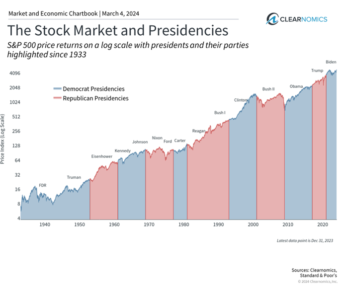

## Table of Contents

## What is the stock market and how does it relate to U.S. elections?

The stock market is like a big store where people can buy and sell pieces of companies called stocks. When you buy a stock, you own a little bit of that company. The price of stocks goes up and down based on how well people think the company is doing. If lots of people want to buy a stock, its price goes up. If fewer people want it, the price goes down. The stock market is important because it helps companies get money to grow and it gives people a way to invest their money and maybe make more money.

U.S. elections can affect the stock market because they can change who is in charge of making laws and rules that impact companies. When a new president or congress is elected, they might make different rules about taxes, trade, and other things that can make companies do better or worse. For example, if people think a new president will help the economy grow, stock prices might go up because more people want to buy stocks. But if people think the new president's plans will hurt the economy, stock prices might go down. So, the stock market can move a lot around election time because of what people expect will happen after the election.

## How do U.S. election results typically influence stock market performance?

U.S. election results can cause the stock market to go up or down because they change who is making the rules for businesses. If people think the new president or congress will make rules that help companies make more money, the stock market often goes up. For example, if a president promises to lower taxes for businesses, people might buy more stocks because they think companies will keep more of their profits.

On the other hand, if people think the new leaders will make rules that make it harder for companies to make money, the stock market might go down. For instance, if a president wants to raise taxes or put more rules on businesses, people might sell their stocks because they worry companies will make less money. So, the stock market can be a bit like a guessing game around election time, with people trying to predict what the new leaders will do.

## Can you explain the immediate stock market reactions to past U.S. election outcomes?

When a new president is elected in the U.S., the stock market often moves right away because people start guessing what will happen next. For example, in 2008 when Barack Obama won, the stock market went down a bit at first because some people worried about his plans to change healthcare and taxes. But soon after, it started going up again because people thought his plans might help the economy in the long run. In 2016, when Donald Trump won, the stock market jumped up right away. People thought his promises to cut taxes and reduce regulations would help businesses make more money.

In 2020, when Joe Biden won, the stock market had a mixed reaction. At first, it didn't move much because people were unsure about what Biden's plans would mean for businesses. But over time, as it became clear what his policies might be, the market started to go up. This shows that the stock market can react differently to different election results, depending on what people expect the new president to do.

## What are the key factors investors consider during U.S. election periods?

During U.S. election periods, investors pay close attention to the policies that candidates promise to put in place. They look at things like tax plans, healthcare reforms, and regulations on businesses. If a candidate says they will lower taxes or make it easier for companies to do business, investors might think that's good for the stock market. But if a candidate wants to raise taxes or put more rules on businesses, investors might worry that it will be harder for companies to make money.

Investors also think about how stable the political situation will be after the election. If there's a lot of uncertainty or fighting between different political groups, investors might be nervous and the stock market could go down. But if people think the new government will work well together, the stock market might go up because investors feel more confident. So, during election times, investors try to guess what will happen and make their decisions based on those guesses.

## How do different political parties' policies affect stock market sectors?

Different political parties in the U.S. have different ideas about how to run the country, and these ideas can affect different parts of the stock market in different ways. For example, if the Republican Party is in power, they often want to lower taxes and reduce rules for businesses. This can be good for sectors like energy and finance because these companies might make more money with fewer rules and lower taxes. On the other hand, if the Democratic Party is in power, they might want to spend more on things like healthcare and education, and they might raise taxes on rich people and big companies. This can be good for sectors like healthcare and education because they might get more money from the government.

The stock market can also be affected by how the parties feel about trade. Republicans often want to make trade easier with fewer rules, which can be good for companies that sell things to other countries. Democrats might want to put more rules on trade to protect jobs at home, which can help some companies but might hurt others that rely on selling things overseas. So, depending on which party wins the election, different parts of the stock market can go up or down based on what the new policies will be.

## What role do economic policies of elected candidates play in stock market trends?

The economic policies of elected candidates can have a big impact on the stock market. When a new president or congress comes into power, they might change the rules about taxes, spending, and regulations. If they lower taxes or make it easier for businesses to operate, people might think companies will make more money. This can make the stock market go up because more people want to buy stocks. On the other hand, if the new leaders raise taxes or put more rules on businesses, people might worry that companies will make less money. This can make the stock market go down because people might sell their stocks.

Investors pay close attention to what the candidates say they will do with the economy. If a candidate talks about helping businesses grow, the stock market might go up because investors think that's good for companies. But if a candidate talks about spending more on things like healthcare or education, and raising taxes to pay for it, the stock market might go down because investors might think that's bad for businesses. So, the stock market can move a lot based on what people expect the new leaders to do with economic policies.

## How do election uncertainties impact stock market volatility?

Election uncertainties can make the stock market go up and down a lot. When people don't know who will win the election or what the new leaders will do, they might feel nervous. This nervousness can make them buy and sell stocks more often, which makes the stock market more volatile. If there's a lot of arguing or fighting between political groups, it can make people even more unsure about what will happen next. This uncertainty can cause big swings in the stock market as investors try to guess what the future will bring.

Even after the election, if it takes a long time to find out who won or if there are legal fights about the results, the stock market can stay volatile. Investors might wait to see what the new government will do before they decide to buy or sell stocks. This waiting and guessing can keep the stock market moving a lot until things become clearer. So, election times can be a bit like a roller coaster for the stock market because of all the uncertainty.

## What are some historical examples where U.S. election results significantly moved the stock market?

In 2008, when Barack Obama won the election, the stock market went down a little at first. Some people were worried about his plans to change healthcare and taxes. They thought these changes might make it harder for businesses to make money. But after a short time, the stock market started to go up again. People began to think that Obama's plans might help the economy grow in the long run, so they felt more confident about buying stocks.

In 2016, when Donald Trump won the election, the stock market jumped up right away. People thought his promises to cut taxes and reduce rules on businesses would help companies make more money. This made investors want to buy more stocks, which pushed the market higher. Trump's win was a surprise to many people, so the big jump in the stock market showed how much people's expectations can change the market.

In 2020, when Joe Biden won the election, the stock market had a mixed reaction at first. It didn't move much because people were unsure about what Biden's plans would mean for businesses. But over time, as it became clear what his policies might be, the market started to go up. People began to think that Biden's plans might help the economy, so they felt better about investing in the stock market.

## How can investors prepare their portfolios for potential U.S. election outcomes?

Investors can prepare their portfolios for U.S. election outcomes by paying attention to what the candidates say about their plans for the economy. If a candidate talks about lowering taxes or making it easier for businesses to operate, investors might want to put more money into stocks from sectors that would benefit, like energy or finance. On the other hand, if a candidate talks about raising taxes or spending more on things like healthcare and education, investors might want to invest in stocks from those sectors because they might get more money from the government. It's also a good idea for investors to spread their money around in different types of investments to lower the risk if the market goes down after the election.

Another way investors can prepare is by staying calm and not making quick decisions based on election news. Elections can make the stock market go up and down a lot, so it's important not to panic and sell all your stocks if the market drops right after the election. Instead, investors should think about the long term and what the new policies might mean for the economy over time. By staying informed and not reacting too quickly, investors can make smarter choices about their portfolios no matter who wins the election.

## What advanced metrics or indicators should experts watch during election times?

During election times, experts should watch the Volatility Index (VIX), also known as the "fear gauge." The VIX measures how much people expect the stock market to move around. If the VIX goes up, it means people are worried and expect big changes in the stock market. This can happen when there's a lot of uncertainty about who will win the election or what the new leaders will do. By keeping an eye on the VIX, experts can get a sense of how nervous investors are feeling.

Another important thing to watch is the yield curve. This shows the difference between short-term and long-term interest rates. If the yield curve gets steeper, it might mean people think the economy will grow faster after the election. But if it gets flatter or even inverts, it could mean people are worried about a slowdown or recession. Experts can use the yield curve to guess what investors think will happen to the economy after the election. By looking at these and other indicators, experts can better understand how the election might affect the stock market.

## How do international investors perceive U.S. election results in relation to global stock markets?

International investors watch U.S. election results closely because they can affect the whole world's economy. If a new U.S. president promises to help businesses grow, international investors might think that's good for the global stock market. They might buy more stocks from U.S. companies or even from companies in other countries that do business with the U.S. On the other hand, if the new president says they will raise taxes or put more rules on businesses, international investors might worry that it will be harder for companies to make money. This could make them sell their stocks, which can cause the global stock market to go down.

The U.S. is a big part of the world economy, so what happens there can change how people invest all over the world. If the U.S. election causes a lot of uncertainty, international investors might feel nervous and move their money to safer places like bonds or gold. But if the election results make people feel more confident about the future, international investors might be more willing to take risks and invest in stocks. So, U.S. election results can have a big impact on how international investors think and act, which can move global stock markets in big ways.

## What long-term impacts might U.S. election results have on stock market performance and investor strategies?

U.S. election results can have big effects on the stock market over a long time. If a new president or congress makes rules that help businesses, like lowering taxes or making it easier for companies to operate, the stock market might go up for a while. Investors might feel good about buying stocks because they think companies will make more money. On the other hand, if the new leaders make rules that make it harder for businesses, like raising taxes or putting more rules on them, the stock market might go down. Investors might feel worried and sell their stocks because they think companies will make less money. So, the policies that come from the election can shape how the stock market does for years.

Investors often change their strategies based on who wins the election. If they think the new leaders will help the economy grow, they might put more money into stocks and keep it there for a long time. They might also focus on certain parts of the stock market that they think will do well under the new rules. But if they think the new leaders will hurt the economy, they might move their money to safer places like bonds or cash. They might also spread their money around more to lower the risk if the stock market goes down. So, the long-term impact of U.S. election results can change how investors plan and what they do with their money.

## How does algorithmic trading function in the context of an election scenario?

Algorithmic trading, often referred to as algo trading, is the use of computer algorithms to automate and accelerate trading activities in financial markets. These algorithms are designed to execute orders based on pre-set criteria, such as price, [volume](/wiki/volume-trading-strategy), or timing, allowing trades to be completed at speeds and frequencies impossible for human traders. This type of trading has gained importance due to its ability to process large volumes of data and execute trades efficiently, influencing market [liquidity](/wiki/liquidity-risk-premium) and price discovery.

During U.S. election periods, [algorithmic trading](/wiki/algorithmic-trading) systems leverage vast datasets and historical patterns to navigate the market's reaction to political events. Algorithms use data on past election outcomes, market reactions, and anticipated fiscal policies to inform trading decisions. They implement strategies such as statistical [arbitrage](/wiki/arbitrage), [momentum](/wiki/momentum) trading, and sentiment analysis to predict market movements. For instance, a common approach is to analyze historical volatility levels around previous elections to assess the potential for similar patterns, applying statistical models to gauge the likelihood of repetition.

The formula for calculating the expected market movement, $M$, based on historical data can be expressed as:

$$
M = \alpha + \beta \times E
$$

where:
- $\alpha$ represents the baseline market movement without election effects,
- $\beta$ reflects the sensitivity of the market to election-related factors, 
- $E$ denotes the election event indicator, which is quantified based on historical patterns and current data inputs.

One of the significant impacts of algorithmic trading on market dynamics during elections is the potential increase in market volatility. Algorithms can amplify price swings as they react swiftly to large volumes of information, implementing trades at high speeds. This effect can lead to heightened short-term volatility, creating opportunities for profit but also increasing the risk of rapid and substantial market fluctuations. For example, if an algorithm detects a sudden increase in volatility due to unexpected election results, it may trigger a series of trades designed to capitalize on this volatility, further contributing to the market movement.

While algorithmic trading can enhance liquidity and efficiency, it also poses challenges such as flash crashes, where prices plummet precipitously due to automated trades triggering one another in a feedback loop. Additionally, the competitive nature of algo trading means firms are often engaged in a technological arms race, constantly upgrading systems to maintain a competitive edge. This underscores the importance of robust risk management systems to mitigate adverse effects of such trading strategies during volatile periods like U.S. elections.

## References & Further Reading

[1]: Bergstra, J., Bardenet, R., Bengio, Y., & Kégl, B. (2011). ["Algorithms for Hyper-Parameter Optimization."](https://proceedings.neurips.cc/paper/2011/file/86e8f7ab32cfd12577bc2619bc635690-Paper.pdf) Advances in Neural Information Processing Systems 24.

[2]: ["Advances in Financial Machine Learning"](https://www.amazon.com/Advances-Financial-Machine-Learning-Marcos/dp/1119482089) by Marcos Lopez de Prado

[3]: ["Evidence-Based Technical Analysis: Applying the Scientific Method and Statistical Inference to Trading Signals"](https://www.amazon.com/Evidence-Based-Technical-Analysis-Scientific-Statistical/dp/0470008741) by David Aronson

[4]: ["Machine Learning for Algorithmic Trading"](https://github.com/PacktPublishing/Machine-Learning-for-Algorithmic-Trading-Second-Edition) by Stefan Jansen

[5]: ["Quantitative Trading: How to Build Your Own Algorithmic Trading Business"](https://books.google.com/books/about/Quantitative_Trading.html?id=j70yEAAAQBAJ) by Ernest P. Chan