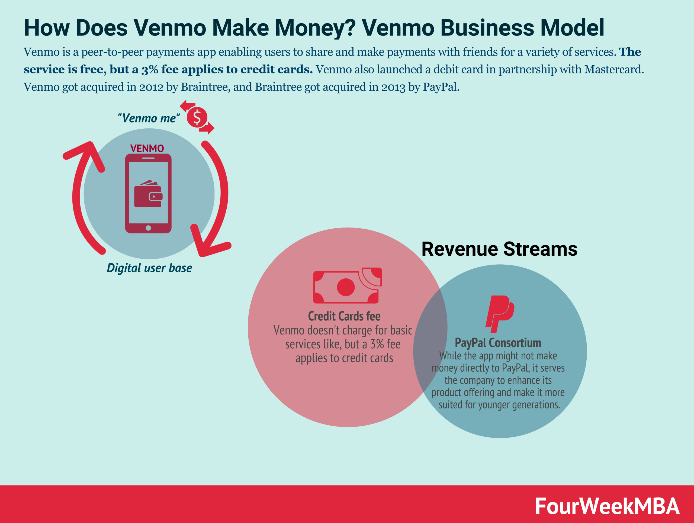

## Table of Contents

## What is Venmo and how does its debit card work?

Venmo is an app that lets you send and receive money easily from your phone. You can use it to pay friends back for things like dinners or rent. It's like a digital wallet where you can keep money and transfer it to other people who also use Venmo. To start using Venmo, you need to download the app, create an account, and link it to your bank account or a debit/credit card.

The Venmo debit card is a special card that you can get if you use Venmo. It's connected to your Venmo account, so you can spend the money in your Venmo account directly, just like you would with a regular debit card. You can use it to buy things in stores or online, and the money comes out of your Venmo balance. It's handy because you don't need to move money to your bank account first; you can spend it right away from your Venmo account.

## How does PayPal relate to Venmo?

PayPal and Venmo are both owned by the same company, so they work together but are different apps. PayPal is older and lets you do more things like buying things online, sending money to people, and even getting paid by businesses. Venmo is simpler and mostly used for sending money to friends or splitting bills. You can connect your Venmo account to PayPal, which makes it easy to move money between the two.

If you have money in Venmo, you can move it to PayPal and use it there. This is good because PayPal works in more places and countries than Venmo. Also, if you want to use your Venmo money to shop online or pay for things where PayPal is accepted, you can do that easily by transferring your money first. So, while Venmo and PayPal are separate, they help each other out because they're part of the same family.

## What are the basic financial strategies of PayPal?

PayPal makes money in a few main ways. First, they charge fees when people use their service to buy things or send money. For example, if you use PayPal to buy something from a store, the store might pay a fee to PayPal. Also, if you send money to someone in another country, PayPal charges a fee for that. These fees add up and are a big part of how PayPal makes money.

Another way PayPal earns money is by holding onto the money people keep in their PayPal accounts. They can use this money to invest and earn interest, which is another way they make money. PayPal also offers other services like credit and loans, which can bring in more money through interest and fees. So, by charging for transactions, investing the money they hold, and offering extra services, PayPal has different ways to make money and keep growing.

## How has the introduction of the Venmo debit card affected PayPal's user base?

The Venmo debit card has helped PayPal grow its user base by making it easier for people to spend their Venmo money. Before the debit card, people had to move money from Venmo to their bank account before they could spend it. Now, with the debit card, they can use their Venmo money right away to buy things in stores or online. This makes Venmo more useful and attracts more people to use it, which in turn helps PayPal because they own Venmo.

The debit card also makes Venmo more appealing to younger people who like using apps to manage their money. Since Venmo is popular with this group, the debit card has helped keep them using PayPal's services. By offering a way to spend money directly from Venmo, PayPal has made its overall service more attractive, leading to more users and more activity on their platform.

## What are the revenue streams for PayPal and how might the Venmo debit card impact them?

PayPal makes money in different ways. They charge fees when people use PayPal to buy things or send money. For example, when you buy something from a store using PayPal, the store pays a fee to PayPal. Also, when you send money to someone in another country, PayPal charges a fee for that. Another way PayPal earns money is by holding onto the money people keep in their PayPal accounts. They can invest this money and earn interest from it. PayPal also offers services like credit and loans, which bring in more money through interest and fees.

The Venmo debit card can help PayPal make more money. When people use the Venmo debit card to spend their money, it means more transactions are happening. More transactions mean more fees for PayPal. Also, the debit card makes Venmo more useful, so more people might use Venmo and PayPal. This could lead to more money in PayPal accounts, which PayPal can invest and earn interest from. So, the Venmo debit card can help PayPal grow its revenue in different ways.

## How does the Venmo debit card fit into PayPal's broader financial strategy?

The Venmo debit card is a big part of PayPal's plan to make more money and get more people to use their services. The card lets people spend their Venmo money right away, without having to move it to their bank first. This makes Venmo more useful and can bring in more users. When more people use Venmo, it means more money is moving around in PayPal's system. PayPal can then charge fees on these transactions, which is one of their main ways to make money.

Also, the Venmo debit card helps PayPal keep their users happy and coming back. It's popular with younger people who like using apps for money stuff. By offering a card that makes Venmo even better, PayPal can keep these users and maybe even get more. This not only helps PayPal make more money from fees but also lets them hold onto more money in their system, which they can invest and earn interest from. So, the Venmo debit card is a smart move that fits well with PayPal's goals to grow and make more money.

## What are the competitive advantages that the Venmo debit card provides to PayPal?

The Venmo debit card gives PayPal a big edge over other companies because it makes Venmo even more useful. People can spend their Venmo money right away without moving it to their bank first. This is a big deal because it makes Venmo more convenient and attractive to users, especially young people who like using apps for money stuff. When more people use Venmo, it means more money is moving around in PayPal's system. This leads to more fees for PayPal, which is one of their main ways to make money.

Also, the Venmo debit card helps PayPal stand out from other payment apps. It's not just about sending money to friends anymore; now, Venmo users can use their money to buy things in stores or online. This makes Venmo a bigger part of people's everyday lives. By offering this card, PayPal can keep their users happy and coming back, which helps them stay ahead of other companies trying to do the same thing.

## How has the market responded to the launch of the Venmo debit card?

When Venmo launched its debit card, people were excited because it made using Venmo even easier. Before, if you wanted to spend your Venmo money, you had to move it to your bank first. Now, with the debit card, you can use your Venmo money right away to buy things in stores or online. This made Venmo more useful and popular, especially with younger people who like using apps for money stuff. More people started using Venmo, which helped PayPal, the company that owns Venmo, grow its business.

The market saw the Venmo debit card as a smart move by PayPal. It helped PayPal stand out from other payment apps because it added a new way for people to use their money. Other companies noticed this and some even started offering similar cards. But Venmo's card was popular because it was easy to use and worked well with the Venmo app. Overall, the launch of the Venmo debit card was a big success and helped PayPal keep growing and staying ahead in the market.

## What are the potential risks and challenges that the Venmo debit card poses to PayPal's financial strategy?

One big risk for PayPal with the Venmo debit card is that people might not like it. If people find the card hard to use or if they have problems with it, they might stop using Venmo. This would be bad for PayPal because they make money when people use Venmo a lot. Also, if something goes wrong with the card, like if it gets hacked or if there are mistakes with the money, it could make people lose trust in PayPal and Venmo. That could hurt PayPal's business a lot.

Another challenge is that other companies might start offering their own debit cards that work better than Venmo's. If another app comes out with a card that people like more, they might switch to that app instead of using Venmo. This would mean less money moving around in PayPal's system, which is how they make money. PayPal has to keep making the Venmo debit card better and easier to use so people keep choosing it over other options. If they don't, they could lose users and money.

## How does the Venmo debit card influence PayPal's approach to regulatory compliance and financial security?

The Venmo debit card makes PayPal have to be even more careful about following the rules. When people use the card to spend money, PayPal has to make sure they are following all the laws about how money moves around. This means they have to keep good records and report things to the government when they need to. If they don't do this right, they could get in big trouble. So, the debit card makes PayPal have to work harder to make sure they are doing everything by the book.

The card also makes PayPal have to be extra careful about keeping people's money safe. When people use the Venmo debit card, they are trusting PayPal to protect their money from hackers and thieves. PayPal has to use strong security to make sure no one can steal money from people's Venmo accounts. If there is a problem and money gets stolen, people might stop using Venmo and PayPal could lose a lot of business. So, the Venmo debit card makes PayPal have to work hard to keep everything safe and secure.

## What advanced analytics and data strategies does PayPal employ to optimize the performance of the Venmo debit card?

PayPal uses smart computer tools to learn about how people use the Venmo debit card. They look at all the data from the card to see things like when people use it the most, what they buy with it, and how much money they spend. This helps PayPal make the card better. For example, if they see that a lot of people use the card to buy things online, they might make it easier to use for online shopping. They also use this data to find out if people are having problems with the card, so they can fix those problems quickly.

PayPal also uses this information to make their marketing better. They can see what kind of people like using the Venmo debit card and then tell more people like them about it. This helps them get more users. They also use the data to see if the card is making them more money. If they see that the card is bringing in a lot of fees, they might decide to make the card even better or tell more people about it. By using data smartly, PayPal can make the Venmo debit card work better for them and their users.

## How might future innovations in payment technology affect the strategic role of the Venmo debit card within PayPal's ecosystem?

As payment technology keeps changing, the Venmo debit card could become even more important for PayPal. New tech like contactless payments, where you can pay by just tapping your card or phone, could make the Venmo debit card easier and faster to use. If Venmo adds these features, more people might want to use it. Also, if new technology makes it easier to use Venmo money in more places, like other countries or new types of stores, the Venmo debit card could help PayPal grow even more. PayPal would need to keep up with these changes to make sure the Venmo debit card stays useful and popular.

But there are also risks. If other companies come up with new and better ways to pay, people might start using those instead of the Venmo debit card. For example, if a new app lets people pay with their phones in a way that's easier or safer than the Venmo debit card, PayPal might lose users. PayPal will need to keep making the Venmo debit card better and safer to stay ahead. They'll need to use the latest technology to make sure the Venmo debit card keeps helping them make money and grow their business.

## References & Further Reading

[1]: Marcos Lopez de Prado. ["Advances in Financial Machine Learning"](https://www.amazon.com/Advances-Financial-Machine-Learning-Marcos/dp/1119482089). Wiley, 2018.

[2]: David Aronson. ["Evidence-Based Technical Analysis: Applying the Scientific Method and Statistical Inference to Trading Signals"](https://www.amazon.com/Evidence-Based-Technical-Analysis-Scientific-Statistical/dp/0470008741). Wiley, 2006.

[3]: Stefan Jansen. ["Machine Learning for Algorithmic Trading: Predictive Models to Extract Signals from Market and Alternative Data for Systematic Trading Strategies with Python, 2nd Edition"](https://github.com/stefan-jansen/machine-learning-for-trading). Packt Publishing, 2020.

[4]: Ernest P. Chan. ["Quantitative Trading: How to Build Your Own Algorithmic Trading Business"](https://www.amazon.com/Quantitative-Trading-Build-Algorithmic-Business/dp/0470284889). Wiley, 2008.

[5]: Joel Hasbrouck. ["Empirical Market Microstructure: The Institutions, Economics, and Econometrics of Securities Trading"](https://academic.oup.com/book/52241). Oxford University Press, 2007. 

[6]: Amir Massoud Farahmand, Csaba Szepesvári, and Jan Pieter van der Heijden. ["Reinforcement learning for market making in batch and online high-frequency trading"](https://scholar.google.com/citations?user=G5SAV7gAAAAJ&hl=en). Journal of Statistical Theory and Practice, 2018.