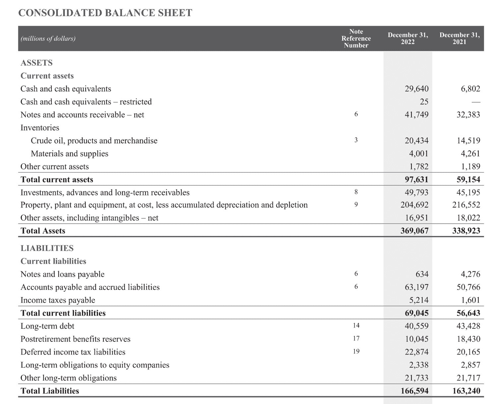

## Table of Contents

## What is working capital?

Working capital is the money a business has to run its day-to-day operations. It's calculated by taking the company's current assets, like cash and inventory, and subtracting its current liabilities, like bills and debts that need to be paid soon. Having enough working capital is important because it helps a business pay its short-term expenses and keep running smoothly.

If a business has more working capital, it can handle unexpected costs or take advantage of new opportunities. On the other hand, if a business doesn't have enough working capital, it might struggle to pay its bills on time, which can lead to bigger problems. Managing working capital well is key to making sure a business stays healthy and can grow over time.

## How is working capital calculated?

Working capital is figured out by taking a company's current assets and subtracting its current liabilities. Current assets are things like cash, money that people owe you, and stuff you have in stock that you plan to sell soon. Current liabilities are what you need to pay in the near future, like bills or loans.

If you have more current assets than current liabilities, you have positive working capital. This means you have enough money to cover your short-term costs and keep your business going. If your current liabilities are more than your current assets, you have negative working capital, which can be a problem because it might mean you can't pay your bills on time.

## What is cash flow?

Cash flow is the money that comes in and goes out of a business. It's like keeping track of the cash moving through your wallet. When you get money from sales or other sources, that's cash coming in. When you pay for things like rent, salaries, or supplies, that's cash going out. Good cash flow means you have enough money coming in to cover what's going out, which helps keep your business running smoothly.

If your cash flow is positive, it means you're making more money than you're spending, which is great. But if it's negative, you're spending more than you're making, and that can be a problem. Managing cash flow well is really important because it helps you know if you can pay your bills on time and if you have extra money to grow your business or save for the future.

## How do changes in working capital affect cash flow?

Changes in working capital can really affect a business's cash flow. If a business has more working capital, it means they have more money to use for their day-to-day needs. For example, if they buy more inventory or have more cash on hand, it uses up cash, which can make cash flow go down. On the other hand, if they collect money from customers faster or pay their bills slower, it can help their cash flow because they have more cash available.

If working capital goes down, it can mean the business is using less cash for its daily operations. For instance, if they sell off inventory or collect money owed to them, it brings in more cash and can improve cash flow. But if they have to pay off a lot of bills quickly, it can use up their cash and make cash flow worse. Keeping a good balance in working capital is important for making sure the business has enough cash to keep running smoothly.

## What are the components of working capital that impact cash flow?

The main parts of working capital that affect cash flow are things like inventory, accounts receivable, and accounts payable. When a business buys more inventory, it uses up cash, which can make cash flow go down. But if they sell that inventory, they get cash back, which can help their cash flow. Accounts receivable is money that customers owe the business. If the business can get this money faster, it helps their cash flow because they have more cash coming in. On the other hand, if customers take a long time to pay, it can hurt cash flow.

Accounts payable is money the business owes to others, like suppliers. If the business can pay these bills slower without any penalties, it keeps more cash in the business, which can help cash flow. But if they have to pay these bills quickly, it uses up their cash and can make cash flow worse. So, managing these parts of working capital well is important for keeping a good balance of cash coming in and going out of the business.

## Can you explain the difference between positive and negative working capital changes?

Positive working capital changes happen when a business has more current assets than current liabilities. This means they have more money coming in than going out for their day-to-day needs. For example, if a business sells more products and gets paid quickly, or if they manage to buy inventory at a lower cost, their working capital goes up. This is good because it means they have more cash to use for their business, which can help them pay bills on time and maybe even grow their business.

Negative working capital changes happen when a business has more current liabilities than current assets. This means they are spending more money than they are bringing in for their daily operations. For instance, if a business has to pay a lot of bills quickly but their customers are slow to pay them, their working capital goes down. This can be a problem because it might mean they don't have enough cash to cover their costs, which can lead to bigger issues like not being able to pay employees or suppliers on time.

## How do increases in accounts receivable affect cash flow?

When a business has more money owed to them, which is called accounts receivable, it can make their cash flow go down. This is because the money they are owed isn't actually in their bank account yet. If customers take a long time to pay what they owe, the business might not have enough cash to pay for things like rent, salaries, or supplies right away. So, even though they will get the money eventually, having more accounts receivable means less cash on hand now.

To help with this, businesses can try to get their customers to pay faster. They might offer discounts for early payments or have strict rules about when payments are due. By doing this, they can turn their accounts receivable into cash sooner, which can improve their cash flow. It's all about finding a good balance so the business has enough money to keep running smoothly while waiting for customers to pay up.

## What is the impact of changes in inventory levels on cash flow?

When a business buys more inventory, it spends cash, which makes their cash flow go down. This is because the money they used to buy the inventory is no longer in their bank account. If they keep a lot of inventory on hand for a long time, it ties up their cash, which can make it harder to pay for other things they need right away, like rent or employee salaries.

On the other hand, when a business sells its inventory, it gets cash back, which can help their cash flow. If they can sell their inventory quickly, it means they can turn their products into cash faster. This is good because it keeps more money flowing into the business, helping them cover their costs and maybe even grow. So, managing inventory levels well is important for keeping a healthy cash flow.

## How do accounts payable changes influence cash flow?

When a business has more accounts payable, it means they owe more money to others, like suppliers. If they can take longer to pay these bills without getting into trouble, it can help their cash flow. This is because they get to keep their cash longer, which means they have more money to use for other things they need right away, like paying employees or buying more inventory. So, having more accounts payable can be good for cash flow if they manage it well.

On the other hand, if a business has to pay their accounts payable quickly, it can hurt their cash flow. This is because they have to use up their cash to pay these bills, which means they have less money to use for other things. If they don't have enough cash to cover these payments, it can cause problems like not being able to pay other bills on time. So, it's important for a business to find a good balance with their accounts payable to keep their cash flow healthy.

## What strategies can businesses use to manage working capital for better cash flow?

Businesses can manage their working capital better by keeping a close eye on their inventory. If they buy too much inventory, it ties up their cash, which can hurt their cash flow. So, they should try to buy just enough inventory to meet their needs without having too much sitting around. They can also try to sell their inventory faster, which turns their products into cash more quickly. This helps their cash flow because they have more money coming in.

Another way to manage working capital is by getting customers to pay faster. If customers take a long time to pay what they owe, it can make cash flow worse because the business doesn't have that money yet. Businesses can offer discounts for early payments or have strict rules about when payments are due. This helps turn accounts receivable into cash sooner, which is good for cash flow. 

Lastly, businesses can also manage their accounts payable to help their cash flow. If they can take a bit longer to pay their bills without getting into trouble, it means they can keep their cash longer. This helps because they have more money to use for other things they need right away. But they need to be careful not to wait too long, or they might upset their suppliers. Finding a good balance with accounts payable can really help keep cash flow healthy.

## How can financial ratios help in analyzing the impact of working capital on cash flow?

Financial ratios can help businesses understand how their working capital is affecting their cash flow. One important ratio is the current ratio, which is calculated by dividing current assets by current liabilities. This ratio shows if a business has enough short-term assets to cover its short-term debts. If the current ratio is high, it means the business has more working capital, which can be good for cash flow because it has more cash to use for daily operations. But if the ratio is too high, it might mean the business is not using its assets efficiently, which can tie up cash and hurt cash flow.

Another useful ratio is the inventory turnover ratio, which shows how quickly a business sells its inventory. It's calculated by dividing the cost of goods sold by the average inventory. A high inventory turnover ratio means the business is selling its products quickly, which is good for cash flow because it turns inventory into cash faster. On the other hand, a low ratio might mean the business is holding onto too much inventory, which uses up cash and can make cash flow worse. By keeping an eye on these ratios, businesses can make better decisions about managing their working capital to improve their cash flow.

## What are some advanced techniques for forecasting the impact of working capital changes on future cash flows?

One advanced technique for forecasting the impact of working capital changes on future cash flows is using cash flow forecasting models. These models take into account historical data on inventory levels, accounts receivable, and accounts payable to predict how changes in these areas will affect cash flow in the future. By analyzing trends and patterns, businesses can see how different scenarios, like buying more inventory or collecting payments faster, might impact their cash flow. This helps them plan better and make sure they have enough cash to cover their needs.

Another technique is using scenario analysis, where businesses create different "what if" situations to see how changes in working capital might affect their cash flow. For example, they might look at what happens if customers start paying invoices 30 days later than usual, or if they need to buy more inventory because of a new product launch. By running these scenarios, businesses can prepare for different outcomes and adjust their strategies to keep their cash flow healthy. This kind of planning helps them stay ready for unexpected changes and manage their working capital more effectively.

## What is the Importance of Cash Flow and Working Capital?

Cash flow is a critical financial metric that represents the net amount of cash and cash-equivalents flowing in and out of a business over a specific period. It provides insight into a company's liquidity, which is essential for meeting obligations such as payroll, operating expenses, and debt servicing. The formula for calculating cash flow from operations is as follows:

$$
\text{Cash Flow from Operations} = \text{Net Income} + \text{Non-Cash Expenses} - \text{Changes in Working Capital}
$$

Understanding and monitoring cash flow is crucial for assessing a company's financial health because it encapsulates the ability to generate sufficient cash to sustain and grow operations.

Working capital, on the other hand, is defined as the difference between a company’s current assets and liabilities. It is a fundamental indicator of short-term financial health and operational efficiency. The formula for working capital is:

$$
\text{Working Capital} = \text{Current Assets} - \text{Current Liabilities}
$$

It provides a snapshot of the company’s capacity to fund its day-to-day operations and handle unexpected expenses. A positive working capital indicates that a company can financially manage its short-term obligations, which is a sign of operational efficiency and financial stability.

Healthy cash flow and working capital are synonymous with a company's ability to maintain [liquidity](/wiki/liquidity-risk-premium) and fund its operations efficiently. Liquidity refers to the ease with which assets can be converted into cash without affecting their market price. Efficient liquidity management ensures that a company can meet its short-term debts and operational expenses without undue stress on financial resources. 

In terms of strategic planning and investment, positive cash flow and working capital position a company for long-term growth. A surplus allows businesses to invest in expansion, research and development, and market expansion, while also providing a buffer against economic downturns. 

In summary, cash flow and working capital are interconnected metrics that provide comprehensive insight into a company's financial health. Monitoring these indicators helps financial professionals optimize resource allocation, ensure operational viability, and support sustainable strategic planning and investment decisions.

## References & Further Reading

[1]: Bergstra, J., Bardenet, R., Bengio, Y., & Kégl, B. (2011). ["Algorithms for Hyper-Parameter Optimization."](https://papers.nips.cc/paper/4443-algorithms-for-hyper-parameter-optimization) Advances in Neural Information Processing Systems 24.

[2]: ["Advances in Financial Machine Learning"](https://www.amazon.com/Advances-Financial-Machine-Learning-Marcos/dp/1119482089) by Marcos Lopez de Prado

[3]: ["Evidence-Based Technical Analysis: Applying the Scientific Method and Statistical Inference to Trading Signals"](https://www.amazon.com/Evidence-Based-Technical-Analysis-Scientific-Statistical/dp/0470008741) by David Aronson

[4]: ["Machine Learning for Algorithmic Trading"](https://github.com/stefan-jansen/machine-learning-for-trading) by Stefan Jansen

[5]: ["Quantitative Trading: How to Build Your Own Algorithmic Trading Business"](https://www.amazon.com/Quantitative-Trading-Build-Algorithmic-Business/dp/1119800064) by Ernest P. Chan