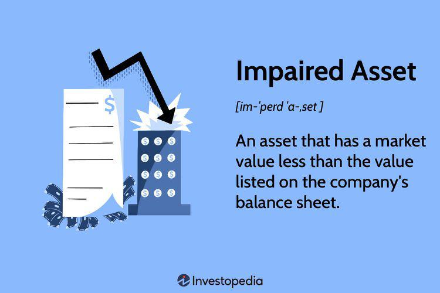

## Table of Contents

## What is an impaired asset?

An impaired asset is something a company owns that has lost some of its value. This can happen for many reasons, like if a machine breaks down or if a building isn't worth as much as before. When this happens, the company needs to recognize this loss in value on their financial statements. This is important because it helps give a true picture of the company's worth.

To figure out if an asset is impaired, companies compare the asset's current value to what they think they can get from it in the future. If the future value is less, then the asset is impaired. They then have to adjust the value of the asset on their books to reflect this lower amount. This process is called impairment testing, and it's something companies do regularly to make sure their financial statements are accurate.

## Why is it important to evaluate assets for impairment?

Evaluating assets for impairment is important because it helps companies show a true picture of their financial health. When an asset loses value, like a piece of machinery that breaks down or a building that becomes less valuable, the company needs to adjust its records to reflect this. If they don't, their financial statements might make the company look healthier than it really is. This can mislead investors, lenders, and other people who rely on these statements to make decisions.

Regular impairment testing ensures that the value of assets on the company's books matches their real-world value. This practice helps maintain trust and transparency in financial reporting. By accurately reporting the value of their assets, companies can make better decisions about future investments and operations. It also helps them comply with accounting standards and regulations, avoiding potential legal issues.

## How can you identify if an asset is impaired?

You can tell if an asset is impaired by comparing its current book value with what you expect to get from it in the future. This is called the recoverable amount. If the recoverable amount is less than the book value, then the asset is impaired. For example, if a company bought a machine for $10,000 but now thinks it can only get $7,000 from it, the asset is impaired by $3,000.

To figure out the recoverable amount, you can look at two things: the fair value less costs to sell, and the value in use. The fair value less costs to sell is what you could sell the asset for minus any costs to sell it. The value in use is how much money the asset will make for the company in the future. You pick the higher of these two amounts as the recoverable amount. If this is less than the book value, you need to adjust the asset's value on the books to reflect the impairment.

## What are the common causes of asset impairment?

Asset impairment can happen for many reasons. One common cause is physical damage. If a machine breaks down or a building gets damaged, it can lose value. Another reason is changes in the market. If the demand for what the asset produces goes down, the asset might not be as valuable anymore. For example, if a factory makes a product that people stop buying, the factory's value could go down.

Another cause of asset impairment is legal or regulatory changes. New laws or rules can make an asset less useful or valuable. For instance, if a new environmental law makes it more expensive to use a certain type of machinery, that machinery might lose value. Economic factors can also play a role. During a recession, asset values can drop because people and businesses have less money to spend.

Lastly, technological changes can lead to impairment. If a new technology comes along that makes an old asset less useful or outdated, its value can go down. For example, if a company uses old computers and a new, better model comes out, the old computers might be worth less. All these reasons can make an asset impaired, and companies need to keep an eye on these factors to manage their assets properly.

## What are the basic steps in the impairment evaluation process?

The first step in the impairment evaluation process is to look at the signs that an asset might be impaired. This could be because of damage, changes in the market, new laws, economic downturns, or new technology. If there are signs of impairment, the next step is to figure out the asset's recoverable amount. This is done by comparing the fair value less costs to sell with the value in use. The fair value less costs to sell is what you could sell the asset for minus any costs to sell it. The value in use is how much money the asset will make for the company in the future. You pick the higher of these two amounts as the recoverable amount.

Once you have the recoverable amount, you compare it to the asset's current book value. If the recoverable amount is less than the book value, the asset is impaired. The difference between the book value and the recoverable amount is the impairment loss. This loss needs to be recorded on the company's financial statements. This means adjusting the value of the asset on the books to reflect the lower recoverable amount. This process helps keep the company's financial statements accurate and trustworthy.

## How do you calculate the recoverable amount of an impaired asset?

To calculate the recoverable amount of an impaired asset, you need to look at two things: the fair value less costs to sell and the value in use. The fair value less costs to sell is how much money you could get if you sold the asset, minus any costs to sell it. For example, if you could sell a machine for $10,000 but it would cost $1,000 to sell it, the fair value less costs to sell would be $9,000. The value in use is how much money the asset will make for the company in the future. To find this, you estimate the future cash flows the asset will bring in and then figure out what those future cash flows are worth today.

Once you have both numbers, you pick the higher one as the recoverable amount. If the fair value less costs to sell is $9,000 and the value in use is $8,000, the recoverable amount would be $9,000. After finding the recoverable amount, you compare it to the asset's current book value. If the recoverable amount is less than the book value, the asset is impaired. For example, if the book value of the machine is $12,000 and the recoverable amount is $9,000, the asset is impaired by $3,000. You then need to record this impairment loss on the company's financial statements by adjusting the asset's value to the recoverable amount.

## What is the difference between fair value less costs of disposal and value in use?

Fair value less costs of disposal is what you could get if you sold an asset, minus any costs to sell it. For example, if you could sell a machine for $10,000 but it would cost $1,000 to sell it, the fair value less costs of disposal would be $9,000. This number helps you understand how much money you could get right now if you decided to sell the asset.

Value in use is how much money the asset will make for the company in the future. To find this, you estimate the future cash flows the asset will bring in and then figure out what those future cash flows are worth today. For example, if a machine will help the company make $8,000 over the next few years, you would calculate the present value of that $8,000 to get the value in use. This number helps you understand how valuable the asset is to keep and use in the business.

## How should an impairment loss be recorded in the financial statements?

When a company finds out that an asset is impaired, they need to record the impairment loss on their financial statements. This means they have to lower the value of the asset on their books to match its new, lower recoverable amount. The difference between the asset's old book value and its new recoverable amount is the impairment loss. This loss is then reported on the income statement as an expense, which makes the company's net income for that period go down.

After recording the impairment loss on the income statement, the company also needs to adjust the asset's value on the balance sheet. They do this by reducing the asset's carrying amount to its recoverable amount. This adjustment helps make sure the balance sheet shows a true picture of the company's assets. By doing this, the company keeps its financial statements accurate and transparent, which is important for investors and other people who look at the company's financial health.

## What are the accounting standards related to asset impairment?

There are two main accounting standards that deal with asset impairment: the International Financial Reporting Standards (IFRS) and the Generally Accepted Accounting Principles (GAAP) used in the United States. IFRS uses a standard called IAS 36, which says that companies need to check their assets for impairment if there are signs that the asset's value has gone down. If an asset is impaired, the company has to lower its value on the books to the recoverable amount, which is the higher of the fair value less costs to sell and the value in use. This helps make sure the financial statements show the true value of the company's assets.

GAAP has its own rules for impairment, mainly under the Accounting Standards Codification (ASC) 350 and ASC 360. ASC 350 deals with the impairment of goodwill and other intangible assets, while ASC 360 focuses on long-lived assets like buildings and equipment. Under GAAP, companies have to test for impairment when there are signs that an asset's value has dropped. If an asset is found to be impaired, the company has to record the loss on the income statement and adjust the asset's value on the balance sheet. Both IFRS and GAAP aim to keep financial reporting accurate and trustworthy by making sure companies show the real value of their assets.

## How do you reverse an impairment loss, and under what conditions is it allowed?

Reversing an impairment loss means increasing the value of an asset back to what it was before, or close to it, if the asset's value goes up again. Under IFRS, you can reverse an impairment loss for most assets if there's clear evidence that the reasons for the impairment are no longer there. For example, if a machine was impaired because it was damaged, but then it gets fixed and its value goes up, you can reverse the impairment loss. The reversal can't make the asset's value higher than it would have been if the impairment had never happened. You record the reversal on the income statement as income, and you also increase the asset's value on the balance sheet.

Under GAAP, reversing an impairment loss is trickier. Generally, you can't reverse an impairment loss for most assets once it's been recorded. There's one exception, though: if you impaired a certain type of asset called an asset held for sale, and you later decide not to sell it, you can reverse the impairment loss. This is different from IFRS, where reversals are allowed for more types of assets. So, if you're following GAAP, you need to be careful about when and if you can reverse an impairment loss.

## What are the tax implications of recognizing an impairment loss?

When a company recognizes an impairment loss, it can affect their taxes. An impairment loss reduces the value of an asset on the company's books, and this reduction is often treated as an expense. This expense can lower the company's taxable income for the year, which means they might pay less in taxes. However, tax rules can be different from accounting rules, so companies need to check with their tax advisors to make sure they're following the right rules.

In some countries, tax laws might not let companies claim the full impairment loss right away. Instead, they might have to spread it out over several years. This is called depreciation or amortization for tax purposes. So, while the impairment loss might lower the company's taxable income, it might not do so all at once. It's important for companies to understand these rules to plan their taxes properly and avoid any surprises.

## How do impairment assessments differ for different types of assets, such as goodwill versus tangible assets?

Impairment assessments for goodwill are different from those for tangible assets like buildings or machines. Goodwill is an intangible asset that comes from buying another company. It represents the value of things like a company's reputation or customer base that aren't physical. To check if goodwill is impaired, companies do something called a goodwill impairment test. This test compares the fair value of the reporting unit (the part of the company where the goodwill belongs) to its carrying amount, including the goodwill. If the carrying amount is higher than the fair value, the goodwill is impaired. The company then has to lower the value of the goodwill on their books and record the loss.

For tangible assets, like machines or buildings, the impairment test is a bit different. Companies look for signs that the asset's value might have gone down, like damage or changes in the market. If they see these signs, they calculate the asset's recoverable amount, which is the higher of the fair value less costs to sell and the value in use. If this recoverable amount is less than the asset's book value, the asset is impaired. The company then records the impairment loss on the income statement and adjusts the asset's value on the balance sheet. So, while both types of assets need to be checked for impairment, the way you do it and what you look at can be different.

## What are the key differences between Depreciation and Impairment?

Depreciation and impairment represent distinct concepts in financial accounting, each playing a critical role in asset valuation. Understanding the differences between these processes is essential for accurate financial analysis.

**Definition and Explanation of Depreciation**

Depreciation refers to the systematic allocation of the cost of a tangible asset over its useful life. It reflects the wear and tear, decay, or gradual obsolescence of physical assets, allowing a company to distribute the asset's expense over periods that benefit from its use. Depreciation is typically calculated using methods such as the straight-line method, declining balance method, or units of production method.

A simple formula for calculating straight-line depreciation is given by:

$$
\text{Depreciation Expense (DE)} = \frac{\text{Cost of the Asset} - \text{Residual Value}}{\text{Useful Life}}
$$

where the "Cost of the Asset" is the initial purchase price, "Residual Value" is the asset's salvage value at the end of its useful life, and "Useful Life" is the period over which the asset is expected to be used.

**How Depreciation Differs from Impairment in Financial Accounting**

While depreciation is a planned and predictable allocation of asset cost, impairment occurs when there is an abrupt reduction in the recoverable amount of an asset below its carrying amount. Impairment is often triggered by external or internal factors, such as market conditions, legal changes, or technological advancements, resulting in an unexpected loss of value.

Impairment testing is a critical process under accounting standards such as the Generally Accepted Accounting Principles (GAAP) and International Financial Reporting Standards (IFRS). The impairment loss is recognized when an asset's carrying amount exceeds its recoverable amount, calculated as the higher of its fair value less costs to sell or its value in use.

**Impact of Impairment on Asset Valuation Beyond Regular Depreciation**

Impairment affects asset valuation by immediately decreasing an asset's carrying amount on the balance sheet to its recoverable amount, thereby reflecting its diminished utility or benefit. This immediate reduction contrasts with the gradual approach of depreciation, emphasizing the suddenness and significance of impairment events. Consequently, impairment can have a profound impact on a company's financial statements, decreasing net income and asset values, and potentially affecting financial ratios and stakeholders' perceptions.

**The Strategic Importance of Distinguishing Between Depreciation and Impairment in Financial Analysis**

Differentiating between depreciation and impairment is strategically important in financial analysis. Depreciation aligns expenses with revenues, aiding in budgeting and financial planning. Conversely, impairment indicates more severe adjustments, often signaling strategic issues or adverse market conditions.

Recognizing impairment allows companies to address underlying asset valuation concerns, reassess asset utilization strategies, and communicate transparency and reliability to investors and analysts. Moreover, accurately distinguishing between these processes is crucial for regulatory compliance and ensuring precise reporting of an entity’s financial health and performance.

## What are the mitigation strategies and what are the closing thoughts?

Asset impairment poses significant challenges to corporate finance, but adopting effective strategies can mitigate these risks. Here, we explore several approaches to manage asset impairment, with a focus on improving asset management, leveraging technology and financial analysis, and anticipating future trends.

### Strategies to Mitigate Asset Impairment

#### Improving Asset Management

Effective asset management is essential in mitigating impairment risks. Companies can enhance their asset management practices by conducting regular asset evaluations and integrating comprehensive reporting systems. Employing skilled professionals to assess the physical and financial conditions of assets can lead to timely detection of potential impairments. Additionally, fostering a proactive maintenance culture can extend asset life and reduce the chance of sudden impairments. By aligning asset usage with the strategic goals of the organization, businesses can optimize asset performance and anticipate impairments before they materially affect financial statements.

#### Leveraging Technology and Financial Analysis

Technology plays a crucial role in identifying and managing asset impairment. Employing advanced software solutions, such as Enterprise Resource Planning (ERP) systems, offers centralized data access and enhances the accuracy of asset evaluations. These systems can continuously monitor asset conditions, trigger alerts for abnormal wear and tear, and help forecast future impairment risks.

Financial analysis tools also contribute to better impairment management. Techniques such as discounted cash flow (DCF) analysis allow firms to assess potential impairments by calculating the present value of expected future cash flows from an asset. The formula for DCF Analysis is:

$$
\text{DCF} = \sum \left( \frac{C_t}{(1 + r)^t} \right)
$$

where $C_t$ is the cash flow in year $t$ and $r$ is the discount rate.

Python libraries like NumPy and Pandas can be utilized to perform complex analyses and model various impairment scenarios. For instance, a Python function using NumPy to calculate DCF could look like this:

```python
import numpy as np

def calculate_dcf(cash_flows, discount_rate):
    periods = np.arange(len(cash_flows))
    discounted_values = cash_flows / (1 + discount_rate) ** periods
    return np.sum(discounted_values)

# Example usage
cash_flows = np.array([1000, 1500, 1200])  # expected cash flows for 3 years
discount_rate = 0.05  # 5% discount rate
print(calculate_dcf(cash_flows, discount_rate))  # Output: DCF value
```

### Future Trends in Financial Algorithms and Asset Management

As technology continues to evolve, the integration of financial algorithms with asset management will likely become more prevalent. Algorithmic solutions, such as machine learning models, are being developed to predict asset impairments by analyzing historical data and identifying patterns that precede impairments. These predictive analytics tools can deliver insights faster and more accurately than traditional methods, supporting strategic decision-making.

Blockchain technology also holds promise for asset management, offering transparency and traceability throughout an asset's lifecycle, which can be crucial for validating asset conditions and ownership in impairment assessments.

### Closing Thoughts

Efficient management of asset impairment is vital for maintaining accurate financial statements and safeguarding investor confidence. By combining improved asset management practices with advanced technology and financial analytics, companies can significantly reduce impairment risks. As future trends like machine learning and blockchain unfold, their integration into corporate finance will not only streamline impairment identification and management but also enhance the overall robustness of financial strategies. Adopting these cutting-edge approaches will ensure that businesses are better equipped to navigate the complexities of asset impairment in an ever-evolving economic landscape.

## References & Further Reading

[1]: ["Accounting for Impairment Testing"](https://www.ifrs.org/content/dam/ifrs/publications/html-standards/english/2022/issued/ias36.html) by the International Financial Reporting Standards (IFRS)

[2]: ["ASC 360-10: Property, Plant, and Equipment"](https://onlinelibrary.wiley.com/doi/10.1002/9781119357032.ch26) by the Financial Accounting Standards Board (FASB) - Accounting Standards Codification

[3]: ["Machine Learning for Asset Managers"](https://github.com/emoen/Machine-Learning-for-Asset-Managers) by Marcos Lopez de Prado

[4]: ["The Use of Artificial Intelligence in Predicting Financial Distress"](https://www.tandfonline.com/doi/full/10.1080/08839514.2022.2138124) published in the journal Mathematical Methods of Operations Research

[5]: ["Asset Impairment and the New Dynamics of Accounting Standard Assets"](https://www.ifrs.org/content/dam/ifrs/publications/pdf-standards/english/2021/issued/part-a/ias-36-impairment-of-assets.pdf) by Akinboade Oludele Afolabi, Social Science Research Network (SSRN)

[6]: ["International and U.S. Standards on Impaired Assets"](https://www.ifrs.org/issued-standards/list-of-standards/ias-36-impairment-of-assets/) by Jakub Karnowski and Lukasz Jabłonowski, Social Science Research Network (SSRN)

[7]: ["Financial Statement Analysis and Security Valuation"](https://highered.mheducation.com/sites/0078025311/student_view0/index.html) by Stephen H. Penman

[8]: ["Algorithmic Trading and DMA: An Introduction to Direct Access Trading Strategies"](https://www.semanticscholar.org/paper/Algorithmic-trading-%26-DMA-%3A-an-introduction-to-Johnson/aa5de1ab883d5e23b6651faa7c1807586d688e4b) by Barry Johnson

[9]: ["Financial Reporting for Managers: A Value-Creation Perspective"](https://www.amazon.com/Financial-Reporting-Managers-Value-Creation-Perspective/dp/0471457493) by Jamie Pratt