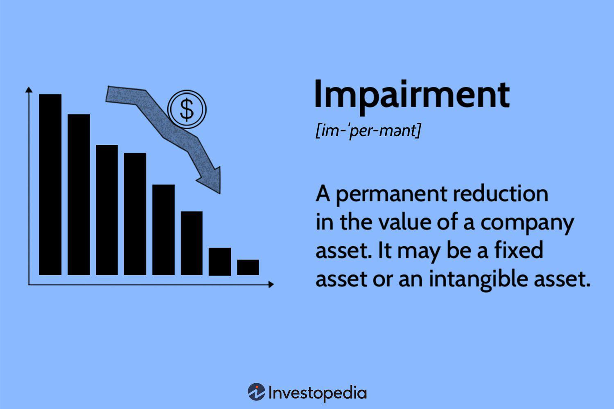

## Table of Contents

## What is an impairment charge?

An impairment charge is when a company decides that an asset they own, like a building or a machine, is worth less than what they paid for it. This can happen if the asset gets damaged, if there's a big change in the market, or if the asset just isn't as useful anymore. When this happens, the company has to lower the value of the asset on their financial records to match its new, lower value. This process is called taking an impairment charge.

Taking an impairment charge affects the company's financial statements. It shows up as a loss on the income statement, which means the company's profits for that period will be lower. On the balance sheet, the value of the asset is reduced, which can make the company's total worth look smaller. This is important because it gives a more accurate picture of what the company owns and how much it is really worth.

## Why do companies record impairment charges?

Companies record impairment charges to make sure their financial statements show the true value of their assets. If an asset, like a factory or a piece of equipment, loses value because it's damaged, outdated, or not as useful anymore, the company needs to update its records. This is important because it helps everyone who looks at the company's financials, like investors or banks, understand the real worth of the company.

Recording an impairment charge also follows the rules of accounting. These rules say that a company's financial statements should be honest and accurate. By taking an impairment charge, the company is being open about any losses in value, which helps keep their financial reporting clear and trustworthy. This way, people can make better decisions about investing in or lending money to the company.

## How are impairment charges calculated?

To calculate an impairment charge, a company first needs to figure out if an asset has lost value. They do this by comparing the asset's current fair value, which is what someone would pay for it now, with its carrying amount, which is what the company has it listed as on their [books](/wiki/algo-trading-books). If the fair value is less than the carrying amount, the asset is considered impaired.

Once they know the asset is impaired, the company calculates the impairment charge by finding the difference between the carrying amount and the fair value. This difference is the impairment charge, and it gets recorded as a loss on the income statement. This lowers the value of the asset on the balance sheet to match its new, lower fair value.

## What are the different types of assets that can be impaired?

Assets that can be impaired include tangible assets like buildings, machinery, and vehicles. These are physical things a company owns that can lose value if they get damaged, become outdated, or are not as useful anymore. For example, if a company's factory gets damaged in a storm, it might be worth less than before, so the company would need to record an impairment charge.

Intangible assets can also be impaired. These are non-physical assets like patents, trademarks, and goodwill. Goodwill often comes from when a company buys another company for more than the value of its tangible assets. If the expected benefits from the purchase don't happen, the goodwill can lose value. For instance, if a company paid a lot for a brand name but the brand becomes less popular, they might need to record an impairment charge for that intangible asset.

## How does an impairment charge affect a company's financial statements?

When a company records an impairment charge, it shows up as a loss on the income statement. This means the company's profits for that period will be lower because of the charge. For example, if a company had to lower the value of a factory because it got damaged, that loss would be shown on the income statement, making the company's earnings look smaller for that time.

On the balance sheet, the impairment charge reduces the value of the asset. So, if a company had a machine worth $100,000 and it became worth only $70,000, the balance sheet would show the machine at the new, lower value. This makes the total value of the company's assets smaller, which can affect how investors and others see the company's worth. By recording the impairment charge, the company makes sure its financial statements give a true picture of its current value.

## What are the accounting standards related to impairment charges?

There are two main sets of accounting rules that talk about impairment charges: the Generally Accepted Accounting Principles (GAAP) used in the United States and the International Financial Reporting Standards (IFRS) used in many other countries. Both sets of rules say that companies need to check their assets regularly to see if they've lost value. If an asset is worth less than what the company has it listed for, they need to record an impairment charge to show the new, lower value.

GAAP and IFRS have some differences in how they handle impairment charges. Under GAAP, companies usually test for impairment when there's a sign that an asset might be worth less, like if it's damaged or the market changes. Once they find an impairment, they lower the asset's value to its fair value. IFRS, on the other hand, requires companies to test certain assets for impairment every year, no matter what. If they find an impairment, they lower the asset's value to its recoverable amount, which is the higher of its fair value minus selling costs or its value in use. Both methods aim to make sure the company's financial statements show the true value of their assets.

## Can impairment charges be reversed, and if so, under what conditions?

Under GAAP, once a company records an impairment charge, they usually can't reverse it. If they lower the value of an asset because it's worth less, that new lower value stays on the books. This rule helps keep the financial statements honest and stops companies from changing their numbers too much.

IFRS is a bit different. If a company records an impairment charge and later the asset's value goes up, they can reverse the charge. But they can only do this if the new value is higher than what they had it at after the impairment. This way, the financial statements can show the true value of the asset if it gets better.

## How do impairment charges impact a company's stock price?

When a company records an impairment charge, it can make their stock price go down. This happens because the charge shows up as a loss on the company's income statement, which makes their profits look smaller. Investors might see this and think the company is not doing as well as they thought, so they might sell their stocks, which can lower the stock price.

But, the impact on the stock price can also depend on other things. If the impairment charge was expected or if investors think it's a one-time thing and not a sign of bigger problems, the stock price might not drop as much. Also, if the company explains the charge well and shows it's still strong in other ways, like good sales or new projects, the stock price might not fall a lot or could even stay the same.

## What are the tax implications of recording an impairment charge?

When a company records an impairment charge, it can affect their taxes. The charge shows up as a loss on the income statement, which means the company's profits look smaller. If a company's profits are lower, they might have to pay less in taxes because taxes are based on how much money the company makes. So, recording an impairment charge can sometimes help a company lower its tax bill for that year.

But, tax rules can be different from accounting rules. Just because a company records an impairment charge on their financial statements doesn't always mean they can use it to lower their taxes right away. Sometimes, tax laws have their own rules about when and how a company can claim a loss from an asset's value going down. So, a company might need to talk to a tax expert to make sure they're doing everything right when it comes to taxes and impairment charges.

## How do analysts interpret impairment charges when evaluating a company's performance?

When analysts look at a company's performance, they pay close attention to impairment charges. These charges show that a company has decided an asset, like a building or a machine, is now worth less than before. This can mean the company made a bad investment or that something unexpected happened, like damage to the asset. Analysts see impairment charges as a sign that the company's past decisions might not be working out as planned. They look at how big the charge is and what caused it to understand if it's a one-time problem or part of bigger issues.

Analysts also think about what the impairment charge means for the company's future. A big charge can make the company's profits look smaller for that year, which might worry investors. But if the charge is for something that won't happen again, like a natural disaster, analysts might not be too concerned. They look at the company's overall health and other financial numbers to see if the impairment charge is a small bump or a sign of deeper problems. This helps them give a fair view of the company's performance and future outlook.

## What are some real-world examples of significant impairment charges and their outcomes?

In 2016, Microsoft had to record a big impairment charge of $7.5 billion. This was because the value of some businesses they bought, like Nokia's phone business, went down a lot. The charge made Microsoft's profits for that year look a lot smaller. But, investors understood that this was because of past decisions and not because Microsoft was doing badly right then. So, even though the charge was big, it didn't hurt Microsoft's stock price too much, and the company kept doing well in other areas.

Another example is General Electric (GE) in 2018. They had to take an impairment charge of $22 billion. This was because the value of their power business and some other parts of the company dropped. The charge made GE's financial statements look really bad, and it made investors worried about the company's future. As a result, GE's stock price dropped a lot. It took a long time for GE to recover and show that they were fixing their problems and getting better.

## How can a company strategically manage impairment charges to optimize financial reporting?

A company can strategically manage impairment charges by being careful about when they decide to test their assets for impairment. They should do this regularly but also keep an eye on any big changes in the market or their business that might mean an asset is worth less. By doing these tests at the right times, a company can make sure they catch any drops in value early and record the impairment charges when it makes the most sense for their financial reports. This way, they can show a more accurate picture of their finances to investors and others.

Another way to manage impairment charges is to be open with investors about why they're taking the charges and what it means for the company. If a company can explain that an impairment charge is a one-time thing because of something like a natural disaster or a change in the market, investors might not be as worried. This can help keep the company's stock price from dropping too much. By being honest and clear about impairment charges, a company can build trust and show that they're on top of their financial health.

## What are Impairment Charges and How Are They Explained?

Impairment charges are reductions in the carrying value of an asset when its recoverable amount falls below its book value. This accounting practice ensures that an asset's value does not appear overstated on a company's balance sheet. Impairment charges are integral to financial accounting as they align financial statements with economic realities, enhancing transparency and investor confidence.

### Indicators for Impairment Reviews

Several indicators may signal the need for an impairment review. These can be internal factors such as significant changes in the use of an asset or external influences including market declines or adverse economic conditions. A drop in asset market value, legal restrictions affecting operations, or technological obsolescence can also necessitate impairment testing.

### Calculating Impairment Charges

The calculation of impairment charges involves estimating an asset's recoverable amount, defined as the higher of its fair value less costs to sell and its value in use. The value in use is the present value of future cash flows expected from the asset. If the recoverable amount is less than the asset's carrying amount, an impairment loss is recognized. The formula for impairment loss is:

$$
\text{Impairment Loss} = \text{Carrying Amount} - \text{Recoverable Amount}
$$

### Impact on Financials and Investor Perception

Impairment charges directly affect a company’s profitability, as they are recognized as an expense on the income statement, reducing net income. This can impact financial ratios and, subsequently, investor perception, potentially affecting stock prices. An increased frequency of impairment charges may signal underlying business issues, leading investors to reassess the company's financial health.

### Case Studies of Impairment Charges

Case studies from recent financial reports illustrate the implications of impairment charges. For instance, during economic downturns, companies in industries such as oil and gas frequently report significant impairments due to drastic drops in commodity prices. In one notable case, a global energy company recorded billions in impairment when it re-evaluated its asset portfolio amid falling oil demand.

Such examples underscore the importance of timely and accurate impairment assessments, prompting businesses to regularly review asset performance relative to changing market and operational conditions. These practices not only comply with accounting standards but also provide stakeholders with realistic insights into corporate financial health.

## References & Further Reading

[1]: Bergstra, J., Bardenet, R., Bengio, Y., & Kégl, B. (2011). ["Algorithms for Hyper-Parameter Optimization."](https://papers.nips.cc/paper/4443-algorithms-for-hyper-parameter-optimization) Advances in Neural Information Processing Systems 24.

[2]: Marcos Lopez de Prado. (2018). ["Advances in Financial Machine Learning."](https://www.amazon.com/Advances-Financial-Machine-Learning-Marcos/dp/1119482089) Wiley.

[3]: David Aronson. (2006). ["Evidence-Based Technical Analysis: Applying the Scientific Method and Statistical Inference to Trading Signals."](https://www.amazon.com/Evidence-Based-Technical-Analysis-Scientific-Statistical/dp/0470008741) Wiley.

[4]: Stefan Jansen. (2020). ["Machine Learning for Algorithmic Trading."](https://github.com/stefan-jansen/machine-learning-for-trading) Packt Publishing.

[5]: Ernest P. Chan. (2008). ["Quantitative Trading: How to Build Your Own Algorithmic Trading Business."](https://www.amazon.com/Quantitative-Trading-Build-Algorithmic-Business/dp/0470284889) Wiley.