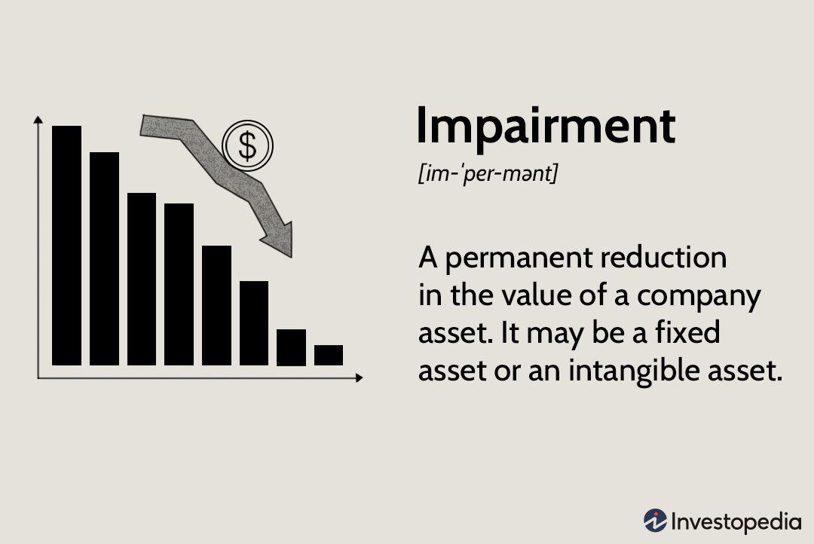

## Table of Contents

## What is impairment in accounting?

Impairment in accounting happens when the value of an asset drops below what is listed on the company's books. This can happen for many reasons, like if a piece of machinery gets damaged or if the market value of an investment goes down. When this happens, the company needs to adjust the value of the asset on their financial statements to reflect its new, lower value. This adjustment is called an impairment loss.

Recognizing impairment is important because it helps make sure that the financial statements show a true picture of the company's value. If a company doesn't account for impairment, it might look like it's worth more than it really is. This can mislead investors and other people who use the financial statements. By recording an impairment loss, the company is being honest about the current value of its assets, which helps everyone make better decisions.

## Why is it important to recognize impairment in financial statements?

Recognizing impairment in financial statements is important because it keeps the information honest and accurate. If an asset loses value, like a machine breaking down or a building becoming less valuable, the company needs to show this on their books. This way, the financial statements reflect what the company is really worth, not just what it used to be worth. If a company doesn't recognize impairment, it might look like it has more value than it actually does, which can be misleading.

This honesty is crucial for people who use the financial statements, like investors and creditors. They need to know the true value of the company to make good decisions about whether to invest or lend money. If the financial statements are not accurate because impairment is not recognized, these people might make bad choices based on wrong information. By recognizing impairment, the company helps everyone understand its real financial health, which builds trust and supports better decision-making.

## How does impairment differ from depreciation?

Impairment and depreciation both deal with the value of assets going down over time, but they work in different ways. Depreciation is like a planned reduction in value. It's something companies expect and account for regularly, usually spreading the cost of an asset over its useful life. For example, if a company buys a truck, they might depreciate its value a little bit each year until it's no longer useful.

Impairment, on the other hand, is more sudden and unexpected. It happens when something goes wrong and an asset loses a big chunk of its value all at once. This could be because of damage, changes in the market, or new laws that affect how useful the asset is. When this happens, the company has to quickly adjust the value of the asset on their [books](/wiki/algo-trading-books) to show its new, lower worth.

So, while depreciation is a routine part of managing assets, impairment is a response to unexpected events. Both are important for keeping a company's financial statements honest and accurate, but they serve different purposes and happen in different situations.

## What are the common causes of asset impairment?

Asset impairment often happens because of changes in the market or the economy. For example, if a company has a lot of inventory but suddenly no one wants to buy it anymore, the value of that inventory goes down. This can happen if there's a new product that's better or if people just stop wanting what the company is selling. Another reason could be if the value of money changes, like if there's inflation, which makes everything more expensive and can lower the value of what a company owns.

Sometimes, impairment is caused by physical damage or obsolescence. If a machine breaks down and can't be fixed easily, it's worth less than before. The same goes for buildings or other property that gets damaged by things like fires or natural disasters. Also, technology can make some assets outdated really fast. If a company uses computers or software that are no longer supported or useful, those assets lose value because they can't do the job anymore.

In some cases, changes in laws or regulations can lead to impairment. If a new law makes it harder or impossible to use an asset the way it was meant to be used, its value goes down. For instance, if new environmental rules mean a factory can't operate as it used to, the value of that factory drops. All these reasons show why it's important for companies to keep an eye on their assets and adjust their value when needed.

## What are the steps to test for asset impairment?

Testing for asset impairment involves a few steps that companies need to follow to see if their assets have lost value. First, they need to look at their assets and figure out if there are any signs that an asset might be worth less than what's on the books. These signs can be things like a big drop in the market value of the asset, damage to the asset, or changes in the law that affect how the asset can be used. If the company finds any of these signs, they need to do a more detailed check.

In the detailed check, the company compares the asset's carrying amount, which is its value on the books, with its recoverable amount. The recoverable amount is the higher of two things: the asset's fair value minus costs to sell, or its value in use. The fair value minus costs to sell is what the company could get if they sold the asset right now, after paying any costs to sell it. The value in use is how much money the asset is expected to bring in over its life. If the carrying amount is higher than the recoverable amount, the asset is impaired, and the company needs to record an impairment loss to lower its value on the books.

## How is the impairment loss calculated?

To calculate an impairment loss, a company first needs to find out the carrying amount of the asset. This is just the value of the asset as it's written on the company's books. Then, they need to figure out the recoverable amount of the asset. The recoverable amount is the higher of two numbers: the fair value of the asset minus any costs to sell it, or the value in use, which is how much money the asset is expected to make over its life. If the carrying amount is more than the recoverable amount, that difference is the impairment loss.

Once the company knows the impairment loss, they need to record it on their financial statements. This means they write down the value of the asset on their books to match its lower recoverable amount. This adjustment helps make sure that the financial statements show a true picture of what the company's assets are really worth. By doing this, the company keeps its financial reporting honest and helps everyone who looks at the statements understand the company's real value.

## What are the accounting entries for recording an impairment loss?

When a company finds out that an asset is impaired, it needs to make some changes in its accounting books. To record the impairment loss, the company will debit an impairment loss account. This account is usually listed under expenses on the income statement. At the same time, the company will credit the asset account on the balance sheet. This credit reduces the carrying amount of the asset to its new, lower recoverable amount.

For example, if a company has a piece of equipment with a carrying amount of $10,000 but finds out its recoverable amount is only $7,000, there's an impairment loss of $3,000. The company would make an entry where they debit the impairment loss account by $3,000 and credit the equipment account by $3,000. This way, the equipment's value on the balance sheet goes down to $7,000, and the $3,000 impairment loss shows up as an expense on the income statement, which lowers the company's net income for that period.

## Can an impairment loss be reversed, and if so, under what conditions?

Yes, an impairment loss can be reversed, but only under certain conditions. If the value of the asset goes back up after it was written down, the company can reverse the impairment loss. But this only happens if there's clear evidence that the reasons for the impairment loss are no longer there. For example, if the market for the asset improves or if the asset is repaired and can now be used better than before, the company might be able to reverse the impairment.

When reversing an impairment loss, the company increases the value of the asset on their books up to what it would have been if the impairment had never happened. They do this by crediting the impairment loss account, which reduces the expense on the income statement, and debiting the asset account on the balance sheet. But there's a limit: the new value of the asset can't be more than what it would have been if the impairment had never been recorded in the first place. This makes sure that the financial statements stay honest and accurate.

## How does impairment affect a company's financial ratios and performance indicators?

When a company records an impairment loss, it can change how the company looks on paper. The impairment loss is an expense on the income statement, which makes the company's net income go down. This lower net income can make the company's profit margins smaller. Profit margins show how much money the company makes after paying for everything, so if they go down, it might look like the company is not doing as well. Also, the value of the company's assets on the balance sheet goes down because of the impairment. This can make the company's return on assets (ROA) go down too. ROA shows how good the company is at making money from its assets, so a lower ROA can make the company seem less efficient.

Impairment can also affect other financial ratios and performance indicators. For example, the debt-to-equity ratio might go up because the total assets go down, but the debt stays the same. This ratio shows how much the company relies on borrowed money, so a higher ratio might make the company look riskier to investors. The price-to-book ratio can also change because the book value of the company's equity goes down. This ratio compares the market value of the company to its book value, so a lower book value can make the company's stock seem more expensive. All these changes can make it harder for the company to get loans or attract investors, because the financial statements might make the company look less healthy than it really is.

## What are the differences in impairment testing for tangible and intangible assets?

When it comes to testing for impairment, tangible and intangible assets have some differences. Tangible assets are things you can touch, like buildings and machinery. For these, companies usually look for signs of impairment, like physical damage or a drop in market value. If they find these signs, they do a detailed test to see if the asset's value on the books is higher than its recoverable amount. The recoverable amount is the higher of what the asset could be sold for, minus selling costs, or how much money it's expected to make in the future. If the book value is higher, the company records an impairment loss to lower the asset's value.

Intangible assets, on the other hand, are things you can't touch, like patents and trademarks. These assets often need to be tested for impairment more often, especially if they have an indefinite useful life. Companies usually do this every year, even if there are no clear signs of impairment. They compare the carrying amount of the intangible asset with its recoverable amount. If the carrying amount is higher, they record an impairment loss. The main difference is that intangible assets might need more regular checks because their value can change quickly due to things like changes in the market or new technology.

## How do international accounting standards (IFRS) and U.S. GAAP differ in their approach to impairment?

International Financial Reporting Standards (IFRS) and U.S. Generally Accepted Accounting Principles (GAAP) have different ways of dealing with impairment. Under IFRS, companies need to check for impairment whenever there's a sign that an asset might have lost value. They look at the whole group of assets, called a cash-generating unit, to see if its value is less than what's on the books. If it is, they record an impairment loss. Also, if the value of an asset goes up later, IFRS allows companies to reverse the impairment loss, but only up to the amount the asset would have been worth if the impairment never happened.

U.S. GAAP, on the other hand, has a different approach. Companies using U.S. GAAP only test for impairment when there's a clear sign that an asset's value has dropped. They look at each asset on its own, not in groups, to see if its book value is more than what it could be sold for or what it's expected to earn. If it is, they record an impairment loss. But unlike IFRS, U.S. GAAP doesn't allow companies to reverse an impairment loss once it's been recorded, no matter what happens to the asset's value later. These differences can lead to different numbers on financial statements, depending on which set of rules a company follows.

## What are some real-world examples of significant impairment charges and their impacts on companies?

In 2016, General Electric (GE) took a big hit with an impairment charge of about $6.2 billion. This was because the value of their power business dropped a lot. The charge made GE's net income go down and made their financial statements look worse. This big loss made investors worried and the price of GE's stock went down. It showed everyone that GE was having a tough time, and it took a while for the company to recover from this.

Another example is Nokia, which in 2015 had to record an impairment charge of around $7.6 billion. This was because the value of their HERE mapping business went down after they decided to sell it. The charge lowered Nokia's profits for that year and made their financial situation look less healthy. It also made people think twice about investing in Nokia, because the impairment showed that their business decisions weren't working out as planned. These examples show how impairment charges can affect a company's reputation and financial health.

## What is the difference between Depreciation and Impairment?

Differentiating between depreciation and impairment is fundamental for accurate accounting and financial reporting. Depreciation primarily concerns the systematic allocation of the cost of a tangible asset over its useful life. This practice accounts for the expected wear and tear, obsolescence, or any physical deterioration of the asset. For example, a company may own machinery with a useful life of 10 years and an initial cost of $100,000. Using the straight-line method of depreciation, the annual depreciation expense would be $10,000, calculated as follows:

$$
\text{Annual Depreciation Expense} = \frac{\text{Cost of the Asset} - \text{Residual Value}}{\text{Useful Life}}
$$

Conversely, impairment represents a sudden and usually unexpected reduction in the recoverable value of an asset. Factors leading to impairment might include adverse market conditions, technological obsolescence, or significant damage to the asset. An impaired asset must be written down to its recoverable amount, which is the higher of its fair value less costs of disposal and its value in use. For instance, if the recoverable amount of an asset is determined to be $60,000 instead of its book value of $80,000, an impairment loss of $20,000 needs to be recognized.

The distinction between these two accounting practices significantly impacts financial reporting. Depreciation is planned and systematic, ensuring consistent expense recognition, which aids in assessing an asset's profitability over time. Impairment, however, requires an immediate adjustment to the asset's carrying amount, with potential repercussions on the company's income statement, where the impairment loss is recorded as an expense, thus reducing net income in the period it is recognized.

On the balance sheet, depreciation gradually reduces the asset's book value. In contrast, impairment results in a direct and more abrupt reduction, which may alter the financial health and ratio analysis of the company. Both practices influence asset valuation but address different aspects and timeframes of an asset's economic reality. Recognizing these differences is crucial for stakeholders who rely on financial statements for decision-making.

## What is the relationship between Algorithmic Trading and Financial Data?

Algorithmic trading utilizes advanced computational methods and financial data to automate trade execution with precision and speed. These strategies rely on quantitative models to analyze numerous market variables, facilitating the identification of optimal trading opportunities at frequencies impractical for manual trading. The core advantage of [algorithmic trading](/wiki/algorithmic-trading) lies in its ability to process vast amounts of data and execute orders rapidly, reducing transaction costs and mitigating market impact.

Intangible assets, such as intellectual property and brand reputation, significantly influence trading strategies. These assets, while not always readily quantifiable, contribute to a company's perceived value, thus influencing market behavior. Incorporating intangible asset analysis into trading algorithms can enhance the accuracy of predictive models, refining trade decision frameworks. For example, sentiment analysis derived from social media platforms or news articles can provide insights into brand perception, indirectly affecting asset valuation.

Accurate financial data is indispensable for algorithms employing [fundamental analysis](/wiki/fundamental-analysis). Fundamental analysis involves evaluating a company's financial statements to determine its intrinsic value. Algorithms can parse quarterly earnings reports, balance sheets, and income statements to extract critical information such as revenue growth, profit margins, and asset turnover ratios. This data feeds into algorithmic models, supporting precise trading signal generation. Python, with its robust libraries such as Pandas and NumPy, provides an effective platform for manipulating and analyzing financial datasets.

Algorithms utilize asset values to generate trading signals through approaches like moving averages, mean reversion, or [machine learning](/wiki/machine-learning) techniques. For instance, an algorithm might calculate simple moving averages (SMA) to identify trends: 

$$
SMA = \frac{P_1 + P_2 + \dots + P_n}{n}
$$

where $P$ represents the price of the asset and $n$ is the period over which the average is calculated. Crossovers of short-term and long-term SMAs can indicate potential buy or sell signals.

Robust asset valuation methodologies are critical in algorithmic trading as they ensure the reliability of the models in diverse market conditions. Approaches such as discounted cash flow (DCF) analysis, which estimates the present value of expected future cash flows, can be integrated into trading algorithms to provide valuation insights. The formula for DCF is:

$$
DCF = \sum \frac{CF_t}{(1 + r)^t}
$$

where $CF_t$ represents the cash flow in period $t$, and $r$ is the discount rate.

The integration of rigorous data analysis and valuation techniques within algorithmic trading not only enhances the accuracy and reliability of trading decisions but also supports the efficient operation of financial markets, benefiting both investors and institutions. As computational capabilities and data availability expand, the sophistication and efficacy of algorithmic trading strategies continue to grow, presenting both opportunities and challenges in the pursuit of optimal trading outcomes.

## References & Further Reading

- **IFRS 3 — Business Combinations by International Financial Reporting Standards**: This standard outlines the accounting requirements for business combinations, ensuring that financial statements provide transparent information about the value of assets, liabilities, and any non-controlling interest. It also details the methods for measuring and recognizing goodwill and other identifiable assets acquired in a business combination.

- **IFRS 9 — Financial Instruments by International Financial Reporting Standards**: This standard addresses the classification, measurement, and recognition of financial instruments. IFRS 9 helps organizations determine how their financial assets and liabilities should be reported, focusing on their impact on the statement of financial position and income statement. The standard also provides guidance on hedge accounting and impairment model for financial assets.

- **Valuation: Measuring and Managing the Value of Companies by McKinsey & Company, Inc.**: This comprehensive guide offers insights into corporate valuation techniques. It explains discounted cash flow (DCF) analysis and other valuation methodologies that are critical in assessing the financial viability and potential of enterprises. The book incorporates case studies and real-world examples, providing readers with practical applications to value management.

- **Financial Statement Analysis and Security Valuation by Stephen H. Penman**: This book investigates into techniques for analyzing financial statements and conducting valuations. It emphasizes a rigorous framework for examining financial reports and understanding their relevance to valuation. The author presents models and tools that help in dissecting the financial health and performance of an organization, equipping analysts and investors with methods to develop informed investment decisions.

- **The Essentials of Financial Trading: From Investment Theory to Trading Practice by Nicola Segre**: Segre's book serves as a primer on financial trading, bridging academic theory with practical trading strategies. It covers essential concepts ranging from market microstructure and pricing to algorithmic trading strategies and risk management. This resource helps traders understand the mechanics of financial markets and the strategic thinking necessary for effective trading.

