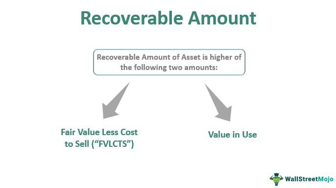

Impairment loss is a financial concept used to describe a reduction in the carrying value of an asset when its market value falls below its recoverable amount. This decline signifies that the asset is no longer worth its recorded value on the balance sheet and necessitates an adjustment, ensuring that the financial statements reflect an accurate asset valuation. Impairment loss is a critical factor for businesses focused on maintaining precise financial reporting, as it directly impacts income statements and the overall representation of an enterprise's financial health.

In the domain of algorithmic trading, impairment loss takes on particular importance. Algorithms rely on a wealth of financial data to inform trading strategies, and any inaccuracy, such as an overvalued asset, can lead to misguided decisions. Thus, understanding the calculation and implications of impairment loss helps in maintaining data integrity, which is foundational for this data-driven trading approach.



The calculation of impairment loss involves several steps, starting with identifying signs that an asset may be impaired. Such signs include significant changes in the market, technological innovations rendering an asset obsolete, or new regulatory policies affecting its value. Once impairment indicators are identified, the recoverable amount is determined. This is calculated as the higher of the asset's fair value less costs to sell and its value in use, which is derived from the present value of future cash flows expected from the asset. If the recoverable amount is lower than the asset's carrying amount, the difference is recorded as an impairment loss on financial statements.

This article will address the methodology for calculating impairment loss and explore its influence on financial contexts and algorithmic trading environments. By accurately reflecting asset values, impairment loss serves as a critical tool for businesses to achieve transparency and precision in financial reporting, ultimately supporting informed and strategic decision-making in trading activities.

## Table of Contents

## Understanding Impairment Loss in Accounting

Impairment loss in accounting is the recognition of a decrease in the fair market value of an asset below its book value, necessitating adjustments in financial statements. This concept is critical for ensuring the accurate representation of a company’s financial health, preventing inflated asset values that could mislead stakeholders.

Under generally accepted accounting principles (GAAP), an asset is considered impaired when its carrying amount exceeds its recoverable amount. The recoverable amount is determined as the higher of the asset's fair value less costs to sell or its value in use. When impairment is identified, the loss is recorded as an expense on the income statement, which directly impacts the company’s profitability figures.

Recognizing impairment losses ensures that the financial records reflect a realistic perspective of asset value, preventing the overstatement of assets and income. This practice is essential for maintaining transparency and integrity in financial reporting, thereby providing stakeholders with reliable financial information for decision-making.

The process of accounting for impairment involves several steps. Initially, entities must assess whether there are indicators of impairment, such as adverse market changes, technological advancements reducing asset value, or legislative impacts. When indicators exist, the entity calculates the recoverable amount and compares it to the asset's carrying amount. If an impairment loss is evident, the carrying amount of the asset is reduced to the recoverable amount, and the loss is recognized in the income statement.

To illustrate, consider the Python code for computing impairment:

```python
def calculate_impairment(carrying_amount, fair_value_less_costs_to_sell, value_in_use):
    recoverable_amount = max(fair_value_less_costs_to_sell, value_in_use)
    if carrying_amount > recoverable_amount:
        impairment_loss = carrying_amount - recoverable_amount
        return impairment_loss
    else:
        return 0

# Example usage:
carrying_amount = 1000
fair_value_less_costs_to_sell = 700
value_in_use = 750
impairment_loss = calculate_impairment(carrying_amount, fair_value_less_costs_to_sell, value_in_use)
print(f"Impairment Loss: {impairment_loss}")
```

This example demonstrates the calculation of impairment loss by determining the recoverable amount and comparing it to the carrying amount. If an impairment loss exists, it is noted as the difference between these values. Through such structured financial adjustments, companies uphold accurate asset valuations and fortify the reliability of financial statements.

## Calculating Impairment Loss

Identifying impairment involves evaluating certain indicators that may signal a decline in the value of an asset. These indicators can include significant changes in the market, advancements in technology that render existing assets obsolete, or legislative amendments that impact the asset's utility.

The calculation of impairment loss begins with determining the asset's recoverable amount. This is calculated as the higher amount between an asset’s fair value minus costs to sell and its value in use. Mathematically, it can be illustrated as:

$$
\text{Recoverable Amount} = \max(\text{Fair Value} - \text{Costs to Sell}, \text{Value in Use})
$$

1. **Fair Value Less Costs to Sell**: This is the price that would be received from selling the asset in a competitive market environment, subtracting any costs associated with completing the sale.

2. **Value in Use**: The present value of the future cash flows expected to be derived from the asset's use and eventual sale.

Once the recoverable amount is determined, it is compared to the asset's carrying amount (the value at which the asset is recognized in the balance sheet). If the recoverable amount is found to be less than the carrying amount, the difference must be recognized as an impairment loss. The formula for calculating the impairment loss is:

$$
\text{Impairment Loss} = \text{Carrying Amount} - \text{Recoverable Amount}
$$

This impairment loss is recorded in the financial statements and impacts the income statement by reducing the net income. Recognizing impairment ensures that the financial statements provide a true and fair view of the asset’s value, maintaining transparency for stakeholders.

## Impairment Loss and Its Impact on Algorithmic Trading

Algorithmic trading depends significantly on precise and timely financial data to make informed decisions about asset allocation and trading strategies. Impairment loss is a key financial metric that can substantially influence these trading algorithms. When an asset's value is recognized as impaired, it yields two principal outcomes relevant to [algorithmic trading](/wiki/algorithmic-trading).

First, the decrease in asset values after accounting for impairment loss can lead to recalibration of trading algorithms. These algorithms often incorporate various input parameters, such as price-to-earnings ratios, book value, and other valuation indicators. A reduction in these metrics due to impairment charges can signal the algorithms to alter trading strategies, such as shifting from a long to a short position, or vice versa. In this context, understanding the impairment loss is vital as it helps maintain the accuracy of these algorithms, enabling them to reflect market conditions more precisely.

Second, impairment charges affect financial statements, altering how market participants perceive company performance. A reported impairment loss can result in a decline in share price as it signals a reduction in asset value. Consequently, trading algorithms incorporating market sentiment and price movements adjust their strategies to capitalize on these changes. This adaptability ensures trading activities remain competitive and aligned with current market narratives.

To appreciate these impacts at a technical level, consider the following Python pseudocode for a simplified trading algorithm sensitive to asset impairment:

```python
def update_trading_strategy(asset_value, recoverable_amount):
    impairment_loss = asset_value - recoverable_amount
    if impairment_loss > 0:
        # Adjust strategy based on reduced asset value
        adjust_trading_signals(asset_id, 'sell')
    else:
        # Maintain or adjust strategy to 'buy' as there's no impairment
        adjust_trading_signals(asset_id, 'buy')

def adjust_trading_signals(asset_id, signal):
    # Logic for altering trading signals based on impairment data
    if signal == 'sell':
        # Increase short positions, reevaluate stop-loss thresholds
        pass
    elif signal == 'buy':
        # Increase long positions, reduce stop-loss thresholds
        pass
```

This code outlines a basic mechanism where the presence of an impairment loss influences the trading strategy. It demonstrates the importance of incorporating impairment losses into trading models to ensure they reflect true asset conditions and market dynamics.

In summary, incorporating impairment loss data into algorithmic trading frameworks is crucial for maintaining an adaptive, data-driven approach, ensuring alignment with actual market conditions and maintaining a competitive edge in trading environments.

## Frequently Asked Questions

### Frequently Asked Questions

**What causes impairment loss to be recognized in financial statements?**

Impairment loss is recognized in financial statements when there is a decline in the recoverable amount of an asset below its carrying value. Several factors can trigger this recognition, such as significant changes in market conditions, negative shifts in consumer demand, advancements in technology rendering an asset obsolete, legal restrictions, or changes in the business environment affecting asset value. For instance, if a company owns manufacturing equipment and a new technology is introduced that performs better and at lower costs, the market value of the old equipment may decrease, necessitating the recognition of an impairment loss.

**How do impairment losses affect investor perceptions and financial ratios?**

Impairment losses directly impact a company's financial statements by reducing the value of assets and, consequently, net income. This adjustment can alter investor perceptions, often leading to concerns about the company's future profitability and asset management effectiveness. Financial ratios, crucial tools for investor decision-making, are also affected. For example, impairment losses can increase the debt-to-equity ratio by reducing equity, thus signaling higher financial leverage. Conversely, the return on assets (ROA) ratio may decrease, implying reduced efficiency in asset utilization. Investors scrutinize these altered ratios to evaluate the company's financial health and investment potential.

**What role does real-time financial data play in successful algorithmic trading?**

Real-time financial data is pivotal in algorithmic trading, where decisions are made in fractions of a second. Accurate and timely information allows algorithms to assess market conditions effectively and to execute trades based on predefined criteria, including impairment charges impacting asset valuations. Algorithms can integrate impairment loss data to adjust models that estimate future cash flows, balance sheets, and valuation metrics, ensuring trading strategies remain aligned with current financial realities. By utilizing comprehensive datasets, algorithmic traders can maintain a competitive edge, optimizing strategies to respond to market movements immediately and accurately.

## Conclusion

Impairment loss is a fundamental accounting measure that serves to safeguard against the overvaluation of assets. By ensuring that assets are recorded at their appropriate values, impairment loss plays a vital role in maintaining financial transparency. This transparency is crucial for stakeholders, as it enhances the reliability of financial statements and aids in strategic decision-making, particularly in the volatile environment of algorithmic trading.

Accurate reflection of asset values, achieved through recognition of impairment loss, allows businesses to avoid inflated valuations that could mislead investors and other stakeholders. This precision in financial reporting is paramount to strategic decision-making, as it provides a realistic view of a company's financial standing. When assets are evaluated properly, businesses can plan and execute strategies more efficiently, addressing potential risks and acknowledging opportunities for growth and improvement.

Furthermore, navigating impairment loss requires a comprehensive understanding of market dynamics and their effects on asset valuation. In algorithmic trading, where decisions are automated based on vast amounts of data, the integration of accurate financial data, including impairment information, is essential. Algorithmic models depend on real-time financial inputs to make informed trading decisions, and an adjusted asset value ensures that trading strategies are based on genuine market conditions.

The successful integration of impairment loss considerations into algorithmic trading models can provide a competitive advantage, allowing traders to make more informed decisions that reflect actual market environments. This leads to more effective trading strategies and potentially higher returns, as the algorithms are aligned with authentic, up-to-date asset valuations. Thus, understanding and appropriately accounting for impairment loss not only reinforce financial transparency but also drive effective strategy formulation and execution in algorithmic trading.

## References & Further Reading

[1]: ["Impairment of Assets – IAS 36"](https://www.ifrs.org/content/dam/ifrs/publications/pdf-standards/english/2021/issued/part-a/ias-36-impairment-of-assets.pdf) by IFRS

[2]: ["Financial Reporting and Analysis"](https://www.wallstreetmojo.com/financial-reporting/) by Charles H. Gibson

[3]: ["Advances in Financial Machine Learning"](https://www.amazon.com/Advances-Financial-Machine-Learning-Marcos/dp/1119482089) by Marcos Lopez de Prado

[4]: ["The Intelligent Investor"](https://www.amazon.com/Intelligent-Investor-Third-Definitive-Investing/dp/0063423537) by Benjamin Graham

[5]: ["Quantitative Financial Analytics"](https://www.amazon.com/Quantitative-Financial-Analytics-Investment-Profits/dp/9813224258) by John A. Dodson

[6]: ["Machine Learning for Algorithmic Trading"](https://github.com/stefan-jansen/machine-learning-for-trading) by Stefan Jansen

[7]: ["International Financial Reporting Standards (IFRS)"](https://en.wikipedia.org/wiki/International_Financial_Reporting_Standards)