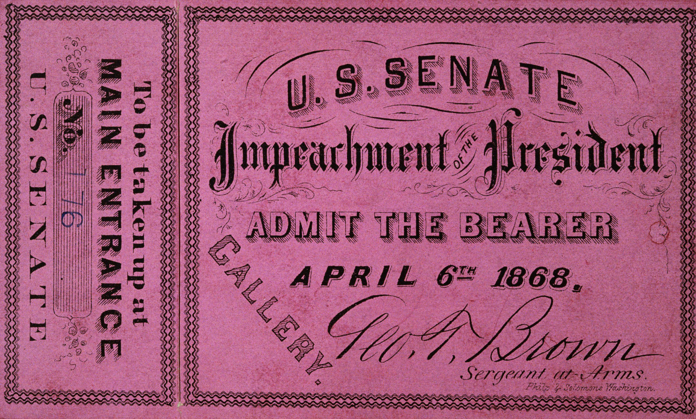

Political and economic systems around the globe exhibit a wide array of structures, principles, and methods, yet they often confront similar foundational processes and challenges. One such process is impeachment, a vital constitutional tool designed to ensure accountability among high-ranking officials. It serves as a critical check against abuses of power, providing a mechanism through which legislative bodies can address misconduct by executive and judicial officeholders. Impeachment has deep roots in democratic governance and functions as a safeguard to maintain trust in public institutions.

On the other hand, the financial sector is witnessing profound transformations brought about by technological advancements, particularly through algorithmic trading. This innovative approach leverages sophisticated algorithms to automate trading decisions, optimizing the speed and efficiency of transactions in financial markets. By harnessing the power of technology, algorithmic trading is reshaping the dynamics of how markets operate, introducing new efficiencies and complexities.



This article examines these two distinct yet influential processes—impeachment within political systems and algorithmic trading in financial markets. By exploring case studies and the evolution of these mechanisms, the article highlights the intersection of constitutional accountability and technological innovation, two pillars that significantly impact global governance and economic systems.

## Table of Contents

## Understanding the Political Process of Impeachment

Impeachment is an essential constitutional mechanism in the United States, designed to hold federal officials, including the President and judiciary members, accountable for serious misconduct. Rooted in Article II, Section 4 of the U.S. Constitution, impeachment serves as a check on the executive and judicial branches, ensuring that individuals in these positions adhere to the highest ethical and legal standards. The Constitution specifies that officials can be impeached for "Treason, Bribery, or other high Crimes and Misdemeanors," although what constitutes this standard has historically been subject to interpretation and debate.

The impeachment process is distinctively bifurcated between two chambers of Congress. Initially, the House of Representatives has the sole authority to impeach, which is analogous to an indictment in criminal law. This step requires a simple majority vote, following inquiries often led by the House Judiciary Committee, although other committees may also become involved, depending on the nature of the accusations. Once the House votes to impeach, the process shifts to the Senate.

The Senate assumes the role of a trial court in the impeachment process, where Senators act as jurors and the Chief Justice of the Supreme Court presides over most presidential impeachment trials. Conviction and subsequent removal from office require a two-thirds majority vote in the Senate. This high threshold underscores the intent that impeachment and removal are measures reserved for the most egregious offenses.

Historical instances highlight the political nuances inherent in impeachment. Andrew Johnson, the 17th President, was impeached in 1868 primarily over conflicts related to post-Civil War Reconstruction policies, reflecting deep political and national divides. In 1998, President Bill Clinton faced impeachment charges of perjury and obstruction of justice stemming from his extramarital affair with Monica Lewinsky and related investigations. Clinton's impeachment underscored personal misconduct's impact on presidential integrity. More recently, Donald Trump was impeached twice; the first in 2019 for abuse of power and obstruction of Congress related to the Ukraine scandal, and the second in 2021 for incitement of insurrection following the storming of the U.S. Capitol. These cases illustrate how impeachment processes often intertwine with the prevailing political climate and ideological battles within the legislative branches.

Impeachment remains a profound assertion of congressional authority, reflecting the critical balance among government branches envisioned by the Constitution's framers. While its application often mirrors the political landscape, the impeachment process is a cornerstone of U.S. constitutional law, representing the idea that no individual is above the law.

## Impeachment Case Studies

Examining notable impeachment cases provides insight into the complexities of political processes. The impeachment of Andrew Johnson in 1868 marked a significant moment in U.S. history, reflecting the deep post-Civil War tensions and political divides. Johnson, who ascended to the presidency following Abraham Lincoln's assassination, faced immense opposition from the Radical Republicans in Congress due to his lenient Reconstruction policies towards the defeated Southern states. His impeachment charges primarily stemmed from his violation of the Tenure of Office Act, which was later deemed unconstitutional. Although the House of Representatives voted to impeach Johnson, the Senate fell short of the necessary two-thirds majority to remove him from office, by just one vote, illustrating the political maneuvering and negotiations involved.

Bill Clinton's impeachment in 1998 centered around charges of perjury and obstruction of justice, rooted in personal misconduct. The allegations emerged from an independent counsel investigation led by Kenneth Starr, initially focused on the Whitewater controversy but later encompassing Clinton's extramarital affair with Monica Lewinsky, a White House intern. The House of Representatives impeached Clinton on two articles — perjury to a grand jury and obstruction of justice — highlighting the intense partisan divide of the era. The Senate trial concluded with Clinton's acquittal, as neither charge achieved the required two-thirds majority, underscoring the procedural and political nature of the impeachment process.

Donald Trump faced impeachment twice during his presidency, underscoring the deep-seated political polarization in contemporary American politics. The first impeachment, in 2019, involved charges of abuse of power and obstruction of Congress, linked to his dealings with Ukraine and efforts to investigate political rivals. The House passed two articles of impeachment, but the Senate acquitted Trump in early 2020. The second impeachment followed the January 6, 2021, Capitol insurrection, with the charge of incitement of insurrection. Though the House swiftly impeached Trump for a second time, the Senate trial, conducted after Trump had left office, resulted in another acquittal, as a significant number of Republican senators voted against conviction despite the dramatic and violent events underpinning the charge.

These cases illustrate the intricate balance between legal proceedings and political strategies inherent in the impeachment process. Each reflects broader societal and political contexts, from post-war recovery and presidential scandals to the extreme political divides of the 21st century.

## Algorithmic Trading: A Financial Revolution

Algorithmic trading is a transformative technological advancement in financial markets, utilizing computer algorithms to automate and optimize trading decisions far beyond human capabilities. The core advantage of [algorithmic trading](/wiki/algorithmic-trading) lies in its ability to execute trades at speeds and with precision that dramatically surpass traditional methods. This automation allows for high-frequency trading, where algorithms can enter and [exit](/wiki/exit-strategy) positions in milliseconds, capitalizing on market inefficiencies and small price movements.

The integration of [artificial intelligence](/wiki/ai-artificial-intelligence) (AI) and [machine learning](/wiki/machine-learning) has further expanded the scope and sophistication of algorithmic trading. Machine learning models can analyze vast datasets, identify patterns, and adapt strategies in real-time, thereby improving predictive accuracy and reducing risks. For example, [deep learning](/wiki/deep-learning) techniques can be employed to process and analyze unstructured data, such as news or social media sentiment, influencing market movements. Here is a simple Python pseudocode example of how machine learning could be integrated into a trading strategy:

```python
import pandas as pd
from sklearn.ensemble import RandomForestClassifier
from sklearn.metrics import accuracy_score

# Load historical market data
data = pd.read_csv('market_data.csv')
features = data[['feature1', 'feature2', 'feature3']]
labels = data['target']

# Split data into training and test sets
train_features, test_features, train_labels, test_labels = train_test_split(features, labels, test_size=0.2)

# Train a Random Forest model
model = RandomForestClassifier(n_estimators=100)
model.fit(train_features, train_labels)

# Predict and evaluate
predictions = model.predict(test_features)
print(f'Accuracy: {accuracy_score(test_labels, predictions)}')

# Use the model to make trading decisions
def make_trade_decision(current_market_data, model):
    if model.predict(current_market_data) == 1:
        return "BUY"
    else:
        return "SELL"

# Example usage
make_trade_decision(new_market_data, model)
```

Algorithmic trading now accounts for a substantial share of global market transactions, driven by institutional investors, hedge funds, and proprietary trading firms capitalizing on the efficiencies of automated systems. Despite its advantages, this method also introduces challenges such as market [volatility](/wiki/volatility-trading-strategies) risks and systemic impacts, as evidenced by events like the 2010 Flash Crash. Accordingly, regulators are continuously adapting frameworks to ensure transparency, fairness, and the mitigation of potential technological risks in financial markets.

## Algorithmic Trading Case Studies

Case studies in algorithmic trading provide essential insights into both the successes and challenges associated with this technologically advanced approach to financial markets. High-frequency trading ([HFT](/wiki/high-frequency-trading-strategies)) firms epitomize the competitive edge gained through algorithmic efficiencies. By using algorithms to execute large volumes of transactions at extremely rapid speeds, often in milliseconds, HFT firms contribute significantly to market [liquidity](/wiki/liquidity-risk-premium) and price formation. The strategic advantage lies in the ability to capitalize on minute price discrepancies across markets, leveraging vast computational power and low-latency data feeds to optimize trading performance.

However, the same technological prowess that facilitates these gains also presents substantial risks and challenges, as evidenced by events such as the 2010 Flash Crash. On May 6, 2010, major U.S. stock indices experienced a sudden and severe drop in value, followed by a rapid recovery. This incident exposed vulnerabilities within automated trading systems, triggering volatility and leading to significant financial and systemic consequences. Investigations revealed that automated algorithms, processing a high [volume](/wiki/volume-trading-strategy) of trades, contributed to the market instability. The Flash Crash underscored the potential for algorithmic trading systems, if not properly managed, to exacerbate market fluctuations and intensify risk.

In response to these challenges, regulatory frameworks are evolving to address concerns related to fairness, transparency, and systemic risk in algorithmic trading. Agencies like the U.S. Securities and Exchange Commission (SEC) and the Commodity Futures Trading Commission (CFTC) are implementing regulations to ensure market stability. These include circuit breakers designed to halt trading during extreme volatility, stringent reporting requirements for algorithmic trading activities, and measures to enhance transparency. Additionally, there is an increasing emphasis on stress-testing algorithms and incorporating safeguards to mitigate unintended consequences.

The evolution of algorithmic trading continues amid concerns about ethical considerations, such as market manipulation and the fairness of trading advantages afforded to those with superior technological capabilities. As such, the regulatory landscape must balance fostering innovation with protecting market integrity, ensuring the long-term sustainability and resilience of financial markets.

## Comparative Analysis: Political and Financial Processes

Both impeachment and algorithmic trading exemplify structured procedures integral to political and financial domains, respectively. Each faces significant scrutiny due to their impact on power dynamics and the ethical considerations inherent in their processes. This section explores these systemized processes and underscores the necessity of oversight and regulation to ensure their efficacy and integrity.

Impeachment acts as a constitutional remedy designed to address severe misconduct by public officials. It is inherently reactive and corrective, aiming to rectify power abuses and uphold governmental accountability. As defined by the U.S. Constitution, impeachment involves the House of Representatives bringing charges and the Senate conducting a trial to determine possible removal from office. Due to its political nature, the impeachment process is often contentious, involving intense partisan and ethical debates that test the balance of power within government structures.

In contrast, algorithmic trading is a proactive mechanism that has transformed financial markets through the use of technology to automate decision-making processes. Algorithms, guided by pre-defined rules, execute trades with speed and precision, allowing for rapid responses to market conditions. This predictive capability offers significant advantages in efficiency and profitability but also poses challenges. The complexity of algorithms, particularly those leveraging artificial intelligence and machine learning, adds layers of opacity that necessitate careful oversight to prevent unfair trading practices and systemic risks.

Analysing these processes highlights the importance of comprehensive regulation and oversight. For impeachment, stringent legal frameworks ensure that accusations are substantiated and that trials are conducted fairly. The U.S. system's checks and balances are critical in preventing misuse of the impeachment process as a political tool. Likewise, in financial markets, regulatory bodies like the Securities and Exchange Commission (SEC) and international equivalents have established guidelines to monitor algorithmic trading activities. These regulations aim to enhance transparency, protect market integrity, and mitigate risks such as those exemplified by events like the 2010 Flash Crash, where algorithmic anomalies led to significant market disruption.

Both impeachment and algorithmic trading, despite their different functions, demonstrate the necessity for oversight to maintain system stability. Impeachment safeguards democratic institutions by ensuring accountability, while algorithmic trading requires regulation to foster fair and stable financial markets. Together, they underscore the broader societal imperative for vigilance and responsibility in the exercise of power, whether in political or financial arenas. Through continued innovation and regulatory evolution, both processes are poised to adapt to emerging challenges, preserving their respective domains' health and resilience.

## Conclusion

Parallels between political and economic mechanisms underscore the ongoing necessity for both innovation and accountability within these domains. Impeachment processes operate as a fundamental political tool aimed at preserving constitutional integrity, while algorithmic trading epitomizes the fusion of technology and finance, drastically altering market dynamics. Each sphere requires a robust framework to ensure effectiveness and trustworthiness.

The study of impeachment exemplifies how political systems navigate accountability challenges, as seen in historical cases involving U.S. presidents. These instances reflect the broader political dynamics and underscore the importance of checks and balances. Algorithmic trading, on the other hand, reveals how technology can revolutionize industries, requiring continuous oversight to safeguard market stability and fairness. Both narratives contribute significantly to our understanding of societal dynamics and their impacts.

Looking forward, advancements in technology will likely play a pivotal role in shaping future developments in both arenas. In politics, technological tools might enhance transparency and public engagement, while in finance, innovations such as artificial intelligence could further refine trading strategies. However, with advancement comes the pressing need for updated regulations to manage new challenges, ensuring systems remain equitable and resilient.

Efficient political processes, alongside financial mechanisms, are indispensable for maintaining healthy systems globally. By fostering environments that balance innovation with accountability, societies can better address emerging challenges and leverage opportunities for sustainable development.

## References & Further Reading

[1]: Bergstra, J., Bardenet, R., Bengio, Y., & Kégl, B. (2011). ["Algorithms for Hyper-Parameter Optimization."](https://papers.nips.cc/paper/4443-algorithms-for-hyper-parameter-optimization) Advances in Neural Information Processing Systems 24.

[2]: ["Advances in Financial Machine Learning"](https://www.amazon.com/Advances-Financial-Machine-Learning-Marcos/dp/1119482089) by Marcos Lopez de Prado

[3]: ["Evidence-Based Technical Analysis: Applying the Scientific Method and Statistical Inference to Trading Signals"](https://www.amazon.com/Evidence-Based-Technical-Analysis-Scientific-Statistical/dp/0470008741) by David Aronson

[4]: ["Machine Learning for Algorithmic Trading"](https://github.com/stefan-jansen/machine-learning-for-trading) by Stefan Jansen

[5]: ["Quantitative Trading: How to Build Your Own Algorithmic Trading Business"](https://www.amazon.com/Quantitative-Trading-Build-Algorithmic-Business/dp/1119800064) by Ernest P. Chan