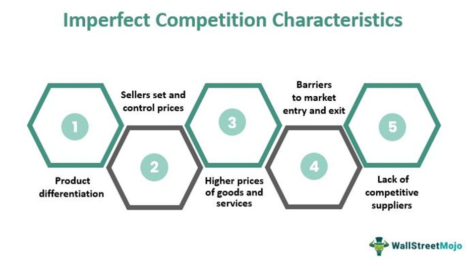

In the complex world of economics, understanding market structures is critical to analyzing how firms compete and how prices are set. Market structures are generally classified into four categories: perfect competition, monopoly, oligopoly, and monopolistic competition. Each of these structures presents distinct characteristics that dictate the behavior of firms within the market, the level of competition, and the pricing mechanisms.

This article will focus on imperfect competition, where the assumptions of perfect competition do not hold. In perfect competition, numerous firms sell homogeneous products, and no single firm has the power to influence the market price. However, in imperfect competition, these conditions are not met, leading to markets that are more reflective of real-world scenarios. This can be attributed to the presence of differentiated products, where firms have some degree of control over pricing, thus acting as price makers rather than price takers. Such market conditions often come with barriers to entry, preventing new competitors from freely entering the market and allowing existing firms to maintain a competitive advantage.



Imperfect competition characterizes most real-world markets, notably those where products are not identical and consumers perceive them as distinct. This differentiation gives firms the ability to employ unique pricing strategies and achieve market power. Key examples of imperfect competition include monopolistic competition and oligopoly. In monopolistic competition, numerous firms offer similar but not identical products, leading to a competitive environment driven by product differentiation. Conversely, an oligopoly is characterized by a small number of large firms that dominate the market, often resulting in strategic interactions and interdependence among competitors.

Additionally, we will explore how algorithmic trading influences and interacts with these market structures. Algorithmic trading leverages automated systems and algorithms to execute trades at speeds and efficiencies beyond human capabilities. Understanding its influence and interaction with imperfect competition is vital as it introduces new dynamics into the market, affecting liquidity, volatility, and overall market efficiency. As financial markets increasingly adopt algorithmic trading, exploring its implications within imperfectly competitive markets becomes crucial for traders and policymakers aiming to navigate the evolving financial landscape effectively.

## Table of Contents

## Understanding Imperfect Competition

Imperfect competition is a market structure where the idealized conditions of perfect competition do not fully exist, allowing firms to exert some control over their pricing strategies. This structure is primarily categorized into two forms: monopolistic competition and oligopoly.

### Monopolistic Competition

In monopolistic competition, a significant number of firms exist in the market, each offering products that are similar but not identical. This differentiation can occur through variations in quality, branding, or features, which gives firms some degree of market power to set prices above marginal cost. Unlike in a perfectly competitive market where products are homogeneous and firms are price takers, companies in monopolistic competition have the flexibility to adjust prices without losing all their customers.

This product differentiation results in a downward-sloping demand curve for each firm, meaning that a single firm can influence its product's price to some extent. However, the presence of close substitutes limits the firm’s pricing power, as consumers can shift to alternative products if prices rise too much. This scenario often leads to a trade-off between pricing high and losing potential customers versus pricing low and gaining market share but reducing profits.

### Oligopoly

Oligopoly is characterized by a small number of firms dominating the market, which creates a landscape where strategic decision-making is crucial. In such markets, the actions of one firm can significantly impact the others, leading to interdependent pricing and output decisions. The firms may produce identical or differentiated products, but the key feature of oligopoly is the strategic interdependence among firms.

A common phenomenon in oligopoly is the existence of 'price rigidity,' where firms are reluctant to change prices for fear of price wars. For example, if one firm lowers its price, others may follow to maintain their market share, leading to reduced profitability for all. Alternatively, firms may choose to collude, either overtly or tacitly, to maximize collective profits by setting higher prices—though this may attract regulatory scrutiny.

### Contrast with Perfect Competition

Perfect competition represents an ideal benchmark where numerous small firms sell identical products, facing perfectly elastic demand curves. In this market structure, no single firm can influence market prices as the market determines price based solely on supply and demand interactions. Firms in perfect competition are price takers, and the sole focus remains on minimizing costs and optimizing production efficiency.

### Impact on Consumer Choices, Prices, and Market Efficiency

The presence of imperfect competition affects consumer choices by offering a wider variety of products compared to perfect competition, where product homogeneity limits consumer options. However, the market power of firms within imperfect competition can lead to higher prices and reduced market efficiency. Firms may not always produce at the socially optimal level, resulting in deadweight losses.

In monopolistic competition, the variety of products can enhance consumer satisfaction, but at the expense of higher prices due to lack of perfect substitutes. Conversely, in oligopolistic markets, strategic behaviors can lead to outcomes such as stable prices or collusion, which might not reflect the true supply-demand equilibrium.

Understanding these dynamics is essential for evaluating how firms navigate price settings and competition strategies within imperfect competition, impacting overall market efficiency and consumer welfare.

## Algorithmic Trading and Its Role in Modern Markets

Algorithmic trading, also known as algo trading or automated trading, involves the use of computer programs to execute and manage trading orders at speeds far superior to human capabilities. These systems make decisions to buy or sell financial instruments based on predefined criteria, such as market conditions or historical data trends. By employing complex mathematical models and algorithms, market participants can rapidly process a massive [volume](/wiki/volume-trading-strategy) of market data, identifying and capitalizing on opportunities in the market more swiftly than any human trader.

One of the defining features of [algorithmic trading](/wiki/algorithmic-trading) is its ability to enhance [liquidity](/wiki/liquidity-risk-premium) in financial markets. Liquidity refers to the ease with which assets can be bought or sold without causing significant price fluctuations. Algorithms contribute by adding a constant flow of buy and sell orders, which increases the volume of transactions and narrows bid-ask spreads. This, in turn, makes markets more efficient and effective, benefiting all market participants through more stable pricing.

However, algorithmic trading also has implications for market [volatility](/wiki/volatility-trading-strategies). While it can provide stability under normal conditions, in certain situations, such as market shocks or sudden events, the speed and volume of algo-driven trades can exacerbate price swings, sometimes resulting in flash crashes. The 2010 Flash Crash is a notable example, where rapid trading by algorithms contributed to a dramatic drop in the U.S. stock market within minutes.

Understanding the impact of algorithmic trading in imperfectly competitive markets is especially important. Markets characterized by imperfect competition do not meet all the criteria of perfect competition, often featuring differentiated products and varying degrees of market power. In such environments, algorithms can exploit minute price differentials and inefficiencies across markets to establish [arbitrage](/wiki/arbitrage) opportunities, theoretically enhancing market efficiency. Yet, these activities also pose challenges by potentially increasing the complexity of market dynamics.

Despite the benefits, algorithmic trading introduces several challenges. One significant concern is the potential for market manipulation. High-frequency trading ([HFT](/wiki/high-frequency-trading-strategies)) algorithms, a subset of algorithmic trading, can engage in practices such as quote stuffing, where false orders are placed rapidly and then canceled to create confusion or gain a market advantage. This raises questions about market fairness and transparency, crucial aspects for regulator attention.

Moreover, the reliance on algorithms raises systemic risk issues. As financial markets become more interconnected and algorithm-dependent, the failure or malfunction of major trading systems could have widespread repercussions. It necessitates robust risk management and fail-safe mechanisms to prevent cascading failures.

For traders, understanding algorithmic trading's mechanics and its effects on market conditions can guide more informed strategy development. For policymakers, the challenge lies in crafting regulations that balance innovation and oversight to protect market integrity without stifling technological advancement. 

In conclusion, algorithmic trading reshapes market dynamics through speed and efficiency but simultaneously presents new challenges that require careful attention from both market participants and regulators to ensure a balanced and fair market environment.

## The Interaction of Imperfect Competition and Algorithmic Trading

The influence of algorithmic trading in imperfect competition, such as monopolistic competition and oligopoly, presents distinct characteristics that impact market dynamics considerably. Within these market structures, algorithms have the capacity to exploit minor price discrepancies across various platforms. This capability can, in theory, contribute to market efficiency by minimizing arbitrage opportunities that exist due to these price variances. The basic principle is aligned with arbitrage theory, where profits are made from price differentials in different markets.

In environments characterized by monopolistic competition, where products are similar but differentiated, algorithmic trading can amplify or mitigate the effects of this differentiation. For example, algorithms capable of processing large datasets rapidly can identify consumer preferences or trends, aiding firms in customizing their product offerings more effectively. This can lead to increased product differentiation as companies strive to cater to niche markets or specific consumer demands. Conversely, algorithms that promote price transparency can reduce perceived differentiation by highlighting cost rather than unique product features.

Oligopolies, dominated by a limited number of firms, present another layer of complexity when combined with algorithmic trading. Here, the strategic interdependence intrinsic to oligopolistic behavior can be significantly impacted by trading algorithms. Algorithms can facilitate more aggressive competitive strategies, such as dynamic pricing models that adjust prices in real time based on competitor behavior, which can intensify price wars. An example is the use of Python-based solutions to implement a dynamic pricing algorithm:

```python
import numpy as np

# Assume competitors' prices are from a normal distribution
competitors_prices = np.random.normal(loc=100, scale=10, size=100)

# Define function for dynamic pricing
def dynamic_pricing(base_price, competitors_prices):
    # Adjust base price based on average of competitors' prices
    price_adjustment = np.mean(competitors_prices) - base_price
    new_price = base_price + 0.5 * price_adjustment
    return new_price

# Current price of the firm's product
base_price = 105
new_price = dynamic_pricing(base_price, competitors_prices)
print(f"Adjusted Price: ${new_price:.2f}")
```

Case studies and empirical data indicate that algorithmic trading in oligopolistic markets might also create a feedback loop where intensified competition leads to increased market volatility. This feedback loop can be exacerbated as firms constantly adjust strategies in response to perceived competitor movements, driven by algorithms analyzing real-time data. Moreover, the presence of a few dominant players utilizing powerful algorithms can lead to market entry barriers for smaller or new firms due to the heightened competitive environment and the cost of technology adoption.

Overall, the interaction between algorithmic trading and imperfect competition necessitates careful analysis. Policymakers and market participants must consider these dynamics to ensure fair and efficient markets, as the effective deployment of algorithmic strategies can have far-reaching implications on market structure and competition.

## Implications for Traders and Policymakers

The emergence of algorithmic trading within markets characterized by imperfect competition introduces a landscape rich with both opportunities and challenges. For traders, these dynamics necessitate an acute understanding of the market's behavior facilitated by algorithmic strategies. This understanding aids in designing more effective trading strategies and enhancing risk management practices. By utilizing sophisticated algorithms, traders can gain a competitive edge, leveraging speed and precision to optimize their trading operations. However, with this edge comes the need for a solid grasp of the potential risks involved, such as algorithmic errors and unintended consequences resulting from complex interactions in the market.

Policymakers, on the other hand, must grapple with the regulatory challenges inherent in the rapid proliferation of algorithmic trading technologies. The speed and complexity of these trading mechanisms pose significant issues for market fairness and transparency. Furthermore, the potential for market manipulation increases as algorithms are capable of executing large volumes of trades in very short time frames, which can distort market prices and create an uneven playing field. Addressing these issues requires carefully crafted regulations that can keep pace with technological advancements without stifling innovation.

Key concerns include the establishment of robust frameworks that ensure transparency in algorithmic trading activities. This involves setting standards for algorithm testing and robust reporting mechanisms that increase market participants' accountability. Additionally, there is a pressing need to monitor and mitigate risks of market manipulation or systemic disruptions, such as those seen in "flash crashes," which are rapid market declines that can result from algorithmic errors or malicious intents.

Recommendations for both market participants and regulators include aligning on best practices for algorithm development and implementation. This might involve adherence to stringent testing protocols to assess algorithm behavior under various market conditions. Moreover, implementing circuit breakers and other safety mechanisms can help stabilize markets during periods of extreme volatility, ensuring that algorithmic trades do not exacerbate market disruptions.

Ultimately, traders and policymakers must collaborate to foster an environment that balances innovation with regulation, ensuring markets remain fair, transparent, and efficient. By remaining vigilant and adaptive to the changes algorithmic trading brings, stakeholders can mitigate risks while maximizing the potential benefits that these technologies offer.

## Conclusion

The interplay between imperfect competition and algorithmic trading is a defining feature of contemporary economic and financial landscapes. Imperfect competition, characterized by product differentiation and a limited number of market players, intersects with algorithmic trading's speed and efficiency, heightening the complexity of market dynamics. Both concepts underscore the persistent evolution of markets facilitated by technological advancements, which continue to shape trading practices and market outcomes.

Algorithmic trading provides several benefits, notably increased efficiency through rapid execution and the ability to process vast datasets, pivotal in today’s data-driven markets. These advantages can enhance liquidity and price discovery, beneficial in markets where firms have pricing power. However, the integration of algorithmic systems in imperfectly competitive markets also introduces challenges. The potential for increased volatility and systemic risks in complex environments has been noted, necessitating a careful balance between automation and oversight.

Future research and policy initiatives are critical to address these challenges comprehensively. It is essential for academia and industry to collaboratively explore the nuances of algorithmic interactions within imperfect markets. Crafting regulations that ensure market fairness and transparency while preventing manipulation is vital for maintaining trust and stability in financial systems.

In conclusion, remaining informed and adaptable is crucial for traders, businesses, and policymakers navigating this dynamic environment. As technology continues to evolve, understanding the implications of algorithmic trading in markets characterized by imperfect competition will be imperative to harnessing its potential while mitigating risks. The pursuit of efficient, equitable, and resilient markets must be a coordinated effort, embracing innovation while safeguarding integrity and stability.

## References & Further Reading

[1]: Cournot, A. A. (1838). "Researches into the Mathematical Principles of the Theory of Wealth." Translated by Nathaniel T. Bacon. Augustus M. Kelley Publishers. 

[2]: Chamberlin, E. (1933). "The Theory of Monopolistic Competition." Harvard University Press.

[3]: Friedman, M. (1976). "Price Theory." Aldine Transaction. 

[4]: Lopez de Prado, M. (2018). ["Advances in Financial Machine Learning."](https://www.amazon.com/Advances-Financial-Machine-Learning-Marcos/dp/1119482089) Wiley.

[5]: Goyenko, R. Y., Holden, C. W., & Trzcinka, C. A. (2009). "Do Liquidity Measures Measure Liquidity?" Journal of Financial Economics, 92(2), 153-181.

[6]: Harris, L. (2003). "Trading and Exchanges: Market Microstructure for Practitioners." Oxford University Press.

[7]: Easley, D., & O'Hara, M. (1987). "Price, Trade Size, and Information in Securities Markets." Journal of Financial Economics, 19(1), 69-90.

[8]: Hasbrouck, J. (1995). "One Security, Many Markets: Determining the Contributions to Price Discovery." The Journal of Finance, 50(4), 1175-1199.

[9]: Hirschey, N. (2005). "Do High-Frequency Traders Anticipate Buying and Selling Pressure?" Available at SSRN 1686004.