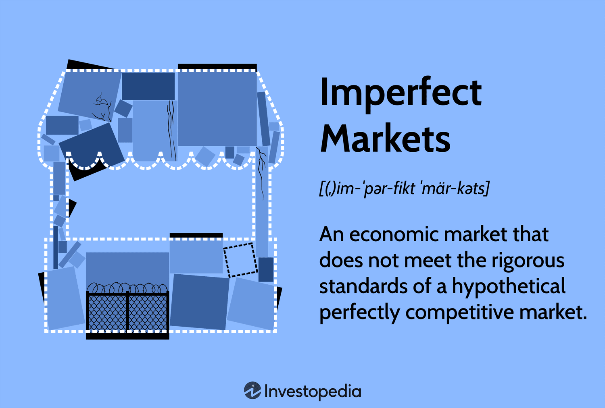

## Table of Contents

## What is imperfect competition in economics?

Imperfect competition is a type of market structure where there are not many sellers, and the products they sell can be different from each other. Unlike perfect competition, where many sellers sell the same product and no one can control the price, in imperfect competition, sellers can have some control over the price because they offer unique products or services. This can happen in markets like restaurants, where each place offers different food and atmosphere, or in technology, where companies like Apple and Samsung offer different phones with unique features.

There are different types of imperfect competition, such as monopolistic competition, oligopoly, and monopoly. In monopolistic competition, many sellers offer similar but not identical products, like different brands of shampoo. In an oligopoly, a few large firms dominate the market, like in the car industry with companies like Toyota and Ford. A monopoly is when there is only one seller in the market, like a local utility company that is the only one providing electricity in an area. Each type of imperfect competition has its own rules and effects on how prices are set and how businesses compete.

## How does imperfect competition differ from perfect competition?

Imperfect competition and perfect competition are two different ways markets can work. In perfect competition, there are many sellers, and they all sell the exact same thing. No single seller can change the price because if they try to charge more, people will just buy from someone else. This means the price stays the same for everyone. Also, in perfect competition, everyone knows everything about the product and the market, so there are no surprises.

In imperfect competition, things are different. There are fewer sellers, and what they sell can be different from each other. This means a seller might be able to charge a bit more if their product is special or if people really like it. For example, if a restaurant has really good food, they can charge more than other restaurants. Also, in imperfect competition, people might not know everything about the market, so sellers can sometimes surprise them with new products or prices. This makes the market more complicated and less predictable than in perfect competition.

## What are the main types of imperfect competition?

The main types of imperfect competition are monopolistic competition, oligopoly, and monopoly. In monopolistic competition, there are many sellers, but each one sells a slightly different product. Think of different brands of shampoo; they all clean your hair, but they might have different scents or ingredients. This means each company can try to make their product a bit better or different to attract more customers, and they might be able to charge a little more if people like their product more.

In an oligopoly, there are only a few big companies that control most of the market. For example, in the car industry, companies like Toyota and Ford are big players. These companies watch each other closely, and if one changes its prices or introduces a new car, the others might do the same. This can make the market a bit tricky because the actions of one company can affect all the others.

A monopoly is when there's only one seller in the whole market. This can happen with things like local utility companies, where there's only one company that provides electricity or water to an area. In a monopoly, the company has a lot of control over the price because people don't have other choices. This can lead to higher prices and less choice for customers.

## Can you explain the concept of monopolistic competition?

Monopolistic competition is a type of market where there are many sellers, but each one sells a product that's a little different from the others. Imagine different brands of shampoo. They all clean your hair, but some might have a special scent, or be better for dry hair, or come in a cool bottle. Because of these differences, each company can try to make their shampoo seem better or more special than the others. This means they might be able to charge a bit more if people like their shampoo more than others.

In this kind of market, companies often spend a lot on advertising to make their product stand out. They want people to think their shampoo is the best one out there. This competition based on how products are different is what makes it "monopolistic." Even though there are many sellers, each one acts a bit like a mini-monopoly because they have some control over the price of their unique product. This is different from perfect competition, where everyone sells the same thing and no one can change the price.

## What is an oligopoly and how does it function?

An oligopoly is a market where just a few big companies control most of the business. Think of the car industry, where companies like Toyota and Ford are the main players. Because there are only a few big companies, they watch each other closely. If one company changes its prices or introduces a new car, the others might do the same. This makes the market a bit tricky because the actions of one company can affect all the others.

In an oligopoly, companies often work together without talking directly. They might see what the others are doing and then decide to do something similar. This can lead to prices staying pretty stable because no one wants to start a price war. But it can also mean less choice for customers because the big companies might not want to change things too much. This kind of market can be good for the big companies but might not be the best for customers who want more options and lower prices.

## How do firms in an oligopoly interact with each other?

In an oligopoly, firms interact with each other in a way that's a bit like a game. They watch what the other companies do and then decide their next move. For example, if one car company lowers its prices, the others might do the same to keep their customers. Or if one company starts selling a new kind of car, the others might start making something similar. This is because in an oligopoly, there are only a few big companies, so what one does can affect all the others.

This kind of interaction can lead to a situation where prices stay pretty stable. No company wants to start a price war because it could hurt everyone. So, they might agree to keep prices at a certain level without actually talking to each other. This can be good for the companies because they make more money, but it might not be so good for customers who want lower prices and more choices. In the end, the actions of one company in an oligopoly can have a big impact on the whole market.

## What role does product differentiation play in imperfect competition?

Product differentiation is really important in imperfect competition. It means that companies try to make their products different from others so they can stand out. For example, in monopolistic competition, like with different brands of shampoo, each company might add a special scent or use different ingredients to make their shampoo seem better. This helps them attract more customers and maybe charge a bit more money because people might think their shampoo is worth it.

In an oligopoly, product differentiation is also key. Big companies, like those in the car industry, might add new features or styles to their cars to make them different from what their competitors offer. This way, they can keep their customers and maybe even steal some from other companies. By making their products unique, these companies can have more control over their prices and how they compete in the market.

## How do barriers to entry affect imperfectly competitive markets?

Barriers to entry are things that make it hard for new companies to start selling in a market. In imperfectly competitive markets, like monopolistic competition, oligopoly, and monopoly, these barriers can be really important. They help the big companies stay in control because it's tough for new businesses to come in and compete. For example, if a new restaurant wants to open in a town where there are already a few popular ones, it might be hard because the new place needs to spend a lot of money on advertising and making their food special to attract customers.

These barriers can keep prices high and limit choices for customers. In an oligopoly, like the car industry, the big companies might have spent a lot of money on factories and technology, making it very expensive for a new company to start making cars. This means the big companies can keep selling cars at higher prices because no new company can easily come in and offer cheaper ones. In a monopoly, like a local utility company, the barrier might be that the government only lets one company provide the service, so no one else can start selling electricity or water in that area. This can lead to the company charging more because people have no other choice.

## What are the welfare implications of imperfect competition?

Imperfect competition can lead to less welfare for people compared to perfect competition. In imperfect competition, there are fewer choices and prices might be higher because there aren't as many sellers. For example, in a monopoly, the only company in the market can charge more because people have no other place to buy from. This means people might have to pay more money for things like electricity or water. Also, because there's less competition, companies might not work as hard to make their products better, so the quality might not be as good as it could be.

On the other hand, imperfect competition can sometimes be good for welfare in certain ways. In monopolistic competition, companies try to make their products different, which can lead to more choices for people. For example, different brands of shampoo might have different scents or ingredients, so people can pick the one they like best. In an oligopoly, big companies might spend a lot of money on research and development to make new and better products, like new kinds of cars. This can lead to new technology and innovation that can improve people's lives. But overall, the higher prices and fewer choices in imperfect competition can still mean less welfare for people.

## How do firms in imperfectly competitive markets set prices?

In imperfectly competitive markets, firms have some control over the prices they set because they offer products that are different from each other. For example, in monopolistic competition, like with different brands of shampoo, each company might add a special scent or ingredient to make their product stand out. This allows them to charge a bit more if people like their shampoo better than others. They can also use advertising to make people think their product is the best, which helps them set higher prices.

In an oligopoly, like the car industry, a few big companies control most of the market. These companies watch each other closely and might set prices based on what the others are doing. If one company lowers its prices, the others might do the same to keep their customers. But they often try to keep prices stable because no one wants to start a price war that could hurt everyone. In a monopoly, like a local utility company, there's only one seller, so they can set higher prices because people have no other choice. This control over prices is a big part of how firms in imperfectly competitive markets work.

## What strategies can firms use to gain a competitive advantage in imperfect markets?

In imperfect markets, firms can use different strategies to get ahead of their competitors. One way is through product differentiation, where they make their products different from others. For example, a company might add a special feature to their phone or use unique ingredients in their food to make it stand out. This can help them attract more customers and charge a bit more money because people might think their product is better. Another strategy is through advertising. By spending a lot on ads, a company can make people think their product is the best, which can help them sell more and set higher prices.

Another important strategy is to create barriers to entry, which makes it hard for new companies to start selling in the market. For example, a big car company might spend a lot of money on factories and technology, making it very expensive for a new company to start making cars. This keeps the big companies in control and helps them keep their prices high. In an oligopoly, firms might also work together without talking directly. They watch what the others are doing and then decide their next move, like keeping prices stable to avoid a price war. This helps them stay competitive and keep their market share.

## How does game theory apply to understanding strategic behavior in oligopolies?

Game theory is a way to understand how companies in an oligopoly make decisions based on what other companies might do. Imagine a game where each player's move depends on what they think the other players will do. In an oligopoly, like the car industry, companies are like players in this game. If one company decides to lower its prices, the others might do the same to keep their customers. Or if one company starts selling a new kind of car, the others might start making something similar. Game theory helps us see how these companies watch each other and make choices to stay competitive.

In game theory, there's a concept called the Nash equilibrium, which is when no company can do better by changing its strategy if the other companies keep doing what they're doing. In an oligopoly, this might mean that all the big companies keep their prices at a certain level because no one wants to start a price war. If one company lowers its prices, the others might follow, and everyone could lose money. So, they might all agree to keep prices high without actually talking to each other. This kind of strategic behavior is what game theory helps us understand in oligopolies.

## References & Further Reading

[1]: Cournot, A. A. (1838). "Researches into the Mathematical Principles of the Theory of Wealth." Translated by Nathaniel T. Bacon. Augustus M. Kelley Publishers. 

[2]: Chamberlin, E. (1933). "The Theory of Monopolistic Competition." Harvard University Press.

[3]: Friedman, M. (1976). "Price Theory." Aldine Transaction. 

[4]: Lopez de Prado, M. (2018). ["Advances in Financial Machine Learning."](https://www.amazon.com/Advances-Financial-Machine-Learning-Marcos/dp/1119482089) Wiley.

[5]: Goyenko, R. Y., Holden, C. W., & Trzcinka, C. A. (2009). "Do Liquidity Measures Measure Liquidity?" Journal of Financial Economics, 92(2), 153-181.

[6]: Harris, L. (2003). "Trading and Exchanges: Market Microstructure for Practitioners." Oxford University Press.

[7]: Easley, D., & O'Hara, M. (1987). "Price, Trade Size, and Information in Securities Markets." Journal of Financial Economics, 19(1), 69-90.

[8]: Hasbrouck, J. (1995). "One Security, Many Markets: Determining the Contributions to Price Discovery." The Journal of Finance, 50(4), 1175-1199.

[9]: Hirschey, N. (2005). "Do High-Frequency Traders Anticipate Buying and Selling Pressure?" Available at SSRN 1686004.