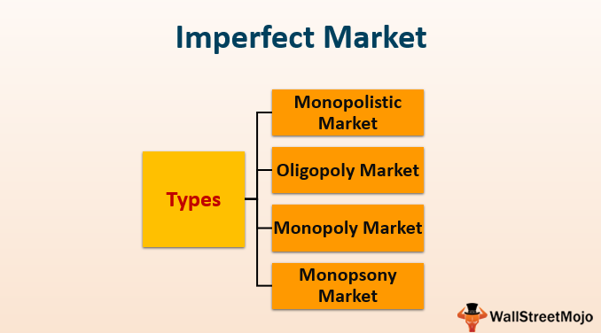

In economics, the notion of perfect markets is primarily theoretical. These idealized markets are characterized by numerous buyers and sellers, homogeneous products, and perfect information, where no participant can influence prices or market outcomes. However, real-world markets rarely align with these conditions, often operating under imperfect conditions due to various inefficiencies and deviations from the perfect market model.

Imperfect markets, by contrast, manifest when certain conditions diverge from the theoretical ideal. This divergence often results in a limited number of participants, product differentiation, and barriers to entry and exit, leading to unique market dynamics that can significantly impact price setting, resource allocation, and overall economic efficiency. As a result, understanding the economic implications of these markets is essential for policymakers, economists, and investors as they strive to address the challenges and opportunities presented by such market structures.



Various types of imperfect markets, such as monopolies, oligopolies, and monopolistic competition, highlight the diversity of market imperfections. Each type presents unique characteristics and consequences, influencing competition, pricing strategies, and consumer choices. The complexity of these market dynamics requires careful analysis to devise effective regulatory and economic policies.

Algorithmic trading, a modern innovation, interacts with these imperfect market structures by utilizing computer algorithms to execute trades. This technology can exploit market inefficiencies, potentially leading to more competitive pricing. However, it poses challenges, such as potential manipulation of market conditions, necessitating thoughtful regulation to maintain balance and fairness.

Overall, as global markets evolve, continuous examination of imperfect markets and their interplay with technologies like algorithmic trading will be necessary. This ongoing analysis helps ensure economic stability, inform policy decisions, and address the multifaceted challenges of maintaining fair and efficient markets in an imperfect world.

## Table of Contents

## What Are Imperfect Markets?

Imperfect markets are those that do not meet the strict criteria of perfect competition, where numerous buyers and sellers transact homogenous products without barriers or distortions. In contrast, imperfect markets are characterized by insufficient competition, leading to a range of inefficiencies and distinct market behaviors. Key features of such markets include a limited number of participants—either buyers or sellers—and product differentiation, which allows firms to have some control over prices. Unlike a perfectly competitive market with numerous participants, imperfect markets often exist with few, dominant firms or relative power concentrations among buyers or sellers.

Barriers to entry and [exit](/wiki/exit-strategy) are prominent indicators of imperfect markets. These can include economic barriers such as high startup costs, legal barriers such as patents or exclusive licenses, and technological barriers that make it difficult for new firms to enter the market or for existing firms to exit without significant losses. Such barriers limit market fluidity and create environments where established firms maintain a competitive advantage, potentially leading to monopolistic or oligopolistic market structures.

Real-world transactions frequently occur in imperfect market conditions. Factors such as incomplete information, where one party possesses more knowledge than another, further exacerbate these imperfections. For example, sellers of specialized goods can better understand product quality compared to buyers, giving them pricing power. Additionally, transaction costs, which are negligible in perfect market assumptions, can be significant in practice, affecting the resource allocation efficiency.

In summary, while perfect markets serve as an ideal economic model, actual markets are prone to imperfections. These imperfections manifest through limited competition, product variability, and hindrances to market entry and exit, leading to a variety of economic outcomes and necessitating tailored regulatory responses.

## Types of Imperfect Markets

Imperfect markets present a range of structures with varying characteristics and economic implications. The key types include monopoly, oligopoly, monopolistic competition, and monopsony, each marked by distinct features in terms of the number of sellers, product differentiation, and pricing power.

### Monopoly

A monopoly describes a market scenario where a single seller controls the entire market for a particular good or service. This singular dominance grants the seller significant discretion in setting prices and output levels, often leading to higher prices and reduced consumer surplus compared to more competitive market structures. The monopolist maximizes profit by equating marginal cost $MC$ to marginal revenue $MR$, leading to a price $P$ that exceeds $MC$, thus creating deadweight loss. The absence of competition can stifle innovation and efficiency, prompting regulatory scrutiny in many jurisdictions ([Varian, 2019](https://www.amazon.com/Intermediate-Microeconomics-Modern-Approach-9th/dp/0393614034)).

### Oligopoly

Oligopoly is characterized by a market dominated by a small number of sellers. This limited competition can result in strategic interactions, where firms may collude formally or tacitly to control prices and output, similar to a monopoly but among multiple players. The Cournot and Bertrand models illustrate how firms within an oligopoly might compete on quantities or prices, respectively. The presence of few competitors means each firm must carefully consider the potential reactions of its rivals when making decisions, often leading to phenomena like sticky prices and kinked demand curves. High barriers to entry often sustain this market structure ([Tirole, 1988](https://www.amazon.com/Theory-Industrial-Organization-Jean-Tirole/dp/0262200716)).

### Monopolistic Competition

In a monopolistic competition scenario, many sellers exist, each offering products that are similar yet slightly differentiated. This differentiation allows firms to have some degree of market power and influence over prices within a specific niche. Unlike a monopoly or oligopoly, firms in monopolistic competition face downward-sloping demand curves due to product differentiation but encounter more elastic demand relative to monopolistic markets. In the long run, the entry and exit of firms drive economic profits to zero, leading to a situation where firms produce at excess capacity and prices exceed marginal costs but are still competitive relative to monopolies ([Chamberlin, 1933](https://www.jstor.org/stable/2290188)).

### Monopsony

Monopsony is a market structure where there are many sellers but only a few buyers. This concentration of buying power allows buyers to exert significant influence over prices and terms, often leading to lower prices than would prevail in a competitive market. A classic example is the labor market in certain regions where a single employer may dominate employment. Just as monopolists restrict output to maximize profits in product markets, monopsonists may restrict purchases to push down prices, potentially leading to underallocation of resources ([Manning, 2003](https://academic.oup.com/book/27685/chapter/246038475)).

Each of these imperfect market structures presents unique challenges and strategic considerations for industry participants and policymakers alike. Understanding these dynamics is crucial for developing effective regulations and business strategies.

## Economic Consequences of Imperfect Markets

Imperfect markets deviate from the idealized conditions of perfect markets, leading to significant economic inefficiencies. One of the most observable outcomes in such markets is the prevalence of higher prices for goods and services. This occurs because firms with market power can influence prices without fear of immediate competition, as is typical in monopolies or oligopolies.

In addition to inflated prices, imperfect markets often witness diminished innovation. In a perfect market, firms are driven by stiff competition to constantly innovate to maintain or improve market share. However, in markets where competition is restricted by high entry barriers or limited competitors, the pressure to innovate diminishes. Companies may opt to rely on existing products and profit margins rather than invest in research and development.

The inefficiencies observed in imperfect markets often attract government intervention. Antitrust laws are among the most common measures employed by governments to address these market failures. Such regulations aim to break down monopolies, prevent collusion, and promote fair competition. For example, the Sherman Antitrust Act in the United States serves as a foundational statute designed to combat anti-competitive practices.

Nonetheless, the role of government intervention in correcting market imperfections is debated among economists. While intended to foster competitive markets, poorly implemented regulatory actions can inadvertently exacerbate market imperfections. For instance, overly stringent regulations may stifle business operations, reduce incentives for firms to enter certain markets, or lead to regulatory capture, where industries manipulate rules to their advantage.

A careful balance is essential in designing and enforcing policies that effectively mitigate the consequences of imperfect markets. This includes ensuring that interventions do not impose excessive burdens on businesses or unintentionally create barriers to competition. As markets evolve with technological advancements and globalization, continuous assessment of regulatory frameworks is crucial to maintain economic stability and promote innovation.

## Algorithmic Trading in Imperfect Markets

Algorithmic trading has become a significant player in financial markets, utilizing advanced computer algorithms to automate and enhance trading processes. These algorithms analyze large datasets to detect patterns and generate trading decisions, often at speeds unattainable by human traders. In imperfect markets, which are characterized by inefficiencies such as limited information and market power imbalances, [algorithmic trading](/wiki/algorithmic-trading) can play a dual role.

On one hand, algorithmic trading can exploit market inefficiencies by rapidly identifying and acting on price discrepancies, resulting in more competitive pricing. For example, in an oligopolistic market where only a few dominant sellers dictate prices, trading algorithms can quickly recognize deviations from expected pricing patterns, enabling traders to capitalize on potential profit opportunities. This increased competition introduced by algorithmic trading can contribute to narrower bid-ask spreads and improved [liquidity](/wiki/liquidity-risk-premium), ultimately benefiting end consumers and other market participants.

However, the effectiveness of algorithmic trading in imperfect markets can also lead to unintended consequences. Specifically, algorithms that are not designed properly or are too aggressive can exacerbate existing market imbalances. An example of this is the "flash crash" phenomenon, where rapid, automated sell-offs can lead to significant market [volatility](/wiki/volatility-trading-strategies) and temporary collapses in prices. If algorithms are designed with the ability to manipulate order flows or create artificial market movements, they can deepen liquidity shortages and amplify price swings, contrary to the stabilizing role they may play under normal circumstances.

The challenge lies in the regulation and monitoring of algorithmic trading to ensure that it contributes positively to market dynamics. Regulatory bodies worldwide are increasingly scrutinizing these systems to ensure they do not misuse asymmetric information to create disturbances in market equilibrium. In this regard, the role of real-time surveillance and robust risk management systems becomes crucial to prevent manipulatory practices and maintain market integrity. 

Programmatically, implementing trading strategies in imperfect markets can involve complex models. A simple Python algorithm for such trading might look like this:

```python
import pandas as pd
from sklearn.linear_model import LinearRegression

# Example dataset with historical price data
data = pd.DataFrame({
    'price': [120, 125, 130, 129, 135, 140, 145]
})

# Hypothetical future prices based on patterns
future_data = pd.DataFrame({'future_price': [136, 139, 141, 144, 142]})

# Linear regression model to estimate price trends
model = LinearRegression()
model.fit(data.index.values.reshape(-1, 1), data['price'])

# Predict future prices
predictions = model.predict(future_data.index.values.reshape(-1, 1))

print(predictions)
```

In conclusion, while algorithmic trading offers tools to enhance market efficiency, its unchecked use in imperfect markets may lead to increased volatility and systemic risks. Both regulators and market participants must work to ensure these systems are designed and managed appropriately, balancing efficiency gains with market stability.

## Comparing Imperfect and Perfect Markets

In a theoretical perfect market, the assumption is that a large number of buyers and sellers exist, none of whom have the ability to influence prices individually. This setting is characterized by complete transparency, where all participants have access to perfect information regarding products, prices, and market conditions. As a result, prices reflect the true equilibrium, balancing supply and demand efficiently at any point in time.

A perfect market also assumes the absence of barriers to entry and exit, allowing firms the fluidity to enter or leave the market freely in response to changing market signals. This flexibility ensures an optimal allocation of resources, where goods are produced at the lowest possible cost, and any economic profit is short-lived, as it attracts new entrants who drive profits down to a normal level.

Conversely, imperfect markets deviate from this ideal situation in several ways. A limited number of buyers or sellers can profoundly affect market dynamics, allowing individual actors significant influence over pricing and production. Information asymmetries are common, whereby some market participants may possess more, less, or misleading information compared to their counterparts, impacting decision-making and price settings adversely.

Moreover, barriers to entry—such as stringent regulations, high startup costs, or technological hurdles—are prevalent in imperfect markets. These barriers can prevent new competitors from entering the fray, thus enabling existing firms to maintain elevated prices and earn sustained economic profits. The lack of proper information and competitive pressure contributes to inefficient resource allocation, leading to market outcomes that do not reflect the consumers' best interests.

Understanding these distinctions between perfect and imperfect markets is crucial for shaping regulatory measures and economic policies. In practice, regulatory bodies might enforce antitrust laws to restrict monopoly formations, ensuring fair competition. Economic policies could aim to improve market transparency, promote fair information distribution, and reduce entry barriers to enhance market efficiency.

Python can demonstrate these market differences through a basic supply and demand model. Consider the following code to illustrate equilibrium in a simplified market scenario:

```python
import matplotlib.pyplot as plt
import numpy as np

# Supply and Demand Model
def demand(price, a, b):
    return a - b * price

def supply(price, c, d):
    return c + d * price

# Parameters for demand and supply curves
a, b = 100, 2  # demand intercept and slope
c, d = 20, 2  # supply intercept and slope

# Price range for plotting
prices = np.linspace(0, 60, 100)

# Calculate demand and supply for each price
demand_values = demand(prices, a, b)
supply_values = supply(prices, c, d)

# Equilibrium: where demand equals supply
equilibrium_price = (a - c) / (b + d)
equilibrium_quantity = demand(equilibrium_price, a, b)

# Plotting the results
plt.figure(figsize=(10, 6))
plt.plot(prices, demand_values, label='Demand', color='red')
plt.plot(prices, supply_values, label='Supply', color='blue')
plt.axvline(x=equilibrium_price, linestyle='--', color='gray', label=f'Equilibrium Price = {equilibrium_price:.2f}')
plt.axhline(y=equilibrium_quantity, linestyle='--', color='green', label=f'Equilibrium Quantity = {equilibrium_quantity:.2f}')
plt.title('Supply and Demand Model')
plt.xlabel('Price')
plt.ylabel('Quantity')
plt.legend()
plt.grid(True)
plt.show()
```

This representation helps to visualize how price and quantity are determined in theoretically perfect markets. Market imperfections shift these curves, resulting in deviations from the equilibrium that justified intervention and policy realignment.

## Conclusion

Imperfect markets are prevalent, significantly impacting economic policies and shaping business strategies worldwide. These markets, characterized by inefficiencies such as limited competition and informational asymmetries, necessitate a nuanced approach to policy formulation and business planning. The concept of perfect markets remains largely theoretical, with real-world deviations warranting close scrutiny and adaptive strategies.

The rise of algorithmic trading presents both opportunities and challenges within these imperfect market structures. On one hand, algorithmic trading has the potential to enhance market efficiency by processing vast amounts of data rapidly and identifying pricing discrepancies that may not be apparent to human traders. This can lead to more informed pricing and increase overall market liquidity. However, the same technology can also contribute to market imperfections. When algorithms are designed to exploit market inefficiencies aggressively, they can exacerbate volatility or manipulate market conditions, leading to concerns around fairness and stability.

The dual nature of algorithmic trading complicates its regulation. Striking a balance between leveraging its benefits and mitigating its risks requires sophisticated regulatory frameworks that are adaptive to technological advancements and evolving market conditions. Policymakers must remain vigilant to ensure that these technologies support, rather than undermine, market integrity.

As global markets continue to evolve, ongoing analysis of market imperfections is essential. This involves not only identifying and understanding these imperfections but also developing effective strategies to manage them. Ensuring economic stability and fairness in the face of these challenges requires a collaborative effort among economists, policymakers, and industry participants. The dynamic nature of markets means that what constitutes an effective response today may need reevaluation tomorrow, highlighting the importance of continuous adaptation and research in economic practices and regulatory approaches.

## References & Further Reading

[1]: Varian, H. R. (2019). ["Intermediate Microeconomics: A Modern Approach"](https://www.amazon.com/Intermediate-Microeconomics-Modern-Approach-Ninth/dp/0393123979). W.W. Norton & Company.

[2]: Tirole, J. (1988). ["The Theory of Industrial Organization"](https://archive.org/details/theoryofindustri00jean). MIT Press.

[3]: Chamberlin, E. H. (1933). ["The Theory of Monopolistic Competition: A Re-orientation of the Theory of Value"](https://archive.org/details/theoryofmonopoli0000unse). Harvard University Press.

[4]: Manning, A. (2003). ["Monopsony in Motion: Imperfect Competition in Labor Markets"](https://www.jstor.org/stable/j.ctt5hhpvk). Princeton University Press.

[5]: Lopez de Prado, M. (2018). ["Advances in Financial Machine Learning"](https://www.amazon.com/Advances-Financial-Machine-Learning-Marcos/dp/1119482089). Wiley.