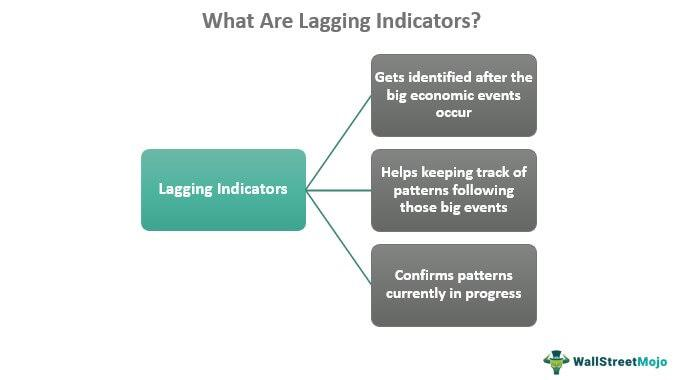

Implementation lag in economic policy is a significant delay between the conception of government actions and their realized effects on the economy. This temporal gap is crucial as it can undermine the efficiency and effectiveness of policy measures intended to stabilize or stimulate economic activity. Recognizing and addressing these delays is essential for several stakeholders, including investors, policymakers, and traders, who rely on the timely impact of economic policies to make informed decisions.

Policy lag can manifest in various forms, such as recognition lag, decision lag, and implementation lag. Each type poses different challenges, including the postponement of economic recovery and the potential for unintended economic outcomes. For instance, a delayed fiscal stimulus might fail to invigorate an economy already recovering on its own, resulting in overheated markets and inflationary pressures.



In the context of modern financial markets, implementation lag has significant implications for algorithmic trading. These trading strategies depend on real-time data and swift market responses. However, the disconnect between policy announcements and their actual effects can lead to mismatches, causing traders to make decisions based on outdated or incomplete information. Such timing discrepancies can influence market dynamics and volatility.

Understanding these delays is not only crucial for navigating economic fluctuations effectively but also for crafting strategies to minimize their impacts. Efforts to reduce policy lags may include reforming bureaucratic processes and leveraging technology to improve communication and decision-making speed. By addressing these issues, the promptness of policy impacts can be enhanced, contributing to better economic stability and market efficiency.

## Table of Contents

## Understanding Policy Lag

Policy lag represents the temporal disparity between the initiation of an economic policy and its eventual full implementation within an economy. This delay is particularly critical as it impacts the effectiveness and timing of economic interventions. Policy lag can be dissected into three primary components: recognition lag, decision lag, and implementation lag. Understanding these different lags allows for a more nuanced view of how government actions translate into economic realities.

**Recognition Lag** occurs when there is a time lapse in identifying economic conditions that require policy intervention. This delay often stems from the time needed to collect, process, and analyze economic data, which can hinder timely decision-making. For instance, fluctuations in GDP or employment rates might not immediately trigger policy adjustments, as these indicators require thorough analysis and validation before action is taken. As a result, recognition lag can lead to missed opportunities for preemptive economic stabilization.

**Decision Lag** pertains to the period between recognizing an economic issue and deciding upon the appropriate policy response. This phase can be prolonged due to the complexities of reaching consensus among policymakers, especially when considering diverse economic impacts and political implications. In democratic systems, decision-making might involve multiple layers of governmental debate and approval, which can further extend this period. Consequently, even when an economic challenge is acknowledged, the time taken to formulate and approve a response can delay effective action.

**Implementation Lag** is the delay in executing and applying the chosen policy measures, once a decision has been made. This can be attributed to bureaucratic hurdles, logistical constraints, and other operational difficulties that slow down the policy deployment process. These challenges can result in economic measures being enacted after their optimal effectiveness window has passed, thereby reducing their impact in stabilizing or stimulating the economy.

The challenges posed by these lags are significant. Delayed economic recovery is a primary concern, as slow policy response times can exacerbate economic downturns, causing prolonged periods of underperformance and distress. Additionally, unintended economic effects may arise from policies that are implemented based on outdated data or conditions that have since evolved. For example, fiscal measures designed to stimulate a recessionary economy might lead to inflationary pressures if the economic context changes during the policy's lag phase.

Overall, policy lag presents a complex challenge that necessitates ongoing attention and innovation to manage effectively, particularly in times of economic uncertainty. By understanding and mitigating these lags, policymakers can improve the precision and timeliness of their interventions, leading to more stable economic environments.

## Causes of Economic Policy Delays

Economic policy delays arise due to a complex interplay of bureaucratic processes, political considerations, and technical constraints. These delays can impede the promptness of policy implementation, leading to significant effects on economic outcomes.

Bureaucratic processes play a critical role in the timing of economic policy enactment. These processes often involve multiple stages of review and approval, which can be time-intensive. For instance, the need to consult various stakeholders, adhere to regulatory frameworks, and comply with legal requirements can significantly delay the rollout of policies. The layered nature of government institutions, requiring clearances from different levels of authority, further complicates and slows the process. Such hurdles prolong the timeline from policy formulation to implementation, thus contributing to the implementation lag.

Political considerations also significantly impact the speed of economic policy deployment. Policymakers often need to navigate partisan disagreements and ensure consensus-building, which can delay decision-making. Political cycles, such as elections, can influence the timing of policy announcements, as leaders may postpone or accelerate policies to align with electoral goals. Negotiations and compromises necessary for policy approval can further extend timeframes, as diverse political interests must be balanced and accommodated.

Technical constraints are another critical [factor](/wiki/factor-investing) contributing to delays in economic policy. These constraints include the availability and processing of accurate data necessary for informed policy formulation. The integration of complex economic models and simulations to predict policy outcomes can require considerable time and expertise. Additionally, outdated technological infrastructure within government bodies can hinder the swift execution of economic measures. The reliance on traditional methods for data collection and analysis, combined with the challenges in forecasting economic conditions, can lead to implementation lags.

The combination of these factors results in a prolonged response of economic measures. Implementation lag can lead to delayed economic recovery during downturns, as the intended effects of a policy are not realized promptly. Furthermore, the introduction of policies with significant delays can lead to unintended economic consequences, as real-time conditions may shift during the lag period. For example, a stimulus package intended to combat a recession may arrive too late, creating inflationary pressures if the economy has already begun to recover.

Given these challenges, addressing the root causes of economic policy delays is essential to reducing implementation lag. Streamlining bureaucratic processes, minimizing political roadblocks, and leveraging advanced data analytics can accelerate policy impacts and enhance economic responsiveness.

## Implementation Lag in Algorithmic Trading

Implementation lags in economic policy introduce complexities in the domain of [algorithmic trading](/wiki/algorithmic-trading). These lags can substantially affect trading strategies that rely on economic indicators and policy signals. Algorithmic trading, characterized by high-speed decision-making capabilities often based on real-time data, may encounter mismatches between trading actions and the outcomes of economic policies delayed by implementation lags.

Algorithmic trading strategies typically depend on instantaneous data to operate efficiently. However, when policy implementation is delayed, these algorithms might base their decisions on outdated or incomplete economic indicators. For instance, a trading algorithm might react to an expected policy change intended to stimulate the economy. Still, if the policy's implementation is postponed, the initial trading decision could lead to suboptimal outcomes or even losses.

Real-time data plays a crucial role in algorithmic trading, providing traders with an edge by offering immediate insights into market conditions and economic indicators. However, the efficacy of real-time data is compromised when there are significant policy lags, as the data may not reflect the actual economic conditions intended by new policies. This discrepancy can lead to a gap between anticipated policy effects and the reality captured by the data, resulting in potential inaccuracies in trading models.

These mismatches emphasize the importance of understanding policy timelines and integrating delay variables in algorithmic models. By incorporating factors accounting for potential lags, traders can better align their strategies with realistic economic outcomes. For example, introducing a delay parameter into a predictive model can help adjust the expected timing of economic changes, providing a more precise alignment with the real-world scenarios likely to unfold under delayed conditions.

Moreover, [machine learning](/wiki/machine-learning) techniques can be employed to predict the potential impacts of policy delays. Algorithms could be trained to recognize patterns of past delays, adding a corrective element to trading strategies that anticipate economic policy impacts. This proactive approach can mitigate risks associated with implementation lag, enabling traders to adjust their positions accordingly.

In conclusion, implementation lag presents a substantial challenge to algorithmic trading strategies that rely on real-time economic indicators. Identifying and adjusting for these delays is vital to ensuring trading strategies are adequately aligned with the actual economic environment, thus maintaining market efficiency and enhancing decision-making accuracy.

## Impact of Implementation Lag on Economic Indicators

Implementation lag significantly affects economic indicators, introducing distortions that may hinder accurate economic assessment and forecasting. Gross Domestic Product (GDP), inflation, and employment rates are primary metrics susceptible to the effects of such delays. These indicators form the backbone of economic analysis and policy formulation, thereby making the understanding of their interaction with implementation lags essential.

Firstly, GDP, a crucial measure of a country's economic performance, can be notably skewed by implementation lags. Policies aimed at stimulating economic growth may take time to manifest in GDP figures due to the delay between policy initiation and actual economic impact. For instance, a government might introduce fiscal stimulus measures, yet the lag in implementation means the GDP effect may not be visible until subsequent quarters. This delay can lead to erroneous interpretations of economic health and subsequent policy missteps if policymakers react based on outdated data.

Secondly, inflation indicators are also vulnerable to lags. Monetary policies, such as [interest rate](/wiki/interest-rate-trading-strategies) adjustments intended to control inflation, often experience delays before influencing the economy. Central banks may lower interest rates to curb high inflation, but the anticipated reduction in inflation may occur only after several months, during which inflation metrics might depict an inaccurate picture of the immediate economic environment. Such lags can compromise inflation targeting, a critical aspect of monetary policy.

Employment rates serve as another indicator heavily impacted by implementation lags. Policies designed to reduce unemployment, such as job creation programs or labor market interventions, often require time before measurable effects on employment figures are observed. Delays can result in persistent high unemployment rates in official [statistics](/wiki/bayesian-statistics), even when underlying conditions have begun improving due to policy measures. This misalignment affects labor market projections and may misguide workforce-related policy decisions.

The implications for economic forecasting are profound. Forecasting models rely heavily on current economic indicators to predict future economic conditions. Implementation lags introduce noise into these indicators, potentially leading to forecast errors. Financial models, for instance, could predict growth or inflation trajectories that do not align with reality due to lag-induced data distortions.

These lags can also contribute to misaligned economic strategies. Policymakers designing future actions based on skewed indicators may inadvertently implement measures that are either too aggressive or too timid, exacerbating economic [volatility](/wiki/volatility-trading-strategies) instead of stabilizing it.

To illustrate the complexity of the impact of implementation lags on economic indicators, consider the following hypothetical Python code snippet that models a simple economic scenario:

```python
import numpy as np
import matplotlib.pyplot as plt

# Simulation parameters
time_steps = 50
policy_impact_delay = 5
gdp_growth_rate = 0.03

# GDP initial value
initial_gdp = 1000

# Array to store GDP values
gdp_values = [initial_gdp]

# Simulate the GDP growth with a delayed policy impact
for t in range(1, time_steps):
    if t >= policy_impact_delay:
        effective_growth_rate = gdp_growth_rate * 1.2  # Imagine a stimulative policy effect
    else:
        effective_growth_rate = gdp_growth_rate

    next_gdp = gdp_values[-1] * (1 + effective_growth_rate)
    gdp_values.append(next_gdp)

# Plotting the GDP trend
plt.plot(gdp_values, label='GDP with Implementation Lag')
plt.xlabel('Time Step')
plt.ylabel('GDP Value')
plt.title('Impact of Implementation Lag on GDP')
plt.legend()
plt.show()
```

In this code, a simple model demonstrates GDP growth with an assumed policy intervention effect after a delay. The visual representation aids in understanding how implementation lags can result in an observable yet delayed effect on GDP, demonstrating the potential for misinterpretation without awareness of such lags. Understanding and accommodating these delays are crucial for more accurate economic forecasting and effective policy planning.

## Addressing and Reducing Implementation Lag

Reducing implementation lags in economic policy is crucial to enhancing the efficacy and timeliness of government interventions. One key strategy is to streamline decision-making processes, which can involve eliminating unnecessary bureaucratic layers and simplifying procedural steps. By doing so, policymakers can expedite the transition from policy formulation to execution, minimizing delays that can hamper the immediate impact on the economy. Enhanced inter-agency cooperation is also vital. When various government departments and agencies work cohesively, the integration and execution of policies become more efficient, reducing the likelihood of delays caused by miscommunication or procedural redundancies.

Advancements in technology and data analytics provide substantial opportunities to mitigate implementation lags. By leveraging real-time data analytics, policymakers can make informed decisions more swiftly, identifying economic shifts and deploying corresponding policy measures without delay. For example, machine learning algorithms can process vast datasets to predict economic trends, enabling proactive policy adjustments. Python, for instance, offers libraries such as Pandas and Scikit-learn, which can be employed to analyze economic indicators and simulate policy outcomes rapidly.

Consider the following Python code as a basic example of how data analytics might be used to forecast an economic indicator:

```python
import pandas as pd
from sklearn.model_selection import train_test_split
from sklearn.linear_model import LinearRegression

# Load dataset
data = pd.read_csv('economic_data.csv')

# Select features and target variable
X = data[['Interest_Rate', 'Inflation_Rate', 'Unemployment_Rate']]
y = data['GDP_Growth']

# Split the dataset into training and testing sets
X_train, X_test, y_train, y_test = train_test_split(X, y, test_size=0.2, random_state=42)

# Initialize and train the model
model = LinearRegression()
model.fit(X_train, y_train)

# Make predictions
predictions = model.predict(X_test)
```

In this example, a linear regression model is used to predict GDP growth based on various economic factors. By integrating such predictive models into policy decision frameworks, governments can better anticipate economic conditions and adapt their policies accordingly, thus reducing implementation lags.

Furthermore, enhancing inter-agency cooperation through technology, such as collaborative platforms and communication tools, can streamline processes. Using cloud-based services for information sharing ensures that all relevant agencies have simultaneous access to critical data, fostering a unified approach to policy execution.

In conclusion, addressing and reducing implementation lags involves adopting strategies that streamline decision-making and enhance inter-agency collaboration. Incorporating technological advancements and data analytics facilitates quicker responses to economic challenges, ultimately promoting economic stability and growth.

## Best Practices and Recommendations

To effectively address implementation lag, policymakers and traders can adopt several best practices that enhance the responsiveness and effectiveness of economic policies and trading strategies.

### For Policymakers:

1. **Streamlined Decision-Making Processes**: Implementing clear and efficient bureaucratic processes is crucial. Reducing the number of hierarchical layers in decision-making can expedite policy deployment. This involves delegating authority where appropriate and establishing well-defined lines of communication among departments and agencies, which can help in quicker execution of economic policy directives.

2. **Inter-Agency Cooperation**: Collaboration across various governmental agencies facilitates data sharing and coherent policy implementation. By fostering inter-agency cooperation, governments can reduce redundancy and improve alignment between different policy measures, thereby minimizing delays.

3. **Data-Driven Policy Formulation**: Leveraging real-time data analytics aids in quicker recognition of economic trends and challenges. Policymakers should invest in advanced data infrastructure to access timely economic indicators, allowing them to anticipate changes in economic conditions and react more swiftly.

4. **Use of Technology in Implementation**: The integration of information and communication technology in public administration can significantly reduce administrative delays. Digital platforms for policy management and public services not only improve efficiency but also enhance transparency and accountability in policy implementation.

5. **Regular Policy Reviews and Feedback Mechanisms**: Establishing a routine review process helps to assess the effectiveness of policies and make necessary adjustments swiftly. Feedback mechanisms enable policymakers to understand the real-world impacts of their initiatives, thus allowing for more dynamic and adaptive governance.

### For Traders:

1. **Algorithmic Flexibility**: Trading algorithms should incorporate flexibility to adapt to policy changes. This involves using machine learning models that can learn from socioeconomic indicators and adjust trading strategies in real time.

   ```python
   import pandas as pd
   from sklearn.ensemble import RandomForestRegressor

   def adjust_trading_strategy(economic_data):
       model = RandomForestRegressor()
       model.fit(economic_data[['indicator1', 'indicator2']], economic_data['market_response'])
       predictions = model.predict(economic_data[['indicator1', 'indicator2']])
       return predictions
   ```

2. **Integration of Economic Forecasts**: Traders can minimize risks by integrating economic forecasts into their trading strategies. This involves using predictive analytics to anticipate potential policy decisions and associated market reactions, providing a competitive edge in terms of trading decisions.

3. **Continuous Monitoring and Adjustment**: Maintaining a practice of continuous monitoring of market and policy developments is crucial. Traders should be prepared to adjust their strategies promptly in response to unexpected policy announcements or implementation delays.

4. **Risk Management Strategies**: Developing robust risk management frameworks that account for policy lag can help traders mitigate potential adverse impacts. This includes diversification of portfolios and use of financial derivatives to hedge against policy-driven volatility.

5. **Stakeholder Engagement**: Engaging with policy analysts and economic experts provides insights into potential policy shifts and upcoming economic measures. Networking with stakeholders can enhance traders’ understanding of the broader economic context, allowing for better-informed trading decisions.

By adopting these best practices, both policymakers and traders can effectively reduce the adverse effects of implementation lag, thereby enhancing economic stability and market efficiency.

## Conclusion

Understanding and addressing implementation lag is crucial for maintaining economic stability and enhancing market efficiency. The concept of implementation lag pertains to the delay between the initiation of economic policies and their tangible impacts on the economy. By comprehending these delays, policymakers can devise more effective strategies to mitigate their adverse effects, thus ensuring that economic interventions are timely and relevant. This understanding is vital not only for policymakers but also for investors and traders who rely on timely data to make informed decisions.

Timely policy interventions can help cushion economies against fluctuations, reducing the severity and duration of economic downturns. When governments respond promptly to economic signals, they can avert potential crises or mitigate their impact, thereby promoting long-term economic growth and stability. Furthermore, real-time adaptations in trading scenarios are necessary to align with fast-changing market conditions. Traders and investors can adjust their strategies based on up-to-date information, minimizing risks associated with implementation lag.

Moreover, reducing implementation lag can lead to more accurate economic forecasting, better alignment of economic strategies, and improved decision-making processes. Technological advancements, particularly in data analytics and information processing, offer promising solutions to streamline these processes, ensuring that policy measures achieve their desired outcomes more swiftly.

In conclusion, addressing implementation lag is essential for fostering economic resilience and ensuring that market participants can effectively navigate dynamic economic landscapes. By prioritizing the reduction of these delays, both public and private sectors can enhance their strategic responses, promoting a more efficient and stable economic environment.

## References & Further Reading

[1]: Mankiw, N. G. (2019). ["Macroeconomics."](https://archive.org/details/macro-economics-mankew) Worth Publishers.

[2]: Blinder, A. S. (1998). ["Central Banking in Theory and Practice."](https://mitpress.mit.edu/9780262522601/central-banking-in-theory-and-practice/) The MIT Press.

[3]: Taylor, J. B. (1993). ["Discretion versus policy rules in practice."](https://web.stanford.edu/~johntayl/Onlinepaperscombinedbyyear/1993/Discretion_versus_Policy_Rules_in_Practice.pdf) Carnegie-Rochester Conference Series on Public Policy, 39, 195-214.

[4]: Hull, J. C. (2018). ["Risk Management and Financial Institutions."](https://books.google.com/books/about/Risk_Management_and_Financial_Institutio.html?id=1J1QDwAAQBAJ) Wiley.

[5]: Bernanke, B. S., & Mishkin, F. S. (1997). ["Inflation Targeting: A New Framework for Monetary Policy?"](https://www.aeaweb.org/articles?id=10.1257/jep.11.2.97) Journal of Economic Literature, 35(1), 97-116.

[6]: Lopez de Prado, M. (2018). ["Advances in Financial Machine Learning."](https://www.amazon.com/Advances-Financial-Machine-Learning-Marcos/dp/1119482089) Wiley.

[7]: Chan, E. (2009). ["Quantitative Trading: How to Build Your Own Algorithmic Trading Business."](https://github.com/ftvision/quant_trading_echan_book) Wiley.