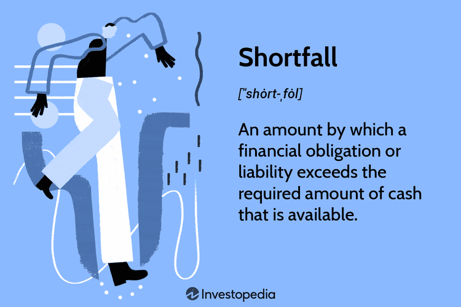

Implementation shortfall in trading refers to the difference between the theoretical cost of executing an investment decision and the actual cost incurred when carrying out the trade. It quantifies the trade execution performance and is a critical metric for understanding and managing trading costs. The calculation of implementation shortfall involves comparing the price at the time of decision-making with the execution price, accounting for delays, price slippage, and any market impact. It can be mathematically expressed as:

$$
\text{Implementation Shortfall} = (\text{Avg Execution Price} - \text{Decision Price}) \times \text{Executed Quantity}
$$

Managing trading costs is fundamental for effective investment performance. Trading costs are broadly classified into explicit costs, such as commissions and fees, and implicit costs, which include slippage and market impact. Both contribute significantly to the erosion of returns, thus emphasizing the need for sophisticated management strategies to optimize investment outcomes.

Algorithmic trading has emerged as a transformative force in the financial markets, designed to minimize implementation shortfall and enhance trading efficiency. Algorithms execute trades at speeds and frequencies beyond human capability, optimizing order placement by determining the best times to execute buy or sell orders to achieve optimal pricing. These sophisticated strategies leverage vast market data, aiming to reduce the adverse effects of trading costs and improve profitability.

The primary focus of this article is to explore the relationship between implementation shortfall, trading costs, investment performance, and algorithmic trading. We will define relevant terms, assess various strategies, and conclude with practical best practices for minimizing trading inefficiencies. By understanding these concepts, investors and traders can enhance their strategy executions, resulting in improved investment performance.

## Table of Contents

## What is Implementation Shortfall?

Implementation shortfall is a critical financial metric that measures the performance and efficiency of trade executions. It represents the difference between the theoretical profit or cost of a trade if executed at the decision price (the price when the trading decision is made) and the actual execution price. The primary purpose of this metric is to quantify the hidden costs of trading, including both explicit and implicit costs, and to assess the effectiveness of trade execution strategies.

**Calculation of Implementation Shortfall:**

The implementation shortfall is calculated as follows:

$$
\text{Implementation Shortfall} = (\text{Decision Price} - \text{Execution Price}) \times \text{Number of Shares}
$$

The decision price is the prevailing market price at the time the buy or sell decision is made, while the execution price is the price at which the trade is actually completed. The implementation shortfall can be affected by market [volatility](/wiki/volatility-trading-strategies), timing of order placement, and the type of order used.

**Importance in Trading:**

Implementation shortfall is a critical metric in trading because it provides insight into the effectiveness of trade execution. A higher shortfall indicates that the trade was less efficient, resulting in increased trading costs that can erode returns. Conversely, a lower shortfall suggests a more efficient trade execution, minimizing additional costs beyond the decision price.

**Common Causes:**

Several factors contribute to implementation shortfall in trading activities:

1. **Market Impact:** Large trades can influence the market price, causing movement against the trader's interest during execution.

2. **Timing Delay:** Delays between decision-making and execution can lead to adverse price movements, especially in volatile markets.

3. **Opportunity Cost:** Failing to execute a trade at an opportune moment can result in missed potential gains.

4. **Order Slippage:** Differences between the expected price of a trade and the actual transaction price due to market fluctuations or order type.

**Impact on Trading Efficiency and Profitability:**

Implementation shortfall has a direct impact on trading efficiency and profitability. Higher shortfalls result in increased trading costs and reduced investment returns. For institutional investors, controlling these costs is vital for achieving better overall portfolio performance. Retail investors can also benefit by understanding and minimizing these hidden costs to maximize investment gains.

**Real-world Examples:**

A typical example of implementation shortfall occurs in high-frequency trading, where rapid execution is crucial. In such scenarios, even slight delays or inefficiencies can lead to significant shortfalls. Another example is during market announcements; trades executed during these periods may face higher shortfall due to increased volatility and market impact. Traders often use advanced algorithms and strategies to mitigate these issues, underscoring the necessity of managing implementation shortfall effectively.

## The Impact of Trading Costs on Investment Performance

Trading costs significantly impact investment performance and are categorized into explicit and implicit costs. 

**Explicit Costs:**
These are direct costs that are easy to quantify and include commissions, fees, and taxes associated with trading. When an investor buys or sells a security, they incur a commission charged by the broker, along with any regulatory or exchange fees. Taxes might also apply, especially in regions with transaction levies or stamp duties.

**Implicit Costs:**
These costs are less apparent and represent the market impact of a trade, the bid-ask spread, and opportunity costs. Market impact refers to the change in the price of a security resulting from the trade itself. A large trade can move the market, potentially increasing the cost of the transaction. The bid-ask spread, the difference between the purchase price and selling price offered by the market makers, is another critical implicit cost. Opportunity cost involves the potential lost return when capital is tied up in a transaction.

**Trading Costs and Investment Performance:**
The interplay between trading costs and investment performance is significant, as these costs directly reduce the returns on an investment portfolio. For institutional investors managing large sums of money, even small percentage changes in returns can translate into substantial dollar amounts. Trading costs can erode returns, particularly in high-frequency trading or when managing large portfolios that require frequent rebalancing.

**Significance of Controlling Trading Costs:**
Both institutional and retail investors must manage trading costs to enhance net returns. For institutional investors, large transaction volumes mean that even slight reductions in costs can lead to considerable savings. Retail investors, on the other hand, face higher relative trading costs and must strategize to optimize their portfolios without incurring excessive fees and charges.

**Excessive Trading Costs and Erosion of Returns:**
High trading costs can erode returns, especially in strategies reliant on frequent trading or those operating on thin margins. For example, a portfolio with a gross return of 8% per annum might see net returns reduced to 6% or less after accounting for high costs, significantly impacting long-term wealth accumulation and the achievement of financial goals.

**Solutions to Reduce and Manage Trading Costs:**
Investors can employ several strategies to mitigate trading costs effectively:

1. **Algorithmic Trading:** Using sophisticated algorithms to optimize trade execution can help reduce implicit costs like market impact and take advantage of real-time pricing.

2. **Limit Orders:** These allow investors to set a specific price at which they are willing to buy or sell, potentially reducing the bid-ask spread costs.

3. **Trading at Optimal Times:** Executing trades when market liquidity is high can reduce the bid-ask spread and market impact.

4. **Portfolio Rebalancing Strategies:** By minimizing unnecessary trades, investors can avoid incurring regular transaction costs.

5. **Leveraging Technology and Analytics:** Advanced trading platforms and analytics tools can provide insights into cost-effective trading opportunities and help in executing trades with precision.

Through careful cost management and strategic trading practices, investors can protect and potentially enhance their investment returns.

## Algorithmic Trading and Its Role in Managing Implementation Shortfall

Algorithmic trading refers to the use of computerized systems to execute trades in financial markets based on pre-defined criteria and strategies. Its evolution has been driven by advances in technology, increased market data availability, and the need for efficiency and precision in trade execution. Initially, [algorithmic trading](/wiki/algorithmic-trading) was used primarily by large financial institutions due to the significant resources required. However, advancements in computing technology and data processing capabilities have broadened its accessibility to a wider range of market participants, including retail investors.

Algorithmic trading strategies play a pivotal role in reducing implementation shortfall by optimizing trade execution processes. Implementation shortfall measures the difference between the decision price of a trade and the actual execution price, including the impact of market movements and transaction costs. By utilizing algorithms, traders can minimize this discrepancy by strategically managing order placement and execution to mitigate adverse price movements and reduce explicit and implicit trading costs.

Various types of algorithmic strategies exist to target lower transaction costs and minimize implementation shortfall. Commonly employed strategies include:

1. **Volume-Weighted Average Price (VWAP)**: This strategy aims to execute an order as close to the volume-weighted average price as possible, spreading trades over a specified period to minimize market impact.

2. **Time-Weighted Average Price (TWAP)**: This strategy breaks an order into smaller trades executed at regular intervals over a predetermined time frame, facilitating steady execution to prevent dramatic price swings.

3. **Percentage of Volume (POV)**: This approach executes a trade according to a specified percentage of the market volume, allowing the order to adjust dynamically based on market conditions.

4. **Implementation Shortfall (IS) strategies**: These prioritize minimizing the difference between the decision price and the execution price, focusing directly on reducing implementation shortfall.

5. **Market Making Algorithms**: These algorithms continually place both buy and sell orders to capitalize on bid-ask spreads, thereby managing liquidity and reducing execution costs.

Successful implementations of algorithmic trading often involve real-world case studies where firms have effectively used these strategies to enhance trading efficiency and profitability. For instance, JP Morgan's implementation of algorithmic strategies has allowed them to optimize trade execution and significantly lower transaction costs. Similarly, quantitative hedge funds, like Renaissance Technologies, have employed sophisticated algorithms to consistently outperform traditional trading approaches.

Despite its advantages, algorithmic trading comes with challenges and risks. These include technological failures, such as system outages or latency issues, which can lead to significant financial losses. Market volatility poses additional risk, as rapid price changes can result in substantial implementation shortfall if strategies are not adaptable. Algorithms may also inadvertently contribute to market microstructure noise, increasing the risk of erroneous trades due to flawed algorithms or unexpected market conditions.

To mitigate these risks, traders and firms employ rigorous testing and validation processes, often using historical data and simulations to ensure the robustness and reliability of algorithms under various market scenarios. Compliance with regulatory requirements remains crucial to prevent market abuse and ensure fair trading practices.

Overall, algorithmic trading continues to evolve, offering significant potential for reducing implementation shortfall and enhancing trading efficiency, provided that market participants remain vigilant of the associated challenges and continuously refine their strategies and technologies.

## Strategies to Minimize Implementation Shortfall

Strategies to minimize implementation shortfall in trading are crucial for optimizing performance and maximizing returns. These strategies involve a combination of technology, analytics, timing, order execution, and the consideration of market conditions.

One key strategy is the use of technology and analytics to optimize trade execution. Modern trading platforms utilize advanced algorithms and [machine learning](/wiki/machine-learning) techniques to analyze vast amounts of market data in real time. This enables traders to identify optimal entry and [exit](/wiki/exit-strategy) points, thereby reducing the adverse effects of implementation shortfall. Tools such as transaction cost analysis (TCA) help in understanding the cost structure of trades and adjusting strategies accordingly. For instance, a TCA might reveal patterns in slippage or market impact that can be used to recalibrate trading strategies.

Timing and order execution strategies are also pivotal. The timing of trades can significantly influence the market impact and price obtained, particularly in volatile markets. Key strategies include the use of limit orders instead of market orders to control the price at which a trade is executed. Moreover, traders can leverage scheduled algorithms like VWAP (Volume Weighted Average Price) or TWAP (Time Weighted Average Price) to execute orders over a specified period, thereby minimizing market impact. VWAP, for instance, helps in distributing a large order across the trading day, avoiding concentration in high-impact periods.

Market conditions are another vital [factor](/wiki/factor-investing) affecting implementation shortfall. Volatility, [liquidity](/wiki/liquidity-risk-premium), and market trends can all affect the slippage experienced during trade execution. Understanding these conditions allows traders to adjust their strategies proactively. For example, a trader might choose to delay trade execution during periods of high volatility to avoid adverse price movements.

Practical tips and best practices for minimizing implementation shortfall include maintaining a flexible trading strategy that adapts to changing market conditions, utilizing automated trading systems to execute trades with precision and speed, and consistently monitoring and analyzing trade performance to identify areas for improvement. Additionally, staying informed about regulatory changes and market developments is essential as these can impact trading dynamics.

In conclusion, minimizing implementation shortfall requires a strategic approach that integrates technology, careful timing, awareness of market conditions, and continuous performance evaluation. These elements together can significantly enhance trading efficiency and profitability.

## Conclusion

Understanding and managing implementation shortfall is vital for achieving investment success as it encompasses the hidden costs of trading that can undermine an investor's portfolio returns. This metric, capturing the difference between the price when a trading decision is made and the actual execution cost, is critical in evaluating trading efficiency and profitability. Effective management of implementation shortfall not only requires a solid grasp of its calculation but also an understanding of the factors that contribute to it, such as market impact and timing delays.

Algorithmic trading emerges as a powerful tool in minimizing implementation shortfall, as it leverages technology and advanced strategies to optimize trade execution. By automating trading processes, algorithmic trading can reduce manual errors, improve execution speed, and manage order volumes with precision, leading to lower transaction costs. Algorithms analyze market data to execute large orders strategically, minimizing the market impact and achieving better price efficiency.

Efficient cost management is another cornerstone of successful trading performance. By controlling explicit and implicit trading costs, both institutional and retail investors can safeguard their return on investment. Techniques such as improved timing, smart order routing, and employing dark pools are instrumental in reducing these costs effectively.

Adapting to new technologies and continuously educating oneself on emerging trading strategies is essential in an evolving financial market landscape. Traders and investors must remain informed about technological advancements and regulatory changes that can influence trading dynamics and costs. By doing so, they can implement tailored solutions that align with their specific trading objectives and risk appetites.

In conclusion, investors are encouraged to evaluate their trading practices critically. By identifying areas for improvement in order execution and cost management, they can enhance their overall investment performance. Embracing algorithmic trading and other advanced tools can lead to more strategic and cost-effective trading decisions.

## Additional Resources

### Additional Resources

**Academic Papers and Industry Studies on Implementation Shortfall**

1. **"The Measurement of Execution Cost and Their Biases" by Almgren and Chriss:** A seminal paper that investigates into the quantification and biases in execution costs, providing a mathematical framework to understand implementation shortfall.

2. **"Implementation Shortfall: Understanding Transaction Costs" by Perold, A.F.:** Available on research databases like JSTOR, this paper provides a detailed analysis of the implementation shortfall and its implications on trading.

3. **"Optimal Trading Strategies: Quantitative Approaches for Managing Trading Costs" by Kissell, R. and Glantz, M.:** This book offers insights into quantitative methods to manage trading costs effectively by leveraging trading algorithms. 

**Books and Publications on Trading Strategies and Algorithmic Trading**

- **"Algorithmic Trading and DMA: An Introduction to Direct Access Trading Strategies" by Barry Johnson:** A comprehensive guide to understanding and implementing algorithmic trading strategies, especially useful for traders seeking to reduce implementation shortfall.

- **"Quantitative Trading: How to Build Your Own Algorithmic Trading Business" by Ernest P. Chan:** This publication helps traders design strategies in line with current trends in algorithmic trading.

- **"Trading and Exchanges: Market Microstructure for Practitioners" by Larry Harris:** An essential read for those interested in the structural aspects of trading and its implications for costs and execution.

**Online Courses and Webinars**

- **Coursera: "Algorithmic Trading Strategies" offered by the University of Michigan:** A course designed to educate participants on designing, testing, and executing automated trading systems.

- **edX: "Trading Basics" from the New York Institute of Finance:** A program suitable for a foundational understanding of trading, with modules on cost management and execution strategies.

- **Fidelity Learning Center: Webinars on Trading Strategies and Market Dynamics:** Regularly updated with the latest on trading practices, covering implementation shortfall and cost reduction tactics.

**Industry Experts and Firms Specializing in Minimizing Implementation Shortfall**

- **Quantitative Brokers**: An agency-only broker specializing in reducing transaction costs with advanced trading algorithms. Contact them at [contact@quantitativebrokers.com](mailto:contact@quantitativebrokers.com).

- **ITG (Investment Technology Group)**: A pioneer in trading technology solutions offering insights and consultancy on execution strategies. Visit their website for more details at [ITG website](https://www.itg.com).

**Forums and Online Communities**

- **Elite Trader (www.elitetrader.com):** An online community where traders share insights and strategies, including discussions on minimizing implementation shortfall.

- **QuantConnect Community:** An open community of quant traders sharing algorithmic trading ideas, tools, and strategies.

- **Stack Exchange Quantitative Finance:** A forum for quantitative traders and investors to ask questions and share knowledge on topics like implementation shortfall and risk management.

These resources provide a comprehensive guide to understanding and addressing implementation shortfall, offering educational and practical avenues for traders and investors to optimize their strategies and cost management practices.

## References & Further Reading

[1]: Almgren, R., & Chriss, N. (2000). ["Optimal Execution of Portfolio Transactions."](https://smallake.kr/wp-content/uploads/2016/03/optliq.pdf) Journal of Risk, 3, 5-39.

[2]: Perold, A. F. (1988). ["The Implementation Shortfall: Paper Versus Reality."](https://www.hbs.edu/faculty/Pages/item.aspx?num=2083) The Journal of Portfolio Management, 14(3), 4-9.

[3]: Kissell, R., & Glantz, M. (2013). ["Optimal Trading Strategies: Quantitative Approaches for Managing Trading Costs."](https://archive.org/details/optimaltradingst0000kiss) American Management Association.

[4]: Johnson, B. (2010). ["Algorithmic Trading & DMA: An Introduction to Direct Access Trading Strategies."](https://archive.org/details/algorithmictradi0000john) 4Myeloma Press.

[5]: Chan, E. P. (2008). ["Quantitative Trading: How to Build Your Own Algorithmic Trading Business."](https://github.com/ftvision/quant_trading_echan_book) John Wiley & Sons.

[6]: Harris, L. (2002). ["Trading and Exchanges: Market Microstructure for Practitioners."](https://www.amazon.com/Trading-Exchanges-Market-Microstructure-Practitioners/dp/0195144708) Oxford University Press.