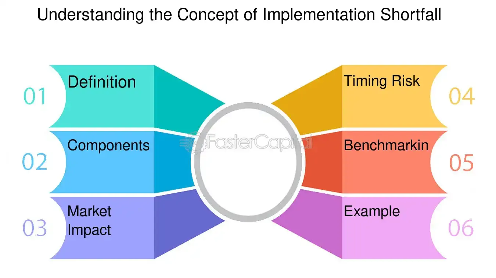

## Table of Contents

## What is implementation shortfall?

Implementation shortfall is a way to measure how well a trading strategy works. It looks at the difference between the decision to trade and when the trade actually happens. This difference can happen because of delays, changes in price, or other costs that come up during trading. By understanding the implementation shortfall, traders can see how much their strategy costs them in real trading situations.

The idea of implementation shortfall was first talked about by André F. Perold in 1988. He wanted to help investors understand the real costs of their trading decisions. This measure includes not just the direct costs, like fees, but also the indirect costs, like the price moving against the trader while they are trying to buy or sell. By using implementation shortfall, traders can make better choices and try to reduce these costs to make their strategies more effective.

## How does implementation shortfall differ from other trading costs?

Implementation shortfall is different from other trading costs because it looks at the total cost of a trade from the moment a decision is made until the trade is finished. Other trading costs, like commissions or fees, are just the direct costs you pay to buy or sell something. Implementation shortfall includes these direct costs but also adds in the indirect costs, like the price moving against you while you're trying to trade. This gives a fuller picture of what trading really costs.

For example, if you decide to buy a stock at $100 but by the time you actually buy it, the price has gone up to $102, the implementation shortfall would include that $2 difference, plus any fees. Other trading costs might only count the fees, missing out on the $2 increase. By looking at implementation shortfall, traders can see the real impact of their trading decisions and work on ways to make their trades cheaper and more effective.

## What are the main components of implementation shortfall?

Implementation shortfall has several main parts that help traders understand the total cost of their trades. The first part is the delay cost, which is the change in price from when you decide to trade until you actually make the trade. If the price goes up while you're waiting to buy, that's a cost. The second part is the price impact, which happens when your trade itself moves the market price. If you buy a lot of a stock, the price might go up because of your buying.

Another part of implementation shortfall is the trading cost, which includes the direct costs like commissions and fees you pay to make the trade. The last part is the opportunity cost, which is what you could have made if you had traded at the best possible time but didn't. All these parts together show the full cost of trading from start to finish, helping traders see where they might be losing money and how they can trade better.

## Can you explain the calculation of implementation shortfall?

To calculate implementation shortfall, you start with the price of the asset when you decide to trade. Let's say you want to buy a stock and the price is $100 at that moment. You then compare this price to the actual price you end up paying when you complete the trade. If the price goes up to $102 by the time you buy, you have a $2 delay cost. You also need to add any fees or commissions you pay, like if the fee is $1, that's another cost. Finally, you look at the opportunity cost, which is the profit you could have made if you had traded at the best possible time but didn't.

Adding all these costs together gives you the total implementation shortfall. In our example, if you paid $102 for the stock plus a $1 fee, and you could have bought it at $100 if you had acted faster, the total implementation shortfall would be $3 ($2 delay cost + $1 fee). This number shows you the real cost of your trade, helping you understand how much your trading strategy is costing you and where you might be able to save money in the future.

## What are some common causes of implementation shortfall?

Implementation shortfall often happens because of delays in trading. When you decide to buy or sell something, it might take time to actually do the trade. During this time, the price can change. If the price goes up before you buy, you end up paying more than you planned. This delay can be caused by slow trading systems, waiting for the right moment to trade, or just taking too long to make a decision.

Another common cause is the impact your trade has on the market. If you try to buy a lot of a stock quickly, other people might see this and start buying too, pushing the price up. This is called price impact. It can make your trade more expensive because you end up paying a higher price than you expected. Also, the costs of trading, like fees and commissions, add to the shortfall. These direct costs, along with the indirect costs from delays and price impacts, all contribute to the total implementation shortfall.

## How does implementation shortfall impact investment performance?

Implementation shortfall can make a big difference in how well your investments do. When you decide to buy or sell a stock, there are costs that come up along the way. These costs, like the price going up while you wait to buy or the fees you have to pay, can eat into your profits. If you're not careful, these costs can add up and make your investment returns smaller than you hoped.

To do better with your investments, it's important to keep an eye on these costs. By understanding and trying to lower the implementation shortfall, you can make smarter choices about when and how to trade. This means you might be able to keep more of your money and see bigger returns over time. Keeping track of these costs helps you manage your investments more effectively and reach your financial goals.

## What strategies can be used to minimize implementation shortfall?

To minimize implementation shortfall, traders can use a few smart strategies. One way is to trade quickly. When you decide to buy or sell, try to do it as fast as you can. This helps avoid the price changing too much while you wait. Another strategy is to break up big trades into smaller ones. Instead of buying a lot of stock all at once, you can buy it little by little over time. This can help keep the price from moving too much because of your trade.

Another good idea is to use smart trading tools and technology. These can help you trade faster and at better prices. Also, think about the time you choose to trade. Trading when the market is busy can lead to bigger price changes, so it might be better to trade when things are quieter. By using these strategies, you can lower the costs that come with trading and keep more of your money.

## Can you provide examples of implementation shortfall in different markets?

In the stock market, imagine you want to buy 1,000 shares of a company's stock. When you decide to buy, the price is $50 per share. But it takes you an hour to place the order because you're waiting for the right moment. By the time you actually buy the stock, the price has gone up to $52 per share. You also have to pay a $10 fee to your broker. So, you end up spending $52,010 instead of the $50,010 you expected. The extra $2,000 you spent is the implementation shortfall, caused by the delay and the fee.

In the foreign exchange market, let's say you want to exchange dollars for euros. You see the exchange rate is 1 USD to 0.85 EUR when you decide to make the trade. But it takes you a few hours to actually do it, and by then, the rate has changed to 1 USD to 0.83 EUR. You also have to pay a small fee of $5 for the transaction. So, instead of getting 850 euros for 1,000 dollars, you get 830 euros after the fee. The difference, which is about 20 euros plus the fee, is your implementation shortfall, caused by the delay in the exchange rate and the transaction fee.

## How do institutional investors typically measure and manage implementation shortfall?

Institutional investors, like big funds that manage a lot of money, use special tools and methods to measure and manage implementation shortfall. They often use computer programs that track the costs of trading, from the moment they decide to buy or sell until the trade is done. These programs look at things like how long it takes to trade, how much the price changes during that time, and any fees they have to pay. By keeping a close eye on these costs, institutional investors can see how much their trading decisions are costing them and where they might be losing money.

To manage implementation shortfall, institutional investors use smart trading strategies. They might break up big trades into smaller ones to avoid moving the market price too much. They also use technology to trade faster and at better prices. Sometimes, they choose to trade when the market is less busy to keep costs down. By using these strategies and keeping track of their costs, institutional investors can make their trading more efficient and keep more of their money for their clients.

## What role does technology play in reducing implementation shortfall?

Technology helps a lot in reducing implementation shortfall by making trading faster and smarter. When you use computer programs and special trading tools, you can place your orders quickly. This means you don't have to wait as long, so the price doesn't change as much before you buy or sell. These tools can also find the best times to trade, so you can avoid busy times when prices might move a lot. By using technology, you can make your trades more efficient and save money on costs.

Another way technology helps is by giving you a lot of information about the market. With real-time data and smart algorithms, you can see how prices are moving and make better decisions. This can help you break up big trades into smaller ones, which can keep the price from changing too much because of your trade. By using technology to understand the market better and trade more carefully, you can lower the costs of trading and keep more of your money.

## How does implementation shortfall relate to market liquidity and volatility?

Implementation shortfall is closely tied to how easy it is to buy or sell something in the market, which we call [liquidity](/wiki/liquidity-risk-premium), and how much prices move around, which we call volatility. When a market is very liquid, it means you can quickly buy or sell without the price changing much. This helps lower implementation shortfall because you can trade faster and at a price close to what you expected. But if the market is not very liquid, it can take longer to trade, and the price might change a lot before you finish. This makes the implementation shortfall bigger because you end up paying more or selling for less than you planned.

Volatility also plays a big role in implementation shortfall. When prices move a lot, it's harder to predict what will happen between the time you decide to trade and when you actually do it. If the price jumps around a lot, you might end up buying at a higher price or selling at a lower price than you wanted. This adds to the costs of trading, making the implementation shortfall larger. So, traders need to watch both liquidity and volatility to manage and reduce their implementation shortfall effectively.

## What are the advanced quantitative models used to predict and mitigate implementation shortfall?

Advanced quantitative models help traders predict and reduce implementation shortfall by using math and data to understand how the market works. One popular model is the Arrival Price Model, which looks at the price of a stock when you decide to trade and compares it to the price when you actually make the trade. This model uses past data to guess how prices might change and helps traders decide the best time to buy or sell. Another model is the Volume-Weighted Average Price (VWAP) Model, which looks at the average price of a stock over a certain time and helps traders break up big trades into smaller ones to avoid moving the market too much.

These models also use something called [algorithmic trading](/wiki/algorithmic-trading), where computers follow set rules to make trades automatically. This can help trade faster and at better prices, reducing the costs from delays and price changes. Some models even use [machine learning](/wiki/machine-learning), which means they can learn from past trades and get better at predicting future costs. By using these advanced models, traders can make smarter decisions and lower their implementation shortfall, keeping more of their money for better investment returns.

## What is Implementation Shortfall?

Implementation shortfall is a critical financial metric that measures the performance and efficiency of trade executions. It represents the difference between the theoretical profit or cost of a trade if executed at the decision price (the price when the trading decision is made) and the actual execution price. The primary purpose of this metric is to quantify the hidden costs of trading, including both explicit and implicit costs, and to assess the effectiveness of trade execution strategies.

**Calculation of Implementation Shortfall:**

The implementation shortfall is calculated as follows:

$$
\text{Implementation Shortfall} = (\text{Decision Price} - \text{Execution Price}) \times \text{Number of Shares}
$$

The decision price is the prevailing market price at the time the buy or sell decision is made, while the execution price is the price at which the trade is actually completed. The implementation shortfall can be affected by market [volatility](/wiki/volatility-trading-strategies), timing of order placement, and the type of order used.

**Importance in Trading:**

Implementation shortfall is a critical metric in trading because it provides insight into the effectiveness of trade execution. A higher shortfall indicates that the trade was less efficient, resulting in increased trading costs that can erode returns. Conversely, a lower shortfall suggests a more efficient trade execution, minimizing additional costs beyond the decision price.

**Common Causes:**

Several factors contribute to implementation shortfall in trading activities:

1. **Market Impact:** Large trades can influence the market price, causing movement against the trader's interest during execution.

2. **Timing Delay:** Delays between decision-making and execution can lead to adverse price movements, especially in volatile markets.

3. **Opportunity Cost:** Failing to execute a trade at an opportune moment can result in missed potential gains.

4. **Order Slippage:** Differences between the expected price of a trade and the actual transaction price due to market fluctuations or order type.

**Impact on Trading Efficiency and Profitability:**

Implementation shortfall has a direct impact on trading efficiency and profitability. Higher shortfalls result in increased trading costs and reduced investment returns. For institutional investors, controlling these costs is vital for achieving better overall portfolio performance. Retail investors can also benefit by understanding and minimizing these hidden costs to maximize investment gains.

**Real-world Examples:**

A typical example of implementation shortfall occurs in high-frequency trading, where rapid execution is crucial. In such scenarios, even slight delays or inefficiencies can lead to significant shortfalls. Another example is during market announcements; trades executed during these periods may face higher shortfall due to increased volatility and market impact. Traders often use advanced algorithms and strategies to mitigate these issues, underscoring the necessity of managing implementation shortfall effectively.

## References & Further Reading

[1]: Almgren, R., & Chriss, N. (2000). ["Optimal Execution of Portfolio Transactions."](https://smallake.kr/wp-content/uploads/2016/03/optliq.pdf) Journal of Risk, 3, 5-39.

[2]: Perold, A. F. (1988). ["The Implementation Shortfall: Paper Versus Reality."](https://www.hbs.edu/faculty/Pages/item.aspx?num=2083) The Journal of Portfolio Management, 14(3), 4-9.

[3]: Kissell, R., & Glantz, M. (2013). ["Optimal Trading Strategies: Quantitative Approaches for Managing Trading Costs."](https://archive.org/details/optimaltradingst0000kiss) American Management Association.

[4]: Johnson, B. (2010). ["Algorithmic Trading & DMA: An Introduction to Direct Access Trading Strategies."](https://archive.org/details/algorithmictradi0000john) 4Myeloma Press.

[5]: Chan, E. P. (2008). ["Quantitative Trading: How to Build Your Own Algorithmic Trading Business."](https://github.com/ftvision/quant_trading_echan_book) John Wiley & Sons.

[6]: Harris, L. (2002). ["Trading and Exchanges: Market Microstructure for Practitioners."](https://www.amazon.com/Trading-Exchanges-Market-Microstructure-Practitioners/dp/0195144708) Oxford University Press.