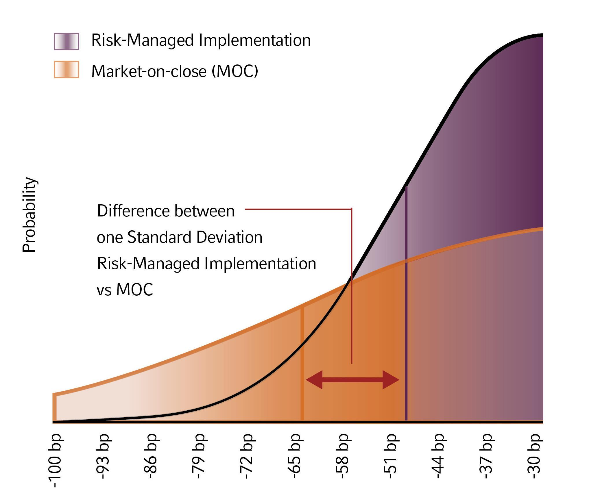

## Table of Contents

## What is implementation shortfall?

Implementation shortfall is a way to measure how well a trading strategy works in the real world compared to how it was supposed to work on paper. Imagine you have a plan to buy or sell stocks at certain prices, but when you actually do it, the prices might be different because of things like other traders, market changes, or delays. The difference between what you planned to spend or earn and what you actually spent or earned is called the implementation shortfall.

This concept is important because it helps traders and investors see how much their trading costs are affecting their profits. For example, if you planned to buy a stock at $100 but ended up buying it at $102 because of delays or market movements, that extra $2 is your implementation shortfall. By understanding and trying to reduce this shortfall, traders can make their strategies more effective and keep more of their profits.

## How is implementation shortfall calculated?

Implementation shortfall is calculated by comparing the planned cost or revenue of a trade with the actual cost or revenue. Let's say you planned to buy a stock at $50, but you ended up buying it at $52 because of delays or market changes. The difference, which is $2 in this case, is your implementation shortfall. This calculation helps you see how much extra you paid or how much less you received due to the real-world challenges of executing your trading plan.

To calculate it more formally, you start with the paper portfolio, which is what your portfolio would look like if you could buy or sell at the planned prices. Then, you compare this to your actual portfolio after the trade. The difference between the value of the paper portfolio and the actual portfolio, after accounting for any fees or other costs, gives you the implementation shortfall. This number tells you how much your trading strategy's performance deviated from the ideal scenario.

## What are the key components of implementation shortfall statistics?

Implementation shortfall [statistics](/wiki/bayesian-statistics) help traders understand the costs and challenges of executing their trading plans. The key components include the paper portfolio, which shows what the portfolio would look like if trades were made at the planned prices, and the actual portfolio, which reflects the real-world results after the trades are completed. The difference between these two portfolios, after considering any fees or other costs, is the implementation shortfall. This difference shows how much the actual trading costs affected the overall performance of the strategy.

Another important component is the breakdown of the shortfall into different types of costs. These can include delay costs, which happen when there's a time gap between deciding to trade and actually trading; market impact costs, which occur when the act of trading itself moves the market price; and opportunity costs, which are losses from not being able to trade at the best possible time. Understanding these components helps traders see where they can improve their trading process to reduce costs and increase profits.

## Why is implementation shortfall important in trading and investment?

Implementation shortfall is important in trading and investment because it helps traders see how much their plans are affected by real-world challenges. When you plan to buy or sell stocks at certain prices, things like delays, market changes, or other traders can make the actual prices different. The difference between what you planned and what you actually did is the implementation shortfall. Knowing this helps traders understand the extra costs they face and how these costs can eat into their profits.

By understanding implementation shortfall, traders can work on making their strategies better. They can look at where the extra costs are coming from, like delays in trading or the impact their trades have on the market. Once they know this, they can try to reduce these costs, maybe by trading faster or in smaller amounts. This way, they can keep more of their profits and make their trading plans work better in the real world.

## What are common causes of implementation shortfall?

Implementation shortfall happens because of many things that can make trading harder than planned. One big reason is delays. When you decide to buy or sell a stock, it can take time to actually do it. During that time, the price might change, so you end up buying or selling at a worse price than you wanted. Another reason is the impact your trade has on the market. If you're trading a lot of a stock, other traders might see this and change their prices, making your trade cost more.

Other causes of implementation shortfall include the size of your trade and how easy it is to trade the stock. If you want to trade a lot of a stock that's hard to buy or sell, you might have to accept a worse price just to get the trade done. Also, there are opportunity costs. Sometimes, you can't trade at the best time because of rules or other reasons, so you miss out on better prices. All these things add up and make the difference between what you planned to spend or earn and what you actually did.

## How can implementation shortfall be minimized?

To minimize implementation shortfall, traders can try to trade faster. If you can make your trades happen quickly, there's less chance for the price to change while you're waiting. Another way is to break up big trades into smaller ones. When you trade a little bit at a time, it's less likely to move the market price a lot, so you can get closer to the price you wanted. Also, using smart trading tools can help. These tools can find the best times to trade and help you avoid times when the market is moving a lot.

Another important thing is to pick the right stocks to trade. Some stocks are easier to buy and sell than others. If you choose stocks that are traded a lot, it's easier to get the price you want. Traders can also watch the market closely and be ready to trade when the time is right. By understanding what causes implementation shortfall and trying to control those things, traders can make their trading plans work better and keep more of their profits.

## What tools and technologies are used to measure implementation shortfall?

To measure implementation shortfall, traders use special software and tools that track how their trades go compared to their plans. These tools can look at the prices at which trades were supposed to happen and compare them to the actual prices. They can also break down the costs into different parts, like delay costs or market impact costs. This helps traders see exactly where they are losing money and how they can do better.

Some common tools include trading algorithms and analytics platforms. Trading algorithms can help execute trades faster and at better prices, reducing the chance of big shortfalls. Analytics platforms can give detailed reports on how trades went, showing things like how long it took to trade and how the market moved during that time. By using these tools, traders can keep a close eye on their implementation shortfall and work on ways to make it smaller.

## Can you explain the difference between implementation shortfall and other trading cost metrics?

Implementation shortfall is different from other trading cost metrics because it looks at the whole picture of how a trade goes compared to what was planned. It includes all the costs that come up when you actually trade, like delays, market impact, and missed chances. Other metrics might only look at part of this, like just the fees you pay or the difference between the price you see and the price you get. Implementation shortfall gives a full view of how well your trading plan works in the real world, not just one piece of it.

For example, another common metric is the bid-ask spread, which is the difference between the highest price someone is willing to buy a stock for and the lowest price someone is willing to sell it for. This is just one part of trading costs. Implementation shortfall, on the other hand, would also include the time it took to trade and how the market moved during that time. So, while the bid-ask spread can tell you about one specific cost, implementation shortfall tells you about all the costs together and how they affect your overall trading strategy.

## How does implementation shortfall impact portfolio performance?

Implementation shortfall can make a big difference in how well your portfolio does. When you plan to buy or sell stocks at certain prices, but end up doing it at different prices because of delays or market changes, it can cost you more money or make you earn less than you expected. This extra cost or lost profit is the implementation shortfall. If it's big, it can eat into your overall returns and make your portfolio perform worse than you hoped.

To manage this, traders need to understand what causes implementation shortfall and try to reduce it. By trading faster, breaking big trades into smaller ones, and using smart tools, traders can get closer to their planned prices. This helps keep more of their profits and makes their portfolio perform better. So, by paying attention to implementation shortfall and working to make it smaller, traders can improve their portfolio's performance over time.

## What are advanced statistical methods used in analyzing implementation shortfall?

Advanced statistical methods help traders understand implementation shortfall better. One common method is regression analysis, which looks at how different things like delays or market impact affect the shortfall. By using regression, traders can see which factors are the biggest problems and work on fixing them. Another method is time-series analysis, which looks at how the shortfall changes over time. This helps traders see if there are patterns or times when the shortfall is bigger, so they can plan their trades better.

Another useful method is Monte Carlo simulation. This method uses random numbers to create many different scenarios of what might happen when you trade. By looking at all these scenarios, traders can see how likely it is that they will face a big shortfall and plan ways to avoid it. Also, [machine learning](/wiki/machine-learning) is becoming more popular for analyzing implementation shortfall. Machine learning can find patterns in big sets of data that humans might miss. It can help traders predict when and how big the shortfall might be, so they can make better trading plans.

## How do market conditions affect implementation shortfall?

Market conditions can have a big impact on implementation shortfall. When the market is moving a lot, like during big news events or economic changes, it's harder to trade at the prices you planned. The prices can change quickly, so if you take too long to trade, you might end up buying or selling at a worse price. Also, if the market is not very busy, it can be hard to trade big amounts without moving the price yourself. This is called market impact, and it can make your implementation shortfall bigger.

On the other hand, when the market is calm and there are a lot of people trading, it's easier to buy or sell without big price changes. This can help keep your implementation shortfall small. Traders need to watch the market closely and try to trade when conditions are good for them. By understanding how the market is behaving, they can make better plans and reduce the costs that come from implementation shortfall.

## What are the latest research findings on implementation shortfall statistics?

Recent research on implementation shortfall has focused on using new technology to better understand and reduce it. One big finding is that machine learning can help predict when and how big the shortfall might be. By looking at a lot of past data, machine learning can find patterns that humans might miss. This can help traders make better plans and trade at times when the shortfall is likely to be small. Another finding is that breaking big trades into smaller ones can really help. When you trade smaller amounts, it's less likely to move the market price a lot, so you can get closer to the price you wanted.

Also, researchers have found that the way traders behave can affect implementation shortfall. If traders are too slow or wait too long to trade, the shortfall can be bigger. But if they use smart tools and trade quickly, they can reduce it. Studies have shown that understanding how delays and market impact affect the shortfall is key. By knowing these things, traders can work on making their trading plans better and keep more of their profits.

## What is Understanding Implementation Shortfall?

Implementation Shortfall (IS) is a critical metric utilized in the evaluation of trading strategies, particularly within [algorithmic trading](/wiki/algorithmic-trading). It quantifies the difference between the decision price, the price at which a trader decides to buy or sell an asset, and the actual execution price. This difference highlights the efficacy of trade execution strategies, serving as an essential tool for traders aiming to optimize their financial outcomes.

IS measures slippage, a term describing the discrepancy between expected and actual trade prices due to market dynamics. Slippage can stem from various factors, including market impact and timing delays. Market impact refers to the change in the asset price caused by the trade itself. As large orders are executed, they can cause price movements that deviate from the decision price, particularly in less liquid markets. Delay costs, or opportunity costs, also play a role, arising from the time between the decision to trade and the eventual execution. These costs can incur significant losses if market conditions shift unfavorably during this period.

The formula for Implementation Shortfall can be expressed as follows:

$$
\text{Implementation Shortfall} = (P_{\text{execution}} - P_{\text{decision}}) \times Q
$$

where:
- $P_{\text{execution}}$ is the actual execution price,
- $P_{\text{decision}}$ is the initial decision price,
- $Q$ is the quantity of the asset traded.

By quantifying IS, traders can assess how well their execution strategies minimize the combined costs of market impact and delays. Analyzing IS ensures that traders maintain an optimal balance between executing trades promptly to avoid adverse price movements and controlling the impact their trades have on the market. This balance is crucial for maximizing returns and minimizing costs, especially when handling large orders.

In practice, a lower IS indicates more efficient trade execution, as it implies that the final trade price is closer to the ideal decision price. Understanding and managing Implementation Shortfall is fundamental for traders seeking to refine their strategies in fast-paced and complex market environments.

## What is the Almgren-Chriss Framework: An Overview?

The Almgren-Chriss framework, introduced by Robert Almgren and Neil Chriss, is a prominent method in algorithmic trading for tackling the problem of optimal execution strategy by minimizing expected trading costs. By balancing the trade-off between market impact and execution risk, this framework offers a systematic approach to achieving more efficient trade executions.

At its core, the Almgren-Chriss framework operates under the assumption of a linear market impact model. This means it presumes that the cost to execute a trade increases linearly with the size of the trade relative to the market's [liquidity](/wiki/liquidity-risk-premium). A primary strength of the framework is its use of mean-variance optimization. This mathematical approach helps identify the best trading trajectory, whereby the trade-off between immediate execution and gradual accumulation (to reduce market impact costs) is methodically balanced against the potential risk associated with price [volatility](/wiki/volatility-trading-strategies) during the execution period. The optimization problem can be expressed as minimizing the expected cost plus a penalty for the risk due to uncertainty in price movements:

$$
\min_{x(t)} \mathbb{E}[C] + \lambda \cdot \text{Var}[C]
$$

where $\mathbb{E}[C]$ is the expected cost, $\text{Var}[C]$ is the variance of the cost, and $\lambda$ represents the trader's risk aversion level.

Three distinct features make the Almgren-Chriss model particularly advantageous. Firstly, its foundation in theoretical optimization provides a robust basis for creating efficient trading strategies. Secondly, the model offers closed-form solutions, allowing for straightforward mathematical calculations, which is invaluable for real-time trading applications. Lastly, the model is notable for its transparency in assumptions, making it easier for practitioners to comprehend and adapt the framework to real-world conditions.

These salient attributes have contributed to the Almgren-Chriss framework's widespread adoption and enduring relevance in the field of algorithmic trading, particularly for traders seeking to minimize costs while maintaining a comprehensive understanding of the underlying mechanics of their execution strategies.

## What are Optimal Execution Strategies?

The Almgren-Chriss framework in algorithmic trading provides distinct strategies for optimal execution by focusing either on minimizing market impact or minimizing variance. These strategies are designed to navigate the trade-offs between execution cost and risk, facilitating more efficient trade outcomes.

Minimum impact strategies are akin to the Time-Weighted Average Price (TWAP), where trades are spread evenly over a specified period. This approach reduces the immediate price impact by distributing trades across various market conditions. As a result, it is particularly suitable for high-[volume](/wiki/volume-trading-strategy) transactions in illiquid markets where market impact can significantly alter prices. The TWAP strategy is executed by segmenting the total order into smaller, timed trades, thereby mitigating sudden market shifts due to large order sizes.

In contrast, minimum variance strategies focus on rapid execution, often resembling a strategy where all trades are completed immediately. The intent here is to reduce the potential risk associated with price fluctuations over time. By executing quickly, traders avoid the inherent risk of adverse price movements in volatile markets. This strategy is beneficial when the market conditions are uncertain, and the risk of waiting could outweigh the potential savings from reduced market impact.

Practical implementation often leads traders to select an intermediate approach that balances between these extremes. This involves adjusting the speed of execution based on real-time market conditions, asset volatility, and liquidity considerations. Such an approach typically involves customizing the execution trajectory to suit specific risk aversion levels and market conditions. By dynamically adjusting the trade execution strategy, traders can achieve an equilibrium that minimizes both impact costs and execution risk.

The mathematical underpinning of these strategies can be complex, involving the optimization of cost functions that account for both the expected cost due to the market impact and the variance of trade execution. The Almgren-Chriss optimization can be expressed as minimizing the following objective function:

$$
\min_{x(t)} \left( \mathbb{E}[C(x)] + \lambda \text{Var}(C(x)) \right)
$$

Here, $x(t)$ denotes the trading trajectory, $C(x)$ represents the cost function incorporating market impact, and $\lambda$ is the risk aversion parameter. By adjusting $\lambda$, traders can tilt the balance between minimizing expected cost versus reducing execution risk variance.

Through this versatile framework, the Almgren-Chriss model provides practical solutions for algorithmic trading, enabling traders to implement strategies that cater to specific market conditions and risk tolerances effectively.

## References & Further Reading

[1]: Almgren, R., & Chriss, N. (2001). ["Optimal Execution of Portfolio Transactions."](https://smallake.kr/wp-content/uploads/2016/03/optliq.pdf) The Journal of Risk, 3(2), 5-39.

[2]: Kissell, R. (2013). ["The Science of Algorithmic Trading and Portfolio Management"](https://www.sciencedirect.com/book/9780124016897/the-science-of-algorithmic-trading-and-portfolio-management). Academic Press.

[3]: Gatheral, J., & Schied, A. (2013). ["Optimal Trade Execution Under Geometric Brownian Motion in the Almgren and Chriss Framework."](https://papers.ssrn.com/sol3/papers.cfm?abstract_id=1654151) Review of Financial Studies, 22(2), 651–691.

[4]: Bouchaud, J.-P., Farmer, J. D., & Lillo, F. (2009). ["How Markets Slowly Digest Changes in Supply and Demand."](https://arxiv.org/abs/0809.0822) Handbook of Financial Markets: Dynamics and Evolution.

[5]: Kissell, R., & Glantz, M. (2003). ["Optimal Trading Strategies"](https://www.semanticscholar.org/paper/Optimal-Trading-Strategies%3A-Quantitative-Approaches-Kissell-Glantz/0552eba9819c8b3091684cbe8c94fc68724e739e). AMACOM.