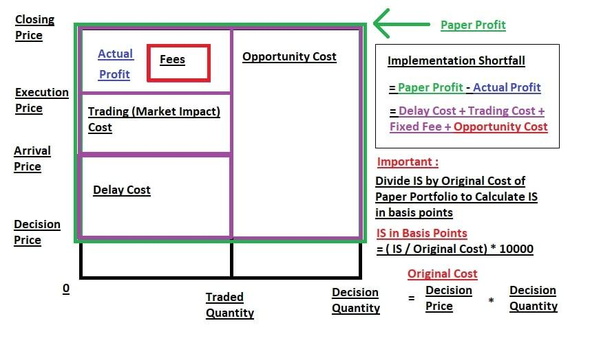

## Table of Contents

## What is the basic concept of implementation shortfall?

Implementation shortfall is a way to measure how well an investment strategy works when it's put into action. It compares the actual results of the strategy to what was expected if everything went perfectly. The difference between these two is the shortfall. This concept is important because it helps investors see how much their trading costs and other real-world factors affect their returns.

For example, imagine you have a plan to buy a stock at $100, expecting it to go up. But by the time you actually buy it, the price is $102 because of delays or other costs. The $2 difference is part of the implementation shortfall. This measure helps investors understand the real impact of their trading decisions and costs, allowing them to make better choices in the future.

## How does implementation shortfall differ from other trading cost metrics?

Implementation shortfall is different from other trading cost metrics because it looks at the total impact of trading on an investment's performance. While other metrics might focus just on the direct costs like commissions or the bid-ask spread, implementation shortfall includes these costs plus the opportunity cost of not getting the best price right away. For example, if you planned to buy a stock at $100 but ended up buying it at $102 due to delays, the $2 difference is part of the shortfall. This broader view helps investors see the full effect of their trading decisions.

Other common trading cost metrics, like the [volume](/wiki/volume-trading-strategy)-weighted average price (VWAP) or the implementation efficiency, focus on different aspects of trading costs. VWAP measures the average price at which a stock is traded throughout the day, helping traders see if they got a good deal compared to the market. Implementation efficiency, on the other hand, compares the actual cost of a trade to a benchmark cost, showing how well the trade was executed. Unlike implementation shortfall, these metrics don't capture the opportunity costs and delays that can significantly affect an investment's overall performance.

## What are the key components of implementation shortfall?

Implementation shortfall looks at different parts of trading costs. One key part is the explicit costs, which are easy to see. These include things like commissions and fees you pay when you buy or sell a stock. Another part is the implicit costs, which are harder to see. These include the bid-ask spread, which is the difference between the price someone is willing to buy a stock and the price someone is willing to sell it.

The other big part of implementation shortfall is the opportunity cost. This is the money you might lose because you didn't buy or sell a stock at the best time. For example, if you wanted to buy a stock at $100 but ended up buying it at $102 because you waited too long, the $2 difference is an opportunity cost. By looking at both the explicit and implicit costs, plus the opportunity cost, implementation shortfall gives a full picture of how trading affects your investment's performance.

## Can you explain the formula used to calculate implementation shortfall?

Implementation shortfall is calculated by comparing the actual cost of a trade to what it would have been if everything went perfectly. The formula starts with the paper portfolio value, which is what your investment would be worth if you could buy or sell at the exact price you wanted, right when you wanted. Then, you subtract the actual portfolio value, which is what your investment is really worth after you've made the trade, including all the costs and delays.

The difference between these two values is the implementation shortfall. This difference shows you how much money you lost because of trading costs and not getting the best price right away. By using this formula, investors can see the full impact of their trading decisions and work on ways to reduce these costs in the future.

## What are the common causes of implementation shortfall in trading?

Implementation shortfall in trading often happens because of delays in making trades. When you want to buy or sell a stock, you might not be able to do it right away. This delay can cause the price to change, so you end up buying or selling at a worse price than you planned. For example, if you want to buy a stock at $100 but it takes time to complete the trade, the price might go up to $102 by the time you buy it. This $2 difference is part of the implementation shortfall.

Another common cause is the costs of trading itself. These costs include things like commissions, fees, and the difference between the price someone is willing to buy a stock (the bid) and the price someone is willing to sell it (the ask). These costs add up and can make your investment worth less than you expected. For example, if you pay a $10 commission to buy a stock, that's $10 less in your pocket, which is another part of the implementation shortfall.

## How can implementation shortfall be minimized in a trading strategy?

To minimize implementation shortfall in a trading strategy, it's important to act quickly when making trades. If you can buy or sell a stock at the price you want right away, you won't lose money because of price changes while you wait. Using advanced trading tools and algorithms can help you make trades faster. Also, trading during times when the market is very active can help because there are more buyers and sellers, so it's easier to get the price you want.

Another way to reduce implementation shortfall is to keep trading costs low. This means choosing brokers with low commissions and fees, and trying to trade when the difference between the buying and selling price (the bid-ask spread) is small. Sometimes, it can help to break big trades into smaller ones, so you don't move the market price too much. By paying attention to these things, you can make your trading strategy work better and keep more of your money.

## What role does market impact play in implementation shortfall?

Market impact is a big part of implementation shortfall. It's what happens when you buy or sell a lot of a stock and the price changes because of your trade. For example, if you want to buy a lot of a stock, other people might see this and start buying too, which can make the price go up. This means you end up paying more than you planned, which adds to the implementation shortfall.

To deal with market impact, traders often break big trades into smaller ones. This way, they don't move the market price as much. By doing this, they can keep the implementation shortfall lower. It's all about trying to get the best price without making the market move against you.

## How does timing risk affect implementation shortfall?

Timing risk is when the price of a stock changes while you are waiting to buy or sell it. This can make the implementation shortfall bigger. For example, if you want to buy a stock at $100 but it takes a while to make the trade, the price might go up to $102 by the time you buy it. This $2 difference is part of the implementation shortfall because you didn't get the price you wanted.

To reduce timing risk, traders need to be quick. Using fast trading tools and algorithms can help them make trades faster. Also, trading when the market is busy can be good because it's easier to get the price you want. By being quick and smart about when to trade, traders can keep the implementation shortfall smaller and save more money.

## What are some advanced techniques for measuring implementation shortfall?

Advanced techniques for measuring implementation shortfall often involve using complex models and algorithms to get a more accurate picture of trading costs. One common method is called "arrival price" analysis, which looks at the price of a stock when a trader decides to make a trade, and then compares it to the price they actually get. This helps show how much the price changed while waiting to make the trade. Another technique is "volume-weighted average price" (VWAP) analysis, which compares the price a trader gets to the average price of the stock over a certain time period. This helps traders see if they got a good deal compared to the market.

Another advanced technique is using "slippage models" to predict how much the price might change because of a big trade. These models help traders understand the market impact of their trades and plan better. Some traders also use "transaction cost analysis" (TCA) tools, which look at all the different costs of trading, like commissions, fees, and the bid-ask spread, to see how they affect the overall performance of an investment. By using these advanced techniques, traders can get a clearer view of their implementation shortfall and find ways to make their trading strategies more effective.

## How can implementation shortfall be used to evaluate the performance of a portfolio manager?

Implementation shortfall can be a useful tool for evaluating how well a portfolio manager is doing their job. It looks at the difference between what the portfolio manager planned to do and what actually happened when they made trades. If the portfolio manager can keep this difference small, it means they are good at managing trading costs and getting the best prices for their trades. This shows that they are skilled at turning their investment ideas into real results without losing too much money to trading costs.

To use implementation shortfall for evaluation, you compare the portfolio's performance to what it would have been if everything went perfectly. If the portfolio manager's actual results are close to the perfect scenario, it's a sign that they are doing a good job. On the other hand, if the difference is big, it might mean the portfolio manager needs to work on reducing trading costs or making trades more quickly. This way, implementation shortfall helps investors see how effective their portfolio manager is at putting investment strategies into action.

## What are the limitations and criticisms of using implementation shortfall as a metric?

One big problem with using implementation shortfall as a metric is that it can be hard to figure out what the "perfect" trade would have been. This is because the market is always changing, and it's tough to know exactly what would have happened if you had bought or sold a stock at a different time. Also, implementation shortfall can be affected by things outside of a trader's control, like sudden news or big market moves. This means it might not always be fair to judge a trader's performance just by looking at their implementation shortfall.

Another criticism is that implementation shortfall can be tricky to compare across different traders or strategies. Each trader might have different goals, and what counts as a "good" trade can change depending on the situation. Some people also say that focusing too much on implementation shortfall might make traders worry more about saving money on trading costs than about making good investment choices. This could lead them to miss out on big opportunities just to keep their trading costs low.

## How does implementation shortfall integrate with algorithmic trading systems?

Implementation shortfall is a big deal in algorithmic trading because it helps traders see how well their computer programs are doing at making trades. When traders use algorithms, they want to buy or sell stocks at the best possible price. But things like delays or trading costs can make the price go up or down. By looking at the implementation shortfall, traders can see how much money they are losing because of these problems. They can then change their algorithms to trade faster or find ways to keep costs down.

For example, if an algorithm is set to buy a stock at $100 but it takes a while to make the trade, the price might go up to $102 by the time the trade happens. The $2 difference is part of the implementation shortfall. Traders can use this information to make their algorithms better. They might break big trades into smaller ones or trade when the market is busy to get better prices. By keeping an eye on implementation shortfall, traders can make sure their algorithms are working as well as possible.

## What is Understanding Implementation Shortfall?

Implementation shortfall provides a crucial metric in the assessment of trading decision costs against intended strategies. It measures the deviation between the expected and actual execution prices, [factor](/wiki/factor-investing)ing in expenses shaped by market dynamics and procedural delays.

A trader can use implementation shortfall to evaluate trade efficiency by examining price discrepancies caused by market impacts or execution lags. For instance, a sudden increase in demand might spike the price, resulting in a higher actual execution price compared to the decision price. This deviation, or "slippage," reflects the shortfall's impact. Execution delays can further exacerbate price slippage, where a swiftly moving market causes trades to only fulfill at less advantageous prices than initially anticipated.

The formula for calculating implementation shortfall is:

$$
\text{Implementation Shortfall} = (\text{Execution Price} - \text{Decision Price}) \times \text{Executed Quantity} + \text{Other Trading Costs}
$$

Where:
- Execution Price is the actual price paid.
- Decision Price is the price at which the trade was intended.
- Executed Quantity is the number of shares or contracts.
- Other Trading Costs encompass commissions and fees.

Minimizing this shortfall is crucial for boosting trading performance and trimming excess costs. Methods to mitigate implementation shortfall include optimizing order timing and execution strategies to align more closely with market conditions. Traders often leverage [algorithmic trading](/wiki/algorithmic-trading) systems to break large orders into smaller parts or execute trades over time to reduce market impact and execution delays. By refining execution tactics, traders enhance performance and profitability while managing the cost and risk associated with various market conditions.

In conclusion, focusing on reducing implementation shortfall is vital for any trading strategy aimed at maintaining cost efficiency and market competitiveness.

## What are the components of implementation shortfall?

Implementation shortfall consists of several crucial components that are instrumental in quantifying the costs associated with executing a trade. These components include the decision price, final execution price, and various trading costs.

The decision price serves as a critical benchmark, often defined as the close price or arrival price. The close price refers to the last price at which a security trades during a regular trading session, while the arrival price is the market price at the time the trading decision is made or the order is received by a broker. These prices provide a baseline for measuring the shortfall, allowing traders to assess how much the market price moves from the moment a decision is made to when the trade is executed.

In addition to the decision price, trading costs significantly influence the magnitude of the implementation shortfall. These costs include:

1. **Commissions**: These are the fees paid to brokers for executing trades. While often a fixed percentage of the trade's value, they can vary depending on the broker's pricing structure. 

2. **Market Impact**: This refers to the change in asset price caused by the trade itself. Large orders can drive prices up (in the case of buys) or down (in the case of sells), affecting the final execution price and increasing the implementation shortfall.

3. **Opportunity Cost**: This cost arises from missed trading opportunities when prices move favorably between the decision and execution times. Delays or inefficiencies in execution can prevent traders from capitalizing on favorable price movements, leading to opportunity costs.

Mathematically, implementation shortfall can be expressed as:

$$
\text{Implementation Shortfall} = (\text{Execution Price} - \text{Decision Price}) \times \text{Number of Shares} + \text{Commissions} + \text{Other Costs}
$$

Understanding these components is crucial for traders aiming to minimize the gap between expected and actual trade outcomes. By optimizing each element, traders can improve execution efficiency and reduce the associated costs, ultimately enhancing trading performance.

## References & Further Reading

[1]: Kissell, R., & Glantz, M. (2003). ["Optimal Trading Strategies: Quantitative Approaches for Managing Market Impact and Trading Risk."](https://archive.org/details/optimaltradingst0000kiss) AMACOM.

[2]: Almgren, R., & Chriss, N. (2000). ["Optimal Execution of Portfolio Transactions."](https://smallake.kr/wp-content/uploads/2016/03/optliq.pdf) The Journal of Risk.

[3]: Lo, A. W. (2016). ["Adaptive Markets: Financial Evolution at the Speed of Thought."](https://www.jstor.org/stable/j.ctvc77k3n) Princeton University Press.

[4]: Robert Kissell. (2013). ["The Science of Algorithmic Trading and Portfolio Management."](https://www.sciencedirect.com/book/9780124016897/the-science-of-algorithmic-trading-and-portfolio-management) Academic Press.

[5]: Hasbrouck, J. (2007). ["Empirical Market Microstructure: The Institutions, Economics, and Econometrics of Securities Trading."](https://academic.oup.com/book/52241) Oxford University Press.