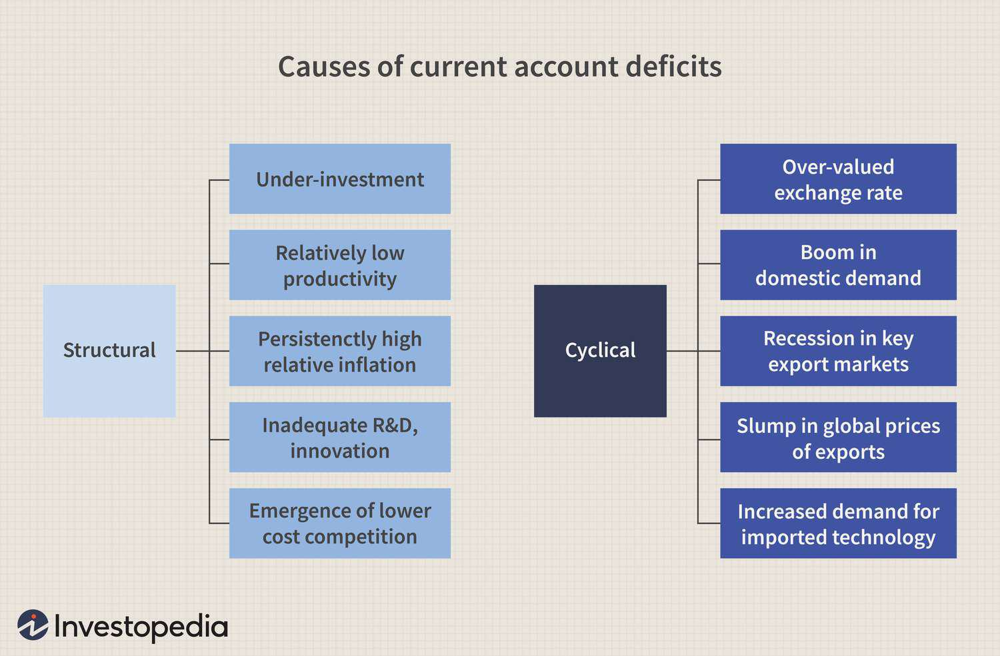

In today's global economy, the current account deficit serves as a crucial indicator of a country's economic health. It represents a situation where a nation's total imports of goods, services, and transfers exceed its total exports. This financial metric is often closely monitored by policymakers, economists, and traders due to its significant implications for economic stability and growth. As the world becomes increasingly interconnected, understanding the intricacies of the current account deficit and its economic impact becomes essential.

Current account deficits are not solely a negative indicator; they can reflect robust consumer demand, investment opportunities, and an economy's developmental phase. A nuanced interpretation of these deficits requires considering them alongside other economic indicators to gauge overall economic well-being.



Moreover, the intersection of current account deficits with algorithmic trading introduces another layer of complexity. Algorithmic trading, which utilizes advanced mathematical models to execute trades at high speeds, has revolutionized financial markets. These algorithms often factor in macroeconomic indicators like current account deficits to optimize trading strategies and manage risks effectively.

Understanding the dynamics of how current account deficits arise, their potential economic risks and benefits, and how algorithmic trading can be leveraged to address these challenges is critical. This article explores these intricate relationships, providing insights into how economic stability and financial markets are influenced by these factors. Whether you are a policymaker, economist, or trader, grasping these concepts is essential for informed decision-making and strategic planning in today's global economic landscape.

## Table of Contents

## Understanding Current Account Deficits

A current account deficit occurs when a country's imports of goods, services, and investments surpass its exports, resulting in a net outflow of domestic currency to foreign markets. This financial metric often serves as a litmus test for a country’s economic standing and is interchangeably referred to as the balance of payments deficit or trade deficit. The presence of a current account deficit signals a nation spending more on foreign trade than it is earning, potentially borrowing capital from other countries to make up the difference. 

A variety of factors contribute to the emergence of a current account deficit. Economic growth, for instance, can elevate consumer demand for foreign goods, intensifying import levels. Additionally, exchange rate fluctuations can render a country's exports less competitive, exacerbating the trade imbalance. National policies, both fiscal and monetary, also play crucial roles; for example, policies favoring high domestic spending or low-interest rates can augment the deficit by encouraging imports. 

Mechanistically, the current account is a component of a nation's balance of payments (BOP), comprising the trade balance, primary income (investment income and compensation of employees), and secondary income (current transfers). Formally, the current account balance $CAB$ can be represented as:

$$

CAB = TB + PI + SI 
$$

Where:

- $TB$ stands for the trade balance, which is the difference between exports and imports.
- $PI$ is the net primary income and includes cross-border wages and investment returns.
- $SI$ represents the net secondary income, covering personal transfers and donations.

Deficits may arise when imports surpass exports ($TB < 0$), when income flows to foreigners exceed domestic inflows ($PI < 0$), or when net transfers outpace incoming funds ($SI < 0$). The interconnectedness of current account deficits and national policies becomes especially pronounced when fiscal decisions—such as taxes or government spending—directly influence domestic consumption and savings rates, thereby adjusting the propensity for imports and exports.

Economists and policymakers closely scrutinize the current account deficit due to its potential implications, including impacts on currency value. A sustained deficit might prompt currency depreciation, influencing export competitiveness and inflationary pressures. Managing these aspects necessitates a nuanced understanding of both macroeconomic conditions and global market dynamics.

## Economic Impacts of Current Account Deficits

Current account deficits, often perceived as indicators of economic frailty, can exert diverse influences on a nation's economy. These deficits occur when a country's imports surpass its exports, signifying an imbalance in trade. While they might suggest economic vulnerability, current account deficits can concurrently highlight robust consumer demand and potential investment opportunities.

One of the primary effects of a current account deficit is its impact on Gross Domestic Product (GDP). A sustained deficit may imply that a country is consuming more than it produces, potentially stimulating domestic demand yet also increasing dependency on foreign capital. This dependency can be risky if foreign capital inflows fluctuate or recede.

Currency valuation is another critical area affected by current account deficits. A persistent deficit may lead to depreciation of the national currency, as the demand for foreign currency increases to pay for imports. This depreciation can make exports cheaper and more competitive globally, possibly offsetting the negative impacts of the deficit. However, it can also lead to imported inflation, where the cost of imported goods rises due to a weaker domestic currency.

National debt levels can also be influenced by current account deficits. When a country runs a deficit, it may need to borrow from foreign lenders, increasing its external debt burden. This borrowing can lead to higher interest payments and future fiscal challenges, particularly if the loans are denominated in foreign currencies and the domestic currency depreciates.

Despite these challenges, there are long-term benefits associated with current account deficits. One potential advantage is increased foreign investment. As foreign capital flows into the country to finance the deficit, it may lead to enhanced productivity and economic growth if invested wisely. This investment can take the form of foreign direct investment (FDI), which can bring in new technologies, managerial expertise, and access to international markets.

Moreover, capital inflow associated with current account deficits can provide the resources needed for domestic companies to expand and modernize. By accessing foreign capital, firms may be able to invest in projects that spur economic growth and create jobs, ultimately contributing to economic stability and prosperity.

In summary, while current account deficits are often viewed with caution, they present both risks and opportunities for a country's economy. The key to leveraging these potential benefits lies in maintaining a balanced approach to foreign investment, currency management, and fiscal policy, ensuring that the economy remains robust and resilient amidst global financial fluctuations.

## Risks and Challenges of a Current Account Deficit

A persistent current account deficit, where a country consistently imports more goods, services, and capital than it exports, can pose several risks and challenges to an economy. One of the primary concerns is the potential increase in national debt. To finance a current account deficit, countries often borrow from foreign lenders, leading to an accumulation of external debt. Over time, excessive borrowing can strain national finances, as governments must allocate resources to service debt obligations instead of investing in development projects or social programs.

Currency devaluation is another significant risk associated with a persistent current account deficit. As a country imports more than it exports, the demand for foreign currency increases, putting downward pressure on the national currency's value. A depreciating currency can make imports more expensive, leading to higher inflation, which may erode consumer purchasing power and adversely affect economic stability.

The inflationary pressures resulting from currency devaluation and increased import costs can further complicate economic management. Higher inflation can lead to increased interest rates as monetary policy authorities attempt to control price rises. This can stifle economic growth by making borrowing more expensive for consumers and businesses.

Countries facing sustained current account deficits also risk economic instability. Foreign investors may lose confidence in the country's ability to manage its economic affairs, leading to reduced capital inflow and even capital flight. This can exacerbate currency devaluation and lead to a vicious cycle of rising deficits and declining investor confidence, ultimately increasing the risk of a financial crisis.

To manage these risks effectively, countries can adopt several strategies and policies. Diversifying export products and markets can help reduce reliance on a limited range of goods or trading partners, potentially narrowing the trade deficit. Governments can implement fiscal measures to encourage savings and reduce consumption of imported goods. Additionally, promoting foreign direct investment can help offset the negative impact of a deficit by attracting capital inflow into the country.

Monetary policy can also play a crucial role. Central banks might intervene in foreign exchange markets to stabilize the currency or adjust interest rates to control inflation without hampering growth. Structural reforms aimed at enhancing competitiveness and productivity can improve export performance, further assisting in balancing the current account.

In summary, understanding the complexities associated with a current account deficit is essential for developing effective economic policies that ensure long-term stability and growth. Managing such deficits requires a multifaceted approach that combines fiscal, monetary, and structural reforms to mitigate risks and harness potential opportunities for economic advancement.

## The Role of Algorithmic Trading in Deficit Management

Algorithmic trading has become an essential tool in managing the economic impact of current account deficits by leveraging vast amounts of economic data to create optimal trading strategies. With the advancement of technology and data analytics, algorithms can process complex datasets to identify trends and patterns that may influence financial markets, particularly in economies experiencing current account deficits.

One of the primary ways algorithms assist in managing deficits is through the integration of macroeconomic indicators into automated trading models. By incorporating data such as GDP growth rates, exchange rates, inflation, and current account balances, algorithms can make informed trading decisions that account for the broader economic context.

For instance, a model may use time-series analysis to predict exchange rate movements based on the current account deficit fluctuations. This predictive capability allows traders to preemptively adjust their positions in anticipation of currency devaluation, a common risk associated with persistent deficits. The mathematical basis for such analysis often relies on stochastic calculus and econometric models, such as the Vector Autoregression (VAR) model.

```python
import numpy as np
from statsmodels.tsa.api import VAR

# Sample data for macroeconomic indicators
data = np.array([[1.5, 0.7, -0.1],  # [GDP growth, inflation, current account balance]
                 [1.7, 0.8, -0.2],
                 [1.6, 0.9, -0.3],
                 [1.8, 1.0, -0.4]])

# Create VAR model
model = VAR(data)
results = model.fit(maxlags=2)

# Forecast next period indicators
forecast = results.forecast(y=data[-2:], steps=1)
print("Forecast for next period (GDP growth, inflation, current account balance):", forecast)
```

This Python code snippet demonstrates how traders could use a VAR model to forecast macroeconomic indicators, helping them adjust their trading strategies accordingly.

Moreover, case studies have highlighted the effectiveness of [algorithmic trading](/wiki/algorithmic-trading) during periods of economic [volatility](/wiki/volatility-trading-strategies). For example, during the Eurozone debt crisis, algorithmic trading models that incorporated macroeconomic data could rapidly adapt to the changing financial landscape, outperforming traditional trading strategies. These models used real-time data feeds to adjust their algorithms dynamically, optimizing asset allocation to mitigate the risks linked with widening deficits.

Additionally, algorithmic trading facilitates improved [liquidity](/wiki/liquidity-risk-premium) and efficiency in the markets, contributing to stabilizing prices amid the pressures exerted by a current account deficit. This automated management approach has proven particularly effective in volatile markets, where human reaction times and bias can negatively impact trading outcomes.

In summary, algorithmic trading integrates complex economic indicators to effectively manage the challenges posed by current account deficits. By adapting quickly to new data, these models can help mitigate risks and capitalize on opportunities, underscoring their significance in modern financial markets.

## Conclusion

The relationship between current account deficits and the overall economy presents a multifaceted dynamic crucial to understanding modern economic landscapes. While current account deficits may initially appear as indicators of potential economic vulnerability due to the imbalance between imports and exports, they can simultaneously offer avenues for economic growth and investment. These deficits can foster enhanced consumer demand and create attractive environments for foreign direct investments, especially if they finance productive investments that enhance the country’s capacity to repay its external obligations in the future.

Algorithmic trading emerges as a pivotal tool in navigating the challenges presented by current account deficits. It offers sophisticated computational models that integrate extensive economic data to manage the inherent risks associated with these deficits, such as inflationary pressures and currency devaluation. Algorithmic strategies allow traders to respond swiftly to market volatility and leverage opportunities presented by fluctuations in deficit trends and macroeconomic indicators.

In conclusion, adopting a nuanced approach to understanding and managing current account deficits is essential for achieving economic stability and fostering market success. This entails not only recognizing the potential risks associated with prolonged deficits but also capitalizing on their capability to drive economic expansion and attract investment. Algorithmic trading, with its advanced analytical capabilities, plays a critical role in optimizing economic strategies, enabling stakeholders to balance risks and opportunities effectively. Strategic management of current account deficits, supported by cutting-edge trading technologies, is indispensable for sustaining economic health in an interconnected global market.

## References & Further Reading

1. **Current Account Deficits and Economic Impacts**
   - *Blanchard, O. & Johnson, D. R. (2013). "Macroeconomics."* This textbook provides a comprehensive overview of macroeconomic principles, including the concept of current account deficits and their broad economic implications. 
   - *Corden, W. M. (1994). "Economic Policy, Exchange Rates, and the International System." Oxford University Press.* This book explores how economic policies influence current account balances and exchange rates, offering valuable insights into the systemic effects of deficits.

2. **Algorithmic Trading Strategies**
   - *Chan, E. (2013). "Algorithmic Trading: Winning Strategies and Their Rationale." Wiley.* A detailed guide to the development and rationale behind various algorithmic trading strategies, including how they can be applied in contexts involving current account deficits.
   - *Kissell, R. (2013). "The Science of Algorithmic Trading and Portfolio Management." Academic Press.* Offers technical insights into the construction of algorithmic trading systems, highlighting the integration of macroeconomic indicators like current account deficits into trading models.

3. **Deficit Management and Fiscal Policy**
   - *Obstfeld, M. & Rogoff, K. (1996). "Foundations of International Macroeconomics." MIT Press.* An essential resource for understanding the global implications of fiscal policy decisions, including the management of current account deficits.
   - *Krugman, P. (1991). "Has the Adjustment Process Worked." IMF Economic Review.* An article examining historical approaches to managing current account imbalances and their effectiveness in the modern economic context.

4. **Further Exploration and Advanced Studies**
   - *IMF Working Papers.* These working papers tackle complex issues related to current account deficits, fiscal policy, and economic stability. Accessible at [IMF Working Papers](https://www.imf.org/en/Publications/WP).
   - *BIS Papers.* The Bank for International Settlements provides a range of studies on the interplay between monetary policy, financial markets, and global economic trends available at [BIS Publications](https://www.bis.org/publ/).
   - For those interested in the implications of fiscal policy on financial markets, the article "The Dynamic Effects of Discretionary Fiscal Policy" by Cwik, T., & Wieland, V. (2011) in the American Economic Journal provides a rigorous analysis.

These resources offer a foundational and advanced understanding of current account deficits, their economic impacts, and the innovative role of algorithmic trading in modern financial markets.