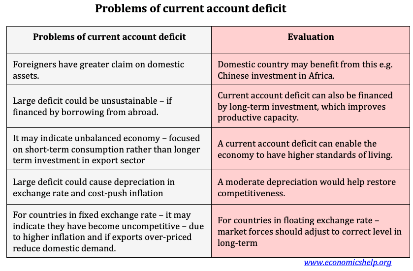

## Table of Contents

## What is a current account deficit?

A current account deficit happens when a country spends more money on foreign goods and services than it earns from selling its own goods and services abroad. This is part of a country's balance of payments, which keeps track of all the money coming in and going out. When a country has a current account deficit, it means it is importing more than it is exporting. This can be due to a lot of reasons, like people in the country buying more foreign products or the country's businesses not selling enough overseas.

Having a current account deficit is not always bad. It can mean that foreign investors are putting money into the country, which can help grow the economy. But if the deficit is too big and lasts too long, it can cause problems. The country might need to borrow more money from other countries, which can lead to more debt. Also, if people start to worry about the deficit, it might make the country's currency weaker, making imports more expensive and possibly leading to inflation.

## How is a current account deficit measured?

A current account deficit is measured by looking at the difference between what a country earns from its exports and what it spends on its imports. This includes not just physical goods like cars and electronics, but also services like tourism and banking. If a country spends more on imports than it earns from exports, it has a current account deficit.

The measurement is part of a bigger picture called the balance of payments. This is a record of all the money that flows in and out of a country over a certain period, usually a year. The current account is just one part of this record. It also includes things like income from investments and money sent home by workers living abroad. By comparing these numbers, economists can see if a country is spending more than it is earning, which shows up as a deficit.

## What causes a current account deficit?

A current account deficit can happen for a few reasons. One big reason is when a country buys more things from other countries than it sells to them. This means it imports more than it exports. If people in the country like buying foreign products like cars, clothes, or food, it can lead to a bigger deficit. Another reason is if the country's currency is strong. A strong currency makes foreign goods cheaper, so people might buy more from abroad, increasing the deficit.

Another cause is if the country's businesses are not selling enough of their products to other countries. This could be because their products are not as good or as cheap as those from other countries. Also, if a country's economy is growing fast, it might need to import more materials and goods to keep up with the growth, which can lead to a deficit. Sometimes, foreign investors putting money into the country can also cause a deficit because they might be buying more local goods and services, but this is usually seen as a good thing for the economy.

In summary, a current account deficit can be caused by a country buying more from abroad than it sells, having a strong currency, not exporting enough, needing more imports for a growing economy, or receiving foreign investments. While a deficit is not always bad, it can become a problem if it gets too big and lasts too long.

## Can a current account deficit affect a country's currency value?

Yes, a current account deficit can affect a country's currency value. When a country has a big deficit, it means it is spending more money on things from other countries than it is making from selling its own things. This can make people worry about the country's economy. If people think the country might have trouble paying back what it owes, they might not want to keep their money in that country's currency. This can make the currency weaker.

A weaker currency can make things from other countries more expensive for people in the country. This might help the country sell more of its own things to other countries because they become cheaper for foreigners to buy. But if the currency gets too weak too fast, it can cause other problems like higher prices for everything at home, which is called inflation. So, a current account deficit can lead to a weaker currency, which can have both good and bad effects on the economy.

## How does a current account deficit impact national savings and investment?

A current account deficit can affect a country's national savings and investment. When a country has a deficit, it means it is spending more on things from other countries than it is earning from selling its own things. To cover this difference, the country might need to borrow money from other countries or use its own savings. This can lead to less money being saved at home because the country is using its savings to pay for the deficit.

This situation can also impact investment. If a country is using a lot of its savings to cover the deficit, there might be less money left over for businesses to invest in new projects or to grow. On the other hand, if foreign investors are putting money into the country to help cover the deficit, this can actually increase the amount of money available for investment. So, a current account deficit can mean less national savings and can affect how much money is available for investment, depending on where the money to cover the deficit comes from.

## What are the short-term effects of a current account deficit on an economy?

In the short term, a current account deficit can make a country's currency weaker. When a country spends more money on things from other countries than it earns from selling its own things, people might worry about the country's money. If they think the country might have trouble paying back what it owes, they might not want to keep their money in that country's currency. This can make the currency's value go down, which makes things from other countries more expensive for people at home.

A weaker currency can also have some good effects in the short term. When the currency is weaker, things made in the country become cheaper for people in other countries to buy. This can help the country sell more of its own things abroad, which can help the economy grow. But if the currency gets too weak too fast, it can cause prices to go up at home, which is called inflation. So, a current account deficit can have both good and bad effects on the economy in the short term.

## What are the long-term implications of a sustained current account deficit?

If a country keeps having a current account deficit for a long time, it can lead to some big problems. One problem is that the country might need to borrow more and more money from other countries to pay for the things it is buying from abroad. This can make the country's debt grow bigger and bigger. If the debt gets too big, it can be hard for the country to pay it back, and this can make people worry about the country's money. If people start to think the country might not be able to pay back its debts, they might not want to lend it more money or might ask for higher interest rates, which can make things even harder for the country.

Another long-term problem is that a big and lasting current account deficit can make the country's currency weaker over time. When the currency is weak, things from other countries become more expensive for people at home. This can make prices go up, which is called inflation. If inflation gets too high, it can make life harder for people because their money does not go as far. Also, if the country is always borrowing money to cover the deficit, it might have less money left over for important things like building schools or hospitals. So, a long-lasting current account deficit can lead to more debt, a weaker currency, higher prices, and less money for important projects.

## How do current account deficits influence inflation and interest rates?

A current account deficit can make prices go up, which is called inflation. When a country buys more things from other countries than it sells, it might need to borrow money or use its savings to pay for these things. This can make the country's currency weaker. When the currency is weak, things from other countries become more expensive for people at home. If the country keeps having a deficit and the currency stays weak, prices can keep going up, leading to more inflation. This can make life harder for people because their money does not buy as much as before.

Current account deficits can also affect interest rates. If a country keeps borrowing money to pay for its deficit, it might have to offer higher interest rates to get people to lend it money. This is because people might worry that the country will have trouble paying back what it owes. Higher interest rates can make it more expensive for people and businesses to borrow money, which can slow down the economy. So, a big and lasting current account deficit can lead to higher interest rates, which can make things harder for everyone.

## What role does government policy play in managing a current account deficit?

Government policy can help manage a current account deficit by changing how much a country buys from other countries and how much it sells to them. If a country is buying too much from abroad, the government might put taxes on these things to make them more expensive. This can make people buy more things made at home instead. The government can also help businesses sell more of their things to other countries by giving them money or making it easier for them to do business abroad. This can help the country earn more money from selling its own things, which can lower the deficit.

Another way the government can help is by making the country's currency weaker on purpose. A weaker currency makes things from the country cheaper for people in other countries to buy, so they might buy more. This can help the country sell more of its own things and earn more money, which can also lower the deficit. But the government has to be careful because making the currency too weak can make prices go up at home, which can cause other problems. So, the government needs to use a mix of different policies to manage the deficit without making things worse in other ways.

## How do global economic conditions affect a country's current account deficit?

Global economic conditions can have a big impact on a country's current account deficit. If the world economy is doing well, other countries might buy more things from the country, which can help lower the deficit. But if the world economy is not doing well, other countries might not buy as much, and this can make the deficit bigger. Also, if the price of things like oil or other important goods goes up a lot, the country might have to spend more money to buy them from other countries, which can make the deficit worse.

Another way global conditions affect the deficit is through interest rates and money moving around the world. If interest rates in other countries go up, people might want to move their money there to get a better return. This can make the country's currency weaker, which can make the deficit bigger because things from other countries become more expensive. On the other hand, if the world is looking for safe places to put money, they might invest more in the country, which can help lower the deficit. So, what happens in the rest of the world can make a big difference in how big a country's current account deficit is.

## What are the differences in managing current account deficits in developed versus developing economies?

Developed economies often have more tools and resources to manage current account deficits. They can use their strong financial systems to borrow money at lower interest rates, which helps them cover the deficit without causing too many problems. They might also have policies that make it easier for their businesses to sell things to other countries, which can help lower the deficit. Because developed economies are usually seen as safer places to invest, they can attract more money from around the world, which can also help manage the deficit. But if the deficit gets too big, even developed economies can face problems like a weaker currency and higher prices.

Developing economies, on the other hand, might find it harder to manage a current account deficit. They often have to borrow money at higher interest rates because people see them as riskier places to invest. This can make their debt grow faster and make it harder to pay back. Developing economies might not have as many ways to help their businesses sell things to other countries, so they might have a harder time earning money to lower the deficit. If the deficit gets too big, it can make their currency much weaker and cause big problems with prices going up, which can hurt the economy even more. So, managing a current account deficit can be a bigger challenge for developing economies than for developed ones.

## What are some historical examples of countries dealing with significant current account deficits and their outcomes?

One historical example is the United States in the 1980s. During this time, the U.S. had a big current account deficit because it was buying a lot more things from other countries than it was selling. The government tried to fix this by making the dollar weaker, which made things from the U.S. cheaper for other countries to buy. This helped lower the deficit a bit, but it also made prices go up at home. In the end, the U.S. managed to handle the deficit without too many problems because it had a strong economy and could borrow money easily.

Another example is Argentina in the early 2000s. Argentina had a huge current account deficit because it was spending a lot of money on things from other countries. When people started to worry about Argentina's money, they took their money out of the country, which made the currency much weaker. This caused prices to go up a lot, and Argentina had a big economic crisis. The government had to change a lot of its policies to try to fix the problem, but it took a long time for the economy to get better.

A third example is Greece during the late 2000s and early 2010s. Greece had a big current account deficit because it was spending more money than it was earning. The government had borrowed a lot of money to pay for this, but when people started to worry about whether Greece could pay back its debts, they asked for higher interest rates. This made it even harder for Greece to manage its deficit. The country had to get help from other countries and change a lot of its policies, but it went through a long and painful economic crisis before things started to get better.

## What is the understanding of current account deficits?

A current account deficit occurs when a country's imports of goods, services, and investments surpass its exports, resulting in a net outflow of domestic currency to foreign markets. This financial metric often serves as a litmus test for a country’s economic standing and is interchangeably referred to as the balance of payments deficit or trade deficit. The presence of a current account deficit signals a nation spending more on foreign trade than it is earning, potentially borrowing capital from other countries to make up the difference. 

A variety of factors contribute to the emergence of a current account deficit. Economic growth, for instance, can elevate consumer demand for foreign goods, intensifying import levels. Additionally, exchange rate fluctuations can render a country's exports less competitive, exacerbating the trade imbalance. National policies, both fiscal and monetary, also play crucial roles; for example, policies favoring high domestic spending or low-interest rates can augment the deficit by encouraging imports. 

Mechanistically, the current account is a component of a nation's balance of payments (BOP), comprising the trade balance, primary income (investment income and compensation of employees), and secondary income (current transfers). Formally, the current account balance $CAB$ can be represented as:

$$

CAB = TB + PI + SI 
$$

Where:

- $TB$ stands for the trade balance, which is the difference between exports and imports.
- $PI$ is the net primary income and includes cross-border wages and investment returns.
- $SI$ represents the net secondary income, covering personal transfers and donations.

Deficits may arise when imports surpass exports ($TB < 0$), when income flows to foreigners exceed domestic inflows ($PI < 0$), or when net transfers outpace incoming funds ($SI < 0$). The interconnectedness of current account deficits and national policies becomes especially pronounced when fiscal decisions—such as taxes or government spending—directly influence domestic consumption and savings rates, thereby adjusting the propensity for imports and exports.

Economists and policymakers closely scrutinize the current account deficit due to its potential implications, including impacts on currency value. A sustained deficit might prompt currency depreciation, influencing export competitiveness and inflationary pressures. Managing these aspects necessitates a nuanced understanding of both macroeconomic conditions and global market dynamics.

## References & Further Reading

1. **Current Account Deficits and Economic Impacts**
   - *Blanchard, O. & Johnson, D. R. (2013). "Macroeconomics."* This textbook provides a comprehensive overview of macroeconomic principles, including the concept of current account deficits and their broad economic implications. 
   - *Corden, W. M. (1994). "Economic Policy, Exchange Rates, and the International System." Oxford University Press.* This book explores how economic policies influence current account balances and exchange rates, offering valuable insights into the systemic effects of deficits.

2. **Algorithmic Trading Strategies**
   - *Chan, E. (2013). "Algorithmic Trading: Winning Strategies and Their Rationale." Wiley.* A detailed guide to the development and rationale behind various algorithmic trading strategies, including how they can be applied in contexts involving current account deficits.
   - *Kissell, R. (2013). "The Science of Algorithmic Trading and Portfolio Management." Academic Press.* Offers technical insights into the construction of algorithmic trading systems, highlighting the integration of macroeconomic indicators like current account deficits into trading models.

3. **Deficit Management and Fiscal Policy**
   - *Obstfeld, M. & Rogoff, K. (1996). "Foundations of International Macroeconomics." MIT Press.* An essential resource for understanding the global implications of fiscal policy decisions, including the management of current account deficits.
   - *Krugman, P. (1991). "Has the Adjustment Process Worked." IMF Economic Review.* An article examining historical approaches to managing current account imbalances and their effectiveness in the modern economic context.

4. **Further Exploration and Advanced Studies**
   - *IMF Working Papers.* These working papers tackle complex issues related to current account deficits, fiscal policy, and economic stability. Accessible at [IMF Working Papers](https://www.imf.org/en/Publications/WP).
   - *BIS Papers.* The Bank for International Settlements provides a range of studies on the interplay between monetary policy, financial markets, and global economic trends available at [BIS Publications](https://www.bis.org/publ/).
   - For those interested in the implications of fiscal policy on financial markets, the article "The Dynamic Effects of Discretionary Fiscal Policy" by Cwik, T., & Wieland, V. (2011) in the American Economic Journal provides a rigorous analysis.

These resources offer a foundational and advanced understanding of current account deficits, their economic impacts, and the innovative role of algorithmic trading in modern financial markets.

