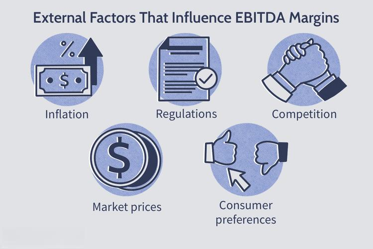

## Table of Contents

## What is EBITDA and how is it calculated?

EBITDA stands for Earnings Before Interest, Taxes, Depreciation, and Amortization. It's a way to measure how well a company is doing by looking at its profits before taking away certain costs. These costs include interest on loans, taxes, and the gradual reduction in value of things like buildings and equipment (depreciation and amortization).

To calculate EBITDA, you start with the company's earnings, which is usually the net income found on the income statement. Then, you add back the expenses for interest, taxes, depreciation, and amortization. This gives you a clearer picture of the company's operating performance without the impact of financing and accounting decisions. It's like looking at how much money the company makes from its main business activities before other costs are taken out.

## What does the EBITDA margin represent for a company?

The EBITDA margin shows how much of a company's money from sales is left after paying for things needed to run the business, but before taking away interest, taxes, depreciation, and amortization. It's a percentage that tells you how much profit a company makes from its main work, without worrying about how it's financed or how old its equipment is. A higher EBITDA margin means the company is good at making money from what it does every day.

This margin is useful because it lets you compare how well different companies are doing, even if they are in different places or have different ways of paying for their business. By looking at the EBITDA margin, you can see which companies are better at turning their sales into profit, before all the other costs come into play. It's like a simple way to check the health of a company's core business activities.

## How can EBITDA margin be used to compare companies within the same industry?

EBITDA margin is a useful tool for comparing companies in the same industry because it shows how much profit each company makes from its main business activities, before other costs like interest, taxes, and depreciation are taken out. By looking at the EBITDA margin, you can see which companies are better at turning their sales into profit. For example, if Company A has an EBITDA margin of 25% and Company B has an EBITDA margin of 15%, it means that Company A is more efficient at making money from its core business than Company B.

This comparison is helpful because it takes away the effects of different financing decisions or the age of the company's equipment. Some companies might have big loans and pay a lot of interest, while others might have newer equipment and less depreciation. By using EBITDA margin, you can focus on the core performance of the business without these differences getting in the way. So, it's a good way to see which companies in the same industry are doing a better job at their main work.

## What are the limitations of using EBITDA margin as a financial metric?

While EBITDA margin is helpful for comparing how well companies are doing, it has some problems. One big problem is that it doesn't include important costs like interest, taxes, depreciation, and amortization. These costs can be a big deal for some companies. For example, a company with a lot of debt will have to pay a lot of interest, which can really affect how much money they keep at the end of the day. So, if you only look at EBITDA margin, you might think a company is doing better than it really is.

Another limitation is that EBITDA margin can be different from one industry to another. What's a good margin in one industry might not be so good in another. This means you can't always use it to compare companies in different industries. Also, some companies might try to make their EBITDA margin look better by changing how they report their earnings or by not including all their costs. This can make it hard to trust the numbers and get a true picture of how the company is doing.

## How does EBITDA margin affect a company's valuation?

EBITDA margin can affect how much a company is worth because it shows how good the company is at making money from its main work. If a company has a high EBITDA margin, it means they keep a lot of money from what they sell before paying for things like loans, taxes, and the wear and tear on their equipment. Investors and buyers like to see a high EBITDA margin because it suggests the company is efficient and could be a good investment. So, a company with a high EBITDA margin might be valued higher than one with a lower margin.

However, EBITDA margin is just one piece of the puzzle. It doesn't tell the whole story because it leaves out important costs like interest, taxes, and the cost of replacing old equipment. These costs can make a big difference in how much money a company really keeps. So, while a high EBITDA margin can make a company look more valuable, smart investors will also look at other numbers to get a full picture of the company's health and future potential.

## Can EBITDA margin be manipulated, and if so, how?

Yes, companies can try to make their EBITDA margin look better than it really is. They might do this by playing around with how they report their earnings. For example, they could move some costs from the income statement to somewhere else, so those costs don't show up when calculating EBITDA. Or, they might recognize revenue earlier than they should, making their sales look higher and boosting their EBITDA margin.

Another way to manipulate EBITDA margin is by not including all the costs that should be there. A company might decide not to count some expenses as part of their operating costs, which makes their EBITDA look bigger. This can be tricky because it hides the true costs of running the business. So, while EBITDA margin is useful, it's important to check if the numbers are honest and if they really show how the company is doing.

## What is considered a good EBITDA margin and how does it vary by industry?

A good EBITDA margin can be different depending on the industry. In general, a higher EBITDA margin is better because it shows that a company keeps more money from what it sells after paying for the things needed to run the business. For example, in industries like software or pharmaceuticals, where the cost to make more products after the first one is low, a good EBITDA margin might be around 25% to 40% or even higher. But in industries like retail or restaurants, where costs are higher and profits are smaller, a good margin might be around 5% to 15%.

The reason EBITDA margins vary by industry is because different businesses have different costs and ways of making money. For example, a tech company might have high initial costs to develop a product but then can sell it many times without much extra cost. This can lead to a high EBITDA margin. On the other hand, a grocery store has to keep buying new products to sell, which means their costs stay high and their margins are lower. So, when looking at EBITDA margins, it's important to compare companies within the same industry to get a fair idea of how well they're doing.

## How does EBITDA margin correlate with operational efficiency?

EBITDA margin is a good way to see how efficient a company is at making money from what it does every day. If a company has a high EBITDA margin, it means they are good at keeping more of the money they make from sales after paying for things like workers, rent, and supplies. This shows that the company is running its main business well and not wasting money. For example, if two companies sell the same thing but one has a higher EBITDA margin, that company is probably better at managing its costs and making a profit.

However, EBITDA margin isn't the only thing that shows how efficient a company is. It doesn't count important costs like interest on loans, taxes, and the wear and tear on equipment. So, a company might have a high EBITDA margin but still have problems if it has a lot of debt or old equipment that needs to be replaced. To really understand how efficient a company is, you need to look at other numbers too, like how quickly they can turn their products into cash or how well they manage their inventory. But overall, a high EBITDA margin is a good sign that a company is doing a good job at its core business.

## What impact does debt have on EBITDA margin and overall financial health?

Debt can change how a company's EBITDA margin looks and affects its overall financial health. When a company borrows money, it has to pay interest on that debt. These interest payments are not included in the EBITDA calculation, so a company with a lot of debt might still show a high EBITDA margin. This can make the company look more profitable than it really is because the high interest costs are hidden. So, while the EBITDA margin might look good, the company could be struggling to pay its debts, which can be a big problem.

On the other hand, too much debt can hurt a company's financial health even if the EBITDA margin is high. If a company has to spend a lot of money on interest payments, it might not have enough left over to reinvest in the business or to handle unexpected costs. This can make the company less stable and more likely to run into financial trouble. So, it's important to look at a company's debt levels along with its EBITDA margin to really understand how healthy the company is.

## How do changes in EBITDA margin over time reflect a company's strategic direction?

Changes in a company's EBITDA margin over time can show what direction the company is going in. If the EBITDA margin is going up, it might mean the company is getting better at making money from what it does every day. They could be finding ways to cut costs or make more money from sales. This could be part of a plan to grow the business or make it more efficient. For example, a company might start using new technology to make things cheaper or sell more products to increase their profits.

On the other hand, if the EBITDA margin is going down, it could mean the company is facing challenges or changing its strategy. Maybe they are spending more money to grow the business, like opening new stores or developing new products. This can lower the margin in the short term but might be good for the company in the long run. Or, it could mean they are having trouble keeping costs down or making sales. By looking at how the EBITDA margin changes over time, you can get a sense of what the company is trying to do and how well their plans are working.

## What advanced analytical techniques can be used to forecast future EBITDA margins?

To guess what a company's EBITDA margin might be in the future, people can use special math and computer methods. One way is to use something called regression analysis. This means looking at past numbers like sales, costs, and how much the company made, to find patterns. By understanding these patterns, you can make a guess about what might happen next. Another way is to use time series analysis, which is like looking at how the EBITDA margin has changed over time and using that to predict where it's going. These methods help by using past information to make smart guesses about the future.

Another helpful technique is scenario analysis. This means thinking about different things that could happen, like the economy getting better or worse, or new laws that affect the company. By making different guesses about these things, you can see how they might change the EBITDA margin. Also, [machine learning](/wiki/machine-learning) can be used to look at a lot of data and find hidden patterns that might be hard to see otherwise. These patterns can help make better predictions about future EBITDA margins. By using these advanced methods, people can get a clearer picture of what might happen to a company's profits in the future.

## How do global economic conditions influence a company's EBITDA margin?

Global economic conditions can really change a company's EBITDA margin. When the world economy is doing well, people have more money to spend, which can mean more sales for a company. This can make the EBITDA margin go up because the company is making more money from what it sells. But if the economy is not doing well, like during a recession, people might not buy as much. This can make sales go down and costs stay the same or even go up, which can lower the EBITDA margin. Also, things like changes in currency values or trade rules can affect how much it costs to make or sell things, which can also change the EBITDA margin.

Another way global economic conditions can affect EBITDA margin is through interest rates and inflation. If interest rates go up, it can be more expensive for a company to borrow money, which might not show up in the EBITDA margin but can affect the company's overall health. Inflation can make the costs of things like materials and labor go up, which can squeeze the EBITDA margin if the company can't raise its prices enough to cover these higher costs. So, even though EBITDA margin looks at profits before some costs, global economic conditions can still have a big impact on it by changing sales, costs, and how much money the company keeps at the end of the day.

## What is EBITDA and how can it be understood?

EBITDA (Earnings Before Interest, Taxes, Depreciation, and Amortization) is a financial metric designed to provide insights into a company's operating profitability by excluding non-operational expenses. It allows for a more focused examination of a company’s core business activities by eliminating the effects of financing and accounting decisions.

The formula for calculating EBITDA is straightforward and involves summing up interest, taxes, depreciation, and amortization with net income:

$$
\text{EBITDA} = \text{Net Income} + \text{Interest} + \text{Taxes} + \text{Depreciation} + \text{Amortization}
$$

By excluding interest and taxes, EBITDA removes the variability caused by different tax rates and debt levels across companies, enabling a clearer comparison of operating performance across firms with distinct capital structures. Additionally, excluding depreciation and amortization, which are non-cash charges associated with historical investments in tangible and intangible assets, provides a clearer picture of a company's current operational profitability. This is particularly advantageous when analyzing firms in capital-intensive industries, such as manufacturing or telecommunications, where significant amounts of fixed assets can lead to substantial depreciation expenses.

Despite its utility, it's important to note that EBITDA is not a measure recognized by Generally Accepted Accounting Principles (GAAP). Its wide adoption stems from its ability to neutralize certain expenses that might obscure true operational capabilities, but it should be used cautiously alongside other financial measures to ensure a comprehensive assessment of company performance. The emphasis on core operations makes EBITDA a preferred choice for comparisons within industries and evaluating acquisition targets. However, the absence of regulation around the measure can affect its consistency and interpretation, necessitating careful consideration by analysts and investors.

## References & Further Reading

[1]: Bergstra, J., Bardenet, R., Bengio, Y., & Kégl, B. (2011). ["Algorithms for Hyper-Parameter Optimization."](https://dl.acm.org/doi/10.5555/2986459.2986743) Advances in Neural Information Processing Systems 24.

[2]: ["Advances in Financial Machine Learning"](https://www.amazon.com/Advances-Financial-Machine-Learning-Marcos/dp/1119482089) by Marcos Lopez de Prado

[3]: ["Evidence-Based Technical Analysis: Applying the Scientific Method and Statistical Inference to Trading Signals"](https://www.amazon.com/Evidence-Based-Technical-Analysis-Scientific-Statistical/dp/0470008741) by David Aronson

[4]: ["Machine Learning for Algorithmic Trading"](https://github.com/stefan-jansen/machine-learning-for-trading) by Stefan Jansen

[5]: ["Quantitative Trading: How to Build Your Own Algorithmic Trading Business"](https://www.amazon.com/Quantitative-Trading-Build-Algorithmic-Business/dp/1119800064) by Ernest P. Chan