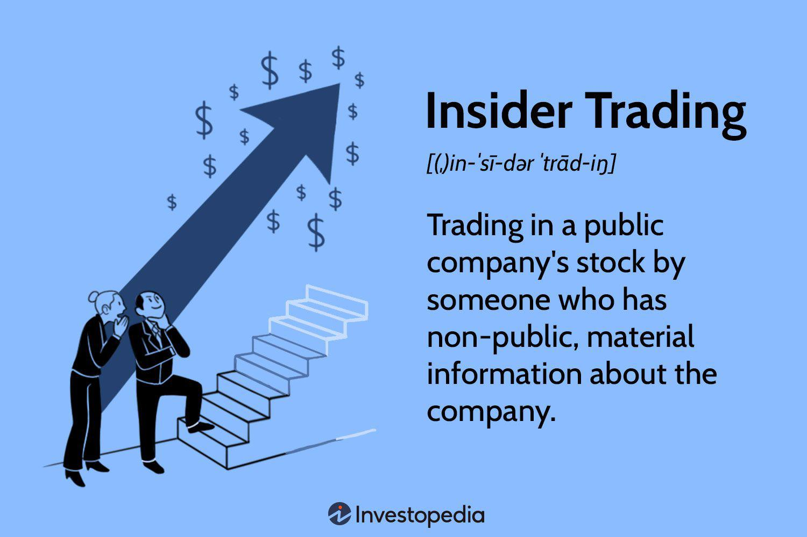

Understanding the intricacies of insider selling in stock markets is crucial for investors seeking to make informed financial decisions. Insider selling refers to corporate insiders, such as executives, directors, and significant shareholders, selling shares of their own company. These transactions, when disclosed, are publicly reported and provide valuable data that can influence investment strategies. 

Financial analysis and algorithmic trading make significant use of insider transaction data. By examining patterns in insider selling, analysts can gain insights into the company's perceived future performance. For instance, when insiders sell significant amounts of shares, it may suggest they anticipate a decline in stock value, although it's important to note that selling does not always indicate negative prospects; it can also reflect personal liquidity needs. 



The regulatory landscape governing insider transactions ensures transparency, with rules like the 10b5-1 plan providing a structured way for insiders to sell stock without allegations of insider trading. This legal framework is essential to maintain fair market practices and protect investor interests.

Insider transactions also hold predictive value. Historically, insider buying often correlates with positive stock price movements, whereas insider selling can precede declines. Studies have shown that insider actions serve as a powerful sentiment indicator, potentially guiding market participants. Algorithmic trading platforms leverage insider transaction data, developing sophisticated models to automate investment decisions and potentially forecast market movements with greater accuracy.

This article aims to equip investors with a nuanced understanding of insider selling, enhancing their ability to interpret these actions as part of a broader financial strategy. By understanding the motives behind insider transactions and employing advanced analytical tools, investors can glean valuable insights into a company's future outlook, thereby improving their decision-making in an ever-evolving stock market environment.

## Table of Contents

## Understanding Insider Selling

Insider selling involves the actions of corporate insiders—typically executives, directors, and significant shareholders—who sell shares of their own company. This activity is closely monitored and regulated to maintain transparency and foster trust in the financial markets. In the United States, for example, the Securities and Exchange Commission (SEC) mandates that such transactions be reported promptly on forms such as Form 4. This requirement ensures that the market is informed about the buying or selling activities of people likely to have inside information about the company's prospects.

Legal frameworks such as the Rule 10b5-1 plan are pivotal in regulating insider sales. Established by the SEC, the 10b5-1 plan provides a pre-arranged schedule for insiders to buy or sell company stock. This rule is designed to protect insiders from accusations of insider trading by allowing them to conduct transactions at times when they might possess material non-public information. The plan must be established at a time when the insider is not in possession of such information and must outline the number of shares to be sold or the market conditions under which sales will occur.

Despite regulations, insider selling can offer insights into how insiders perceive the company's future. For instance, if a significant number of executives sell large amounts of stock, it may signal their concerns about the company’s future performance or stock valuation. However, one must be cautious in interpreting these signals as insider selling can happen for many benign reasons such as personal financial planning, tax reasons, or portfolio diversification.

Beyond compliance, the examination of insider selling patterns can reveal important implications for investors. Analysts often look at the [volume](/wiki/volume-trading-strategy) and frequency of insider sales in relation to the overall trading volume and other financial indicators to gauge market sentiment. However, this should only be one element among many in a comprehensive financial analysis strategy. By understanding the legal frameworks and strategic implications of insider selling, investors can better assess its impact and incorporate this knowledge into informed decisions about their investment strategies.

## The Role of Financial Analysis in Insider Trading

Financial analysis plays a crucial role in understanding how insider transactions impact company performance and stock valuation. Insider selling, carried out by individuals such as executives or directors within a company, can provide significant insights into a company's dynamics and the sentiment of its leadership. These transactions, when analyzed meticulously, offer potential indicators of future stock performance.

Insider sales data serve as a reflection of executive sentiment regarding the company's prospects. For example, substantial selling by insiders may indicate a lack of confidence in the company's near-term growth or sound strategic direction. Conversely, if insiders are not selling during typical profit-taking periods, it may suggest optimism about the company's long-term potential. Financial analysts often assess these patterns, along with associated volumes and timing, to predict stock movements.

Accurate predictions of stock price changes can be rooted in the integration of insider transaction data with broader financial metrics. For instance, analysts may use earnings reports, cash flow statements, and market conditions in conjunction with insider sales to form a comprehensive view. When analyzing these data sets, tools such as Python can be useful for modeling and simulations. Here's a simple example illustrating how Python might be used to assess the impact of insider sales:

```python
import pandas as pd
import numpy as np

# Sample data
data = {'Insider_Sales': [1000, 2000, 1500, 3000, 2500],
        'Stock_Price_Change': [-0.5, -1.2, -0.7, -1.5, -1.0]}

# Convert to DataFrame
df = pd.DataFrame(data)

# Calculate correlation between Insider Sales and Stock Price Change
correlation = np.corrcoef(df['Insider_Sales'], df['Stock_Price_Change'])[0, 1]
print(f"Correlation: {correlation:.2f}")
```

In this example, examining the correlation between insider sales and stock price change can help analysts draw conclusions about potential stock movements.

Beyond merely signaling potential red flags, insider transaction data are pivotal in shaping financial forecasts. By integrating insider data with quantitative metrics such as price-to-earnings ratios, debt levels, and revenue forecasts, analysts can refine predictive models. These models are critical in strategic investment decisions, helping institutions and individual investors alike to mitigate risks and seize opportunities.

In summary, analyzing insider transactions through a financial lens provides investors with crucial indicators of a company’s health and future trajectory. This analysis, when combined with extensive market metrics, enhances the accuracy of stock predictions and aids in making informed investment decisions.

## Algorithmic Trading and Insider Transaction Analysis

Algorithmic trading integrates insider transaction data by utilizing sophisticated computer systems to automate investment processes based on pre-established criteria. These systems are designed to swiftly analyze patterns in insider buying and selling, thereby identifying potential opportunities in the investment landscape.

A notable feature of [algorithmic trading](/wiki/algorithmic-trading) is its capacity to process vast amounts of insider transaction data rapidly. By evaluating the buying and selling behaviors of insiders—such as executives and major shareholders—these algorithms can detect patterns that may signal underlying changes in a company’s stock price. The system's ability to analyze data at a speed unmatched by human capabilities allows it to provide early warnings about potential price changes, enhancing the agility and responsiveness of trading strategies.

Machine learning is increasingly incorporated into algorithmic models, enriching their predictive power regarding insider actions. Machine learning algorithms, through techniques such as supervised learning, can refine predictions by learning from vast datasets of past insider transactions. For example, regression models may be used to predict future stock prices based on identified trends in insider sales and purchases. Consider a basic linear regression model:

$$

y = \beta_0 + \beta_1x_1 + \beta_2x_2 + \epsilon 
$$

where $y$ is the predicted stock price, $x_1$ might represent insider buying volume, $x_2$ insider selling volume, $\beta$ coefficients are trained on historical data, and $\epsilon$ is the error term. This model illustrates how historical insider transaction data can be leveraged to predict future stock movements.

Here is an example of how insider transaction data could be used in a simplified Python algorithm:

```python
import pandas as pd
from sklearn.linear_model import LinearRegression

# Sample data: insider transactions
data = {
    'insider_buy': [100, 150, 200, 130, 180],
    'insider_sell': [50, 70, 80, 60, 75],
    'stock_price_next_day': [110, 120, 130, 125, 135]
}

df = pd.DataFrame(data)

# Define features and target
X = df[['insider_buy', 'insider_sell']]
y = df['stock_price_next_day']

# Linear regression model
model = LinearRegression()
model.fit(X, y)

# Predicting the stock price based on new insider data
new_data = pd.DataFrame({'insider_buy': [160], 'insider_sell': [65]})
predicted_price = model.predict(new_data)

print(f"Predicted stock price: {predicted_price[0]}")
```

This example highlights how algorithmic trading systems not only process insider information efficiently but also leverage advanced [machine learning](/wiki/machine-learning) techniques to enhance predictive accuracy. Consequently, investors can better align their strategies with emerging market trends, informed by the nuanced signals from insider transactions.

## Predictive Value of Insider Transactions

Insider transactions, particularly buying and selling activities by a company's executives, directors, and significant shareholders, have long been studied for their predictive value in financial markets. Empirical evidence suggests a strong correlation between insider buying and subsequent positive stock price movements. This phenomenon can be attributed to insiders’ profound understanding of their firm's operational and financial health, enabling them to make informed decisions about the company's future prospects. Conversely, insider selling is often regarded as a precursor to stock price declines, reflecting potential concerns about a company’s future performance or shifts in market sentiment.

Research indicates that insiders are well-positioned to anticipate their firm’s future performance due to their access to non-public, material information. For instance, a study by Lakonishok and Lee (2001) examined insider trading patterns and found that insider purchases significantly outperformed market averages, suggesting insiders can exploit their informational advantages. Similarly, a study by Seyhun (1986) highlighted that abnormal returns were realized following insider transactions, emphasizing the information content conveyed through these activities.

Traders often assess the scale and frequency of insider transactions to gauge market sentiment. Large or frequent sales by insiders might signal bearish sentiment, potentially prompting traders to consider reducing their holdings in the stock. Conversely, significant insider buying might be interpreted as a bullish signal, suggesting confidence in the company's future performance. By integrating these insights with broader market data, traders can enhance their investment strategies, particularly in volatile markets where sentiment shifts can lead to rapid price changes.

Quantitative analysis of insider transactions can be facilitated using mathematical models and computational tools. Python, for instance, offers libraries such as pandas and numpy, enabling the efficient processing and analysis of insider transaction datasets. By evaluating variables such as transaction volume, price movement following transactions, and historical insider behavior, these models can help predict future stock price trends. 

In volatile markets, insider transactions serve as a critical sentiment indicator. During periods of uncertainty, investor focus often intensifies on insider behavior, as it provides clues about the strategic outlook and confidence levels of those most intimately familiar with the company. As such, understanding the predictive value of insider transactions is a valuable tool for investors aiming to develop informed, dynamic strategies that capitalize on market sentiment and insider-driven signals.

## Case Studies and Real-World Implications

Insider transactions provide critical insights into market behavior, particularly in volatile sectors such as technology and biotechnology. Specific case studies illustrate how insider activities have significantly influenced stock market movements, offering practical lessons for investors keen on leveraging insider data in their decision-making process.

A notable example is the technology sector, where insider transactions have often preceded major stock price shifts. Apple Inc. has been a frequent subject of analysis. Historical patterns reveal that significant insider selling has sometimes predated periods of stock price stagnation or decline. For instance, during the late 2010s, several Apple executives sold large quantities of stock prior to the company's delayed product launches, which subsequently put pressure on the stock. This pattern suggests that insiders' expectations of future challenges could be inferred from their selling activity, providing a cautionary signal to investors.

Similarly, in the biotechnology sector, insider transactions have often been predictive of major company announcements, such as FDA approvals or trial results. A case in point is the company Vertex Pharmaceuticals. Prior to receiving approval for a new cystic fibrosis treatment, notable insider buying was observed. Subsequently, the approval news led to a significant increase in stock price. This case highlights how insider buying can align with positive future developments, serving as a bullish indicator for market participants.

These examples demonstrate the practical application of insider transaction data in formulating investment strategies. Utilizing such data involves analyzing the scale and context of insider activities. Investors can employ statistical models to assess whether insider actions are statistically significant predictors of stock performance. For instance, a logistic regression model could be used to predict the probability of a stock price increase following insider buying. Python's scikit-learn library offers tools for building such predictive models, enabling data-driven interpretation of insider activities.

```python
from sklearn.model_selection import train_test_split
from sklearn.linear_model import LogisticRegression
from sklearn.metrics import accuracy_score

# Sample data format: ['Insider_Buying', 'Stock_Price_Change']
data = [[1, 1], [0, 0], [1, 1], [0, 0], [1, 1]]  # Example data with binary outcomes

# Splitting the data
X_train, X_test, y_train, y_test = train_test_split(
    [d[0] for d in data], [d[1] for d in data], test_size=0.2, random_state=42)

# Reshape data for sklearn
X_train = [[x] for x in X_train]
X_test = [[x] for x in X_test]

# Logistic Regression Model
model = LogisticRegression()
model.fit(X_train, y_train)
predictions = model.predict(X_test)

# Model accuracy
accuracy = accuracy_score(y_test, predictions)
print(f"Model Accuracy: {accuracy}")
```

By learning from these case studies, investors can enhance their ability to interpret insider transactions, allowing for more informed trading decisions. Nevertheless, caution must be exercised, as insider behaviors can be driven by personal reasons unrelated to company performance. Thus, insider transaction data should be one component of a diversified analytical approach.

## Challenges and Ethical Considerations

Accuracy and timeliness of data are crucial elements in the analysis of insider transactions. The effectiveness of using insider data for making informed stock market decisions relies heavily on the availability of accurate and up-to-date information. Delays between the actual transaction and the public reporting can lead to data becoming obsolete, thus affecting its predictive capability. Legally, insiders are required to report their transactions to regulatory bodies like the United States Securities and Exchange Commission (SEC) within a specified time frame, often leading to data that may be several days old by the time it reaches the public domain. 

Regulatory changes can significantly impact the landscape of insider transaction data. Alterations in reporting requirements, such as changes in the timeframe within which insiders must report their trades, can either enhance or impede the utility of these reports for investors. For example, the SEC's Form 4 filings, which insiders use to report their transactions, are a key source of this data. Any amendments to the requirements of Form 4 filings can alter the timeliness and accessibility of insider data, influencing investors’ ability to react to insider transactions in a timely manner.

Investors should remain vigilant and avoid the pitfall of relying solely on insider transaction data when making investment decisions. A diversified analytical approach, incorporating both qualitative and quantitative metrics, is essential to mitigate the risks associated with potential data inaccuracies or misinterpretations. This holistic approach enables investors to balance insider data with broader economic indicators and financial metrics, providing a well-rounded basis for decision-making. The integration of diverse data sources helps to cross-verify the insights derived from insider transactions and enhances the robustness of investment strategies.

Ethical concerns are a significant consideration when analyzing insider transaction data. There is an inherent risk of overreliance on non-public information, which raises questions of legality and fairness. Investors and traders must ensure compliance with legal protocols to avoid engaging in activities that could border on insider trading, which is illegal under securities law. Ethical investing practices require transparency and adherence to legal guidelines, ensuring that all market participants have equal access to material information. Balancing the use of insider data with ethical standards and regulatory compliance helps maintain trust and integrity in the financial markets.

In summary, while insider transactions can offer valuable insights into market trends and company performance, investors must consider the challenges of data accuracy and timeliness, adapt to regulatory changes, maintain diversified analytical practices, and uphold ethical standards to effectively utilize this information in their trading strategies.

## Conclusion

Insider selling, a multifaceted and often misunderstood component of the stock market, provides significant insights into a company's future performance and market prospects. Understanding insider transactions allows investors to decode nuanced signals about a firm's vitality and potential direction. When insider selling is interpreted correctly, it can serve as a strategic tool, enhancing both portfolio management and investment decisions. By integrating insider transaction data with robust financial analysis and sophisticated algorithmic trading models, investors can craft more potent and dynamic investment strategies. These strategies benefit from a more comprehensive view that acknowledges the potential impact of insider behavior on market trends and stock valuations.

Investors who harness a comprehensive understanding of insider behavior can better navigate the inherent uncertainties of the stock market. This advantage stems from their ability to interpret insider selling patterns as indicators of overvaluation, potential downturns, or changes in corporate strategy. Access to timely and accurate data further amplifies this advantage, allowing for more proactive and informed decision-making.

Continuous learning and adaptation are critical components of success in the ever-evolving financial markets. As regulations surrounding insider transactions change and new trading techniques emerge, investors must remain vigilant and responsive. Embracing these changes requires a commitment to ongoing education, staying informed about regulatory updates, and updating analytical models to incorporate the latest market practices. This adaptive approach ensures that investors remain competitive and ethically grounded while maximizing the predictive value of insider transactions.

In conclusion, while insider selling comprises numerous complexities, it offers a valuable lens through which investors can assess market conditions and company health. By leveraging this information within a framework of financial analysis and technology, informed investors can enhance their market strategies and better anticipate potential shifts, thereby securing a strategic advantage in a fluctuating investment landscape.

## References & Further Reading

[1]: Lakonishok, J., & Lee, I. (2001). ["Are Insider Trades Informative?"](https://www.jstor.org/stable/2696757) The Review of Financial Studies, 14(1), 79-111.

[2]: Seyhun, H. N. (1986). ["Insiders’ Profits, Costs of Trading, and Market Efficiency."](https://www.sciencedirect.com/science/article/pii/0304405X86900607) Journal of Financial Economics, 16(2), 189-212.

[3]: Wang, W., & Shivakumar, L. (2004). ["The Links Between Earnings Management and Insider Trading."](https://www.sciencedirect.com/science/article/abs/pii/S0304405X04000534) Journal of Accounting Research, 42(2), 1-31.

[4]: Martinez, R. (2011). ["The Impact of Insider Trading Regulations on Stock Market Efficiency: A Global Perspective."](https://sites.temple.edu/ticlj/files/2017/02/23.2.Hughes-TICLJ.pdf) European Journal of Finance and Banking Research, 4(4), 1-13.

[5]: Chong, E., Han, C., & Park, F.C. (2017). ["Deep Learning Networks for Stock Market Analysis and Prediction: Methodology, Data Representations, and Case Studies."](https://www.sciencedirect.com/science/article/pii/S0957417417302750) Expert Systems with Applications, 83, 187-205.