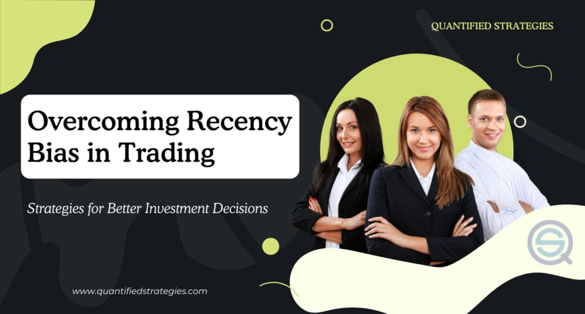

Informed investment decisions are pivotal for attaining financial objectives and ensuring the sustainability of financial markets. An informed decision is one where investors assess and analyze pertinent data and insights, minimizing errors driven by misinformation or emotional impulses. The significance extends to individual investors safeguarding their portfolios and to financial institutions aiming to optimize returns while managing risks effectively.

Implicit bias, a subconscious and automatic inclination affecting judgment, poses a substantial obstacle in investment psychology. Such biases can distort perception and lead to irrational financial choices, driven by factors beyond empirical data. For example, confirmation bias might cause an investor to overly favor information that aligns with their existing beliefs, neglecting contradictory evidence that might be crucial for sound decision-making.

Investment psychology intersects significantly with modern technological advancements, such as algorithmic trading. This fusion introduces new complexities and opportunities within financial markets. Algorithmic trading uses pre-designed codes and mathematical models to execute trades at high speeds and volumes, ostensibly reducing human error and bias. However, understanding this technology's psychological impact is vital, as it still necessitates human oversight and strategic input.

Acknowledging these dynamics is crucial for both individual investors and financial institutions. Individuals must navigate their psychological predispositions to make more rational decisions. Institutions, equipped with significant resources, must balance algorithmic efficiency with human judgment to capitalize on nuanced market conditions effectively.

This article will explore these themes, starting with an examination of implicit bias and its influence on investment decisions. It will then discuss investment psychology's role in trading, assess how algorithmic trading provides solutions to psychological pitfalls, and finally, offer insights on combining human and machine precision for superior investment outcomes.

## Table of Contents

## Understanding Implicit Bias in Investment Decisions

Implicit bias refers to the subconscious attitudes or stereotypes that affect an individual’s understanding, actions, and decisions, often without their explicit awareness. In the context of investments, implicit biases can significantly sway decision-making, leading individuals to make choices that may not align with optimal investment strategies or market realities. These biases manifest despite investors believing their decisions are rational, highlighting the gap between intention and subconscious influence. 

One common bias is confirmation bias, where investors favor information that confirms existing beliefs or hypotheses while disregarding contradictory data. For instance, an investor might selectively focus on news stories that predict a positive outlook for a stock they own, disregarding unfavorable reports. This can lead to holding onto poor-performing stocks based on biased information rather than objective analysis. Overconfidence is another prevalent bias, characterized by an investor's inflated belief in their own knowledge or predictive abilities. An example is when an investor overestimates the accuracy of their market predictions, which can result in risky investment decisions without adequate risk assessment.

These biases often lead to poor investment choices, as investors either cling to deteriorating investments or trade excessively based on unfounded market convictions. Understanding and mitigating these biases is crucial for improving investment outcomes. One effective strategy is becoming aware of these biases through self-reflection and education. Workshops and training sessions focusing on behavioral finance can illuminate these subconscious influences, enabling investors to adjust their decision-making frameworks accordingly.

Another approach involves employing structured decision-making processes, such as setting predefined criteria for buying or selling assets, which can mitigate the influence of bias. Engaging in regular portfolio reviews with unbiased financial advisors can provide an external check on potential biased thinking. Lastly, leveraging tools like [algorithmic trading](/wiki/algorithmic-trading) systems can offer decisions based on data analysis rather than emotional biases, though it’s crucial to maintain human oversight to ensure adaptability and context-specific decision-making. By incorporating these strategies, investors can work towards reducing the impact of implicit biases, fostering more informed and successful investment choices.

## Investment Psychology: The Mind's Role in Trading

Investment psychology plays a crucial role in the realm of financial decision-making and trading behaviors. Understanding how psychological factors influence investors can significantly enhance investment strategies and outcomes. Key psychological concepts such as fear, greed, and herd behavior profoundly impact trading activities.

Fear and greed are often cited as primary emotions driving market behaviors. Fear, particularly the fear of losing money, can lead investors to make impulsive decisions, often resulting in suboptimal outcomes such as panic selling during market downturns. On the other hand, greed can drive investors to overestimate potential gains, leading to risky investment decisions and speculative bubbles. The interplay between these two emotions can lead to market [volatility](/wiki/volatility-trading-strategies) as investors react unpredictably to external stimuli.

Herd behavior is another psychological phenomenon affecting trading, where investors mimic the actions of others rather than relying on their independent analysis. This behavior can lead to market trends and bubbles, as seen in historical events like the dot-com bubble. Individuals' tendency to align with the majority can create self-fulfilling prophecies, driving prices to irrational levels.

By understanding these psychological concepts, investors can develop better strategies, avoiding common pitfalls associated with emotional decision-making. Incorporating psychological insights into trading can foster a more disciplined approach, allowing investors to remain rational during periods of market turbulence. For instance, recognizing the influence of herd mentality can enable investors to avoid following market trends blindly.

Emotional discipline is paramount in achieving successful investing outcomes. Maintaining a balanced mindset helps in adhering to pre-defined strategies, reducing the likelihood of making emotion-driven decisions. Techniques such as setting clear investment objectives, regularly reviewing investment performance, and using stop-loss orders can assist investors in maintaining emotional discipline. Furthermore, adopting a long-term perspective can mitigate the impact of short-term emotional fluctuations.

In conclusion, integrating an understanding of psychological factors into investment strategies can provide a competitive edge. Recognizing the impact of fear, greed, and herd behavior, alongside maintaining emotional discipline, can significantly enhance trading success. Investors equipped with psychological insights are better positioned to navigate the complexities of financial markets and make informed decisions that align with their strategic goals.

## Algorithmic Trading: A Modern Solution

Algorithmic trading, also known as algo-trading, refers to the use of computer programs to execute trading strategies based on pre-defined criteria. This innovative trading method has significantly transformed financial markets by enabling trades at a speed and frequency that would be impossible for human traders. Algorithmic trading utilizes complex mathematical models and formulas to analyze market data and [carry](/wiki/carry-trading) out trades based on market conditions, making it a cornerstone of modern finance.

One of the primary benefits of algorithmic trading is its speed and efficiency. Algorithms can process vast amounts of data in milliseconds, allowing trades to be executed at optimal prices. This rapid execution reduces transaction costs and improves the efficiency of the market by ensuring that bid-ask spreads are minimized. Additionally, algorithmic trading eliminates human emotion from trading decisions, which can lead to more consistent and rational investment outcomes. Since algorithms operate purely on data-driven criteria, they are not swayed by fear, greed, or cognitive biases that often afflict human traders.

Algorithms play a pivotal role in mitigating human biases by strictly adhering to predetermined rules and guidelines. For instance, they can be programmed to avoid common pitfalls such as loss aversion, where investors hold onto losing positions for too long, or the disposition effect, where investors prematurely sell winning positions. By doing so, algorithmic trading can enhance decision-making by ensuring that trades are executed based on objective data rather than subjective judgment.

Despite its advantages, algorithmic trading is not without limitations and challenges. One major concern is the risk of technical failures, which can lead to significant financial losses. Glitches in algorithms or unexpected market conditions can cause them to malfunction, resulting in erratic trading behavior. Moreover, there is a danger of over-reliance on algorithms, which can lead to a lack of human oversight and potentially overlook broader market contexts that a human trader might recognize. This reliance can also exacerbate market volatility, as algorithmic strategies may respond simultaneously to market signals, leading to rapid and large-scale transactions.

Additionally, algorithmic trading requires substantial investment in technology and infrastructure, which may not be feasible for all market participants, especially smaller investors. The complexity of developing and maintaining effective trading algorithms necessitates expertise in both financial markets and programming, posing a barrier to entry for those without the requisite skills.

In conclusion, algorithmic trading continues to revolutionize the financial industry by delivering speed, efficiency, and rationality in trade execution. While it offers substantial benefits in mitigating human biases and enhancing market operations, traders must remain aware of its potential risks and limitations. A balanced approach that combines the precision of algorithmic systems with human insight may offer the most robust strategy for navigating modern financial markets.

## Synergizing Human Insight with Algorithmic Precision

Combining human expertise with algorithmic tools harnesses the strengths of both entities, resulting in enhanced investment outcomes. Human insight brings qualitative analysis and experience-driven intuition, while algorithms offer computational speed and the ability to process vast datasets without emotional interference.

**Case Studies and Examples**

One notable example of successful synergy is Renaissance Technologies, a [hedge fund](/wiki/hedge-fund-trading-strategies) employing algorithmic models driven by quantitative analysis but maintained by a staff of skilled mathematicians and scientists. Their Medallion Fund, known for its exceptional returns, illustrates the power of combining sophisticated algorithms with expert human oversight. Similarly, BlackRock’s Aladdin platform integrates data analytics and portfolio management techniques, enabling fund managers to make well-informed decisions based on real-time analysis.

**Role of Technology in Decision-Making**

Technological advancements such as [machine learning](/wiki/machine-learning) and [artificial intelligence](/wiki/ai-artificial-intelligence) improve investor decision-making by identifying patterns and trends beyond human recognition. These tools enhance predictive accuracy and allow investors to anticipate market movements more effectively. Algorithms can execute trades at speeds and frequencies unattainable for humans, optimizing transaction times and reducing operational risks.

Yet, technology alone cannot account for unexpected market shifts or geopolitical events that might elude quantitative models. Human oversight ensures that such factors are incorporated, providing a holistic approach to investment decisions.

**Balancing Automation with Personal Judgment**

Investors can balance automation with personal judgment by adopting a hybrid approach, ensuring that while machines manage routine tasks, humans focus on strategic analysis and oversight. This is exemplified by implementing a feedback loop where human insights refine algorithmic models, and algorithm outputs inform human strategies.

A practical application is to maintain a decision-making framework where humans set the strategic direction and ethical considerations, while algorithms handle data analysis and initial trade suggestions. Investors might manually review and approve trades exceeding a certain threshold or involve complex ethical considerations.

This harmony between human and algorithm facilitates a comprehensive investment strategy, leveraging the precision of technology with the nuanced understanding of human experts.

## Conclusion

In the pursuit of optimal investment outcomes, a comprehensive understanding of implicit bias, investment psychology, and algorithmic trading emerges as indispensable. Implicit biases, which unconsciously affect decision-making, pose a significant risk to investment choices by skewing perception and judgment. Recognizing these biases, such as confirmation bias and overconfidence, allows investors to make more rational decisions, reducing the likelihood of financial missteps.

Investment psychology further underscores the importance of cognitive and emotional factors in trading. Psychological elements like fear, greed, and herd behavior can drastically influence market activities. An informed investor can harness this knowledge to craft strategies that are resilient to emotional upheaval, promoting disciplined and deliberate investment actions.

Algorithmic trading provides a modern solution by leveraging technology to enhance efficiency and remove emotional interference. Although algorithms mitigate human biases through speed and precision, they are not without limitations, such as technical failures and the risk of over-reliance. Acknowledging these constraints is crucial for maintaining a balanced approach.

Therefore, integrating human insight with algorithmic precision fosters an environment where technology and personal expertise complement each other, leading to robust investment decisions. Investors and financial institutions are encouraged to adopt this holistic approach, balancing automated systems with keen human oversight to navigate the complexities of contemporary financial markets effectively. This synergy not only enhances decision-making but also fosters adaptability and resilience in the ever-evolving landscape of investing.

## References & Further Reading

[1]: Bergstra, J., Bardenet, R., Bengio, Y., & Kégl, B. (2011). ["Algorithms for Hyper-Parameter Optimization."](https://papers.nips.cc/paper/4443-algorithms-for-hyper-parameter-optimization) Advances in Neural Information Processing Systems 24.

[2]: ["Advances in Financial Machine Learning"](https://www.amazon.com/Advances-Financial-Machine-Learning-Marcos/dp/1119482089) by Marcos Lopez de Prado

[3]: ["Evidence-Based Technical Analysis: Applying the Scientific Method and Statistical Inference to Trading Signals"](https://www.amazon.com/Evidence-Based-Technical-Analysis-Scientific-Statistical/dp/0470008741) by David Aronson

[4]: ["Machine Learning for Algorithmic Trading"](https://github.com/stefan-jansen/machine-learning-for-trading) by Stefan Jansen

[5]: ["Quantitative Trading: How to Build Your Own Algorithmic Trading Business"](https://www.amazon.com/Quantitative-Trading-Build-Algorithmic-Business/dp/1119800064) by Ernest P. Chan