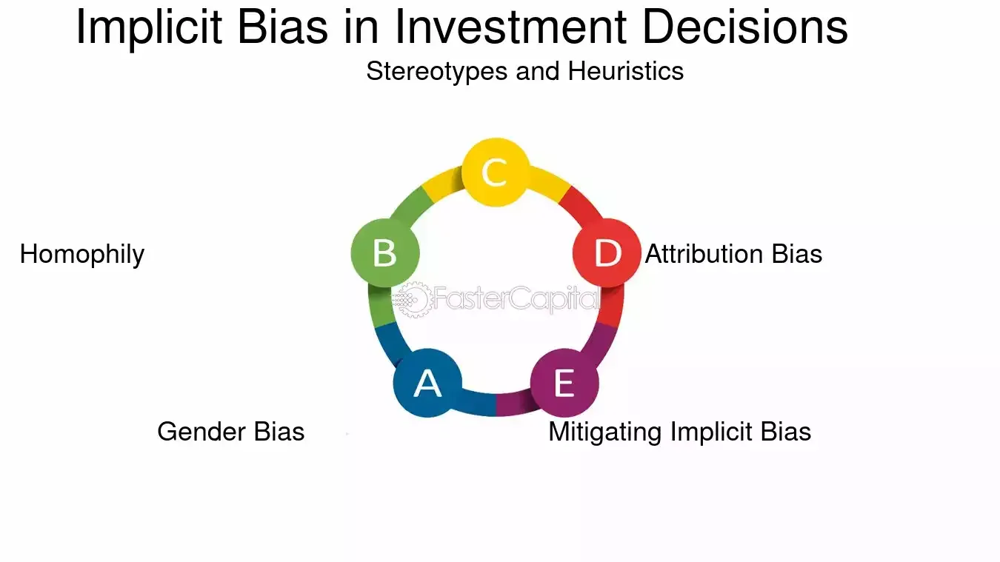

## Table of Contents

## What is implicit bias?

Implicit bias refers to the attitudes or stereotypes that affect our understanding, actions, and decisions in an unconscious way. These biases are often formed by our experiences and the culture around us, and they can influence how we see and treat others without us even realizing it. For example, someone might unconsciously believe that certain jobs are better suited for men or women, even if they consciously believe in gender equality.

These biases can have a big impact on areas like hiring, policing, and healthcare. For instance, a doctor might unknowingly treat patients differently based on their race or gender because of implicit biases. It's important to be aware of these biases because, even though they are unconscious, they can lead to unfair treatment and discrimination. By learning about and understanding our implicit biases, we can work to reduce their effects and treat everyone more fairly.

## How does implicit bias differ from explicit bias?

Implicit bias and explicit bias are two types of bias that affect how we think and act, but they work in different ways. Implicit bias is when we have attitudes or stereotypes that we are not aware of. These biases happen without us knowing and can influence our decisions and actions without us realizing it. For example, if someone has an implicit bias, they might treat people differently without meaning to, because their brain is making quick judgments based on what they've learned from society or their experiences.

On the other hand, explicit bias is when we are fully aware of our prejudices and attitudes. This type of bias is conscious, meaning we know we have these biases and we might even express them openly. For example, if someone has an explicit bias against a certain group, they might openly say negative things about that group or treat them unfairly on purpose. The key difference is that while implicit bias is hidden and automatic, explicit bias is intentional and known to the person who has it.

Understanding the difference between these two types of bias is important because it helps us see how our thoughts and actions can affect others, whether we mean for them to or not. By being aware of both implicit and explicit biases, we can work on reducing their impact and treating everyone more fairly.

## Can you provide examples of implicit bias in everyday life?

Implicit bias can show up in everyday life in many ways. For example, imagine you are a teacher and you have a new student. Without realizing it, you might expect this student to be good at math just because they wear glasses. This is an example of implicit bias because you are making a judgment based on a stereotype, even though you might not think you are biased. Another example could be when you are walking down the street and you see someone coming towards you. If you feel more nervous because of the color of their skin, that's also implicit bias at work. Your brain is making a quick judgment based on what you've seen or heard before, even if you don't want to feel that way.

Another common place where implicit bias can happen is at work. Let's say you are in charge of hiring new employees. You might unconsciously prefer candidates who went to the same school as you or who have similar hobbies. This is implicit bias because you are favoring certain people without even knowing it. In healthcare, a doctor might spend less time with patients from certain backgrounds because of unconscious beliefs about those groups. These examples show how implicit bias can affect our everyday decisions and actions without us even realizing it.

## What are common types of implicit biases that affect investment decisions?

Implicit biases can influence investment decisions in many ways. One common type is the familiarity bias, where investors prefer to put their money into companies or industries they know well. For example, someone might invest more in local businesses or in the sector they work in because they feel more comfortable with what they know. Another type is confirmation bias, where investors look for information that supports their existing beliefs and ignore information that doesn't. This can lead them to make decisions based on what they want to believe rather than on all the facts.

Another common implicit bias is the overconfidence bias, where investors think they know more than they actually do. This can lead them to take bigger risks or trade more often than they should. Herd mentality is also a type of implicit bias where investors follow what others are doing without thinking for themselves. They might buy or sell stocks just because everyone else is doing it, even if it's not the best decision for them. These biases can lead to poor investment choices and can affect how well someone's investments perform over time.

## How can implicit bias influence an investor's perception of risk and reward?

Implicit bias can shape how an investor sees risk and reward in their investments. For example, if an investor has a bias towards familiar companies or industries, they might see those investments as less risky. They feel comfortable with what they know, so they might think these investments are safer, even if they're not. This can lead them to miss out on other opportunities that might be better but seem riskier because they're less familiar.

On the other hand, confirmation bias can make investors focus only on information that supports what they already believe. If they think a certain stock will do well, they'll pay attention to news that says it will, and ignore news that says it won't. This can make them think the reward is higher than it really is, because they're not seeing the full picture. Over time, these biases can lead investors to take on too much risk or miss out on real rewards, because their decisions are based on incomplete or biased information.

## What role does implicit bias play in portfolio diversification?

Implicit bias can make it hard for an investor to have a good mix of investments in their portfolio. For example, if someone feels more comfortable with companies they know well, they might put too much money into those familiar businesses. This means their portfolio isn't as diverse as it could be, because they're not spreading their money across different types of investments. When a portfolio isn't diverse, it can be riskier because if something goes wrong with the familiar companies, the investor could lose a lot of money.

Another way implicit bias can affect portfolio diversification is through confirmation bias. This happens when an investor only looks at information that agrees with what they already think. They might think that certain stocks or industries will do well and ignore any signs that they might not. This can make them put too much money into those investments, thinking they are safe bets, when really they're just not seeing the whole picture. By not considering a wider range of investments, their portfolio ends up less diverse and more vulnerable to changes in the market.

## How can implicit bias lead to herd behavior in the investment community?

Implicit bias can lead to herd behavior in the investment community when investors follow what others are doing without thinking for themselves. For example, if many people start buying a certain stock, others might jump in too, just because they see everyone else doing it. This can happen because of a bias called social proof, where people think something must be good if lots of others are doing it. They might not stop to check if the investment really makes sense for them, they just go along with the crowd.

This herd behavior can be risky because it can create bubbles in the market. When lots of people buy the same thing, the price can go up a lot, even if the investment isn't really worth that much. But if everyone suddenly decides to sell, the price can drop fast, and people can lose a lot of money. So, even though it might feel safe to follow the crowd, it's important for investors to think for themselves and not let their implicit biases push them into making decisions without really looking at the facts.

## What are the potential financial consequences of implicit bias in investment strategies?

Implicit bias can lead to big money problems in how people invest. If someone only invests in things they know well because of familiarity bias, they might miss out on other good investments. This can make their portfolio less diverse, which means if something goes wrong with the familiar investments, they could lose a lot of money. Also, if an investor only looks at information that agrees with what they already think because of confirmation bias, they might think an investment is safer or will make more money than it really will. This can lead them to take on too much risk without realizing it, and they could end up losing money when the investment doesn't do as well as they expected.

Another way implicit bias can hurt an investor's money is through herd behavior. When people see others buying a certain stock or investment, they might jump in too, just because everyone else is doing it. This can create bubbles in the market where prices go up a lot, even if the investment isn't really worth that much. But if everyone suddenly decides to sell, the price can drop fast, and people can lose a lot of money. So, following the crowd without thinking for yourself can be risky and lead to big financial losses. It's important for investors to be aware of their biases and make decisions based on all the facts, not just what feels safe or familiar.

## How can investors identify their own implicit biases?

Investors can start to see their own implicit biases by thinking about why they make the choices they do. For example, if they always pick investments from companies they know or industries they like, that might be because of familiarity bias. They can ask themselves if they're just sticking with what feels safe and comfortable, or if they're really looking at all the options. Another way is to pay attention to the information they look at. If they only read news or reports that say their investments are good, that could be confirmation bias. They should try to look at different views and see if they're missing something important.

Another way to find implicit biases is to think about how they feel when they see other people making different investment choices. If they feel like following the crowd without thinking, that might be herd behavior. They can also take online tests, like the Implicit Association Test, which can help show biases they might not know they have. By being aware of these biases, investors can start to make better choices and not let their unconscious thoughts lead them to risky or bad investments.

## What tools or methods can be used to mitigate the impact of implicit bias on investment decisions?

One way to reduce the impact of implicit bias on investment decisions is to use a checklist or a decision-making framework. This can help investors think through their choices more carefully and make sure they're looking at all the important information. For example, they can write down the reasons they want to invest in something and check if those reasons are based on facts or just feelings. They can also ask themselves if they're considering a wide range of investments or just sticking to what they know. Using a checklist can help them see where their biases might be affecting their decisions and make more balanced choices.

Another helpful tool is to talk to a financial advisor or join an investment club. When investors share their ideas with others, they can get different points of view and see if they're missing something important. A financial advisor can point out where biases might be affecting their choices and suggest ways to look at investments more objectively. Being part of a group can also help investors see how others think about the same investments, which can make them question their own biases and make better decisions. By using these tools, investors can work on reducing the impact of their implicit biases and improve their chances of making good investment choices.

## How do institutional investors address implicit bias within their organizations?

Institutional investors often use training programs to help their employees understand and deal with implicit bias. These programs teach people about what implicit bias is and how it can affect their decisions. They might use role-playing or case studies to show how biases can show up in real life. By learning about these biases, employees can start to see where they might be making choices based on unconscious thoughts instead of facts. This can help them make better decisions and treat everyone more fairly.

Another way institutional investors address implicit bias is by setting up rules and systems to make sure decisions are fair. For example, they might use a checklist or a set of guidelines that everyone has to follow when making investment choices. This can help make sure that decisions are based on facts and not on biases. They might also have a diverse team of people working on investments, so different points of view are considered. By having these rules and a diverse team, institutional investors can reduce the impact of implicit bias and make better investment decisions.

## What are the latest research findings on the impact of implicit bias on financial markets?

Recent research shows that implicit bias can have a big effect on financial markets. One study found that investors often make choices based on what they see others doing, which can lead to herd behavior. This means that if a lot of people start buying a certain stock, others might follow without really thinking about it. This can create bubbles in the market where prices go up a lot, even if the stock isn't really worth that much. When the bubble bursts and everyone starts selling, prices can drop fast, causing big losses for investors who followed the crowd.

Another finding is that implicit biases like familiarity bias can make investors stick to what they know, leading to less diverse portfolios. For example, investors might put more money into companies or industries they are familiar with, thinking they are safer bets. But this can be risky because if something goes wrong with those familiar investments, they could lose a lot of money. Research also shows that confirmation bias, where investors only look at information that supports what they already believe, can make them think an investment is better than it really is. This can lead to taking on too much risk without realizing it, which can hurt their returns over time.

## References & Further Reading

[1]: Bergstra, J., Bardenet, R., Bengio, Y., & Kégl, B. (2011). ["Algorithms for Hyper-Parameter Optimization."](https://papers.nips.cc/paper/4443-algorithms-for-hyper-parameter-optimization) Advances in Neural Information Processing Systems 24.

[2]: ["Advances in Financial Machine Learning"](https://www.amazon.com/Advances-Financial-Machine-Learning-Marcos/dp/1119482089) by Marcos Lopez de Prado

[3]: ["Evidence-Based Technical Analysis: Applying the Scientific Method and Statistical Inference to Trading Signals"](https://www.amazon.com/Evidence-Based-Technical-Analysis-Scientific-Statistical/dp/0470008741) by David Aronson

[4]: ["Machine Learning for Algorithmic Trading"](https://github.com/stefan-jansen/machine-learning-for-trading) by Stefan Jansen

[5]: ["Quantitative Trading: How to Build Your Own Algorithmic Trading Business"](https://www.amazon.com/Quantitative-Trading-Build-Algorithmic-Business/dp/1119800064) by Ernest P. Chan