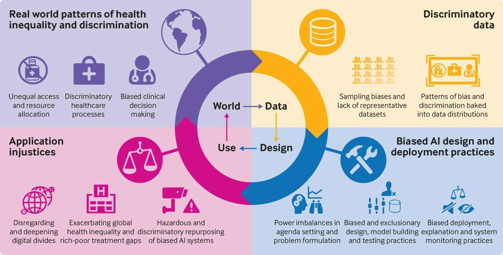

## Table of Contents

## What is implicit bias in the context of machine learning?

Implicit bias in machine learning refers to the hidden assumptions or prejudices that can affect how a machine learning model makes decisions or predictions. These biases can come from the data used to train the model, the way the model is designed, or even from the people who create the model. For example, if a model is trained on data that mostly represents one group of people, it might not work well for other groups. This can lead to unfair outcomes, like a model that is less accurate in predicting health risks for certain ethnic groups because those groups were underrepresented in the training data.

To address implicit bias, it's important to carefully examine the data and the model's performance across different groups. This involves checking the data for any biases and making sure the model is tested on a diverse set of examples. If biases are found, steps can be taken to correct them, such as collecting more diverse data or adjusting the model to be fairer. By being aware of and actively working to reduce implicit bias, we can create machine learning models that are more equitable and effective for everyone.

## How does implicit bias differ from explicit bias in machine learning models?

Implicit bias in machine learning models is when the model makes decisions based on hidden or unconscious assumptions. These biases often come from the data the model was trained on. For example, if a model was trained mostly on data from one group of people, it might not work well for other groups. The model doesn't know it's being biased; it's just using the patterns it learned from the data. This can lead to unfair outcomes, like a model that is less accurate for certain groups because those groups were not well represented in the training data.

Explicit bias, on the other hand, is when the bias in a model is intentional and clear. This can happen if the people creating the model deliberately design it to favor certain outcomes or groups. For example, a model might be programmed to give higher scores to applicants from certain schools. In this case, the bias is known and can be easily identified because it was put into the model on purpose. Unlike implicit bias, explicit bias is straightforward and can be addressed directly by changing the model's design or rules.

Both types of bias can lead to unfair results, but they are handled differently. Implicit bias requires careful examination of the data and the model's performance across different groups to uncover and correct it. Explicit bias, however, can be addressed by directly changing the model's rules or algorithms to remove the intentional bias. Understanding the difference between these two types of bias is important for creating fairer [machine learning](/wiki/machine-learning) models.

## Can you explain how implicit biases are introduced into machine learning algorithms?

Implicit biases can sneak into machine learning algorithms through the data they are trained on. Imagine you're teaching a computer to recognize pictures of dogs. If most of the pictures you show it are of small, fluffy dogs, the computer might think all dogs look like that. When it sees a big, shaggy dog, it might not recognize it as a dog because it wasn't in the training data. This happens because the data used to train the model might not represent everyone or everything equally. For example, if a model is trained on health data mostly from one group of people, it might not work well for other groups because their health patterns are different.

Another way implicit biases can enter machine learning algorithms is through the choices made by the people who create them. Even if the data is diverse, the way the model is designed can still introduce biases. For instance, if the people building the model decide to focus on certain features more than others, the model might end up making decisions based on those features in a way that unfairly affects some groups. This can happen without anyone realizing it, because these choices are often based on what seems important or normal to the people making them, but might not be fair or accurate for everyone.

## What are some common sources of data that can lead to implicit bias in machine learning?

One common source of data that can lead to implicit bias in machine learning is historical data. This data often reflects past societal biases and inequalities. For example, if a model is trained on historical hiring data from a company that has historically favored certain groups, the model might learn to make similar biased decisions. This can happen even if the people creating the model don't want it to be biased, because the data they use already has those biases built in.

Another source of data that can introduce implicit bias is data collected from online sources. The internet can be a great place to gather lots of data quickly, but it's not always a good representation of everyone. For example, if a model is trained on social media data, it might learn from posts and comments that come mostly from certain groups of people. This can lead the model to make decisions that work well for those groups but not for others who are less represented online.

Lastly, data from specific geographic areas can also lead to implicit bias. If a model is trained on data from one city or country, it might not work well for people in other places. For example, a model trained on health data from a wealthy neighborhood might not accurately predict health risks for people in poorer areas because their health patterns are different. This can result in the model making unfair or inaccurate predictions for people outside the area where the data was collected.

## How can implicit bias affect the performance and fairness of machine learning models?

Implicit bias can make machine learning models perform worse and be unfair. When a model is trained on data that doesn't represent everyone equally, it might make decisions that work well for some groups but not for others. For example, if a model is trained on health data from mostly one group of people, it might not accurately predict health risks for other groups. This can lead to the model making mistakes or giving unfair results, like a health app that is less accurate for certain ethnic groups because those groups were underrepresented in the training data.

This kind of bias can also affect how people trust and use the model. If people from certain groups see that the model doesn't work well for them, they might stop using it or not trust its decisions. This can make the model less useful overall. To fix this, it's important to check the data for any biases and make sure the model is tested on a diverse set of examples. By doing this, we can create models that are fairer and work better for everyone.

## What are some techniques used to detect implicit bias in machine learning models?

One way to detect implicit bias in machine learning models is by using fairness metrics. These are special tools that help us see if a model treats different groups of people the same way. For example, we can look at the model's accuracy for different groups. If the model is much less accurate for one group than for others, it might be biased. Another fairness metric is called "disparate impact," which checks if the model's decisions affect different groups unfairly. If a model approves loans for one group more often than another, even when their applications are similar, that could be a sign of bias.

Another technique is to use bias auditing tools. These tools help us check the data the model was trained on and the decisions it makes. We can use these tools to see if the data represents everyone fairly and if the model's decisions are fair across different groups. For example, we might find that the training data has fewer examples from certain groups, which can lead to bias. By looking at the model's performance on different slices of data, we can spot where the model might be biased and work to fix it.

A third approach is to use techniques like counterfactual analysis. This involves changing certain features in the data to see how the model's decisions change. For example, if we change the race or gender of people in the data and the model's decisions change a lot, it might show that the model is biased. By doing this kind of analysis, we can understand how different factors affect the model's decisions and work to make the model fairer.

## How can data preprocessing help mitigate implicit bias in machine learning?

Data preprocessing can help reduce implicit bias in machine learning by making the data more balanced and fair before it's used to train a model. One way to do this is by checking the data for any missing groups or underrepresented people. If we find that certain groups are not well represented, we can collect more data from those groups to make the dataset more diverse. This helps the model learn from a wider range of examples, which can make its decisions fairer. Another way is to use techniques like [data augmentation](/wiki/data-augmentation), where we create more examples of underrepresented groups by slightly changing existing data. This can help the model see more variety and reduce bias.

Another important part of data preprocessing is removing or adjusting biased features in the data. For example, if we know that certain features in the data, like ZIP codes, might lead to biased decisions, we can either remove those features or change them in a way that doesn't affect the model's fairness. We can also use techniques like reweighting, where we give more importance to examples from underrepresented groups during training. This helps the model pay more attention to those examples and can lead to fairer outcomes. By carefully preprocessing the data, we can help ensure that the machine learning model works well for everyone and doesn't unfairly favor one group over another.

## What role does model selection and algorithm choice play in reducing implicit bias?

Choosing the right model and algorithm can help reduce implicit bias in machine learning. Some models are better at handling bias than others. For example, simpler models like linear regression might be less likely to pick up on small, biased patterns in the data compared to more complex models like deep neural networks. By choosing a model that is less likely to overfit to biased data, we can help make sure the model's decisions are fairer. Also, some algorithms, like those used in ensemble methods, can be designed to focus on fairness by combining the predictions of multiple models in a way that reduces bias.

Another way model selection and algorithm choice can help is by using fairness-aware algorithms. These are special algorithms that are designed to make sure the model treats different groups of people the same way. For example, some algorithms can adjust the model's decisions to reduce bias, like making sure the model doesn't favor one group over another when making predictions. By choosing these kinds of algorithms, we can help create models that are more fair and work better for everyone.

## Can you describe some real-world examples where implicit bias in machine learning has had significant impacts?

One real-world example of implicit bias in machine learning is in the criminal justice system. In 2016, a study by ProPublica found that a tool called COMPAS, used to predict the likelihood of a criminal reoffending, was biased against Black defendants. The tool was more likely to incorrectly label Black defendants as high risk compared to White defendants. This meant that Black people were more likely to be unfairly kept in jail or given harsher sentences because of the tool's predictions. This shows how machine learning models can have serious impacts on people's lives if they are not checked for bias.

Another example is in healthcare. A study published in Science in 2019 showed that an algorithm used by many hospitals to predict which patients would need extra care was biased against Black patients. The algorithm used health costs as a way to predict need, but because of systemic racism, Black patients often receive less care and therefore have lower costs. This led the algorithm to underestimate the health needs of Black patients, meaning they were less likely to get the extra care they needed. This example shows how implicit bias in machine learning can lead to unfair treatment and worse health outcomes for certain groups of people.

## What are the ethical considerations surrounding implicit bias in machine learning?

The ethical considerations of implicit bias in machine learning are very important. When machine learning models are biased, they can make unfair decisions that affect people's lives. For example, if a model used for hiring is biased against certain groups, it can stop those people from getting jobs they deserve. This can lead to more inequality and unfairness in society. It's not right for a model to treat people differently just because of the data it was trained on, so it's our job to make sure the models are fair and treat everyone the same.

To deal with these ethical issues, we need to be careful about the data we use and how we build our models. We should check the data to make sure it represents everyone fairly and use techniques to fix any biases we find. We also need to think about the impact our models can have on people and make sure they are designed to be fair. By doing this, we can help make sure that machine learning helps everyone equally and doesn't make existing problems worse.

## How can organizations implement ongoing monitoring and auditing to manage implicit bias in their machine learning systems?

Organizations can implement ongoing monitoring and auditing to manage implicit bias in their machine learning systems by regularly checking how their models perform across different groups of people. This means looking at the model's accuracy and fairness for different groups to see if it treats everyone the same way. They can use tools and metrics to measure this, like checking if the model makes the same kind of mistakes for everyone or if it favors one group over another. By doing this regularly, organizations can catch any biases early and fix them before they cause harm.

Another important part of ongoing monitoring is keeping an eye on the data that the models use. This means checking the data for any new biases that might come in over time and making sure the data stays diverse and representative of everyone. Organizations can also set up systems to alert them if the model starts making biased decisions. By staying vigilant and continuously auditing both the data and the model's performance, organizations can help ensure that their machine learning systems remain fair and effective for everyone.

## What advanced research is being conducted to better understand and address implicit bias in machine learning?

Researchers are working on new ways to understand and fix implicit bias in machine learning. One big area of study is developing better fairness metrics. These are tools that help us see if a model is treating everyone fairly. For example, researchers are looking at how to measure something called "disparate impact," which checks if a model's decisions unfairly affect different groups. They are also working on new ways to measure how accurate a model is for different groups of people. By improving these metrics, researchers hope to make it easier to spot and fix bias in machine learning models.

Another important area of research is creating new algorithms that can help reduce bias. Some researchers are working on fairness-aware algorithms, which are designed to make sure a model's decisions are fair for everyone. For example, they might use techniques like reweighting, where the model pays more attention to examples from underrepresented groups during training. Other researchers are looking at ways to change the model after it's been trained to make it fairer. By developing these new algorithms, researchers aim to build machine learning models that work well for everyone, no matter who they are.

## References & Further Reading

[1]: Barocas, S., Hardt, M., & Narayanan, A. (2019). ["Fairness and Machine Learning."](https://fairmlbook.org/) fairmlbook.org.

[2]: Mehrabi, N., Morstatter, F., Saxena, N., Lerman, K., & Galstyan, A. (2021). ["A Survey on Bias and Fairness in Machine Learning."](https://arxiv.org/abs/1908.09635) ACM Computing Surveys.

[3]: Obermeyer, Z., Powers, B., Vogeli, C., & Mullainathan, S. (2019). ["Dissecting Racial Bias in an Algorithm Used to Manage the Health of Populations."](https://pubmed.ncbi.nlm.nih.gov/31649194/) Science.

[4]: Angwin, J., Larson, J., Mattu, S., & Kirchner, L. (2016). ["Machine Bias."](https://www.propublica.org/article/machine-bias-risk-assessments-in-criminal-sentencing) ProPublica.

[5]: Chouldechova, A. (2017). ["Fair prediction with disparate impact: A study of bias in recidivism prediction instruments."](https://pubmed.ncbi.nlm.nih.gov/28632438/) Big Data.

[6]: Kleinberg, J., Mullainathan, S., & Raghavan, M. (2017). ["Inherent Trade-Offs in the Fair Determination of Risk Scores."](https://arxiv.org/abs/1609.05807) arXiv:1609.05807 [cs.LG].

[7]: Dwork, C., Hardt, M., Pitassi, T., Reingold, O., & Zemel, R. (2012). ["Fairness Through Awareness."](https://arxiv.org/abs/1104.3913) Proceedings of the 3rd Innovations in Theoretical Computer Science Conference.