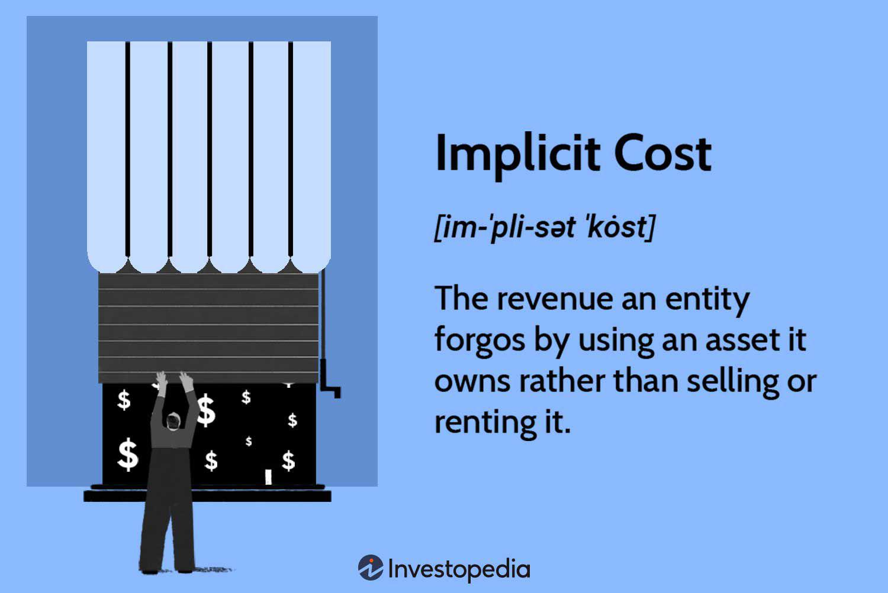

Economic cost analysis is a fundamental aspect of business finance, assessing the total costs associated with any business decision. Unlike accounting costs, which solely consider explicit expenses such as wages and materials, economic cost incorporates both explicit and implicit costs. Implicit costs represent the opportunity costs of utilizing resources already owned by the company, rather than choosing the next best alternative use for those resources. These costs can include the foregone income from employing one's own funds or the potential earnings from alternative projects not pursued. Recognizing implicit costs is crucial, as they can significantly impact a company's profitability and strategic direction over time.

Algorithmic trading, on the other hand, represents a revolutionary advancement in modern financial markets, where computer algorithms are employed to execute trading orders at speeds and volumes unimaginable in traditional trading. The prominence of algorithmic trading has been driven by its ability to operate with high precision, leverage complex strategies, and capitalize on even minuscule market inefficiencies. Its significance is underscored by its widespread adoption across major exchanges globally, impacting trading dynamics and liquidity.



This article aims to explore the intersection between economic cost analysis and algorithmic trading. Both domains, while distinct, converge significantly in the nuances of financial decision-making. Specifically, the inclusion of implicit cost analysis can enhance the creation and deployment of algorithmic strategies, providing a fuller picture of actual trading costs and yielding more informed and strategic decisions.

Understanding these concepts is critical for traders, financial analysts, and business leaders who strive for optimal financial performance. By integrating comprehensive cost analysis--including both explicit and implicit costs--into their strategies, businesses and traders alike can achieve greater efficiency and effectiveness in their financial decisions, ultimately leading to improved financial outcomes and sustainability.

## Table of Contents

## Understanding Economic Cost Analysis

Economic cost analysis is a critical component of business finance that aids in effective decision-making by evaluating all costs associated with a particular business action or investment. Economic costs include both explicit and implicit costs, distinguishing them from accounting costs, which only focus on explicit costs.

**Definition of Economic Cost and Its Distinction from Accounting Cost**

Economic cost represents the total opportunity costs incurred by a business and includes both explicit and implicit costs. Explicit costs are direct, out-of-pocket expenses such as wages, rent, and materials—essentially any cost that involves a direct monetary payment. Implicit costs, on the other hand, reflect the opportunity costs of using resources that could have been employed elsewhere but do not entail direct monetary payments (i.e., they are non-monetary). For example, the opportunity cost of a business owner's time is considered an implicit cost.

Accounting cost, however, only considers explicit costs when evaluating a business’s financial performance and profitability, ignoring the broader economic perspective provided by implicit costs. This can lead to a narrow understanding of resource usage and potential forgone opportunities.

**Components of Economic Costs: Explicit and Implicit Costs**

1. **Explicit Costs:** As previously mentioned, these costs involve tangible monetary expenses. Examples include salaries, utility bills, leasing agreements, and material purchases. Explicit costs are typically easy to measure and directly recorded.

2. **Implicit Costs:** These costs represent the foregone benefits that could have been realized if the company's resources were utilized differently. For instance, if a company uses its existing facilities to produce goods, the implicit cost would be the rental income that could have been earned if those facilities were leased out instead.

**Role of Economic Cost Analysis in Business Decision-Making**

Economic cost analysis enhances business decision-making by offering a comprehensive view of all associated costs, not just those that involve direct expenditure. By incorporating implicit costs, businesses can better assess the true profitability of a project or investment. This broader perspective supports strategic planning and resource allocation, driving long-term financial health and operational efficiency.

**Examples of How Businesses Apply Economic Cost Analysis**

Businesses often apply economic cost analysis when deciding on capital investments, entering new markets, or discontinuing operations. For example, a company contemplating the launch of a new product line would consider both the explicit costs of production and potential revenue sacrifices from redirecting existing resources. By evaluating these components together, businesses can prioritize projects that promise overall profitability rather than those that merely appear profitable from an accounting perspective.

**Challenges in Conducting Economic Cost Analysis in Dynamic Markets**

Conducting economic cost analysis is inherently challenging, particularly in dynamic markets characterized by constant change and uncertainty. The main challenges include:

- **Estimating Implicit Costs:** Unlike explicit costs, implicit costs are difficult to quantify as they rely on subjective estimates of foregone opportunities. Identifying these costs requires a deep understanding of alternative uses for a company’s resources.

- **Data Availability:** Accurate analysis depends on the availability and reliability of data, which can be scarce or rapidly outdated in volatile market conditions.

- **Market Dynamics:** Rapid shifts in consumer preferences, economic conditions, and technological advancements complicate forecasts and models used in economic cost analysis.

Despite these challenges, economic cost analysis is an invaluable tool for businesses seeking to make informed decisions regarding resource allocation and strategic planning. Understanding and incorporating both explicit and implicit costs allow companies to better assess their true economic efficiency and potential for growth.

## Exploring Implicit Costs

Implicit costs, often referred to as opportunity costs, represent the foregone benefits that arise when a company allocates its resources to one option over the next best alternative. Unlike explicit costs, which involve clear cash exchanges, implicit costs do not directly affect cash flow but significantly influence a company's profitability and strategic direction. For instance, when a business uses its existing resources for current operations instead of renting them out, the potential rental income becomes an implicit cost, reflecting the value of alternative missed opportunities.

The impact of implicit costs on a company's bottom line can be profound, as they influence net profit by determining the opportunity cost of resource allocation decisions. For example, if a firm owns its production facility, it doesn’t pay rent, resulting in zero explicit costs for rental. However, the potential income it could have generated from leasing the facility out must be considered when evaluating the firm's genuine profitability. Failure to account for these costs can lead to overvaluation of profits, affecting managerial decisions and investor perceptions.

To effectively identify and evaluate implicit costs, companies can employ several methods. One common approach is to conduct a comprehensive analysis of the firm's resources and alternatives, quantifying the benefits of the foregone alternatives. Financial modeling and scenario analysis are techniques often used to simulate various outcomes and assess the opportunity costs involved. This analysis often requires blending historical data evaluation with assumptions about future market conditions and competitor actions.

The importance of accounting for implicit costs extends significantly into long-term strategic planning. Considerations of these costs aid companies in making informed decisions about resource allocation, investment opportunities, and overall corporate strategy. By evaluating implicit costs, businesses can optimize their operational efficiency and ensure resource allocation that maximizes long-term profitability.

Several case studies highlight the consequences of overlooking implicit costs. For instance, a manufacturing firm that opted to use its factory space for production rather than renting it out experienced initial success. However, over time, the market for rental properties soared, rendering the opportunity cost of using the facility for production far greater than the potential income from leasing. This oversight resulted in suboptimal financial performance and ultimately prompted a reassessment of strategic priorities. Another case involves a technology start-up that committed all its resources to develop a single product line without considering the implicit costs associated with neglected alternative projects. This lack of consideration for implicit costs led to missed growth opportunities and constrained financial returns.

Recognizing implicit costs enables companies to align their strategic plans with financial realities, ensuring that growth and profitability are sustainable and diversified. By integrating implicit cost analysis into business decisions, firms are better positioned to navigate competitive markets and optimize their resource allocation effectively.

## Basics of Algorithmic Trading

Algorithmic trading is a method of executing orders using automated pre-programmed trading instructions. It accounts for variables such as time, price, and [volume](/wiki/volume-trading-strategy) to execute trades systematically across the financial markets. This approach leverages complex algorithms, mathematical models, and computational resources to optimize the trading process, minimizing human intervention and emotion-driven decision-making.

The emergence of [algorithmic trading](/wiki/algorithmic-trading) can be traced back to the 1970s, but it gained significant traction in the late 1990s with advancements in technology and the increased availability of high-frequency data. Today, algorithmic trading constitutes a substantial portion of trading volume in global financial markets, with estimates suggesting that it accounts for around 70-80% of trading in developed markets like the NYSE and Nasdaq.

Several key components and technologies form the backbone of algorithmic trading. Firstly, trading algorithms themselves, which are sets of rules designed to achieve specific trading objectives, ranging from market-making, [arbitrage](/wiki/arbitrage), and [trend following](/wiki/trend-following) to [statistical arbitrage](/wiki/statistical-arbitrage) and basket trading. Another critical component is high-frequency trading infrastructure, which necessitates low-latency networks and fast execution platforms to gain a competitive edge. Market data feeds and historical data repositories are equally important, providing the necessary information for [backtesting](/wiki/backtesting) and strategy optimization.

The benefits of algorithmic trading are manifold. Speed and accuracy are the most significant advantages, as algorithms can execute trades in fractions of a second, far quicker than human capability. This speed means algorithms can capitalize on fleeting market inefficiencies and price differentials, improving potential returns. Moreover, the systematic nature of algorithmic trading reduces the likelihood of human errors and emotional biases that can adversely affect trading outcomes.

However, algorithmic trading is not without risks. One of the primary concerns is its contribution to market [volatility](/wiki/volatility-trading-strategies). Algorithms can react rapidly to market events, which occasionally leads to exacerbated market moves, as witnessed during events like the Flash Crash of 2010. The complexity of algorithms also presents risks, as unanticipated interactions between trading strategies can result in unintended consequences. Furthermore, algorithmic trading can lead to increased market fragmentation and unfair advantages for those with superior technology and resources.

Current trends in algorithmic trading are influenced by several factors. There is a growing emphasis on using [artificial intelligence](/wiki/ai-artificial-intelligence) and [machine learning](/wiki/machine-learning) to enhance algorithmic strategies, allowing algorithms to adapt and evolve through learning from market data. Regulatory changes are reshaping the landscape, compelling firms to focus on transparency and risk management. As technology continues to advance, the future outlook for algorithmic trading includes wider adoption in emerging markets and the integration of more sophisticated, adaptive algorithms capable of operating in increasingly complex market environments.

In conclusion, algorithmic trading stands as a cornerstone of modern financial markets, offering unparalleled speed and efficiency. However, understanding the associated technologies, benefits, and risks is crucial for market participants aiming to leverage this tool effectively. As innovations continue to reshape the industry, algorithmic trading will likely maintain its pivotal role in shaping financial market dynamics.

## Economic Cost Analysis in Algorithmic Trading

Economic cost analysis plays a crucial role in enhancing the efficiency of algorithmic trading strategies by ensuring that all costs associated with trading are accurately identified and managed. Economic costs in this context are comprehensive and include a consideration of both explicit costs, such as transaction fees and slippage, and implicit costs, which might arise from the impact of trading on market prices.

**Transaction Costs, Slippage, and Implicit Costs**

Transaction costs are the direct fees incurred while executing trades, involving broker commissions and exchange fees. Slippage, on the other hand, is the difference between the expected price of a trade and the price at which the trade is actually executed. This discrepancy often occurs in fast-moving markets where price changes occur within microseconds. Implicit costs are less apparent and can result from the market impact of large trades, which can move prices unfavorably for the trader, or from the opportunity costs associated with capital being tied up in positions.

Algorithmic strategies must account for these costs to optimize performance. For example, minimizing slippage might involve refining the time or size of trade execution, while reducing implicit costs might require strategic trade placement to avoid unnecessary market impact.

**Integrating Cost Analysis into Trading Algorithms**

Incorporating economic cost analysis into trading algorithms enhances decision-making processes. Algorithms can be programmed to consider historical cost data and adjust execution strategies accordingly. For instance, a basic algorithm might involve:

```python
def optimize_trade_execution(expected_price, market_price, transaction_fee):
    slippage = market_price - expected_price
    total_cost = slippage + transaction_fee
    if total_cost < threshold:
        execute_trade()
    else:
        adjust_parameters()
```

In this example, the algorithm evaluates total cost against a predefined threshold to decide whether to proceed with a trade or adjust trading parameters.

**Case Examples of Successful Cost Management**

There are several cases where traders have successfully managed costs in algorithmic trading. Quantitative trading firms often develop proprietary models that [factor](/wiki/factor-investing) in real-time data on transaction costs and market movements to optimize trade execution. For example, a trading strategy that dynamically adjusts to market [liquidity](/wiki/liquidity-risk-premium) can considerably reduce slippage and implicit costs. These firms often attribute their success to sophisticated cost models that are integral to their trading frameworks.

**Challenges in Applying Cost Analysis to Algorithmic Trading**

Applying economic cost analysis to algorithmic trading presents several challenges. Market conditions are constantly changing, and algorithms must adapt quickly to maintain optimal performance. Additionally, the complexity of accurately measuring and predicting implicit costs can be daunting. Firms may struggle with integrating vast amounts of data into actionable insights, a task that requires advanced data analytics and machine learning techniques.

Moreover, as algorithmic trading strategies become more sophisticated, there is a risk of increased market volatility. This can introduce new implicit costs, as high-frequency trading may exacerbate price fluctuations. Understanding these dynamic conditions is essential for traders aiming to manage costs effectively.

In conclusion, economic cost analysis is fundamental to the success of algorithmic trading by identifying and mitigating both explicit and implicit costs. While challenges remain, ongoing advancements in technology and data analysis continue to enhance the precision and effectiveness of cost management strategies in trading algorithms.

## Strategies for Managing Implicit Costs in Trading

Algorithmic trading, by its nature, incurs various implicit costs that are not directly recorded in financial statements but can significantly impact trading profitability. Identifying and managing these costs is essential for traders looking to enhance their bottom line.

### Common Implicit Costs in Algorithmic Trading

Implicit costs in algorithmic trading may include:

1. **Market Impact Costs**: This occurs when large trades influence the market price unfavorably. The sheer volume of buying or selling can shift prices, leading to less favorable execution rates.

2. **Slippage**: The difference between the expected price of a trade and the actual price. Slippage often occurs in fast-moving markets where price quoting and order execution are asynchronous.

3. **Opportunity Costs**: These arise when capital is tied up in potentially suboptimal trades, preventing investment in more profitable opportunities.

4. **Latency and Information Costs**: Delays in information processing and order execution can sometimes result in old market data being used for decision-making.

### Methods to Minimize Implicit Costs and Enhance Profitability

- **Order Slicing**: To mitigate market impact costs, traders can divide large orders into smaller increments, executing them over time to avoid drastic market shifts caused by voluminous trades.

- **Algorithm Selection**: Employing specially designed algorithms to optimize trade execution can help manage slippage. This includes using market-adaptive algorithms that adjust based on prevailing market conditions.

- **Transaction Cost Analysis (TCA)**: Continuous monitoring and analysis of trading costs can provide insights into inefficient practices, enabling systematic adjustments to minimize costs over time.

### Role of Technology in Reducing Implicit Costs

Advanced technologies play a pivotal role in reducing implicit costs through:

- **High-frequency Trading (HFT) Systems**: Utilizing HFT reduces latency, enabling instantaneous response to market changes, thereby minimizing latency costs and optimizing execution.

- **Machine Learning and AI**: These technologies help in predicting market movements closer to real-time, thus reducing potential slippage and opportunity costs by ensuring timely trades.

- **Blockchain Technology**: It can offer lower latency, greater transparency, and efficiency in post-trade processes, potentially minimizing information and market impact costs.

### Case Studies of Trading Firms Managing Implicit Costs

Several firms have successfully managed implicit costs using innovative approaches:

- **Renaissance Technologies**: Known for its quantitative approach, it thrives on minimizing market impact through sophisticated mathematical models that guide trade execution.

- **Citadel LLC**: Utilizes cutting-edge technologies and continuous optimization strategies to reduce both explicit and implicit costs, providing it an edge in high-frequency arena [1].

### Recommendations for Traders and Firms

- **Continuous Training**: Firms should invest in upskilling traders and developers on the nuances of implicit costs and the ways technology can alleviate these.

- **Regular Audits**: By regularly auditing the performance of trading algorithms, firms can identify and address areas where implicit costs occur.

- **Diversified Strategies**: Employing a mix of trading strategies can mitigate risk and reduce reliance on any single strategy that might incur high implicit costs.

Ultimately, managing implicit costs in algorithmic trading requires a blend of strategic planning, technological implementation, and continuous learning and adaptation. By prioritizing these areas, traders can enhance their operational efficiency and profitability.

[1] Zuckerman, G. (2009). *The Man Who Solved the Market: How Jim Simons Launched the Quant Revolution*. Penguin UK.

## Conclusion

Economic cost analysis, focusing on both explicit and implicit costs, serves as a foundational tool in business finance, impacting everything from strategic planning to everyday financial decisions. Implicit costs, though often overlooked, significantly affect a company’s bottom line, emphasizing the need for a comprehensive approach to economic cost analysis. Understanding these costs is crucial not only in traditional business operations but also in algorithmic trading, where even minimal inefficiencies can lead to substantial financial consequences.

Algorithmic trading has revolutionized financial markets by increasing transaction speed and accuracy. However, its success largely depends on effective economic cost management, including meticulous analysis of transaction costs and slippage. The integration of cost analysis into the design and optimization of trading algorithms is essential for maintaining efficacy and profitability. Yet, challenges in accurately capturing and evaluating implicit costs remain, signifying areas for ongoing research and development.

The dynamics of financial markets continue to evolve, influenced by technological advancements and the increasing complexity of trading strategies. This progression underscores the importance of integrating comprehensive cost analysis into strategic planning for businesses and traders alike. By better accounting for both explicit and implicit costs, organizations can enhance decision-making processes and optimize financial performance.

Future research should explore innovative methods for identifying and managing implicit costs, particularly in algorithmic trading environments. As financial landscapes evolve, so too must the methodologies employed to assess costs accurately. By maintaining a focus on holistic cost analysis, businesses can better navigate the complexities of modern finance, ultimately fostering sustainable growth and competitive advantage.

## References & Further Reading

[1]: Bergstra, J., Bardenet, R., Bengio, Y., & Kégl, B. (2011). ["Algorithms for Hyper-Parameter Optimization."](https://papers.nips.cc/paper/4443-algorithms-for-hyper-parameter-optimization) Advances in Neural Information Processing Systems 24.

[2]: Marcos López de Prado. (2018). ["Advances in Financial Machine Learning"](https://www.amazon.com/Advances-Financial-Machine-Learning-Marcos/dp/1119482089). Wiley.

[3]: Aronson, D. R. (2007). ["Evidence-Based Technical Analysis: Applying the Scientific Method and Statistical Inference to Trading Signals"](https://onlinelibrary.wiley.com/doi/book/10.1002/9781118268315). Wiley.

[4]: Jansen, S. (2020). ["Machine Learning for Algorithmic Trading"](https://github.com/stefan-jansen/machine-learning-for-trading). Packt Publishing.

[5]: Chan, E. P. (2008). ["Quantitative Trading: How to Build Your Own Algorithmic Trading Business"](https://github.com/ftvision/quant_trading_echan_book). Wiley.