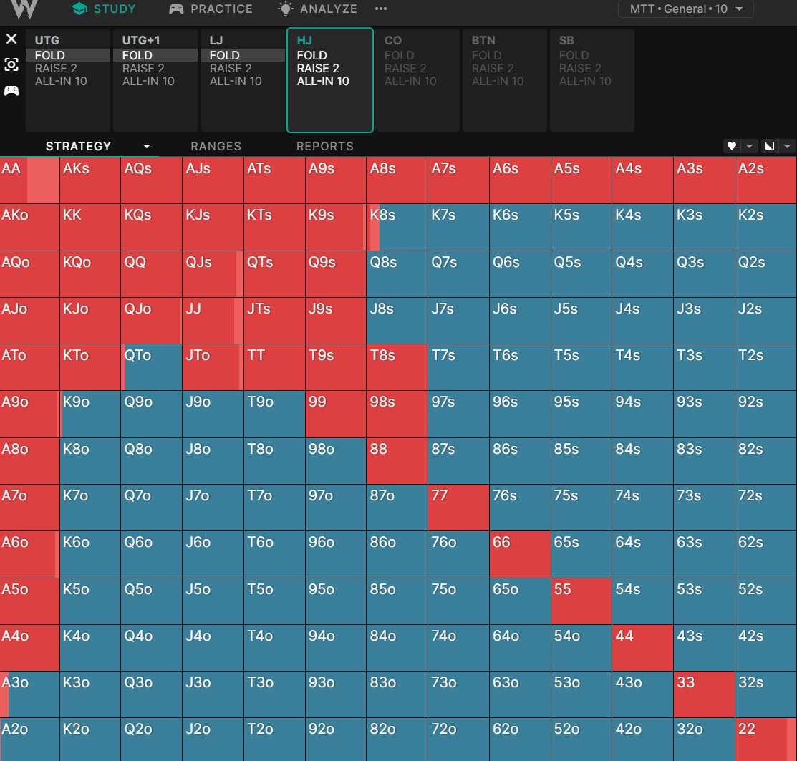

## Table of Contents

## What is implied betting frequency?

Implied betting frequency is a way to understand how often a bet would need to win to be a good choice. It's like figuring out the odds of winning a bet based on the amount of money you could win. If a bet pays out a lot of money, it might not need to win very often to be a good bet. But if the payout is small, the bet needs to win more often to be worth it.

For example, if you bet $10 and could win $50, the implied betting frequency would show that you don't need to win this bet very often for it to be a good choice. On the other hand, if you bet $10 and only win $12, you would need to win this bet much more often to make it worthwhile. Understanding implied betting frequency helps you decide if a bet is a smart one to take.

## How is implied betting frequency calculated?

To calculate implied betting frequency, you need to know the odds of the bet and how much you could win. Let's say you bet $1 on something and you could win $4 if you win. The total payout, including your bet, would be $5. The implied probability of winning this bet is 1 divided by 5, which is 20%. This means the bet thinks you have a 20% chance of winning. The implied betting frequency is just another way to say this, but it's more about how often you need to win for the bet to be good.

So, if the implied probability is 20%, the implied betting frequency is also 20%. This means you need to win this bet 20% of the time for it to be a good bet. If you think you'll win more than 20% of the time, then it's a good bet. If you think you'll win less than 20% of the time, then it's not a good bet. It's a simple way to check if a bet is worth taking based on how often you need to win.

## Why is understanding implied betting frequency important for bettors?

Understanding implied betting frequency is important for bettors because it helps them figure out if a bet is a good choice. It's like a tool that shows how often a bet needs to win to be worth it. If a bet has a high payout, it might not need to win very often to be a good bet. But if the payout is low, the bet needs to win more often. This helps bettors decide if they think a bet is worth taking based on how often they think they will win.

For example, if a bet has an implied betting frequency of 25%, it means the bet needs to win 25% of the time to be a good choice. If a bettor thinks they will win more than 25% of the time, then the bet is a good one. But if they think they will win less than 25% of the time, then it's not a good bet. This way, bettors can make smarter choices and not just bet on anything without thinking about it.

## Can you explain the difference between implied betting frequency and actual betting frequency?

Implied betting frequency is about what the odds of a bet say. It's like the bet's guess on how often it should win. If you bet $1 and could win $4 more, making a total of $5, the implied betting frequency is 20%. This means the bet thinks it needs to win 20% of the time to be a good bet. It's a way to see if a bet is worth it based on the odds.

Actual betting frequency is different because it's about what really happens. It's the real number of times a bet wins out of all the times it's made. If someone bets on a football team to win and they bet 100 times, and the team wins 30 of those times, the actual betting frequency is 30%. This shows how often the bet actually wins, not just what the odds say.

Understanding both helps bettors make better choices. If the implied betting frequency is lower than the actual betting frequency, it might be a good bet. But if the implied betting frequency is higher than the actual betting frequency, it might not be worth it. It's all about comparing what the bet says it should do with what it actually does.

## What role does implied betting frequency play in sports betting strategies?

Implied betting frequency is a key part of sports betting strategies because it helps bettors figure out if a bet is worth taking. It's like a guide that shows how often a bet needs to win to be a good choice. If a bet has a high payout, it might not need to win very often to be worth it. But if the payout is low, the bet needs to win more often. Bettors use this information to decide if they think a bet is a good one based on how often they believe they will win.

For example, if a bet has an implied betting frequency of 25%, it means the bet needs to win 25% of the time to be worth it. If a bettor thinks they will win more than 25% of the time, then the bet is a good choice. But if they think they will win less than 25% of the time, then it's not a good bet. This helps bettors make smarter choices by comparing what the bet says it should do with what they think will actually happen.

## How does implied betting frequency affect the expected value of a bet?

Implied betting frequency helps bettors understand how often a bet needs to win to be a good choice. It's like a guess from the bet on how often it should win. If the implied betting frequency is low, like 20%, it means the bet thinks it only needs to win 20% of the time to be worth it. This can affect the expected value of the bet because it tells you how much you need to win to make the bet good. If you think you will win more often than the implied betting frequency, the expected value of the bet goes up. It means you might make more money than you thought.

On the other hand, if you think you will win less often than the implied betting frequency, the expected value of the bet goes down. It means the bet might not be worth it because you won't win enough to make it a good choice. So, understanding the implied betting frequency helps you see if a bet's expected value is good or not. It's a simple way to check if a bet is worth taking based on how often you need to win.

## What are common misconceptions about implied betting frequency?

One common misconception about implied betting frequency is that it tells you exactly how often a bet will win. People sometimes think that if a bet has an implied betting frequency of 25%, it means the bet will win exactly 25% of the time. But that's not true. Implied betting frequency is just a guess from the bet on how often it should win to be worth it. It doesn't say anything about what will really happen. The actual frequency of winning could be higher or lower than what the bet says.

Another misconception is that implied betting frequency is the only thing you need to look at when deciding if a bet is good. Some people think if the implied betting frequency is low, the bet must be good. But that's not the whole story. You also need to think about the actual chances of winning and other things like the payout. Just because a bet has a low implied betting frequency doesn't mean it's a sure win. You have to compare it with what you think will really happen to see if it's a good bet.

## How can one use implied betting frequency to identify value bets?

Implied betting frequency helps you find value bets by showing how often a bet needs to win to be a good choice. A value bet is when you think a bet will win more often than what the odds say. If a bet has an implied betting frequency of 20%, it means the bet thinks it needs to win 20% of the time to be worth it. If you think the bet will win more than 20% of the time, like 30%, then it's a value bet. You're getting a better deal than what the odds say.

To use implied betting frequency to find value bets, you need to compare what the bet says it should do with what you think will really happen. If a bet has a high payout, it might not need to win very often to be worth it. But if the payout is low, the bet needs to win more often. By looking at the implied betting frequency, you can see if a bet is worth taking based on how often you need to win. If you think you'll win more often than the implied betting frequency, then you've found a value bet.

## What are the limitations of using implied betting frequency in betting analysis?

Implied betting frequency is a helpful tool, but it has some limits. One big limit is that it only tells you what the bet thinks it should do, not what will really happen. Just because a bet has a low implied betting frequency doesn't mean it will win often. You need to think about other things like the real chances of winning and what you know about the game or event. If you only look at the implied betting frequency, you might miss important details that could change your mind about a bet.

Another limit is that implied betting frequency doesn't think about things that can change quickly, like player injuries or weather. These things can make a big difference in sports betting, but the implied betting frequency doesn't change with them. So, you need to use other information along with implied betting frequency to make the best choices. It's a good starting point, but you shouldn't rely on it alone to decide if a bet is worth taking.

## How does implied betting frequency vary across different sports?

Implied betting frequency can change a lot depending on the sport you're betting on. In sports like basketball or football, where there are many games and a lot of data, the implied betting frequency might be easier to understand. For example, if you're betting on a basketball team to win, the odds might show an implied betting frequency of 60% if the team is really good. But if you're betting on a less predictable sport like baseball, where a single game can be decided by just one pitch, the implied betting frequency might be harder to figure out. The odds might show a lower implied betting frequency, like 40%, because it's harder to predict what will happen.

Different sports also have different kinds of bets, which can change the implied betting frequency. In horse racing, you might bet on a horse to win, place, or show, and each type of bet has its own implied betting frequency. A bet on a horse to win might have a lower implied betting frequency, like 20%, because it's harder to win than to place or show. In soccer, you might bet on the number of goals scored, and the implied betting frequency can be different for bets on over or under goals. Understanding how implied betting frequency works in different sports can help you make better bets, but you need to think about the sport and the type of bet you're making.

## Can you discuss advanced statistical models used to refine implied betting frequency calculations?

Advanced statistical models help make implied betting frequency calculations more accurate. One common model is the logistic regression model, which looks at different things that could affect a bet's outcome, like team stats or player performance. By using this model, you can get a better idea of the real chances of winning a bet, not just what the odds say. This helps you see if a bet is a good choice by comparing the model's prediction with the implied betting frequency. Another model is the Monte Carlo simulation, which runs many different versions of a game or event to see all the possible outcomes. This can show you how often a bet might win in different situations, which can be really helpful for figuring out if a bet is worth it.

These models can also use [machine learning](/wiki/machine-learning) to get even better at predicting outcomes. Machine learning models can learn from past data to make more accurate guesses about future bets. They can look at a lot of different information, like weather, injuries, or even how teams have played against each other before. By using these advanced models, you can get a clearer picture of what might happen, which helps you decide if a bet's implied betting frequency is a good guide or if you should look at other things too. It's like having a smart friend who can help you see the whole picture before you make a bet.

## How might future technologies impact the use of implied betting frequency in betting markets?

Future technologies like [artificial intelligence](/wiki/ai-artificial-intelligence) and big data could change how we use implied betting frequency in betting markets. These technologies can look at a lot of information very quickly, like player stats, team performance, and even things like weather or injuries. This means they can make better guesses about how often a bet will win. With AI, you could get a more accurate idea of a bet's real chances of winning, not just what the odds say. This could help bettors see if a bet is a good choice by comparing the AI's prediction with the implied betting frequency.

Also, new technologies might make betting markets more clear and fair. Right now, implied betting frequency is a guess from the bet on how often it should win. But with better technology, we could have more accurate and up-to-date information. This could make it easier for bettors to find value bets, where they think a bet will win more often than the odds say. As technology gets better, it could help bettors make smarter choices by giving them a clearer picture of what might happen, making implied betting frequency a more useful tool in betting.

## What is the importance of implied betting frequency in algorithmic trading?

In high-frequency trading ([HFT](/wiki/high-frequency-trading-strategies)), the significance of timing and speed is paramount, as even microsecond delays can influence profitability. Implied betting frequency facilitates the optimization of trade execution by anticipating the optimal [volume](/wiki/volume-trading-strategy) of trades, thus reducing latency issues and unnecessary trading delays. By predicting how frequently trades should be executed based on current and historical market data, traders can streamline operations to maximize efficiency.

Efficient trade management directly contributes to lowering transaction costs, predominantly through minimizing market impact and optimizing transaction timing. The relationship between transaction costs and trading frequency can be represented in its simplest form as:

$$
\text{Transaction Cost} = \text{Fixed Cost} + \text{Variable Cost} \times \text{Trade Volume}
$$

where managing the trade volume judiciously, through an accurate understanding of betting frequency, helps decrease both fixed and variable components of transaction costs, consequently enhancing overall profitability.

Furthermore, grasping implied betting frequency allows traders to effectively allocate technical and human resources. By anticipating the volume of trades, systems can be configured with the necessary computational power and network bandwidth to handle expected loads without bottlenecks. This foresight ensures that the technical infrastructure is robust enough to accommodate predicted trading activities, thereby avoiding performance degradation due to resource insufficiencies.

Alignment of trading strategies with real-time market dynamics also plays a crucial role in maintaining strategy relevance. Market conditions can change rapidly; a strategy that does not consider the anticipated frequency of trades may quickly become ineffective. Implied betting frequency provides traders with the insights needed to dynamically adjust strategies, ensuring they remain competitive and responsive to unexpected market movements, helping avoid obsolescence.

In summary, understanding and applying implied betting frequency in [algorithmic trading](/wiki/algorithmic-trading) is essential for reducing latency, minimizing transaction costs, and ensuring that trading strategies remain effective under varying market conditions.

## References & Further Reading

[1]: Bergstra, J., Bardenet, R., Bengio, Y., & Kégl, B. (2011). ["Algorithms for Hyper-Parameter Optimization."](https://papers.nips.cc/paper/4443-algorithms-for-hyper-parameter-optimization) Advances in Neural Information Processing Systems 24.

[2]: ["Advances in Financial Machine Learning"](https://www.amazon.com/Advances-Financial-Machine-Learning-Marcos/dp/1119482089) by Marcos Lopez de Prado

[3]: ["Evidence-Based Technical Analysis: Applying the Scientific Method and Statistical Inference to Trading Signals"](https://www.amazon.com/Evidence-Based-Technical-Analysis-Scientific-Statistical/dp/0470008741) by David Aronson

[4]: ["Machine Learning for Algorithmic Trading"](https://github.com/stefan-jansen/machine-learning-for-trading) by Stefan Jansen

[5]: ["Quantitative Trading: How to Build Your Own Algorithmic Trading Business"](https://books.google.com/books/about/Quantitative_Trading.html?id=j70yEAAAQBAJ) by Ernest P. Chan