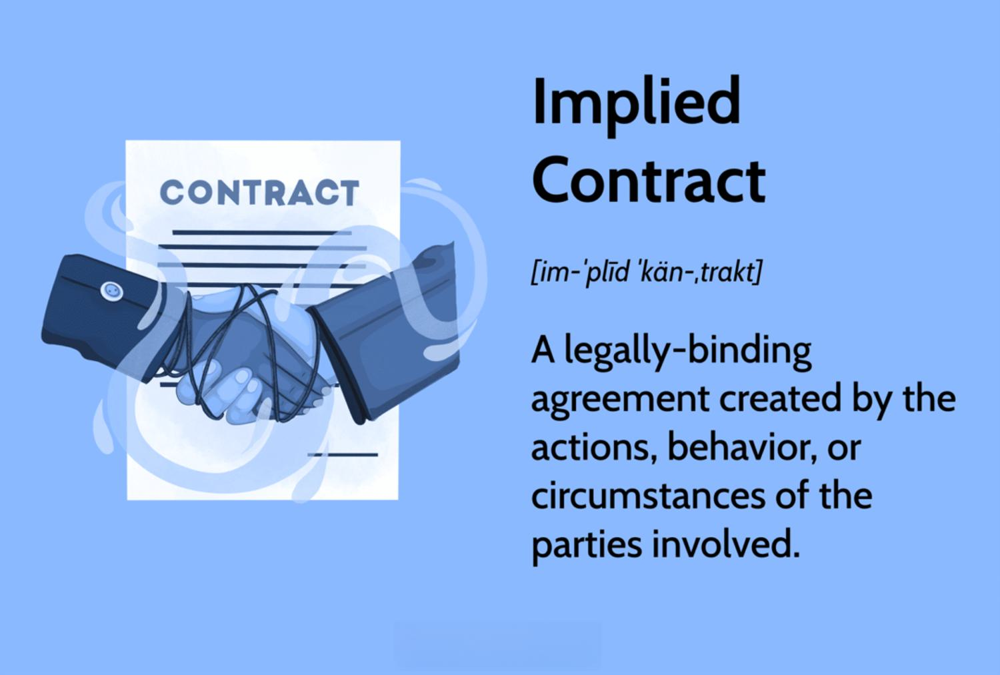

The complexity of algorithmic trading is significantly influenced by a variety of contracts, each governed by specific rules that define their execution and enforceability. Investors and businesses involved in this domain must comprehensively understand these contract dynamics to effectively navigate the market. Implied contracts, while not overtly articulated, emerge from patterns of behavior and mutual understanding, and carry substantial weight in trading activities. This article aims to dissect these contracts and the foundational rules that sustain them, alongside examining the diverse contract types pertinent to algorithmic trading.

In algorithmic trading, contracts are more than mere legal formalities—they are strategic tools that can shape trading operations and outcomes. This article endeavors to illuminate how implied contracts and explicit agreements influence trading strategies and the operational frameworks in which they function. By examining real-world applications and impacts, we aim to provide a nuanced understanding of the contractual landscape that supports sophisticated trading systems. As we explore these elements, it becomes clear that the knowledge of contract types and rules is indispensable for anyone wishing to succeed in the increasingly competitive world of algorithmic trading.

## Table of Contents

## Understanding Implied Contracts

Implied contracts are a foundational concept in both legal and business contexts, as they provide a mechanism for acknowledging agreements that emerge not from documented terms, but from actions, circumstances, or conduct of parties involved. These contracts are formed when the behavior of parties indicates a mutual intent to form an agreement, yet without explicit verbal or written communication.

In the trading sector, implied contracts manifest through repetitive business interactions or well-established patterns of behavior that suggest an intention to engage in a contractually binding relationship. For example, if a trader habitually executes trades and payments with another entity in a consistent manner without a formal contract, this behavior could create an implied contract expecting such trades to continue under similar conditions.

The differentiation between implied contracts and express contracts lies primarily in their formation. While express contracts are explicitly articulated, with clear terms agreed upon by all parties involved, implied contracts require inference from conduct or the nature of the transactional relationship. This distinction is crucial as it impacts enforceability. Express contracts leave little room for ambiguity since the explicit details are agreed upon initially, whereas implied contracts rely on the circumstances surrounding the practices and actions of the involved parties, which might sometimes lead to interpretational challenges.

Understanding the role of implied contracts in trading operations is essential due to their flexibility and adaptability. They can allow trading entities to operate with an understanding that reduces the rigidity and formality of written contracts, potentially enabling quicker operational decisions and continuity of trading activities without the need for constant formal authorizations. However, this also comes with the caveat of legal ambiguity, where the absence of explicit documentation might lead to disputes over the assumed conditions or intentions behind the actions.

The implications of implied contracts in trading operations extend further to risk management and relationship governance. Entities must carefully analyze their interactions to discern when and how implied contracts may be functioning in their dealings. By recognizing these contracts, traders can manage expectations and legal obligations effectively, preventing unintentional liabilities that may arise from conduct that could be interpreted as contractual agreement.

## Contract Rules and Their Importance

Every contract, whether explicit or implied, operates under a framework of rules that guarantee its enforceability and fairness. These fundamental rules are essential not just in general business practices but also within the specialized domain of [algorithmic trading](/wiki/algorithmic-trading), where they delineate the terms of collaboration and execution among varied trading entities.

### Basic Contract Rules

1. **Offer and Acceptance**: This rule constitutes the backbone of contract formation, requiring clear communication from the offering party and an affirmative, unambiguous acceptance from the accepting party. This mutual consent forms the basis of a legally binding agreement. In algorithmic trading, this could manifest in the acceptance of a specific trading algorithm by another party, leading to an operational service agreement.

2. **Consideration**: Consideration involves the exchange of value between parties entering into an agreement. This value could be monetary or otherwise, serving as the incentive or reason for a party to engage in the contract. In a trading context, consideration might be the fees for executing trades via an algorithmic platform, creating obligations for performance and reciprocation.

3. **Mutuality of Obligation**: This principle ensures that all parties involved have clear, binding obligations. Each party's duties or services must be explicitly stipulated to avoid any ambiguity in enforcement. In algo trading, this is crucial for structuring partnership agreements or trade executions where each party understands its operational boundaries and responsibilities.

### Application in Algorithmic Trading

Understanding these fundamental rules is critical, not merely from a legal compliance perspective but as a foundation for building trust and clarity in trading operations. For instance, when algorithmic trading firms enter into service agreements with data providers, these rules ensure that both parties fulfill their agreed-upon roles, such as data furnishing and processing obligations, thereby minimizing potential conflicts.

### Prevention of Legal Disputes

Adherence to these contract rules helps avert legal disputes by providing a clear framework regarding expectations and permissible actions. In a fast-paced and high-stakes environment like algorithmic trading, misunderstandings can lead to significant financial and reputational risks. A solid grasp of contract rules facilitates the negotiation and enforcement of agreements, ensuring accountability and encouraging transparent business relationships.

In summary, basic contract rules provide a structured foundation for legal agreements, impacting various aspects of algorithmic trading operations. Recognizing their importance in defining partnership agreements, service provisions, and trade executions is essential. By advocating for adherence to these rules, trading entities not only protect themselves legally but also establish a ground for trust and efficient business operations.

## Types of Contracts in Algorithmic Trading

In algorithmic trading, various contract types play pivotal roles, each serving distinct purposes within trading strategies and risk management frameworks. Spot contracts, derivatives, and swaps are among the most prevalent types utilized in this domain.

Spot contracts represent agreements for the immediate exchange of financial instruments or commodities at the current market price. These contracts are crucial for traders who seek to capitalize on short-term market movements without the delays associated with more complex financial instruments. An example can be observed in currency trading, where a spot [forex](/wiki/forex-system) transaction involves the direct exchange of currency pairs, typically settled within two business days.

Derivatives, on the other hand, are financial instruments whose values are dependent on the value of an underlying asset. This category encompasses options, futures, and forward contracts. Derivatives enable traders to hedge risk or speculate on the future price movements of assets. For instance, a futures contract allows traders to agree on a price for a commodity that will be delivered and paid for at a later date, thus providing a mechanism to manage price [volatility](/wiki/volatility-trading-strategies).

Options, a derivative class, grant the holder the right, but not the obligation, to buy or sell an underlying asset at a predetermined price before or at a specified expiration date. These instruments are particularly beneficial for implementing strategies such as options spreads or straddles, which aim to exploit specific market conditions or movements.

Swaps are another category of derivative contracts where two parties exchange cash flows or financial instruments over a set period. Common types include [interest rate](/wiki/interest-rate-trading-strategies) swaps, currency swaps, and commodity swaps. Each swap type provides unique benefits; for example, interest rate swaps are often used to manage exposure to fluctuations in interest rates by exchanging fixed-rate payments for floating-rate payments or vice versa.

Incorporating these contract types into algorithmic trading strategies involves understanding their unique characteristics and implications for risk allocation. For instance, traders might opt to use a combination of spot and derivative contracts to balance immediate trading opportunities with longer-term hedging strategies. By strategically employing these instruments, traders can optimize their market exposure while mitigating risks linked to volatility, [liquidity](/wiki/liquidity-risk-premium), and counterparty solvency.

In summary, the selection and application of various contract types in algorithmic trading are integral to formulating effective trading strategies. Each contract type offers distinct advantages and uses, allowing traders to tailor their approaches to suit specific market conditions and objectives.

## Impact of Contracts on Algo Trading Strategies

Contracts play a pivotal role in shaping algorithmic trading strategies by establishing the legal and operational frameworks within which trades are executed. These frameworks define the parameters of trading activities, such as permissible instruments and markets, and condition the strategic decisions that trading algorithms can make. As automated systems evolve, the terms and stipulations within contracts become integral to informing and shaping trading behaviors.

Contracts define the scope and limitations of algorithmic trades, influencing flexibility and timing. For example, derivatives contracts, well-known for their complexity, provide mechanisms for hedging and leverage, allowing algorithms to adapt swiftly to market changes. Such contracts might stipulate margin requirements which, in turn, influence an algorithm's risk exposure and capital utilization. Algorithms can be coded to automatically execute trades within these predefined limits, ensuring compliance while optimizing for returns.

Moreover, contract terms can significantly impact market access. Legal agreements with exchanges or brokers often dictate the market depth and order types available to trading algorithms. These become crucial for high-frequency trading strategies, where milliseconds of access time, informed by contractually defined market connectivity, can result in significant competitive advantages or disadvantages.

Consider a real-world scenario involving options contracts. These contracts can provide an algorithm with the flexibility to pursue strategies such as straddles or strangles, which rely on volatility predictions. The terms of these contracts—such as the expiration date and strike price—directly affect the strategy by defining when and how the options can be exercised. An algorithm might use historical price data and implied volatility measures to decide on optimal positions within the constraints of these contracts, aiming to profit from anticipated market movements.

Contracts also facilitate algorithmic strategies focusing on [arbitrage](/wiki/arbitrage) opportunities. A situation that illustrates this involves discrepancies between spot and futures prices. Contracts that clearly outline settlement procedures and timing are crucial, as they can be exploited by trading algorithms to lock in risk-free profits where price inefficiencies occur. The contractual details regarding delivery mechanisms and settlement dates enable algorithms to harmonize trades across different markets and ensure both compliance and profitability.

To encapsulate, contracts in algorithmic trading are not merely formalities but are integral to the strategic and operational pillars upon which trading algorithms are built. They dictate the feasibility and execution of strategies by constraining or allowing specific trading actions and ensuring adherence to legal and market standards. Understanding contract intricacies thus becomes indispensable for maximizing algorithmic trading performance and staying competitive in a fast-paced financial environment.

## Legal Considerations and Regulatory Compliance

The legal framework governing algorithmic trading is marked by its intricacy and rapid evolution, reflecting the need for participants to remain vigilant concerning compliance issues. Regulatory compliance is indispensable for algorithmic traders to avoid litigation and financial repercussions. Here we explore the primary legal concerns and strategies essential for maintaining lawful operations within algorithmic trading.

One of the foremost legal considerations is adherence to securities laws, which can vary significantly across jurisdictions. Traders must be acutely aware of regulations such as the Financial Industry Regulatory Authority (FINRA) rules in the United States, the Markets in Financial Instruments Directive II (MiFID II) in the European Union, and similar frameworks worldwide. These regulations typically cover aspects such as market manipulation, insider trading, and reporting obligations.

Cross-border trading adds another layer of complexity. Traders operating across different countries must navigate diverse legal systems and trade regulations. They must consider the possibility of conflicting compliance requirements and potential regulatory arbitrage opportunities. For instance, data protection laws, like the General Data Protection Regulation (GDPR) in the EU, impose stringent requirements on how traders handle investor information. Failure to comply with these regulations can lead to severe penalties.

Algorithmic traders must also be cognizant of the legal ramifications of their trading algorithms. This includes ensuring that their algorithms do not inadvertently engage in predatory trading practices or breach anti-manipulation rules. Ensuring fairness and transparency in algorithms can often require thorough testing and maintaining a robust audit trail.

A crucial aspect of compliance involves the meticulous documentation of trading activities. Traders should maintain comprehensive records of all transactions, the rationale behind programming decisions, and evidence of compliance with applicable laws. Automation in record-keeping can be achieved using technologies such as blockchain, which provides a secure and verifiable transaction history.

In practice, implementing an effective compliance strategy involves deploying a combination of monitoring tools, automated reporting systems, and regular audits. Many firms also choose to appoint a compliance officer or dedicate a team to oversee regulatory adherence. Staying informed about changes in legislation and regulatory updates is equally vital, often necessitating continuous education and training for staff.

Finally, collaboration with legal professionals specializing in financial regulations can offer invaluable support. Legal experts can provide tailored advice and conduct risk assessments, thus ensuring that the trading strategies align with the current regulatory landscape. 

Overall, legal considerations in algorithmic trading necessitate a proactive and informed approach, where compliance not only mitigates risks but also fosters an environment of trust and integrity in financial markets.

## Conclusion

Contracts are fundamental to the robust functioning of algorithmic trading systems. They act as the backbone, ensuring that every transaction, agreement, and strategy is legally sound and operationally feasible. The understanding of contracts, ranging from implied agreements to complex financial instruments, is not just beneficial but essential for market participants. Implied contracts, often built on established practices and mutual understandings, offer flexibility but demand clarity to avoid misunderstandings in fast-paced trading environments.

As the landscape of algorithmic trading continues to evolve, traders and businesses must remain vigilant and informed about contract rules and types. This agility provides a competitive edge by helping traders anticipate legal challenges and align their operations with regulatory requirements. Whether dealing with spot contracts, derivatives, or swaps, knowing the specific attributes and implications of each type can optimize risk management and trading strategies.

Incorporating legal knowledge into trading strategies greatly enhances operational effectiveness. With a thorough understanding of contract law, trading entities can minimize risks associated with non-compliance and strategic missteps. This legal awareness enables them to craft strategies that are both innovative and compliant, thereby safeguarding against potential legal repercussions and financial penalties.

Our discussion highlights the critical role that contracts play in both mitigating risks and enabling strategic opportunities in algorithmic trading. By anchoring trading operations in sound legal frameworks, contracts ensure that algorithmic strategies are not only profit-focused but also resilient and adaptable to the ever-changing trading environment. As such, mastering contract dynamics remains a crucial aspect of success in algorithmic trading.

## References & Further Reading

[1]: ["The Law of Electronic Commerce: Overcoming Barriers to the Electronic Market"](https://www.cambridge.org/core/books/law-of-electronic-commerce/CCDDEC14F8C993621DC7DB120218552F) by Alan Davidson

[2]: ["Algorithmic Trading and DMA: An introduction to direct access trading strategies"](https://archive.org/details/algorithmictradi0000john) by Barry Johnson

[3]: Langevoort, D.C. (2009). ["Behavioral Theories of Judgment and Decision Making in Legal Scholarship: A Literature Review"](https://scholarship.law.vanderbilt.edu/vlr/vol51/iss6/2/). Vanderbilt Law Review, 57(5).

[4]: Malkiel, B.G. (2019). ["A Random Walk Down Wall Street: The Time-tested Strategy for Successful Investing"](https://yourknowledgedigest.org/wp-content/uploads/2020/04/a-random-walk-down-wall-street.pdf). W. W. Norton & Company.

[5]: ["High-Frequency Trading: A Practical Guide to Algorithmic Strategies and Trading Systems"](https://www.ahmetbeyefendi.com/wp-content/uploads/2020/07/High-Frequency-Trading-Irene-Aldridge.pdf) by Irene Aldridge

[6]: O'Hara, M. (2015). ["High-Frequency Market Microstructure"](https://www.sciencedirect.com/science/article/pii/S0304405X15000045). Annual Review of Financial Economics, 7, 31-51.

[7]: Duffie, D., & Singleton, K.J. (2012). ["Credit Risk: Pricing, Measurement, and Management"](https://books.google.com/books/about/Credit_Risk.html?id=e9-OIaqjiWUC). Princeton University Press.