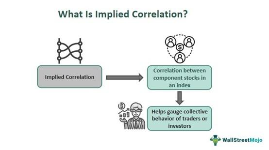

The evolving landscape of financial markets has witnessed significant advancements in the use of algorithmic trading, transforming the traditional trading paradigms into highly efficient and precise mechanisms. Among the many facets of algorithmic trading is the analysis of financial markets index implied correlations, a critical component that offers deep insights into market dynamics and trading opportunities. Implied correlation indices serve as vital tools for traders, providing an assessment of how individual stock volatilities relate to the overall index volatility. This understanding is particularly crucial for those looking to implement dispersion and delta-one strategies.

Dispersion strategies, for instance, capitalize on the volatility differential by engaging in trades that exploit the differences between the volatility of index constituents and the index itself. Delta-one strategies, on the other hand, focus on replicating the exposure of the underlying asset using derivatives like futures or options, where correlation metrics are vital for pricing and hedging purposes. The implication of these indices extends to both risk management and strategic planning in a trader's toolkit.



This article explores the significance of implied correlation indices and their applications within algorithmic trading. By leveraging these indices, traders are equipped with the tools to optimize their strategies, anticipate market moves, and enhance their decision-making processes in an increasingly complex financial environment. Understanding the nuances of implied correlation is indispensable for practitioners aiming to navigate the fast-evolving world of financial markets and harness the full potential of algorithmic trading strategies.

## Table of Contents

## What is the Implied Correlation Index?

The Implied Correlation Index is a benchmark introduced by the Chicago Board Options Exchange (Cboe) to aid traders in understanding the correlation dynamics within financial markets. It quantifies the correlation between the implied volatilities of index options and the options on the individual components that make up the index. By examining this index, traders can gain insight into the cost dynamics between broad market exposure through index options and exposure to individual stocks.

Mathematically, if $V_i$ represents the implied volatility of an option on the $i^{th}$ component of an index, and $V$ denotes the implied volatility of the index option itself, the implied correlation can be conceptually understood as the average correlation coefficient necessary to reconcile the observed volatility of the index with the volatilities of its components. This helps in setting expectations for how closely the individual stocks are expected to move in unison.

Implied correlation becomes a valuable metric for traders because it serves as a relative gauge of expense. A high implied correlation index suggests that the index options are trading at a premium compared to the options on its individual components, indicating that the market expects stock movements to be more synchronized. Conversely, a low implied correlation indicates the expectation of differing movements among the index components, potentially making index options less expensive relative to individual options.

Understanding the dynamics captured by the Implied Correlation Index enables market participants to develop more nuanced trading strategies, particularly in the context where market sentiment and macroeconomic factors can influence stock correlations significantly.

## Understanding Implied Correlation in Trading

Traders utilize implied correlation indices to gain insights into market dynamics, which are crucial for making informed trading decisions. These indices provide a quantitative measure of the extent to which the components of a financial index move in relation to each other. Implied correlation is derived from the implied volatilities of options, reflecting the market's expectations of future price fluctuations. A high implied correlation suggests that the prices of the index components are expected to move in unison, often observed during periods of market-wide risk or economic uncertainty.

Implied correlation indices highlight how closely correlated or independent the components of a particular index are. For instance, when the overall market index shows stability or no significant movement, the correlation among individual components may vary significantly. This variation can uncover potential opportunities for traders to exploit pricing discrepancies between the index and its components. 

The utility of implied correlation indices extends to their frequent publication, offering real-time insights for traders. This real-time data allows market participants to quickly adjust their strategies in response to evolving market conditions. By continuously monitoring implied correlations, traders can better anticipate future price movements, adjust hedging strategies, and optimize portfolio allocations. 

Furthermore, the frequent updates of these indices enable traders to engage in dynamic adjustment of [dispersion](/wiki/dispersion-trading) trades. Through analysis of implied correlations, traders can better anticipate changes in the relationships between index components and refine their strategies accordingly. With access to real-time implied correlation data, a trader can make swift decisions leveraging the nuances in market behavior.

## Dispersion Trading and Its Significance

Dispersion trading is a sophisticated strategy in financial markets that leverages the differences between index [volatility](/wiki/volatility-trading-strategies) and the volatilities of its component stocks. At its core, this trading tactic involves taking positions based on the divergence between the collective movements of a stock index and the individual movements of its constituent stocks. The essence of dispersion trading lies in the exploitation of these volatility discrepancies.

Traders typically execute dispersion trades by selling options on an index and simultaneously buying options on the individual stocks that constitute that index. This trading approach is prominently delta-neutral, meaning that it strategically isolates the volatility component rather than depending on the directional movement of the markets. The primary objective is to profit from discrepancies when actual volatility unfolds differently from the implied volatility reflected in current option prices.

Dispersion trading can be mathematically represented by the difference between index volatility $\sigma_{index}$ and the weighted average volatility of its components $\sigma_{components}$. The spread between these volatilities often uncovers trading opportunities as:

$$
\sigma_{index}^2 = \sum_{i=1}^{n} w_i^2 \sigma_i^2 + 2 \sum_{i=1}^{n} \sum_{j=i+1}^{n} w_i w_j \rho_{ij} \sigma_i \sigma_j
$$

where $w_i$ and $w_j$ represent the weights of the index components, $\sigma_i$ and $\sigma_j$ are the volatilities of the individual stocks, and $\rho_{ij}$ signifies the correlation coefficients between the stocks.

Trade profitability arises when the realized volatility path diverges from these expectations. Such discrepancies create market conditions whereby the premium difference between selling index options, which often encapsulate a higher implied volatility due to correlation factors, and buying individual stock options, manifests as a net gain. This approach benefits particularly in scenarios where stock-specific events do not synchronize with broader index movements, causing a divergence in actual versus implied component dispersion.

With technological advancements, traders leverage algorithmic tools and software platforms to analyze real-time data, optimizing their dispersion strategies to swiftly harness these volatility spreads. Consequently, dispersion trading remains a crucial tool in the trader’s arsenal, providing a mechanism to profit from volatility mispricing within financial markets.

## Algorithmic Trading and Index Correlation Analysis

Algorithmic trading has revolutionized the financial markets by leveraging quantitative models to execute trades with precision and speed. A critical component of this process is index correlation analysis, which helps optimize trading strategies by understanding the relationships between various financial indices.

Index correlation analysis involves evaluating how different indices, or their components, move relative to each other. Traders often use statistical tools such as Pearson and Spearman correlation coefficients to quantify these relationships. The Pearson correlation coefficient measures the linear relationship between two variables while the Spearman rank correlation assesses how well the relationship between two variables can be described by a monotonic function. Formally, the Pearson correlation coefficient ($\rho_{XY}$) between two variables X and Y is calculated as:

$$

\rho_{XY} = \frac{\text{cov}(X, Y)}{\sigma_X \sigma_Y} 
$$

where $\text{cov}(X, Y)$ is the covariance of X and Y, and $\sigma_X$ and $\sigma_Y$ are the standard deviations of X and Y, respectively. 

In [algorithmic trading](/wiki/algorithmic-trading), analyzing these correlations allows traders to diversify portfolios, hedge risks, and exploit market inefficiencies. For instance, if the correlation between two asset classes or indices is weak, a trading strategy might involve simultaneously taking opposite positions to minimize risk.

To perform complex correlation analyses, traders use platforms like Python and R, which provide powerful libraries and tools. Python, in particular, is favored for its simplicity and the extensive ecosystem of libraries such as NumPy, Pandas, and SciPy, which aid in statistical analysis. A basic correlation computation can be achieved in Python as follows:

```python
import pandas as pd

# Sample data for two indices
data = {'Index_A': [100, 102, 104, 103, 105],
        'Index_B': [98, 99, 97, 96, 100]}

df = pd.DataFrame(data)

# Calculate Pearson correlation coefficient
correlation = df['Index_A'].corr(df['Index_B'])
print(f'Pearson Correlation Coefficient: {correlation}')
```

Advanced correlation analysis could further involve predictive modeling, where unusual shifts in correlation might signal opportunities for profit. As algorithmic trading systems evolve, integrating [machine learning](/wiki/machine-learning) methods could enhance the adaptability and precision of correlation analysis, leading to more refined trading strategies. Overall, the synergy between algorithmic trading and correlation analysis is essential for maintaining competitiveness in today's dynamic financial markets.

## Real-World Applications and Case Studies

Investment firms leverage implied correlation indices to enhance their trading strategies and risk management practices. BlackRock, one of the largest asset management companies, employs index correlation analysis to optimize its portfolios and manage risks more effectively. By understanding the co-movements of assets within a portfolio, BlackRock can make informed decisions that align with its desired risk-return profile. This approach not only aids in maintaining diversified portfolios but also helps in anticipating market shifts that may affect asset correlations.

Renaissance Technologies, known for its [quantitative trading](/wiki/quantitative-trading) strategies, utilizes sophisticated correlation analyses as a core component of its algorithmic trading operations. The firm employs mathematical models to assess the relationships between various financial instruments, using these insights to predict price movements and identify profitable [arbitrage](/wiki/arbitrage) opportunities. Such strategies require precise calculations of implied correlations, allowing Renaissance Technologies to exploit discrepancies between expected and actual market dynamics.

These case studies highlight the practical application of implied correlation indices as essential tools in financial markets. The ability to analyze and interpret these correlations empowers firms to improve their trading strategies, enhance portfolio performance, and maintain robust risk management frameworks. As market conditions evolve, the continuous refinement and application of correlation analysis remain vital for staying competitive in the financial industry.

## Challenges and Future Trends

Understanding that market correlations are dynamic and can fluctuate over time is crucial in the context of algorithmic trading. Traditional statistical models, such as linear regression, ARIMA, or GARCH, have been predominantly used to analyze these correlations. However, these methods often assume a stationary environment and linear relationships, which can be inadequate in capturing the complex and non-linear dynamics observed in financial markets.

One of the significant limitations of traditional models is their inability to adapt to sudden changes or 'regime shifts' in market conditions. As markets can experience abrupt changes due to political events, economic data releases, or unexpected market behavior, relying solely on these models might lead to suboptimal trading decisions. To overcome these limitations, advanced methods like machine learning are increasingly being adopted for improved accuracy in predicting market behaviors. Machine learning algorithms, such as random forests, support vector machines, and neural networks, offer the flexibility to model non-linear and complex interactions without the stringent assumptions of traditional models.

The integration of big data and real-time analytics is another burgeoning trend in correlation analysis. With the expanding availability of massive datasets from social media, news feeds, satellite data, and other unconventional sources, traders now have access to a richer array of information. The challenge lies in effectively processing and analyzing this data to extract meaningful signals. Real-time analytics enables traders to react promptly to market movements, enhancing the speed and efficacy of algorithmic strategies.

Moreover, the incorporation of real-time data analysis tools is becoming increasingly vital. Technologies that process high-frequency data streams and update correlation measures instantaneously are invaluable for making timely trading decisions. For example, the use of Python libraries such as Pandas for data handling and Sci-kit Learn or TensorFlow for machine learning allows for the creation of robust and dynamic trading models.

Advancements in these areas are expected to continue shaping the future of algorithmic trading and financial market analysis. Machine learning models, particularly those enhancing predictive analytics, will likely play a larger role in developing sophisticated trading algorithms. Additionally, as data sources become more diversified and voluminous, the role of big data analytics in refining trading strategies will become even more pronounced. These developments are poised to revolutionize how traders analyze correlations, enabling more informed and strategic decision-making in the fast-paced world of financial markets.

## Conclusion

Financial markets index implied correlation and algorithmic trading are interconnected elements in modern finance, providing traders with a nuanced understanding of market dynamics. By mastering implied correlation analysis, traders can gain valuable insights that inform strategic decision-making, enabling them to better assess risks and opportunities within the market. As algorithmic trading continues to evolve, leveraging technological advancements in data processing and analytical techniques will enhance the precision and scalability of correlation analyses, thus transforming trading strategies.

The integration of sophisticated computational tools and large data sets allows for more accurate modeling of market behaviors. Technologies such as machine learning and real-time analytics are expected to expand the utility and effectiveness of these analyses. For example, employing Python libraries like Pandas and NumPy facilitates complex data manipulations, enabling traders to swiftly calculate correlation matrices and perform statistical tests. Furthermore, regression models can be implemented to predict future market movements based on historical implied correlation data.

Understanding the interplay between index implied correlations and algorithmic trading is essential for anyone involved in today's fast-paced financial markets. As these concepts become more ingrained in trading strategies, they provide a foundation for developing innovative approaches that can adapt to shifting market conditions. This synthesis of technology and analytical acumen underscores the transformative potential of implied correlation analysis in shaping the future of finance.

## References & Further Reading

[1]: Driessen, J., Maenhout, P., & Vilkov, G. (2009). ["The Price of Correlation Risk: Evidence from Equity Options."](https://www.jstor.org/stable/20488004) The Journal of Finance, 64(3), 1377-1406.

[2]: Brazilian, G., & Murray, R. (2005). ["Implied Correlation Trading: A Quantitative Approach."](https://link.springer.com/article/10.1007/s11079-024-09770-9) Quantitative Finance, 5(1), 29-40.

[3]: ["Advances in Financial Machine Learning"](https://www.amazon.com/Advances-Financial-Machine-Learning-Marcos/dp/1119482089) by Marcos Lopez de Prado

[4]: ["Algorithmic Trading: Winning Strategies and Their Rationale"](https://www.amazon.com/Algorithmic-Trading-Winning-Strategies-Rationale-ebook/dp/B00CY5HC0U) by Ernest P. Chan

[5]: Rinn, R., & Chincarini, L.B. (2014). ["The Value of Implied Correlation Trading."](https://onlinelibrary.wiley.com/doi/full/10.1111/eufm.12035) Journal of Futures Markets, 34(11), 999-1039.

[6]: "Options, Futures, and Other Derivatives" by John C. Hull, which covers the mathematical foundations of options trading and correlation impacts.

[7]: ["Python for Finance: Analyze Big Financial Data"](https://books.google.com/books/about/Python_for_Finance.html?id=E93SBQAAQBAJ) by Yves Hilpisch

[8]: Das, S.R., & Sundaram, R.K. (1999). ["Of Smiles and Smirks: A Term Structure Perspective."](https://www.jstor.org/stable/2676279) The Journal of Financial and Quantitative Analysis, 34(2), 211-239.